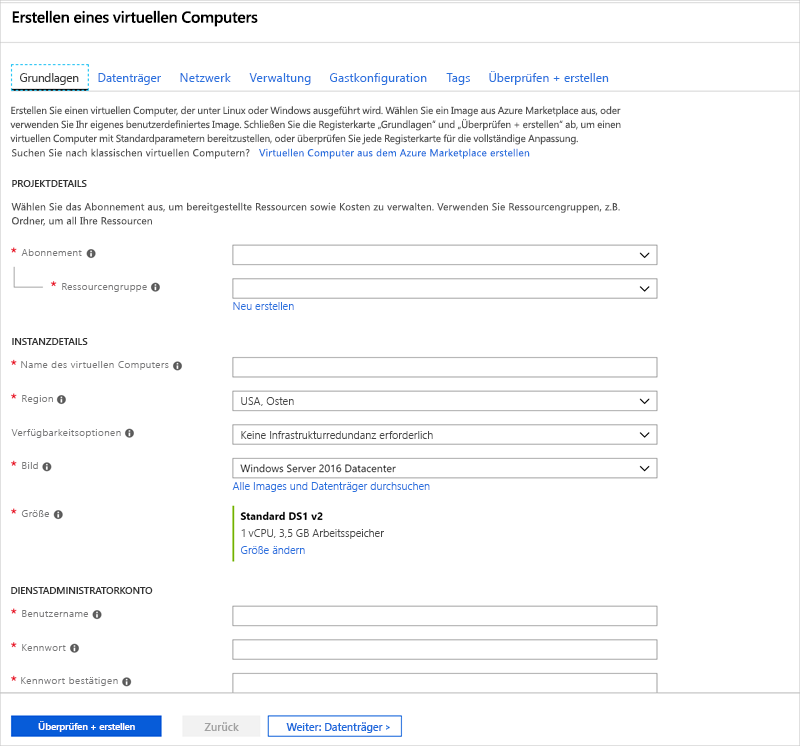
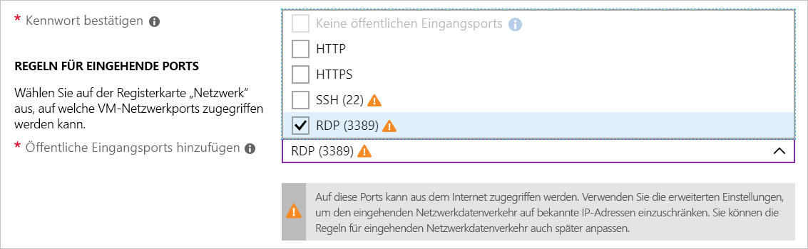
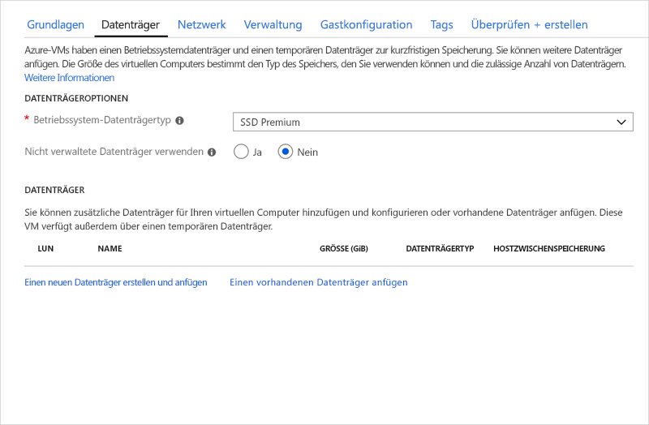
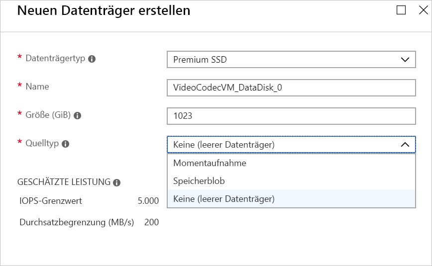
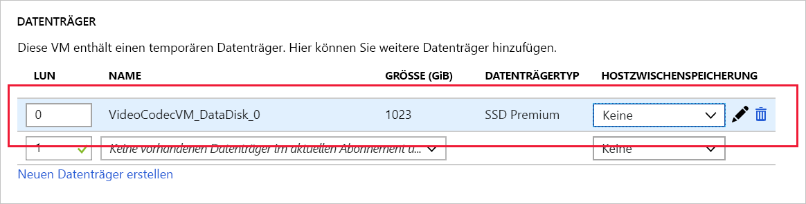

Wie zuvor bereits erwähnt, verarbeitet das Beispielunternehmen Videoinhalte auf virtuellen Windows-Computern.Recall that our company processes video content on Windows VMs. Angenommen, eine neue Stadt hat Sie damit beauftragt, die Aufnahmen ihrer Verkehrskameras zu verarbeiten. Es handelt sich allerdings dabei um ein Modell, mit dem Sie zuvor noch nicht gearbeitet haben.A new city has contracted us to process their traffic cameras, but it's a model we've not worked with before. Sie müssen eine neue Windows-VM erstellen und proprietäre Codecs installieren, damit Sie mit dem Verarbeiten und Analysieren der Images beginnen können.We need to create a new Windows VM and install some proprietary codecs so we can begin processing and analyzing their images.

<!-- Activate the sandbox -->
[!include]

## Erstellen eines neuen virtuellen Windows-ComputersCreate a new Windows virtual machine

Sie können virtuelle Windows-Computer über das Azure-Portal, die Azure CLI oder Azure PowerShell erstellen.We can create Windows VMs with the Azure portal, Azure CLI, or Azure PowerShell. Am einfachsten ist es im Portal, da es Ihnen während der Erstellung der VM alle erforderlichen Informationen, Hinweise und hilfreiche Meldungen zur Verfügung stellt.The easiest approach is the portal because it walks you through the required information and provides hints and helpful messages during the creation of the VM.

1. Melden Sie sich beim [Azure-Portal](https://portal.azure.com/learn.docs.microsoft.com?azure-portal=true) mit dem Konto an, über das Sie die Sandbox aktiviert haben.Sign into the [Azure portal](https://portal.azure.com/learn.docs.microsoft.com?azure-portal=true) using the same account you activated the sandbox with.

1. Klicken Sie im Azure-Portal oben links auf **Ressource erstellen**.Click **Create a resource** in the upper left corner of the Azure portal.

1. Geben Sie **Windows Server 2016 Datacenter** in das Suchfeld ein, und klicken Sie dann in der angezeigten Liste auf den gleichnamigen Link.In the search box, enter  **Windows Server 2016 Datacenter**  and then click on the link with the same title in the presented list.

1. Klicken Sie auf die Schaltfläche **Erstellen**, um mit dem Konfigurieren des virtuellen Computers zu beginnen.Click the **Create** button to start configuring the VM.

## Konfigurieren der Einstellungen für den virtuellen ComputerConfigure the VM settings

Im Portal steht für die VM-Erstellung ein Assistent zur Verfügung, der Sie durch sämtliche Konfigurationsbereiche für den virtuellen Computer führt.The VM creation experience in the portal is presented in a "wizard" format to walk you through all the configuration areas for the VM. Wenn Sie auf die Schaltfläche „Weiter“ klicken, gelangen Sie jeweils zum nächsten Konfigurationsabschnitt.Clicking the "Next" button will take you to the next configurable section. Sie können allerdings auch über die Registerkarten im oberen Abschnitt nach Belieben zwischen den einzelnen Abschnitten wechseln.However, you can move between the sections at will with the tabs running across the top that identify each section.

Sobald Sie alle erforderlichen Optionen (durch rote Sternchen gekennzeichnet) angegeben haben, können Sie die verbleibenden Schritte des Assistenten überspringen und im unteren Bereich auf die Schaltfläche **Überprüfen + erstellen** klicken, um mit der Erstellung des virtuellen Computers zu beginnen.Once you fill in all the required options (identified with red stars), you can skip the remainder of the wizard experience and start creating the VM through the **Review + Create** button at the bottom.

Beginnen Sie mit dem Abschnitt **Grundlagen**.We'll start with the **Basics** section.

### Konfigurieren der Grundeinstellungen für den virtuellen ComputerConfigure basic VM settings

> [!NOTE]
> Wenn Sie die Einstellungen ändern und anschließend in jedem Freitextfeld die TAB-TASTE drücken, überprüft Azure den Wert automatisch und versieht ihn mit einem grünen Häkchen, wenn die Änderungen akzeptiert werden.As you change settings and tab out of each free-text field, Azure will validate each value automatically and place a green check mark next to it when it's good. Sie können mit der Maus auf Fehlerindikatoren zeigen, um weitere Informationen zu gefundenen Problemen zu erhalten.You can hover over error indicators to get more information on issues it discovers.

1. Wählen Sie das **Abonnement** aus, über das die VM-Stunden abgerechnet werden sollen.Select the **Subscription** that should be billed for VM hours.

1. Wählen Sie für **Ressourcengruppe** **<rgn>[Name der Sandboxressourcengruppe]</rgn>** aus.For **Resource group**, choose "**<rgn>[sandbox resource group name]</rgn>**".

1. Geben Sie im Abschnitt **INSTANZENDETAILS** einen Namen für Ihren virtuellen Computer ein (beispielsweise **test-vp-vm2** für „zweiter virtueller Computer zum Testen des Videoprozessors“).In the **INSTANCE DETAILS** section, enter a name for your VM, such as **test-vp-vm2** (for Test Video Processor VM #2).
    - Es empfiehlt sich, Ressourcennamen zu standardisieren, um ihren Zweck einfach ermitteln zu können.It's best practice to standardize your resource names so you can easily identify their purpose. Die Namen für virtuelle Windows-Computer sind eingeschränkt: Sie müssen zwischen 1 und 15 Zeichen lang sein, dürfen keine Sonderzeichen bzw. Zeichen enthalten, die nicht den ASCII-Richtlinien entsprechen, und müssen in der aktuellen Ressourcengruppe eindeutig sein.Windows VM names are a bit limited - they must be between 1 and 15 characters, cannot contain non-ASCII or special characters, and must be unique in the current resource group.

1. Wählen Sie von den folgenden Standorten eine Region aus, die in Ihrer Nähe liegt.Select a region close to you from the locations below.

   [!include]

1. Behalten Sie die **Verfügbarkeitsoptionen** als „Keine“ bei.Leave **Availability options** as "None". Diese Option wird verwendet, um sicherzustellen, dass der virtuelle Computer Hochverfügbarkeit aufweist. Zu diesem Zweck werden mehrere virtuelle Computer in einer Gruppe zusammengefasst, um geplante oder ungeplante Wartungsereignisse oder Ausfälle zu verarbeiten.This option is used to ensure the VM is highly available by grouping multiple VMs together a set to deal with planned or unplanned maintenance events or outages.

1. Stellen Sie sicher, dass das Image auf „Windows Server 2016 Datacenter“ festgelegt ist.Ensure the image is set to "Windows Server 2016 Datacenter". Sie können die Dropdownliste öffnen, um alle verfügbaren Optionen anzuzeigen.You can open the drop-down list to see all the options available.

1. Das Feld **Größe** enthält die Standardgröße „DS1“ und kann nicht direkt bearbeitet werden.The **Size** field is not directly editable and has a DS1 default size. Klicken Sie auf den Link **Größe ändern**, um andere VM-Größen abzurufen.Click the **Change size** link to explore other VM sizes. Über das Dialogfeld, das daraufhin angezeigt wird, können Sie anhand der Anzahl von CPUs sowie anhand der Namen und des Datenträgertyps filtern.The resulting dialog allows you to filter based on # of CPUs, Name, and Disk Type. Klicken Sie abschließend auf „Standard DS1 v2“ (in der Regel die Standardeinstellung).Select "Standard DS1 v2" (normally the default) when you are done. Dadurch erhält der virtuelle Computer eine CPU und 3,5 GB Arbeitsspeicher.That will give the VM 1 CPU and 3.5 GB of memory.

    > [!TIP]
    > Da auf der rechten Seite ein neues Fenster geöffnet und über das vorherige Fenster geschoben wurde, um es anzuzeigen, können Sie die Ansicht auch nach links verschieben, um wieder zu den VM-Einstellungen zu gelangen.You can also just slide the view to the left to get back to the VM settings as it opened a new window off to the right and slid the window over to view it.

1. Legen Sie im Abschnitt **ADMINISTRATORKONTO** das Feld **Benutzername** auf den Benutzernamen fest, den Sie verwenden möchten, um sich bei dem virtuellen Computer anzumelden.In the **ADMINISTRATOR ACCOUNT** section, set the **Username** field to a username you will use to sign in to the VM.

1. Geben Sie im Feld **Kennwort** ein Kennwort mit mindestens 12 Zeichen ein.In the **Password** field, enter a password that's at least 12 characters long. Es muss drei der folgenden Zeichen aufweisen: einen Kleinbuchstaben, einen Großbuchstaben, eine Ziffer bzw. ein Sonderzeichen, das nicht „\\“ oder „-“ ist.It must have three of the following: one lower case character, one uppercase character, one number, and one special character that is not '\\' or '-'. Verwenden Sie ein Kennwort, das Sie sich merken können, oder notieren Sie sich das Kennwort. Sie werden es später noch benötigen.Use something you will remember or write it down, you will need it later.

1. Bestätigen Sie das **Kennwort**.Confirm the **password**.

1. Öffnen Sie die Liste im Abschnitt **REGELN FÜR EINGEHENDE PORTS**, und wählen Sie _Allow selected ports_ (Ausgewählte Ports zulassen) aus.In the **INBOUND PORT RULES** section, open the list and choose _Allow selected ports_. Da es sich hier um einen virtuellen Windows-Computer handelt, möchten wir per RDP auf den Desktop zugreifen können.Since this is a Windows VM, we want to be able to access the desktop using RDP. Scrollen Sie ggf. durch die Liste, bis Sie RDP (3389) finden, und wählen Sie diese Option aus.Scroll the list if necessary until you find RDP (3389) and select it. Auf der Benutzeroberfläche wird der Hinweis angezeigt, dass die Netzwerkports auch nach dem Erstellen des virtuellen Computers geändert werden können.As the note in the UI indicates, we can also adjust the network ports after we create the VM.

    

## Konfigurieren von Datenträgern für den virtuellen ComputerConfigure Disks for the VM

1. Klicken Sie auf **Weiter**, um zum Abschnitt „Datenträger“ zu gelangen.Click **Next** to move to the Disks section.

    

1. Wählen Sie „SSD Premium“ als **Betriebssystemdatenträgertyp** aus.Choose "Premium SSD" for the **OS disk type**.

1. Verwenden Sie verwaltete Datenträger, damit Sie nicht mit Speicherkonten arbeiten müssen.Use managed disks so we don't have to work with storage accounts. Sie können bei Bedarf in der grafischen Benutzeroberfläche die Einstellung ändern, damit Ihnen die Informationen angezeigt werden, die Azure benötigt.You can flip the switch in the GUI to see the difference in information that Azure needs if you like.

### Erstellen eines DatenträgersCreate a data disk

Rufen Sie sich in Erinnerung, dass wir einen Betriebssystemdatenträger (C:) und einen temporären Datenträger (D:) verwenden.Recall we will get an OS disk (C:) and Temporary disk (D:). Fügen Sie außerdem einen weiteren Datenträger hinzu.Let's add a data disk as well.

1. Klicken Sie im Abschnitt **DATENTRÄGER** auf den Link **Create and attach a new disk** (Neuen Datenträger erstellen und anfügen).Click the **Create and attach a new disk** link in the **DATA DISKS** section.

    

1. Sie können alle Standardeinstellungen beibehalten: „SSD Premium“, „1.023 GB“ und „Keine“ (leerer Datenträger). Beachten Sie jedoch, dass wir an dieser Stelle eine Momentaufnahme oder ein Speicherblob verwenden könnten, um eine VHD zu erstellen.You can take all the defaults: Premium SSD, 1023 GB, and None (empty disk); although notice that here is where we could use a snapshot, or Storage Blob to create a VHD.

1. Klicken Sie auf **OK**, um den Datenträger zu erstellen, und navigieren Sie zurück zum Abschnitt **DATA DISKS** (DATENTRÄGER).Click **OK** to create the disk and go back to the **DATA DISKS** section.

1. Es sollte nun ein neuer Datenträger in der ersten Zeile angezeigt werden.There should now be a new disk in the first row.

    

## Konfigurieren des NetzwerksConfigure the Network

1. Klicken Sie auf **Weiter**, um zum Abschnitt „Netzwerk“ zu navigieren.Click **Next** to move to the Networking section.

1. In einem Produktionssystem, in dem bereits andere Komponenten vorhanden sind, sollten Sie ein _vorhandenes_ virtuelles Netzwerk verwenden.In a production system where we already have other components, we'd want to utilize an _existing_ virtual network. So kann Ihr virtueller Computer mit den anderen Clouddiensten in unserer Lösung kommunizieren.That way our VM can communicate with the other cloud services in our solution. Wenn für diesen Speicherort noch kein Netzwerk definiert ist, können Sie es hier erstellen und die folgenden Bestandteile konfigurieren:If there isn't one defined in this location yet, we can create it here and configure the:
    - **Den Adressbereich:** der IPv4-Bereich, der dem Netzwerk insgesamt zur Verfügung steht.**Address space**: the overall IPV4 space available to this network.
    - **Subnetzbereich:** Das erste Subnetz, das der Unterteilung des Adressraums dient. Dieses muss innerhalb des definierten Adressraums liegen.**Subnet range**: the first subnet to subdivide the address space - it must fit within the defined address space. Sobald das VNET erstellt wurde, können Sie weitere Subnetze hinzufügen.Once the VNet is created you can add additional subnets.

1. Als Nächstes ändern wir die Standardbereiche, um den IP-Adressraum `172.xxx` zu verwenden.Let's change the default ranges to use the `172.xxx` IP address space. Klicken Sie unter „Virtuelles Netzwerk“ auf **Neu erstellen**.Click **Create New** under Virtual Network.
    - Ändern Sie das Feld **Adressraum** in `172.16.0.0/16`, um ihm den gesamten Adressbereich zuzuweisen.Change the **Address space** field to be `172.16.0.0/16` to give it the full range of addresses
    - Ändern Sie das Feld **Subnetzbereich** in `172.16.1.0/24`, um ihm 256 IP-Adressen des Adressraums zuzuweisen.Change the **Subnet range** field to be `172.16.1.0/24` to give it 256 IP addresses of the space.

1. Klicken Sie auf **OK**.Click **OK**.

> [!NOTE]
> Azure erstellt standardmäßig ein virtuelles Netzwerk, eine Netzwerkschnittstelle und eine öffentliche IP-Adresse für Ihren virtuellen Computer.By default, Azure will create a virtual network, network interface, and public IP for your VM. Nach der Erstellung des virtuellen Computers können die Netzwerkoptionen nicht mehr problemlos geändert werden. Prüfen Sie daher immer genau die Netzwerkzuweisungen für die von Ihnen in Azure erstellten Dienste.It's not trivial to change the networking options after the VM has been created so always double-check the network assignments on services you create in Azure.

## Abschließen der Konfiguration des virtuellen Computers und Erstellen des ImagesFinish configuring the VM and create the image

Die restlichen Optionen weisen geeignete Standardeinstellungen auf, die nicht geändert werden müssen.The rest of the options have reasonable defaults and there's no need to change any of them. Bei Interesse können sich die anderen Registerkarten genauer ansehen.You can explore the other tabs if you like. Neben den einzelnen Optionen befindet sich jeweils ein `(i)`-Symbol, über das Sie eine Erläuterung der jeweiligen Option anzeigen können.The individual options have an `(i)` icon next to them that will show a help bubble to explain the option. Dies ist eine gute Möglichkeit, nähere Informationen über die verschiedenen Optionen zu erhalten, die Sie zum Konfigurieren des virtuellen Computers verwenden können.This is a great way to learn about the various options you can use to configure the VM.

1. Klicken Sie im unteren Bereich auf die Schaltfläche **Überprüfen und erstellen**.Click the **Review + create** button at the bottom of the panel.

1. Das System überprüft Ihre Optionen und zeigt Details zur Erstellung des virtuellen Computers an.The system will validate your options and give you details about the VM being created.

1. Klicken Sie auf **Erstellen**, um den virtuellen Computer zu erstellen und bereitzustellen.Click **Create** to create and deploy the VM. Im Azure-Dashboard wird der virtuelle Computer angezeigt, der aktuell bereitgestellt wird.The Azure dashboard will show the VM that's being deployed. Dieser Vorgang kann einige Minuten in Anspruch nehmen.This may take several minutes.

Währenddessen erfahren Sie in der nächsten Einheit, wozu Sie diesen virtuellen Computer verwenden können.While that's deploying, let's look at what we can do with this VM.