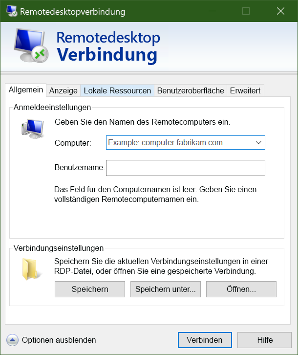

Nachdem Sie nun über einen virtuellen Windows-Computer in Azure verfügen, platzieren Sie als Nächstes Ihre Anwendungen und Daten für die Verarbeitung von Verkehrsvideos auf den virtuellen Computern.Now that we have a Windows VM in Azure, the next thing you’ll do is put your applications and data on those VMs to process our traffic videos. 

Ohne Site-to-Site-VPN mit Azure kann allerdings nicht über Ihr lokales Netzwerk auf Ihre virtuellen Azure-Computer zugegriffen werden.However, unless you’ve set up a site-to-site VPN to Azure, your Azure VMs won’t be accessible from your local network. Wenn Sie sich gerade erst mit Azure vertraut machen, haben Sie wahrscheinlich noch kein Site-to-Site-VPN eingerichtet.If you’re just getting started with Azure, it’s unlikely that you have a working site-to-site VPN. Wie können Sie also Dateien auf virtuelle Azure-Computer übertragen?So how can you transfer files to Azure VMs? Eine einfache Möglichkeit besteht darin, Ihre lokalen Laufwerke über das Remotedesktopverbindungs-Feature von Azure für Ihre neuen virtuellen Azure-Computer freizugeben.One easy way is to use Azure’s Remote Desktop Connections feature to share your local drives with your new Azure VMs.

Nachdem wir nun über einen neuen virtuellen Windows-Computer verfügen, müssen wir darauf unsere benutzerdefinierte Software installieren.Now that we have a new Windows virtual machine, we need to install our custom software on to it. Dafür gibt es zwei Möglichkeiten:There are two ways we can use:

- Remotedesktopprotokoll (RDP)Remote Desktop Protocol (RDP)
- Benutzerdefinierte SkriptsCustom scripts
- Benutzerdefinierte VM-Images (mit vorinstallierter Software)Custom VM images (with the software preinstalled)

Sehen wir uns den einfachsten Ansatz für virtuelle Windows-Computer an: das Remotedesktopprotokoll.Let's look at the simplest approach for Windows VMs: Remote Desktop.

## Was ist das Remotedesktopprotokoll (RDP)?What is the Remote Desktop Protocol?

Das Remotedesktopprotokoll (RDP) bietet Remotekonnektivität mit der Benutzeroberfläche Windows-basierter Computer.Remote Desktop (RDP) provides remote connectivity to the UI of Windows-based computers. RDP ermöglicht es Ihnen, sich remote bei einem physischen oder virtuellen Windows-Computer anzumelden und diesen Computer so zu steuern, als ob Sie an der Konsole sitzen würden.RDP enables you to sign in to a remote physical or virtual Windows computer and control that computer as if you were seated at the console. Eine RDP-Verbindung ermöglicht es Ihnen, die meisten Vorgänge auszuführen, die Sie über die Konsole eines physischen Computers durchführen können. Ausgenommen hiervon sind einige Funktionen in Bezug auf den Betriebszustand und die Hardware.An RDP connection enables you to carry out the vast majority of operations that you can do from the console of a physical computer, with the exception of some power and hardware-related functions.

Für eine RDP-Verbindung wird ein RDP-Client benötigt.An RDP connection requires an RDP client. Microsoft bietet RDP-Clients für die folgenden Betriebssysteme:Microsoft provides RDP clients for the following operating systems:

- Windows (integriert)Windows (built-in)
- macOSMacOS
- iOSiOS
- AndroidAndroid

Der folgende Screenshot zeigt den Remotedesktopprotokoll-Client unter Windows 10.The following screenshot displays the Remote Desktop Protocol client in Windows 10.

Es gibt auch Open-Source-Linux-Clients (etwa Remmina), mit denen Sie von einer Ubuntu-Distribution aus eine Verbindung mit einem Windows-PC herstellen können.There are also open source Linux clients, such as Remmina that enable you to connect to a Windows PC from an Ubuntu distribution.

## Herstellen einer Verbindung mit einem virtuellen Azure-ComputerConnecting to an Azure VM

Wie Sie bereits gesehen haben, kommunizieren virtuelle Azure-Computer über ein virtuelles Netzwerk.As we saw a moment ago, Azure VMs communicate on a virtual network. Ihnen kann auch eine optionale öffentliche IP-Adresse zugewiesen werden.They can also have an optional public IP address assigned to them. Eine öffentliche IP-Adresse ermöglicht die Kommunikation mit dem virtuellen Computer über das Internet.With a public IP, we can communicate with the VM over the Internet. Alternativ können wir ein virtuelles privates Netzwerk (VPN) einrichten, das unser lokales Netzwerk mit Azure verbindet. So können wir eine sichere Verbindung mit dem virtuellen Computer herstellen, ohne eine öffentliche IP-Adresse verfügbar zu machen.Alternatively, we can setup a virtual private network (VPN) that connects our on-premises network to Azure - letting us securely connect to the VM without exposing a public IP. Dieser Ansatz wird in einem anderen Modul behandelt und ist vollständig dokumentiert, sollten Sie sich für diese Option interessieren.This approach is covered in another module and is fully documented if you are interested in exploring that option.

Noch ein Hinweis: Öffentliche IP-Adressen werden in Azure häufig dynamisch zugewiesen.One thing to be aware of with public IP addresses in Azure is they are often dynamically allocated. Das bedeutet, dass sich die IP-Adresse im Laufe der Zeit ändern kann. Bei virtuellen Computern geschieht das, wenn der virtuelle Computer neu gestartet wird.That means the IP address can change over time - for VMs this happens when the VM is restarted. Sie können gegen Aufpreis statische Adressen zuweisen, wenn Sie eine direkte Verbindung mit einer IP-Adresse anstatt mit einem Namen herstellen möchten und sicherstellen müssen, dass sich die IP-Adresse nicht ändert.You can pay more to assign static addresses if you want to connect directly to an IP address instead of a name and need to ensure that the IP address will not change.

### Wie stelle ich über RDP eine Verbindung mit einer VM in Azure her?How do you connect to a VM in Azure using RDP?

Die Verbindungsherstellung mit einer VM in Azure über RDP ist ein einfacher Vorgang.Connecting to a VM in Azure using RDP is a simple process. Wechseln Sie im Azure-Portal zu den Eigenschaften Ihrer VM, und klicken Sie oben auf **Verbinden**.In the Azure portal, you go to the properties of your VM, and at the top, click **Connect**. Dort werden die dem virtuellen Computer zugewiesenen IP-Adressen angezeigt, und Sie können eine vorkonfigurierte **RDP-Datei** herunterladen, die Windows dann im RDP-Client öffnet.This will show you the IP addresses assigned to the VM and give you the option to download a preconfigured **.rdp** file that Windows then opens in the RDP client. Sie können die Verbindung über die öffentliche IP-Adresse der VM in der RDP-Datei herstellen.You can choose to connect over the public IP address of the VM in the RDP file. Wenn Sie die Verbindung per VPN oder ExpressRoute herstellen, können Sie alternativ die interne IP-Adresse auswählen.Alternatively, if you're connecting over VPN or ExpressRoute, you can select the internal IP address. Sie können außerdem die Portnummer für die Verbindung festlegen.You can also select the port number for the connection.

Wenn Sie für den virtuellen Computer eine statische öffentliche IP-Adresse verwenden, können Sie die **RDP-Datei** auf Ihrem Desktop speichern.If you're using a static public IP address for the VM, you can save the **.rdp** file to your desktop. Bei Verwendung der dynamischen IP-Adressierung ist die **RDP-Datei** nur gültig, solange der virtuelle Computer aktiv ist.If you're using dynamic IP addressing, the **.rdp** file only remains valid while the VM is running. Wenn Sie den virtuellen Computer beenden und neu starten, müssen Sie eine weitere **RDP-Datei** herunterladen.If you stop and restart the VM, you must download another **.rdp** file.

> [!TIP]
> Sie können die öffentliche IP-Adresse der VM auch im Windows RDP-Client eingeben und auf **Verbinden** klicken.You can also enter the public IP address of the VM into the Windows RDP client and click **Connect**.

Bei der Verbindungsherstellung werden typischerweise zwei Warnungen angezeigt.When you connect, you will typically receive two warnings. Dies sind:These are:

-**Herausgeberwarnung:** Diese Warnung wird angezeigt, weil die **RDP-Datei** nicht öffentlich signiert ist.-**Publisher warning** - caused by the **.rdp** file not being publicly signed.
- **Zertifikatwarnung:** Diese Warnung wird angezeigt, weil das Computerzertifikat nicht als vertrauenswürdig eingestuft wird.**Certificate warning** - caused by the machine certificate not being trusted.

In Testumgebungen können diese Warnungen ignoriert werden.In test environments, these warnings can be ignored. In Produktionsumgebungen kann die **RDP-Datei** mithilfe von **RDPSIGN.EXE** signiert und das Computerzertifikat im Speicher **Vertrauenswürdige Stammzertifizierungsstellen** platziert werden.In production environments, the **.rdp** file can be signed using **RDPSIGN.EXE** and the machine certificate placed in the client's **Trusted Root Certification Authorities** store.

Als Nächstes stellen wir eine RDP-Verbindung mit dem virtuellen Computer her.Let's try using RDP to connect to our VM.