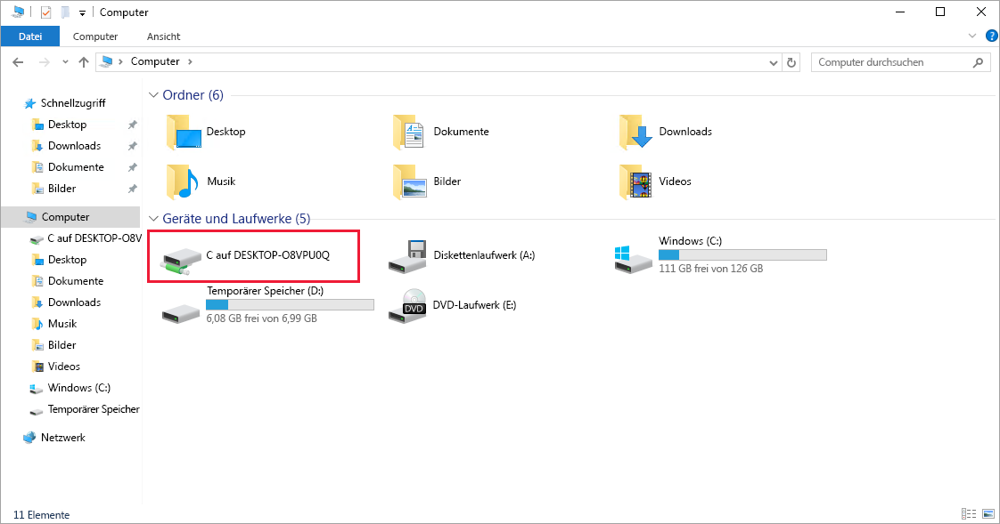
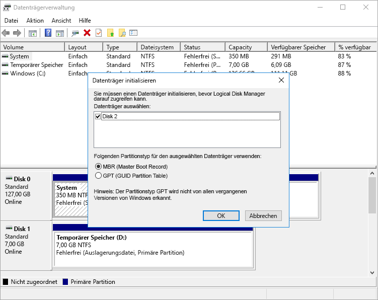

Der virtuelle Windows-Computer wurde bereitgestellt und wird ausgeführt, aber ist noch nicht für Aufgaben konfiguriert.

Denken Sie daran, dass es sich bei diesem Szenario um ein Videoverarbeitungssystem handelt. Unsere Plattform empfängt Dateien über FTP. Die Verkehrsüberwachungskameras laden Videoclips an eine bekannte URL hoch, die einem Ordner auf dem Server zugeordnet ist. Die benutzerdefinierte Software auf jedem virtuellen Windows-Computer wird als Dienst ausgeführt, überwacht den Ordner und verarbeitet die einzelnen hochgeladenen Clips. Sie übergibt das normalisierte Video anschließend an den Algorithmus, der unter anderen Azure-Diensten ausgeführt wird.

Für die Unterstützung dieses Szenarios müssen einige Dinge konfiguriert werden:

- Installieren Sie FTP, und öffnen Sie die Ports, die für die Kommunikation erforderlich sind.
- Installieren Sie den proprietären Videocodec, der für das Kamerasystem der Stadt einzigartig ist.
- Installieren Sie unseren Transcodierungsdienst, der hochgeladene Videos verarbeitet.

Viele davon sind typische administrative Aufgaben, die wir hier nicht behandeln, und es muss keine Software installiert werden. Stattdessen stellen wir Ihnen die einzelnen Schritte vor und zeigen Ihnen, wie Sie benutzerdefinierte Software oder Software von Drittanbietern über Remotedesktop installieren _könnten_. Beginnen wir mit dem Abrufen der Verbindungsinformationen.

## Herstellen einer Verbindung mit dem virtuellen Computer über das Remotedesktopprotokoll

Zum Herstellen einer Verbindung zwischen einem virtuellen Azure-Computer mit einem RDP-Client benötigen Sie Folgendes:

- Die öffentliche IP-Adresse des virtuellen Computers (oder die private, wenn der virtuelle Computer so konfiguriert ist, dass er eine Verbindung mit Ihrem Netzwerk herstellt).
- Die Portnummer.

Sie können diese Informationen in den RDP-Client eingeben oder eine vorkonfigurierte **RDP**-Datei herunterladen.

### Herunterladen der RDP-Datei

1. Stellen Sie im [Azure-Portal](https://portal.azure.com/triplecrownlabs.onmicrosoft.com?azure-portal=true) sicher, dass der Bereich **Übersicht** für den zuvor erstellten virtuellen Computer geöffnet ist. Sie finden den virtuellen Computer unter **Alle Ressourcen**, falls Sie diesen öffnen müssen. Im Bereich „Übersicht“ finden Sie zahlreiche Informationen zum virtuellen Computer.

    - Sie können sehen, ob er ausgeführt wird.
    - Sie können ihn beenden oder neu starten.
    - Sie können die öffentliche IP-Adresse abrufen, um eine Verbindung mit dem virtuellen Computer herzustellen.
    - Sie können die Aktivität von CPU, Datenträger und Netzwerk anzeigen.

1. Klicken Sie oben im Bereich auf die Schaltfläche **Verbinden**.

1. Notieren Sie sich die Einstellungen für die **IP-Adresse** und die **Portnummer** auf dem Blatt **Herstellen der Verbindung mit dem virtuellen Computer**, klicken Sie dann auf **RDP-Datei herunterladen**, und speichern Sie diese.

1. Bevor wir die Verbindung herstellen, müssen einige Einstellungen angepasst werden. Suchen Sie die Datei in Windows mit dem Explorer, klicken Sie mit der rechten Maustaste darauf, und wählen Sie dann **Bearbeiten** aus. Unter macOS müssen Sie die Datei zuerst mit dem RDP-Client öffnen, anschließend mit der rechten Maustaste auf das Element in der angezeigten Liste klicken und **Bearbeiten** auswählen.

1. Sie können eine Vielzahl von Einstellungen anpassen, um den Verbindungsvorgang mit dem virtuellen Azure-Computer zu steuern. Sie sollten sich folgende Einstellungen näher ansehen:

    - **Anzeige:** Ist standardmäßig auf Vollbild festgelegt. Sie können diese Einstellung in eine niedrigere Auflösung ändern oder alle Monitore verwenden, wenn Sie mehr als einen Monitor nutzen.
    - **Lokale Ressourcen:** Sie können lokale Laufwerke für den virtuellen Computer freigeben. Hierdurch können Sie Dateien von Ihrem PC auf den virtuellen Computer kopieren. Klicken Sie unter **Lokale Geräte und Ressourcen** auf die Schaltfläche **Mehr**, um freizugebende Geräte auszuwählen.
    - **Experience** (Darstellung): Passen Sie die visuelle Darstellung basierend auf Ihrer Netzwerkqualität an.

1. Geben Sie Ihr lokales Laufwerk C: frei, damit es auf dem virtuellen Computer sichtbar ist.

1. Wechseln Sie zurück zur Registerkarte **Allgemein**, und klicken Sie auf **Speichern**, um die Änderungen zu speichern. Sie können jederzeit zurückkehren und diese Datei später bearbeiten, um andere Einstellungen zu testen.

### Herstellen einer Verbindung mit dem virtuellen Windows-Computer

1. Klicken Sie auf **Verbinden**, um die Verbindung mit dem virtuellen Computer zu starten.

1. Notieren Sie sich die Sicherheitswarnung und die IP-Adresse des Remotecomputers, die im Dialogfeld **Remotedesktopverbindung** angezeigt werden, und klicken Sie dann auf **Verbinden**.

1. Geben Sie im Dialogfeld **Windows-Sicherheit** Ihren Benutzernamen und Ihr Kennwort ein, den bzw. das Sie bereits in den Schritten 6 und 7 verwendet haben.

    > [!NOTE]
    > Wenn Sie einen Windows-Client für die Verbindung mit dem virtuellen Computer verwenden, werden standardmäßig bekannte Identitäten auf Ihrem Computer verwendet. Sie können auf die Option **More choices** (Weitere Optionen) klicken und „Use a different account“ (Anderes Konto verwenden) auswählen. Hierdurch können Sie eine andere Kombination aus Benutzername und Kennwort eingeben.

1. Notieren Sie sich die Zertifikatfehler im zweiten Dialogfeld **Remotedesktopverbindung**, und klicken Sie dann auf **Ja**.

### Installieren von Workerrollen

Beim erstmaligen Herstellen einer Verbindung mit einem virtuellen Windows Server-Computer wird der Server-Manager gestartet. Dadurch können Sie häufigen Web- oder Datenaufgaben eine Workerrolle zuweisen. Sie können den Server-Manager auch über das Startmenü starten.

Hier würden wir dem Server die Rolle „Webserver“ hinzufügen. Dadurch werden die IIS installiert und HTTP-Anforderungen als Teil der Konfiguration deaktiviert. Außerdem wird der FTP-Server aktiviert. Alternativ könnten wir die IIS ignorieren und einen FTP-Server eines Drittanbieters installieren. Anschließend würden wir den FTP-Server konfigurieren, um den Zugriff auf einen Ordner auf dem Big Data-Laufwerk zuzulassen, das wir dem virtuellen Computer hinzugefügt haben.

Da wir das nun tatsächlich nicht konfigurieren werden, schließen Sie den Server-Manager einfach wieder.

## Installieren benutzerdefinierter Software

Es gibt zwei Herangehensweisen, um Software zu installieren. Bei der ersten Möglichkeit ist dieser virtuelle Computer mit dem Internet verbunden. Wenn die benötigte Software über einen herunterladbaren Installer verfügt, können Sie in der RDP-Sitzung einen Webbrowser öffnen, die Software herunterladen und dann installieren. Wenn Ihre Software wie unser benutzerdefinierter Dienst benutzerdefiniert ist, können Sie die Software bei der zweiten Herangehensweise auf den virtuellen Computer kopieren, um sie zu installieren. Sehen wir uns die zweite Herangehensweise genauer an.

1. Öffnen Sie den Datei-Explorer. Klicken Sie in der Randleiste auf **Dieser PC**. Es sollten mehrere Laufwerke angezeigt werden:

    - Das Windows-Laufwerk (C:), das das Betriebssystem darstellt.
    - Das temporäre Speicherlaufwerk (D:).
    - Ihr lokales Laufwerk „C:“. (Der Name wird sich vom Namen aus dem Beispiel unterscheiden.)

    

Durch den Zugriff auf Ihr lokales Laufwerk können Sie die Dateien für die benutzerdefinierte Software auf den virtuellen Computer kopieren und die Software installieren. Da es sich nur um ein simuliertes Szenario handelt, werden wir diesen Vorgang hier nicht ausführen, aber Sie können sich die Vorgehensweise vorstellen.

Es ist interessanter, zu betrachten, was in der Liste der Laufwerke _fehlt_. Beachten Sie, dass das **Datenlaufwerk** nicht angezeigt wird. Azure hat eine VHD hinzugefügt, aber nicht initialisiert.

## Initialisieren von Laufwerken

Alle zusätzlichen Laufwerke, die Sie neu erstellen, müssen initialisiert und formatiert werden. Der Prozess ist der gleiche wie bei einem physischen Laufwerk.

1. Starten Sie das Tool **Datenträgerverwaltung** über das Startmenü. Möglicherweise müssen Sie zuerst zur Computerverwaltung navigieren, um zur Datenträgerverwaltung zu gelangen. Alternativ können Sie auch im Startmenü nach „Datenträgerverwaltung“ suchen.

1. Es wird eine Warnung mit dem Hinweis angezeigt, dass ein nicht initialisiertes Laufwerk gefunden wurde.

    

1. Klicken Sie auf **OK**, um den Datenträger zu initialisieren. Daraufhin wird er in der Liste der Volumes angezeigt, in der Sie ihn formatieren und ihm einen Laufwerkbuchstaben zuweisen können.

1. Wenn Sie den Datei-Explorer öffnen, sollte nun Ihr Datenlaufwerk angezeigt werden.

1. Schließen Sie nun den RDP-Client, um sich vom virtuellen Computer abzumelden. Der Server wird weiterhin ausgeführt.

Über RDP können Sie mit dem virtuellen Azure-Computer wie mit einem lokalen Computer arbeiten. Durch den Zugriff auf die Desktop-Benutzeroberfläche können Sie diesen virtuellen Computer wie jeden anderen Windows-Computer verwalten: Sie können Software installieren, Rollen konfigurieren, Features anpassen und andere häufige Aufgaben ausführen. Allerdings handelt es sich um einen manuellen Prozess. Wenn Sie häufig Software installieren müssen, sollten Sie die Automatisierung des Prozesses mithilfe von Skripts in Betracht ziehen.