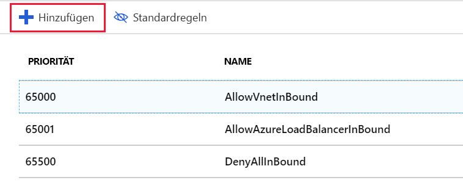
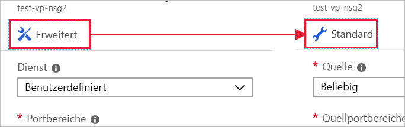
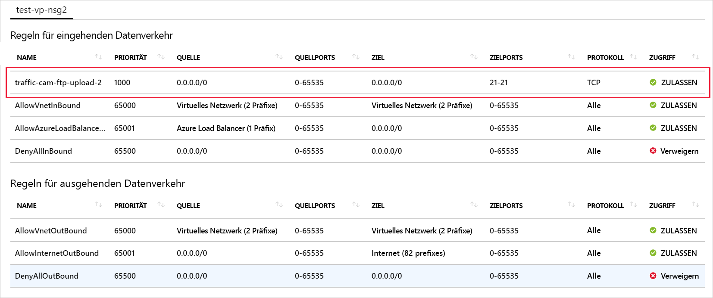

Der Server ist nun in der Lage, Videodaten zu verarbeiten. In einem letzten Schritt müssen Sie die Ports öffnen, die die Verkehrsüberwachungskameras verwenden, um Videodateien auf den Server zu laden.Our server is ready to process video data; the last thing we need to do is open the ports that the traffic cameras will use to upload video files to our server.

## Erstellen einer NetzwerksicherheitsgruppeCreate a network security group

Aufgrund der Angabe, dass Remotedesktopzugriff benötigt wird, sollte Azure eine Sicherheitsgruppe erstellt haben.Azure should have created a security group for us because we indicated we wanted Remote Desktop access. Nachfolgend erfahren Sie, wie Sie eine neue Sicherheitsgruppe erstellen, damit Sie sich mit dem gesamten Prozess vertraut machen können.But let's create a new security group so you can walk through the entire process. Das ist besonders wichtig, wenn Sie Ihr virtuelles Netzwerk _vor_ Ihren virtuellen Computern erstellen möchten.This is particularly important if you decide to create your virtual network _before_ your VMs. Zur Erinnerung: Sicherheitsgruppen sind _optional_ und werden nicht notwendigerweise zusammen mit dem Netzwerk erstellt.As mentioned earlier, security groups are _optional_ and not necessarily created with the network.

> [!NOTE]
> Da es sich hierbei um den zweiten virtuellen Computer handeln _sollte_, sollte bereits eine Sicherheitsgruppe vorhanden sein, die auf unser Netzwerk angewendet werden kann. Wenn dies aber nicht der Fall sein sollte oder andere Regeln für diesen virtuellen Computer gelten, gehen Sie wie folgt vor.Since this is _supposed_ to be the second VM, we would already have a security group to apply to our network, but let's pretend for a moment that we don't, or that the rules are different for this VM.

1. Klicken Sie im [Azure-Portal](https://portal.azure.com/learn.docs.microsoft.com?azure-portal=true) auf der linken Randleiste auf die Schaltfläche **Ressource erstellen**, um eine neue Ressource zu erstellen.In the [Azure portal](https://portal.azure.com/learn.docs.microsoft.com?azure-portal=true), click the **Create a resource** button in the left corner sidebar to start a new resource creation.

1. Geben Sie „Netzwerksicherheitsgruppe“ in das Filterfeld ein, und wählen Sie das entsprechende Element in der Liste aus.Type "Network security group" into the filter box and select the matching item in the list.

1. Vergewissern Sie sich, dass das Bereitstellungsmodell **Resource Manager** ausgewählt ist, und klicken Sie auf **Erstellen**.Make sure the **Resource Manager** deployment model is selected and click **Create**.

1. Geben Sie einen **Namen** für Ihre Sicherheitsgruppe an.Provide a **Name** for your security group. Auch hier empfiehlt sich die Verwendung einer Namenskonvention. Verwenden Sie z.B. „test-vp-nsg2“ für die „zweite Netzwerksicherheitsgruppe zum Testen des Videoprozessors“.Again, naming conventions are a good idea here, let's use "test-vp-nsg2" for "Test Video Processor Network Security Group #2".

1. Wählen Sie das richtige **Abonnement** aus, und verwenden Sie Ihre bereits vorhandene **Ressourcengruppe** (<rgn>[Name der Sandboxressourcengruppe]</rgn>).Select the proper **Subscription** and use your existing **Resource group**, "<rgn>[sandbox resource group name]</rgn>".

1. Platzieren Sie sie abschließend am gleichen **Standort** wie den virtuellen Computer bzw. das virtuelle Netzwerk.Finally, put it into the same **Location** as the VM / Virtual Network. Dies ist wichtig, da Sie diese Ressource andernfalls nicht anwenden können.This is important - you won't be able to apply this resource if it's in a different location.

1. Klicken Sie auf **Erstellen**, um die Gruppe zu erstellen.Click **Create** to create the group.

## Hinzufügen einer neuen Regel für eingehenden Datenverkehr zur NetzwerksicherheitsgruppeAdd a new inbound rule to our Network Security Group

Die Bereitstellung sollte schnell abgeschlossen sein.Deployment should complete quickly.

1. Suchen Sie im Azure-Portal nach der neuen Sicherheitsgruppenressource, und wählen Sie sie aus.Find the new security group resource and select it in the Azure portal.

1. Auf der Übersichtsseite sehen Sie, dass einige Standardregeln zum Sperren des Netzwerks erstellt wurden.On the overview page, you'll find that it has some default rules created to lock down the network.

    Eingangsseite:On the inbound side:

    - Der gesamte eingehende Datenverkehr zwischen zwei VNETs wird zugelassen.All inbound traffic from one VNet to another is allowed. Auf diese Weise können Ressourcen im VNET miteinander kommunizieren.This lets resources on the VNet talk to each other.
    - Azure Load Balancer sendet Testanforderungen, um zu überprüfen, ob die VM aktiv ist.Azure Load balancer "probe" requests to ensure the VM is alive
    - Anderer eingehender Datenverkehr wird vollständig unterbunden.All other inbound traffic is denied.

    Ausgangsseite:On the outbound side:
    - Der gesamte eingehende Netzwerkdatenverkehr im VNET wird zugelassen.All in-network traffic on the VNet is allowed.
    - Der gesamte ausgehende Datenverkehr in das Internet wird zugelassen.All outbound traffic to the Internet is allowed.
    - Anderer ausgehender Datenverkehr wird vollständig unterbunden.All other outbound traffic is denied.

> [!NOTE]
> Da diese Standardregeln mit hohen Prioritätswerten festgelegt sind, werden sie _zuletzt_ ausgewertet.These default rules are set with high priority values, which means that they get evaluated _last_. Diese Regeln können weder geändert noch gelöscht werden. Sie können die Regeln aber _überschreiben_, indem Sie spezifischere Regeln für Ihren Datenverkehr mit einem niedrigeren Prioritätswert erstellen.They cannot be changed or deleted, but you can _override_ them by creating more specific rules to match your traffic with a lower priority value.

1. Klicken Sie im Bereich **Einstellungen** für die Sicherheitsgruppe auf den Abschnitt **Eingangssicherheitsregeln**.Click the **Inbound security rules** section in the **Settings** panel for the security group.

1. Klicken Sie auf **+ Hinzufügen**, um eine neue Sicherheitsregel hinzuzufügen.Click **+ Add** to add a new security rule.

    

    Die Eingabe der Informationen für eine Sicherheitsregel kann auf zwei Arten erfolgen: im einfachen oder im erweiterten Modus.There are two ways to enter the information necessary for a security rule: basic and advanced. Zwischen diesen beiden Modi kann mithilfe der Schaltfläche im oberen Bereich des Bereichs „Hinzufügen“ gewechselt werden.You can switch between them by clicking the button at the top of the "add" panel.

    

    Im erweiterten Modus kann die Regel vollständig angepasst werden. Wenn Sie allerdings ein bekanntes Protokoll konfigurieren möchten, ist der einfache Modus etwas benutzerfreundlicher.The advanced mode provides the ability to completely customize the rule, however, if you just need to configure a known protocol, the basic mode is a bit easier to work with.

1. Der Bereich wird im Modus **Erweitert** gestartet. Klicken Sie oben auf die Schaltfläche **Standard**, um in den Standardmodus zu wechseln, in dem weniger Optionen ausgefüllt werden müssen.The panel starts in **Advanced** mode, click the **Basic** button at the top to switch to basic mode which has less options to fill out.

1. Fügen Sie die Informationen für unsere FTP-Regel hinzu.Add the information for our FTP rule.

    - Legen Sie den **Dienst** auf „FTP“ fest.Set the **Service** to be FTP. Dadurch wird automatisch der Portbereich eingerichtet.This will set your port range up for you.
    - Legen Sie die **Priorität** auf „1.000“ fest.Set the **Priority** to "1000". Der Wert muss niedriger sein als der Wert der Regel **Verweigern**.It has to be a lower number than the default **Deny** rule. Der Bereich kann bei einem beliebigen Wert beginnen. Es empfiehlt sich jedoch, einen gewissen Puffer einzubauen, falls später noch eine Ausnahme erstellt werden muss.You can start the range at any value, but it's recommended you give yourself some space in case an exception needs to be created later.
    - Benennen Sie die Regel. Wir verwenden hier den Namen „traffic-cam-ftp-upload-2“.Give the rule a name, we'll use "traffic-cam-ftp-upload-2".
    - Geben Sie eine Beschreibung der Regel ein.Give the rule a description.

1. Wechseln Sie zurück zum Modus **Erweitert**, indem Sie oben auf die Schaltfläche **Erweitert** klicken.Switch back to the **Advanced** mode by clicking the **Advanced** button at the top. Wie Sie sehen, sind unsere Einstellungen immer noch vorhanden.Notice that our settings are still present. In diesem Bereich können wir differenziertere Einstellungen erstellen.We can use this panel to create more fine-grained settings. Wir können beispielsweise die **Quelle** auf eine bestimmte IP-Adresse oder auf einen bestimmten IP-Adressbereich für die Kameras beschränken.In particular, we would likely restrict the **Source** to be a specific IP address or range of IP addresses specific to the cameras. Wenn Sie die aktuelle IP-Adresse Ihres lokalen Computers kennen, können Sie das ausprobieren.If you know the current IP address of your local computer, you can try that. Behalten Sie andernfalls die Einstellung „Beliebig“ bei, um die Regel zu testen.Otherwise, leave the setting as "Any" so you can test the rule.

1. Klicken Sie auf **Hinzufügen**, um die Regel zu erstellen.Click **Add** to create the rule. Dadurch wird die Eingangsregelliste aktualisiert. Die Regeln werden nach Priorität sortiert und in der angezeigten Reihenfolge ausgewertet.This will update the list of inbound rules - notice they are in priority order, which is how they will be examined.

## Anwenden der SicherheitsgruppeApply the security group

Zur Erinnerung: Eine Sicherheitsgruppe lässt sich auf eine Netzwerkschnittstelle anwenden, um einen einzelnen virtuellen Computer zu schützen, oder auf ein Subnetz, um alle Ressourcen dieses Subnetzes zu schützen.Recall that we can apply the security group to a network interface to guard a single VM, or to a subnet where it would apply to any resources on that subnet. Der zweite Fall ist gängiger, daher verwenden wir ihn hier.The latter approach tends to be the most common so let's do that. Zu der Ressource in Azure gelangen wir entweder über die Ressource des virtuellen Netzwerks oder indirekt über den virtuellen Computer, der das virtuelle Netzwerk verwendet.We could get to this resource in Azure through either the virtual network resource or indirectly through the VM, which is using the virtual network.

1. Wechseln Sie zum Bereich **Übersicht** für den virtuellen Computer.Switch to the **Overview** panel for the virtual machine. Den virtuellen Computer finden Sie unter **Alle Ressourcen**.You can find the VM under **All Resources**.

1. Klicken Sie im Abschnitt **Einstellungen** auf **Netzwerk**.Select the **Networking** item in the **Settings** section.

    

1. In den Netzwerkeigenschaften finden Sie Informationen zum Netzwerk des virtuellen Computers – einschließlich **Virtuelles Netzwerk/Subnetz**.In the networking properties, you will find information about the networking applied to the VM including the **Virtual network/subnet**. Hierbei handelt es sich um einen klickbaren Link, über den Sie zu der Ressource gelangen.This is a clickable link to get to the resource. Klicken Sie auf den Link, um das virtuelle Netzwerk zu öffnen.Click it to open the virtual network. Dieser Link steht _auch_ im Bereich **Übersicht** des virtuellen Computers zur Verfügung.This link is _also_ available on the **Overview** panel of the VM. Beide Links öffnen die **Übersicht** des virtuellen Netzwerks.Either of these will open the **Overview** of the virtual network.

1. Klicken Sie im Abschnitt **Einstellungen** auf **Subnetze**.In the **Settings** section, select the **Subnets** item.

1. Hier sollte ein einzelnes Subnetz (Standard) definiert sein, das zuvor zusammen mit dem virtuellen Computer und dem virtuellen Netzwerk erstellt wurde.We should have a single subnet defined (default) from when we created the VM + network earlier. Klicken Sie auf das Listenelement, um die Details zu öffnen.Click the item in the list to open the details.

1. Klicken Sie auf den Eintrag **Netzwerksicherheitsgruppe**.Click the **Network security group** entry.

1. Wählen Sie Ihre neue Sicherheitsgruppe (**test-vp-nsg2**) aus.Select your new security group: **test-vp-nsg2**.

1. Klicken Sie auf **Speichern**, um die Änderung zu speichern.Click **Save** to save the change. Die Anwendung auf das Netzwerk nimmt etwas Zeit in Anspruch.It will take a minute to apply to the network.

## Überprüfen der RegelnVerify the rules

Im nächsten Schritt überprüfen wir die Änderung.Let's validate the change.

1. Kehren Sie zum Bereich **Übersicht** für den virtuellen Computer zurück.Switch back to the **Overview** panel for the virtual machine. Den virtuellen Computer finden Sie unter **Alle Ressourcen**.You can find the VM under **All Resources**.

1. Klicken Sie im Abschnitt **Einstellungen** auf **Netzwerk**.Select the **Networking** item in the **Settings** section.

1. Über den Link **Effektive Sicherheitsregeln** im Bereich **Übersicht** für das Netzwerk können Sie schnell überprüfen, wie Regeln ausgewertet werden.In the **Overview** panel for the network, there is a link for **Effective security rules** that will quickly show you how rules are going to be evaluated. Klicken Sie auf den Link, um die Analyse zu öffnen, und vergewissern Sie sich, dass Ihre FTP-Regel angezeigt wird.Click the link to open the analysis and make sure you see your FTP rule.

    

1. Diese Regel ermöglicht die Verbindungsherstellung mit einem FTP-Server. Hätten wir die FTP-Workerrolle hinzugefügt und Ordner konfiguriert, könnten Sie mithilfe eines FTP-Clients eine Verbindung mit dem Server herstellen.This rule would let you connect to an FTP server; if we had added the FTP worker role and configured folders, you would be able to use an FTP client to connect to the server.

## Anmerkung:One more thing

Die richtige Implementierung von Sicherheitsregeln ist nicht immer ganz einfach.Security rules are tricky to get right. Bei der Anwendung dieser neuen Sicherheitsgruppe kann z.B. der Fehler auftreten, dass kein Remotedesktopzugriff mehr vorhanden ist.We actually made a mistake when we applied this new security group - we lost our Remote Desktop access! Zur Behebung dieses Problems können Sie der Sicherheitsgruppe eine weitere Regel hinzufügen, um den RDP-Zugriff zu unterstützen.To fix this, you can add another rule to the security group to support RDP access. Achten Sie darauf, die eingehenden TCP/IP-Adressen für die Regel auf Ihre eigenen Adressen zu beschränken.Make sure to restrict the inbound TCP/IP addresses for the rule to be the ones you own.

> [!WARNING]
> Denken Sie immer daran, für den Administratorzugriff verwendete Ports zu sperren.Always make sure to lock down ports used for administrative access. Noch besser: Erstellen Sie ein VPN, um das virtuelle Netzwerk mit Ihrem privaten Netzwerk zu verbinden, und lassen Sie nur RDP- oder SSH-Anforderungen aus diesem Adressbereich zu.An even better approach is to create a VPN to link the virtual network to your private network and only allow RDP or SSH requests from that address range. Sie können auch die Standardeinstellung für den von dem Remotedesktopprotokoll verwendeten Port (3389) ändern.You can also change the port used by RDP to be something other than the default 3389. Denken Sie aber daran, dass eine Portänderung noch keine ausreichende Angriffsabwehr darstellt, sondern lediglich die Portermittlung etwas erschwert.Keep in mind that changing ports is not sufficient to stop attacks, it simply makes it a little harder to discover.