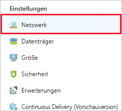

Der Server ist nun in der Lage, Videodaten zu verarbeiten. In einem letzten Schritt müssen Sie die Ports öffnen, die die Verkehrsüberwachungskameras verwenden, um Videodateien auf den Server zu laden.

## Erstellen einer Netzwerksicherheitsgruppe

Aufgrund der Angabe, dass Remotedesktopzugriff benötigt wird, sollte Azure eine Sicherheitsgruppe erstellt haben. Nachfolgend erfahren Sie, wie Sie eine neue Sicherheitsgruppe erstellen, damit Sie sich mit dem gesamten Prozess vertraut machen können. Das ist besonders wichtig, wenn Sie Ihr virtuelles Netzwerk _vor_ Ihren virtuellen Computern erstellen möchten. Zur Erinnerung: Sicherheitsgruppen sind _optional_ und werden nicht notwendigerweise zusammen mit dem Netzwerk erstellt.

> [!NOTE]
> Da es sich hierbei um den zweiten virtuellen Computer handeln _sollte_, sollte bereits eine Sicherheitsgruppe vorhanden sein, die auf unser Netzwerk angewendet werden kann. Wenn dies aber nicht der Fall sein sollte oder andere Regeln für diesen virtuellen Computer gelten, gehen Sie wie folgt vor.

1. Klicken Sie im [Azure-Portal](https://portal.azure.com/learn.docs.microsoft.com?azure-portal=true) auf der linken Randleiste auf die Schaltfläche **Ressource erstellen**, um eine neue Ressource zu erstellen.

1. Geben Sie „Netzwerksicherheitsgruppe“ in das Filterfeld ein, und wählen Sie das entsprechende Element in der Liste aus.

1. Vergewissern Sie sich, dass das Bereitstellungsmodell **Resource Manager** ausgewählt ist, und klicken Sie auf **Erstellen**.

1. Geben Sie einen **Namen** für Ihre Sicherheitsgruppe an. Auch hier empfiehlt sich die Verwendung einer Namenskonvention. Verwenden Sie z.B. „test-vp-nsg2“ für die „zweite Netzwerksicherheitsgruppe zum Testen des Videoprozessors“.

1. Wählen Sie das richtige **Abonnement** aus, und verwenden Sie Ihre bereits vorhandene **Ressourcengruppe** (<rgn>[Name der Sandboxressourcengruppe]</rgn>).

1. Platzieren Sie sie abschließend am gleichen **Standort** wie den virtuellen Computer bzw. das virtuelle Netzwerk. Dies ist wichtig, da Sie diese Ressource andernfalls nicht anwenden können.

1. Klicken Sie auf **Erstellen**, um die Gruppe zu erstellen.

## Hinzufügen einer neuen Regel für eingehenden Datenverkehr zur Netzwerksicherheitsgruppe

Die Bereitstellung sollte schnell abgeschlossen sein.

1. Suchen Sie im Azure-Portal nach der neuen Sicherheitsgruppenressource, und wählen Sie sie aus.

1. Auf der Übersichtsseite sehen Sie, dass einige Standardregeln zum Sperren des Netzwerks erstellt wurden.

    Eingangsseite:

    - Der gesamte eingehende Datenverkehr zwischen zwei VNETs wird zugelassen. Auf diese Weise können Ressourcen im VNET miteinander kommunizieren.
    - Azure Load Balancer sendet Testanforderungen, um zu überprüfen, ob die VM aktiv ist.
    - Anderer eingehender Datenverkehr wird vollständig unterbunden.

    Ausgangsseite:
    - Der gesamte eingehende Netzwerkdatenverkehr im VNET wird zugelassen.
    - Der gesamte ausgehende Datenverkehr in das Internet wird zugelassen.
    - Anderer ausgehender Datenverkehr wird vollständig unterbunden.

> [!NOTE]
> Da diese Standardregeln mit hohen Prioritätswerten festgelegt sind, werden sie _zuletzt_ ausgewertet. Diese Regeln können weder geändert noch gelöscht werden. Sie können die Regeln aber _überschreiben_, indem Sie spezifischere Regeln für Ihren Datenverkehr mit einem niedrigeren Prioritätswert erstellen.

1. Klicken Sie im Bereich **Einstellungen** für die Sicherheitsgruppe auf den Abschnitt **Eingangssicherheitsregeln**.

1. Klicken Sie auf **+ Hinzufügen**, um eine neue Sicherheitsregel hinzuzufügen.

    

    Die Eingabe der Informationen für eine Sicherheitsregel kann auf zwei Arten erfolgen: im einfachen oder im erweiterten Modus. Zwischen diesen beiden Modi kann mithilfe der Schaltfläche im oberen Bereich des Bereichs „Hinzufügen“ gewechselt werden.

    

    Im erweiterten Modus kann die Regel vollständig angepasst werden. Wenn Sie allerdings ein bekanntes Protokoll konfigurieren möchten, ist der einfache Modus etwas benutzerfreundlicher.

1. Der Bereich wird im Modus **Erweitert** gestartet. Klicken Sie oben auf die Schaltfläche **Standard**, um in den Standardmodus zu wechseln, in dem weniger Optionen ausgefüllt werden müssen.

1. Fügen Sie die Informationen für unsere FTP-Regel hinzu.

    - Legen Sie den **Dienst** auf „FTP“ fest. Dadurch wird automatisch der Portbereich eingerichtet.
    - Legen Sie die **Priorität** auf „1.000“ fest. Der Wert muss niedriger sein als der Wert der Regel **Verweigern**. Der Bereich kann bei einem beliebigen Wert beginnen. Es empfiehlt sich jedoch, einen gewissen Puffer einzubauen, falls später noch eine Ausnahme erstellt werden muss.
    - Benennen Sie die Regel. Wir verwenden hier den Namen „traffic-cam-ftp-upload-2“.
    - Geben Sie eine Beschreibung der Regel ein.

1. Wechseln Sie zurück zum Modus **Erweitert**, indem Sie oben auf die Schaltfläche **Erweitert** klicken. Wie Sie sehen, sind unsere Einstellungen immer noch vorhanden. In diesem Bereich können wir differenziertere Einstellungen erstellen. Wir können beispielsweise die **Quelle** auf eine bestimmte IP-Adresse oder auf einen bestimmten IP-Adressbereich für die Kameras beschränken. Wenn Sie die aktuelle IP-Adresse Ihres lokalen Computers kennen, können Sie das ausprobieren. Behalten Sie andernfalls die Einstellung „Beliebig“ bei, um die Regel zu testen.

1. Klicken Sie auf **Hinzufügen**, um die Regel zu erstellen. Dadurch wird die Eingangsregelliste aktualisiert. Die Regeln werden nach Priorität sortiert und in der angezeigten Reihenfolge ausgewertet.

## Anwenden der Sicherheitsgruppe

Zur Erinnerung: Eine Sicherheitsgruppe lässt sich auf eine Netzwerkschnittstelle anwenden, um einen einzelnen virtuellen Computer zu schützen, oder auf ein Subnetz, um alle Ressourcen dieses Subnetzes zu schützen. Der zweite Fall ist gängiger, daher verwenden wir ihn hier. Zu der Ressource in Azure gelangen wir entweder über die Ressource des virtuellen Netzwerks oder indirekt über den virtuellen Computer, der das virtuelle Netzwerk verwendet.

1. Wechseln Sie zum Bereich **Übersicht** für den virtuellen Computer. Den virtuellen Computer finden Sie unter **Alle Ressourcen**.

1. Klicken Sie im Abschnitt **Einstellungen** auf **Netzwerk**.

    

1. In den Netzwerkeigenschaften finden Sie Informationen zum Netzwerk des virtuellen Computers – einschließlich **Virtuelles Netzwerk/Subnetz**. Hierbei handelt es sich um einen klickbaren Link, über den Sie zu der Ressource gelangen. Klicken Sie auf den Link, um das virtuelle Netzwerk zu öffnen. Dieser Link steht _auch_ im Bereich **Übersicht** des virtuellen Computers zur Verfügung. Beide Links öffnen die **Übersicht** des virtuellen Netzwerks.

1. Klicken Sie im Abschnitt **Einstellungen** auf **Subnetze**.

1. Hier sollte ein einzelnes Subnetz (Standard) definiert sein, das zuvor zusammen mit dem virtuellen Computer und dem virtuellen Netzwerk erstellt wurde. Klicken Sie auf das Listenelement, um die Details zu öffnen.

1. Klicken Sie auf den Eintrag **Netzwerksicherheitsgruppe**.

1. Wählen Sie Ihre neue Sicherheitsgruppe (**test-vp-nsg2**) aus.

1. Klicken Sie auf **Speichern**, um die Änderung zu speichern. Die Anwendung auf das Netzwerk nimmt etwas Zeit in Anspruch.

## Überprüfen der Regeln

Im nächsten Schritt überprüfen wir die Änderung.

1. Kehren Sie zum Bereich **Übersicht** für den virtuellen Computer zurück. Den virtuellen Computer finden Sie unter **Alle Ressourcen**.

1. Klicken Sie im Abschnitt **Einstellungen** auf **Netzwerk**.

1. Über den Link **Effektive Sicherheitsregeln** im Bereich **Übersicht** für das Netzwerk können Sie schnell überprüfen, wie Regeln ausgewertet werden. Klicken Sie auf den Link, um die Analyse zu öffnen, und vergewissern Sie sich, dass Ihre FTP-Regel angezeigt wird.

    

1. Diese Regel ermöglicht die Verbindungsherstellung mit einem FTP-Server. Hätten wir die FTP-Workerrolle hinzugefügt und Ordner konfiguriert, könnten Sie mithilfe eines FTP-Clients eine Verbindung mit dem Server herstellen.

## Anmerkung:

Die richtige Implementierung von Sicherheitsregeln ist nicht immer ganz einfach. Bei der Anwendung dieser neuen Sicherheitsgruppe kann z.B. der Fehler auftreten, dass kein Remotedesktopzugriff mehr vorhanden ist. Zur Behebung dieses Problems können Sie der Sicherheitsgruppe eine weitere Regel hinzufügen, um den RDP-Zugriff zu unterstützen. Achten Sie darauf, die eingehenden TCP/IP-Adressen für die Regel auf Ihre eigenen Adressen zu beschränken.

> [!WARNING]
> Denken Sie immer daran, für den Administratorzugriff verwendete Ports zu sperren. Noch besser: Erstellen Sie ein VPN, um das virtuelle Netzwerk mit Ihrem privaten Netzwerk zu verbinden, und lassen Sie nur RDP- oder SSH-Anforderungen aus diesem Adressbereich zu. Sie können auch die Standardeinstellung für den von dem Remotedesktopprotokoll verwendeten Port (3389) ändern. Denken Sie aber daran, dass eine Portänderung noch keine ausreichende Angriffsabwehr darstellt, sondern lediglich die Portermittlung etwas erschwert.