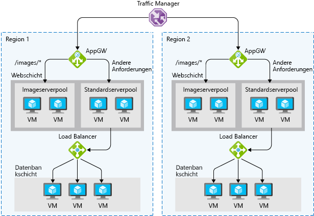

Hochverfügbarkeit (High Availability, HA) stellt sicher, dass Ihre Architektur Fehler behandeln kann. Angenommen Sie, Sie für ein System verantwortlich sind, die immer voll funktionsfähig sein muss. Fehler können und werden auftreten. Wie also stellen Sie sicher, dass Ihr System online bleiben kann, wenn etwas schief geht? Wie gehen Sie mit Wartungsereignissen um? 

Hier können Sie sich über Hochverfügbarkeit informieren, die Anforderungen an die Hochverfügbarkeit von Anwendungen auswerten und erfahren, wie die Azure-Plattform Hochverfügbarkeit bietet und Lösungen zur Erreichung Ihrer Verfügbarkeitsziele bereitstellt.

## Was ist Hochverfügbarkeit?

> [!VIDEO https://www.microsoft.com/videoplayer/embed/RE2yEvc]

Ein hoch verfügbaren Diensts ist ein Dienst, der gleicht schwankungen bei Verfügbarkeit und Last sowie Vorübergehende Ausfälle in abhängigen Diensten und Hardwarekomponenten. Die Anwendung bleibt mit einem akzeptablen Leistungsniveau online und verfügbar (oder erweckt zumindest den Anschein). Dieser verfügbarkeitsgruppe wird häufig durch geschäftsanforderungen, Servicelevel-Zielpunkte oder Vereinbarungen zum Servicelevel definiert.

Bei der Hochverfügbarkeit geht es letztlich um die Fähigkeit, mit dem Verlust oder der schwerwiegenden Leistungsverschlechterung einer Komponente eines Systems umzugehen. Dies kann aufgrund eines virtuellen Computers sein, die eine Anwendung, die offline geschaltet, weil der Host hostet. Ein solcher Fall kann auch aufgrund einer geplanten Wartung für ein Systemupgrade eintreten. Sogar ein Ausfall eines Diensts in der Cloud kann die Ursache sein. Die Identifizierung der Stellen, an denen Ihr System ausfallen kann, und der Aufbau von Funktionen zur Bewältigung dieser Ausfälle stellen sicher, dass die von Ihnen für Ihre Kunden angebotenen Dienste online bleiben können.

Die Hochverfügbarkeit eines Diensts erfordert in der Regel eine hohe Verfügbarkeit der Komponenten, aus denen der Dienst besteht. Stellen Sie eine Website, die ein online-Marketplace erwerben Elemente bietet. Der Dienst, der für Ihre Kunden angeboten wird ist die Möglichkeit, auflisten, kaufen und verkaufen Artikel online. Um diesen Dienst bereitzustellen, verwenden Sie mehrere Komponenten: eine Datenbank, Webserver, Anwendungsserver usw. Jede dieser Komponenten kann ein Fehler auftritt, müssen Sie ermitteln, wie und wo sich Ihre Schwachstellen und bestimmen, wie diese Schwachstellen in Ihrer Architektur zu beheben.

## Auswerten von Hochverfügbarkeit für Ihre Architektur

Es gibt drei Schritte für die Auswertung einer Anwendung für Hochverfügbarkeit: 

1. Bestimmen der Vereinbarung zum Servicelevel Ihrer Anwendung
1. Auswerten der HA-Funktionen der Anwendung
1. Auswerten der HA-Funktionen abhängiger Anwendungen

Sehen wir uns diese Schritte im Detail an.

### Bestimmen der Vereinbarung zum Servicelevel Ihrer Anwendung

Eine Vereinbarung zum Servicelevel (SLA) ist eine Vereinbarung zwischen einem Dienstanbieter und ein Dienstconsumer, in der der Dienstanbieter einen Standard des Diensts basierend auf messbaren Metriken und definierten Zuständigkeiten zusichert. SLAs können strenge, rechtlich bindende, vertragliche Vereinbarungen oder angenommene Erwartungen der Kunden an die Verfügbarkeit sein. Dienstmetriken konzentrieren sich in der Regel auf den Durchsatz des Diensts, die Kapazität und die Verfügbarkeit. Diese Werte können auf verschiedene Weise gemessen werden. Unabhängig von den jeweiligen Metriken, aus denen die SLA besteht, kann Nichterfüllung der SLA schwerwiegende finanzielle Auswirkungen für den Dienstanbieter besitzen. Eine allgemeine Komponente von Vereinbarungen zum Servicelevel ist die garantierte finanzielle Entschädigung für nicht eingehaltenen SLAs.

Servicelevel-Zielpunkte (SLO) sind die Werte der Zielmetriken, die zum Messen der Leistung, Zuverlässigkeit und Verfügbarkeit verwendet werden. Dabei kann es sich um Metriken definieren die Leistung der anforderungsverarbeitung in Millisekunden, die Verfügbarkeit von Diensten innerhalb von Minuten pro Monat oder die Anzahl der Anforderungen pro Stunde verarbeitete handeln. Durch die Auswertung der Metriken, die von der Anwendung und verstehen, welche Kunden als Measure des Qualität zu verwenden, können Sie die akzeptable und inakzeptable Bereiche für diese SLOs definieren. Definieren Sie diese Ziele zu erreichen, legen Sie klar Zielen und Erwartungen mit sowohl den Teams, Dienste und Kunden, die Nutzung dieser Dienste werden unterstützt. Diese SLOs werden verwendet werden, um festzustellen, ob er die gesamte-SLA eingehalten wird.

In der folgenden Tabelle sind die potenziellen kumulativen Ausfallzeiten für verschiedene SLA-Ebenen angegeben. 

| SLA | Ausfallzeit pro Woche | Ausfallzeit pro Monat | Ausfallzeit pro Jahr |
| --- | --- | --- | --- |
| 99 % |1,68 Stunden |7,2 Stunden |3,65 Tage |
| 99,9 % |10,1 Minuten |43,2 Minuten |8,76 Stunden |
| 99,95 % |5 Minuten |21,6 Minuten |4,38 Stunden |
| 99,99 % |1,01 Minuten |4,32 Minuten |52,56 Minuten |
| 99,999% |6 Sekunden |25,9 Sekunden |5,26 Minuten |

Sofern alle anderen Faktoren identisch sind, ist eine höhere Verfügbarkeit natürlich immer vorzuziehen. Aber wenn eine noch höhere Verfügbarkeit angestrebt wird, erhöhen sich auch die Kosten und die Komplexität, um dies zu erreichen. Eine Betriebszeit von 99,99% entspricht einer Gesamtausfallzeit von ca. 5 Minuten pro Monat. Rechtfertigt die Erreichung von 99,999% die zusätzliche Komplexität und die höheren Kosten? Die Antwort hängt von Ihren geschäftlichen Anforderungen ab. 

Hier sind einige andere Aspekte aufgeführt, die für das Definieren einer Vereinbarung zum Servicelevel gelten:

* Wenn Sie 99,99% erreichen möchten, können Sie sich bei der Wiederherstellung nach Ausfällen wahrscheinlich nicht auf manuelle Eingriffe verlassen. Die Anwendung muss eine Selbstdiagnose und Selbstreparatur durchführen können. 
* Im Bereich über 99,99% stellt es eine große Herausforderung dar, Ausfälle schnell genug zu erkennen, um die SLA-Anforderungen zu erfüllen.
* Betrachten Sie das Zeitfenster, auf das sich Ihre Vereinbarung zum Servicelevel bezieht. Je kleiner das Fenster, desto enger die Toleranzen. Vermutlich ist es nicht sinnvoll, Ihre Vereinbarung zum Servicelevel in Bezug auf die stündliche oder tägliche Betriebszeit zu definieren. 

Identifizieren von SLAs ist ein wichtiger erster Schritt bei der die Funktionen für hohe Verfügbarkeit zu ermitteln, die Ihre Architektur erfordern. Auf diese Weise können Sie die Methoden entsprechend gestalten, die Sie verwenden, damit Ihre Anwendung hochverfügbar wird.

### Auswerten der HA-Funktionen der Anwendung

Um die HA-Fähigkeiten Ihrer Anwendung auszuwerten, führen Sie eine Fehleranalyse aus. Konzentrieren Sie sich auf einzelne Fehlerquellen und kritische Komponenten, die einen großen Einfluss auf die Anwendung haben würden, wenn sie unerreichbar bzw. falsch konfiguriert wären oder sich unerwartet verhalten würden. Bestimmen Sie für Bereiche, die über Redundanz verfügen, ob die Anwendung in der Lage ist, Fehlerzustände zu erkennen und sich selbst zu reparieren.

Sie müssen alle Komponenten Ihrer Anwendung sorgfältig auswerten, einschließlich der Komponenten, die für die Bereitstellung von HA-Funktionalität entwickelt wurden (z.B. Load Balancer). Einzelne Fehlerquellen müssen entweder geändert werden, um HA-Funktionen zu integrieren, oder sie müssen durch Dienste ersetzt werden, die HA-Funktionen bereitstellen können.

### Auswerten der HA-Funktionen abhängiger Anwendungen

Sie müssen verstehen, nicht nur die Anforderungen Ihrer Anwendung SLA auf einen Consumer, sondern auch die bereitgestellte SLAs für alle Ressourcen, die von Ihrer Anwendung abhängen kann. Wenn Sie eine Betriebszeit für Ihre Kunden von 99,9 % verpflichtet, aber ein Dienst, von denen, dem Ihre Anwendung abhängt, nur eine Verpflichtung Betriebszeit von 99 hat %, könnte dies Sie nicht beachtet wird die SLA für Ihre Kunden gefährdet. Wenn ein abhängiger Dienst nicht in der Lage ist, eine ausreichende SLA bereitzustellen, müssen Sie möglicherweise Ihre eigene SLA ändern, die Abhängigkeit durch eine Alternative ersetzen oder Wege finden, Ihre SLA zu erfüllen, während die Abhängigkeit nicht verfügbar ist. Abhängig vom Szenario und der Art der Abhängigkeit können fehlerhafte Abhängigkeiten vorübergehend mit Lösungen wie Caches und Arbeitswarteschlangen umgangen werden.

## Die hoch verfügbare Azure-Plattform

Die Azure-Cloudplattform wurde entwickelt, um Hochverfügbarkeit für alle zugehörigen Dienste bereitzustellen. Wie jedes System können auch Anwendungen von Ereignissen der Hard- und Softwareplattform betroffen sein. Die Notwendigkeit, Entwerfen Sie Ihre Anwendungsarchitektur, um Fehler zu behandeln ist wichtig, und die Azure-Cloud-Plattform bietet die Tools und Funktionen, um Ihre Anwendung hoch verfügbar zu machen. Es gibt mehrere Kernkonzepte, wenn Sie HA für Ihre Architektur in Azure in Betracht ziehen:

* Verfügbarkeitsgruppen
* Verfügbarkeitszonen
* Lastenausgleich
* Platform-as-HA-Funktionen einem Dienst (PaaS)

### Verfügbarkeitsgruppen

Verfügbarkeitsgruppen stellen eine Möglichkeit dar, Azure zu informieren, dass virtuelle Computer, die zur gleichen Anwendungsarbeitsauslastung gehören, verteilt werden sollten, um gleichzeitige Auswirkungen von Hardwareausfällen und planmäßiger Wartung zu vermeiden. Verfügbarkeitsgruppen bestehen aus *Updatedomänen* und *Fehlerdomänen*.

Updatedomänen stellen sicher, dass eine Teilmenge der Server Ihrer Anwendung jederzeit ausgeführt wird, wenn die Hosts für virtuelle Computer in einem Azure-Datencenter Ausfallzeiten für die Wartung erforderlich machen. Die meisten Updates können ohne Auswirkungen auf die darauf ausgeführten virtuellen Computer ausgeführt werden, aber es gibt Zeiten, wenn dies nicht möglich ist. Um sicherzustellen, dass Updates in einem gesamten Datencenter auf einmal nicht ausfallen, ist das Azure-Rechenzentrum logisch in updatedomänen (UD) geschnitten. Wenn ein wartungsereignis, z. B. Leistungsupdate und wichtigen Sicherheitspatches, die an den Host angewendet werden, wird das Update über updatedomänen eingeordnet. Die Verwendung von Updates mithilfe von updatedomänen Sequenzierung wird sichergestellt, dass das gesamte Rechenzentrum nicht verfügbar, während der Plattformupdates und Patchen nicht.

Während updatedomänen einen logischen Abschnitt des Datencenters darstellen, Fehlerdomänen (FD) physische Abschnitte des Datencenters und dar Rack Vielfalt von Servern in einer verfügbarkeitsgruppe sicher. Fehlerdomänen Ausrichten der physischen Trennung von gemeinsam genutzter Hardware im Rechenzentrum. Dies schließt die Stromversorgungs-, Kühlungs- und Netzwerkhardware ein, die die physischen Server in Serverracks unterstützt. Für den Fall, dass die Hardware, die ein Serverrack unterstützt, nicht mehr verfügbar ist, ist nur dieses Serverrack von dem Ausfall betroffen. Platzieren Sie Ihre virtuellen Computer in einer verfügbarkeitsgruppe, werden Ihrer virtuellen Computer automatisch auf mehrere Fehlerdomänen (fds) verteilt werden, sodass im Falle eines Ausfalls Hardware nur einen Teil Ihrer VMs betroffen sein werden.

Mit Verfügbarkeitsgruppen können Sie sicherstellen, dass Ihre Anwendung online bleibt, wenn ein Wartungsereignis mit schwerwiegenden Auswirkungen erforderlich ist oder Hardwarefehler auftreten.

### Verfügbarkeitszonen

Verfügbarkeitszonen sind unabhängige physische Datencenterstandorte innerhalb einer Region, die über eine eigene Stromversorgung, Kühlung und Netzwerke verfügen. Durch Berücksichtigung von Verfügbarkeitszonen beim Bereitstellen von Ressourcen können Sie Workloads vor Datencenterausfällen unter Beibehaltung der Anwesenheit in einer bestimmten Region schützen. Dienste wie virtuelle Computer sind *zonale Dienste* und ermöglichen es Ihnen, diese in bestimmten Zonen innerhalb einer Region bereitzustellen. Andere Dienste sind *zonenredundante Dienste* und werden über die Verfügbarkeitszonen hinweg in der jeweiligen Azure-Region repliziert. Beide Typen stellen sicher, dass innerhalb einer Azure-Region keine einzelnen Fehlerquellen vorhanden sind.

Unterstützte Regionen enthalten mindestens drei Verfügbarkeitszonen. Wenn Sie zonale Dienstressourcen in diesen Regionen zu erstellen, müssen Sie die Möglichkeit, die Zone auswählen, in der die Ressource erstellt werden soll. Dies ermöglicht es Ihnen, Ihre Anwendung so zu entwerfen, dass sie einem zonalen Ausfall standhält und weiterhin in einer Azure-Region betrieben wird, bevor Sie Ihre Anwendung in eine andere Azure-Region evakuieren müssen.

Verfügbarkeitszonen sind ein neuer Hochverfügbarkeitskonfigurationsdienst für Azure-Regionen und stehen zurzeit für bestimmte Regionen zur Verfügung. Es ist wichtig, um die Verfügbarkeit des Diensts in der Region zu überprüfen, die Sie planen, Ihre Anwendung bereitstellen, wenn Sie diese Funktion berücksichtigen möchten. Verfügbarkeitszonen werden bei der Verwendung virtueller Computer ebenso wie mehrere PaaS-Dienste unterstützt. Verfügbarkeitszonen sind gegenseitig exklusiv mit Verfügbarkeitsgruppen. Bei der Verwendung von verfügbarkeitszonen zunichtemachen müssen Sie nicht mehr eine verfügbarkeitsgruppe für Ihre Systeme zu definieren. Müssen Sie auf der Ebene der Center Vielfalt und Updates werden nie auf mehrere verfügbarkeitszonen zur gleichen Zeit ausgeführt werden.

### Lastenausgleich

Load Balancer verwalten die Verteilung des Netzwerkdatenverkehrs auf eine Anwendung. Load Balancer sind wichtig, beim Schutz Ihrer Anwendung stabil, um Ausfälle einzelner Komponenten und stellen Sie sicher, dass Ihre Anwendung zum Verarbeiten von Anforderungen verfügbar ist. Für Anwendungen, die diensterkennung integriert haben, ist ein Lastenausgleich für Verfügbarkeitsgruppen und verfügbarkeitszonen erforderlich.

Azure besitzt drei Lastenausgleichstechnologie-Dienste, die sich in ihren Möglichkeiten zum Weiterleiten von Netzwerkdatenverkehr unterscheiden:

* **Azure Traffic Manager** enthält einen globalen DNS-Lastenausgleich. Sie sollten Traffic Manager verwenden, um den Lastausgleich von DNS-Endpunkten innerhalb von oder zwischen Azure-Regionen zu ermöglichen.
* **Azure Application Gateway** Schicht 7-Lastenausgleich bereitgestellt, wie z. B. Round-Robin-Verteilung des eingehenden Datenverkehrs, cookiebasierte sitzungsaffinität, URL-pfadbasis und Möglichkeit zum Hosten von mehreren Websites hinter einem einzelnen Application Gateway-Instanz.
* **Azure Load Balancer** ist eine Lastenausgleichskomponente der Ebene 4. Sie können öffentliche und interne Endpunkte mit Lastenausgleich konfigurieren und Regeln definieren, um eingehende Verbindungen Back-End-Poolzielen mit TCP- und HTTP-Integritätstestoptionen zuzuordnen, damit die Dienstverfügbarkeit verwaltet werden kann.

1 oder eine Kombination aus allen drei Azure-Lastenausgleich Technologien kann sicher, dass die erforderlichen Optionen zur Verfügung, um eine hoch verfügbare Lösung zum Weiterleiten von Netzwerkdatenverkehr durch Ihre Anwendung entwerfen.

### PaaS-HA-Funktionen

PaaS-Dienste verfügen über integrierte Hochverfügbarkeit. Dienste wie Azure SQL-Datenbank, Azure App Service und Azure Service Bus sind Funktionen für hohe Verfügbarkeit und sicherzustellen, dass Fehler bei der verschiedenen Komponenten des Diensts für Ihre Anwendung nahtlos. Die Verwendung von PaaS-Diensten ist eine der besten Möglichkeiten, um sicherzustellen, dass Ihre Architektur hochverfügbar ist.

Bei der Erstellung der Architektur für hohe Verfügbarkeit, sollten Sie die SLA zu verstehen, die Sie für Ihre Kunden übernehmen können. Klicken Sie dann ausgewertet werden sowohl die HA-Funktionen, die Ihre Anwendung verfügt, und die HA-Funktionen und SLAs abhängiger Systeme. Nachdem diese festgelegt wurden, verwenden Sie Azure-Funktionen wie Verfügbarkeitsgruppen, verfügbarkeitszonen und verschiedener Technologien, die Lastenausgleich, um HA-Funktionen zu Ihrer Anwendung hinzuzufügen. Alle PaaS-Dienste, für deren Verwendung Sie sich entscheiden, verfügen über integrierte HA-Funktionen.
