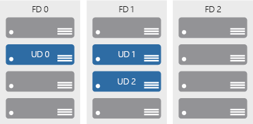
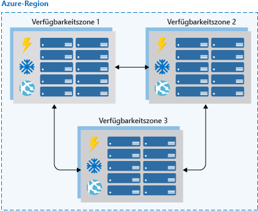

Hochverfügbarkeit (High Availability, HA) stellt sicher, dass Ihre Architektur Fehler behandeln kann. Stellen Sie sich vor, Sie sind für ein System verantwortlich, das immer voll funktionsfähig sein muss. Fehler können und werden auftreten. Wie stellen Sie also sicher, dass Ihr System online bleiben kann, wenn etwas schief geht? Wie führen Sie Wartungsarbeiten ohne Dienstunterbrechungen durch? 

Hier erfahren Sie, weshalb die Hochverfügbarkeit so wichtig ist, wie Sie die Anforderungen an die Hochverfügbarkeit von Anwendungen bewerten und wie die Azure-Plattform Ihnen dabei hilft, Ihre Verfügbarkeitsziele zu erreichen.

## Was ist Hochverfügbarkeit?

> [!VIDEO https://www.microsoft.com/videoplayer/embed/RE2yEvc]

Ein hochverfügbarer Dienst ist ein Dienst, der Schwankungen bei Verfügbarkeit und Auslastung sowie vorübergehende Ausfälle in abhängigen Diensten und Hardwarekomponenten ausgleicht. Die Anwendung bleibt mit einem akzeptablen Leistungsniveau online und verfügbar (oder erweckt zumindest den Anschein). Diese Verfügbarkeit wird häufig durch Geschäftsanforderungen, Ziele auf Servicelevel (SLOs) und Vereinbarungen zum Servicelevel (SLAs) definiert.

Bei der Hochverfügbarkeit geht es letztlich um die Fähigkeit, mit dem Verlust oder der schwerwiegenden Leistungsverschlechterung einer Komponente eines Systems umzugehen. Die Ursache dafür kann ein virtueller Computer sein, der eine Anwendung hostet und offline geht, weil der Host ausgefallen ist. Ein solcher Fall kann auch aufgrund einer geplanten Wartung für ein Systemupgrade eintreten. Sogar ein Ausfall eines Diensts in der Cloud kann die Ursache sein. Die Identifizierung der Stellen, an denen Ihr System ausfallen kann, und der Aufbau von Funktionen zur Bewältigung dieser Ausfälle stellen sicher, dass die von Ihnen für Ihre Kunden angebotenen Dienste online bleiben können.

Die Hochverfügbarkeit eines Diensts erfordert in der Regel eine hohe Verfügbarkeit der Komponenten, aus denen der Dienst besteht. Denken Sie an eine Website, die einen Onlinemarktplatz zum Kauf von Artikeln anbietet. Der Dienst, der Ihren Kunden angeboten wird, ist die Möglichkeit, Artikel online aufzulisten, zu kaufen und zu verkaufen. Um diesen Dienst bereitzustellen, verwenden Sie mehrere Komponenten: eine Datenbank, Webserver, Anwendungsserver usw. Jede dieser Komponenten könnte ausfallen, sodass Sie feststellen müssen, wie und wo Ihre Fehlerquellen sind. Außerdem müssen Sie bestimmen, wie Sie diese Fehlerquellen in Ihrer Architektur behandeln können.

## Bewerten der Hochverfügbarkeit für Ihre Architektur

Es gibt drei Schritte zum Bewerten einer Anwendung für Hochverfügbarkeit:

1. Bestimmen der Vereinbarung zum Servicelevel Ihrer Anwendung
1. Auswerten der HA-Funktionen der Anwendung
1. Auswerten der HA-Funktionen abhängiger Anwendungen

Sehen wir uns diese Schritte im Detail an.

### Bestimmen der Vereinbarung zum Servicelevel Ihrer Anwendung

Eine Vereinbarung zum Servicelevel (SLA) ist eine Vereinbarung zwischen einem Dienstanbieter und ein Dienstconsumer, in der der Dienstanbieter einen Standard des Diensts basierend auf messbaren Metriken und definierten Zuständigkeiten zusichert. SLAs können strenge, rechtlich bindende, vertragliche Vereinbarungen oder angenommene Erwartungen der Kunden an die Verfügbarkeit sein. Dienstmetriken konzentrieren sich in der Regel auf den Durchsatz des Diensts, die Kapazität und die Verfügbarkeit. Diese Werte können auf verschiedene Weise gemessen werden. Unabhängig von den jeweiligen Metriken, aus denen die SLA besteht, kann Nichterfüllung der SLA schwerwiegende finanzielle Auswirkungen für den Dienstanbieter besitzen. Eine allgemeine Komponente von Vereinbarungen zum Servicelevel ist die garantierte finanzielle Entschädigung für nicht eingehaltene SLAs.

Ziele auf Servicelevel (SLOs) stellen die Werte von Zielmetriken dar, die zum Messen der Leistung, Zuverlässigkeit und Verfügbarkeit verwendet werden. Diese Metriken können die Leistung der Anforderungsverarbeitung in Millisekunden, die Verfügbarkeit von Diensten in Minuten pro Monat oder die Anzahl von verarbeiteten Anforderungen pro Stunde definieren. Anhand der Auswertung der von Ihrer Anwendung zur Verfügung gestellten Metriken und des Wissens, wonach Kunden die Qualität beurteilen, können Sie die akzeptablen und inakzeptablen Bereiche für diese SLOs definieren. Indem Sie diese Ziele definieren, legen Sie klare Richtwerte und Erwartungen für die Teams, die die Dienste unterstützen, und die Kunden, die diese Dienste verwenden, fest. Diese SLOs werden dazu verwendet, zu ermitteln, ob die gesamte Vereinbarung zum Servicelevel eingehalten wird.

In der folgenden Tabelle sind die potenziellen kumulativen Ausfallzeiten für verschiedene SLA-Ebenen angegeben. 

| SLA | Ausfallzeit pro Woche | Ausfallzeit pro Monat | Ausfallzeit pro Jahr |
| --- | --- | --- | --- |
| 99 % |1,68 Stunden |7,2 Stunden |3,65 Tage |
| 99,9 % |10,1 Minuten |43,2 Minuten |8,76 Stunden |
| 99,95 % |5 Minuten |21,6 Minuten |4,38 Stunden |
| 99,99 % |1,01 Minuten |4,32 Minuten |52,56 Minuten |
| 99,999% |6 Sekunden |25,9 Sekunden |5,26 Minuten |

Sofern alle anderen Faktoren identisch sind, ist eine höhere Verfügbarkeit natürlich immer vorzuziehen. Aber wenn eine noch höhere Verfügbarkeit angestrebt wird, erhöhen sich auch die Kosten und die Komplexität, um dies zu erreichen. Eine Betriebszeit von 99,99% entspricht einer Gesamtausfallzeit von ca. 5 Minuten pro Monat. Rechtfertigt die Erreichung von 99,999% die zusätzliche Komplexität und die höheren Kosten? Die Antwort hängt von Ihren geschäftlichen Anforderungen ab. 

Hier sind einige andere Aspekte aufgeführt, die für das Definieren einer Vereinbarung zum Servicelevel gelten:

* Wenn Sie 99,99% erreichen möchten, können Sie sich bei der Wiederherstellung nach Ausfällen wahrscheinlich nicht auf manuelle Eingriffe verlassen. Die Anwendung muss eine Selbstdiagnose und Selbstreparatur durchführen können. 
* Im Bereich über 99,99% stellt es eine große Herausforderung dar, Ausfälle schnell genug zu erkennen, um die SLA-Anforderungen zu erfüllen.
* Betrachten Sie das Zeitfenster, auf das sich Ihre Vereinbarung zum Servicelevel bezieht. Je kleiner das Fenster, desto enger die Toleranzen. Vermutlich ist es nicht sinnvoll, Ihre SLA in Bezug auf die stündliche oder tägliche Betriebszeit zu definieren. 

Das Identifizieren von SLAs ist ein wichtiger erster Schritt beim Ermitteln der Funktionen für Hochverfügbarkeit, die für Ihre Architektur erforderlich sind. Auf diese Weise können Sie die Methoden entsprechend gestalten, die Sie verwenden, damit Ihre Anwendung hochverfügbar wird.

### Auswerten der HA-Funktionen der Anwendung

Um die HA-Fähigkeiten Ihrer Anwendung auszuwerten, führen Sie eine Fehleranalyse aus. Konzentrieren Sie sich auf einzelne Fehlerquellen und kritische Komponenten, die einen großen Einfluss auf die Anwendung haben würden, wenn sie unerreichbar bzw. falsch konfiguriert wären oder sich unerwartet verhalten würden. Bestimmen Sie für Bereiche, die über Redundanz verfügen, ob die Anwendung in der Lage ist, Fehlerzustände zu erkennen und sich selbst zu reparieren.

Sie müssen alle Komponenten Ihrer Anwendung sorgfältig auswerten, einschließlich der Komponenten, die für die Bereitstellung von HA-Funktionalität entwickelt wurden (z.B. Load Balancer). Einzelne Fehlerquellen müssen entweder geändert werden, um HA-Funktionen zu integrieren, oder sie müssen durch Dienste ersetzt werden, die HA-Funktionen bereitstellen können.

### Auswerten der HA-Funktionen abhängiger Anwendungen

Sie müssen nicht nur die SLA-Anforderungen Ihrer Anwendung für Ihren Kunden verstehen, sondern auch die bereitgestellten SLAs aller Ressourcen, von denen Ihre Anwendung ggf. abhängig ist. Wenn Sie Ihren Kunden eine Verfügbarkeit von 99,9 % zusichern, aber ein Dienst, von dem Ihre Anwendung abhängt, nur eine Verfügbarkeit von 99 % bereitstellt, könnte dies für Sie das Risiko darstellen, dass Sie die SLA für die Kunden nicht einhalten können. Wenn ein abhängiger Dienst nicht in der Lage ist, eine ausreichende SLA bereitzustellen, müssen Sie möglicherweise Ihre eigene SLA ändern, die Abhängigkeit durch eine Alternative ersetzen oder Wege finden, Ihre SLA zu erfüllen, während die Abhängigkeit nicht verfügbar ist. Abhängig vom Szenario und der Art der Abhängigkeit können fehlerhafte Abhängigkeiten vorübergehend mit Lösungen wie Caches und Arbeitswarteschlangen umgangen werden.

## Die hoch verfügbare Azure-Plattform

Die Azure-Cloudplattform wurde entwickelt, um Hochverfügbarkeit für alle zugehörigen Dienste bereitzustellen. Wie jedes System können auch Anwendungen von Ereignissen der Hard- und Softwareplattform betroffen sein. Die Notwendigkeit, Ihre Anwendungsarchitektur so zu gestalten, dass sie Ausfälle bewältigt, ist entscheidend, und die Azure-Cloudplattform bietet Ihnen die Tools und Funktionen, die Ihre Anwendung hochverfügbar machen. Es gibt mehrere Kernkonzepte, wenn Sie HA für Ihre Architektur in Azure in Betracht ziehen:

* Verfügbarkeitsgruppen
* Verfügbarkeitszonen
* Lastenausgleich
* Hochverfügbarkeitsfunktionen von PaaS (Platform-as-a-Service)

### Verfügbarkeitsgruppen

Verfügbarkeitsgruppen stellen eine Möglichkeit dar, Azure zu informieren, dass virtuelle Computer, die zur gleichen Anwendungsarbeitsauslastung gehören, verteilt werden sollten, um gleichzeitige Auswirkungen von Hardwareausfällen und planmäßiger Wartung zu vermeiden. Verfügbarkeitsgruppen bestehen aus *Updatedomänen* und *Fehlerdomänen*.

Updatedomänen stellen sicher, dass eine Teilmenge der Server Ihrer Anwendung jederzeit ausgeführt wird, wenn für die Hosts für virtuelle Computer in einem Azure-Datencenter Ausfallzeiten für die Wartung erforderlich sind. Die meisten Updates können ohne Auswirkungen auf die auf ihnen ausgeführten virtuellen Computer ausgeführt werden, aber es gibt Zeiten, zu denen dies nicht möglich ist. Um sicherzustellen, dass Updates nicht gleichzeitig in einem gesamten Datencenter ausgeführt werden, ist das Azure-Datencenter logisch in Updatedomänen (UDs) aufgeteilt. Wenn ein Wartungsereignis (z.B. ein Leistungsupdate oder ein wichtiger Sicherheitspatch) auf den Host angewendet werden muss, wird das Update durch Updatedomänen sequenziell ausgeführt. Durch die Verwendung von sequenzierenden Updates mithilfe von Updatedomänen wird sichergestellt, dass nicht das gesamte Datencenter während Plattformupdates und Patchvorgängen nicht verfügbar ist.

Während Updatedomänen einen logischen Abschnitt des Datencenters darstellen, repräsentieren Fehlerdomänen (FD) physische Abschnitte des Datencenters und stellen die Rackvielfalt von Servern in einer Verfügbarkeitsgruppe sicher. Fehlerdomänen entsprechen der physischen Trennung von gemeinsam genutzter Hardware im Datencenter. Dies schließt die Stromversorgungs-, Kühlungs- und Netzwerkhardware ein, die die physischen Server in Serverracks unterstützt. Für den Fall, dass die Hardware, die ein Serverrack unterstützt, nicht mehr verfügbar ist, ist nur dieses Serverrack von dem Ausfall betroffen. Durch Platzieren Ihrer VMs in einer Verfügbarkeitsgruppe werden Ihre VMs automatisch über mehrere Fehlerdomänen verteilt, sodass nur ein Teil Ihrer VMs betroffen ist, wenn ein Hardwarefehler auftritt.

Mit Verfügbarkeitsgruppen können Sie sicherstellen, dass Ihre Anwendung online bleibt, wenn ein Wartungsereignis mit schwerwiegenden Auswirkungen erforderlich ist oder Hardwarefehler auftreten.

### Verfügbarkeitszonen

Verfügbarkeitszonen sind unabhängige physische Datencenterstandorte innerhalb einer Region, die über eine eigene Stromversorgung, Kühlung und Netzwerke verfügen. Durch Berücksichtigung von Verfügbarkeitszonen beim Bereitstellen von Ressourcen können Sie Workloads vor Datencenterausfällen unter Beibehaltung der Anwesenheit in einer bestimmten Region schützen. Dienste wie virtuelle Computer sind *zonale Dienste* und ermöglichen es Ihnen, diese in bestimmten Zonen innerhalb einer Region bereitzustellen. Andere Dienste sind *zonenredundante Dienste* und werden über die Verfügbarkeitszonen hinweg in der jeweiligen Azure-Region repliziert. Beide Typen stellen sicher, dass innerhalb einer Azure-Region keine einzelnen Fehlerquellen vorhanden sind.

Unterstützte Regionen enthalten mindestens drei Verfügbarkeitszonen. Wenn Sie zonale Dienstressourcen in diesen Regionen erstellen, haben Sie die Möglichkeit, die Zone auszuwählen, in der die Ressource erstellt werden soll. Dies ermöglicht es Ihnen, Ihre Anwendung so zu entwerfen, dass sie einem zonalen Ausfall standhält und weiterhin in einer Azure-Region betrieben wird, bevor Sie Ihre Anwendung in eine andere Azure-Region evakuieren müssen.

Verfügbarkeitszonen sind ein neuer Hochverfügbarkeitskonfigurationsdienst für Azure-Regionen und stehen zurzeit für bestimmte Regionen zur Verfügung. Es ist wichtig, die Verfügbarkeit dieses Diensts in der Region zu überprüfen, in der Sie Ihre Anwendung bereitstellen möchten, wenn Sie diese Funktion in Betracht ziehen. Verfügbarkeitszonen werden bei der Verwendung von VMs ebenso wie mehrere PaaS-Dienste unterstützt. Verfügbarkeitszonen und Verfügbarkeitsgruppen schließen sich gegenseitig aus. Wenn Sie Verfügbarkeitszonen verwenden, müssen Sie keine Verfügbarkeitsgruppe für Ihre Systeme definieren. Sie verfügen dann über Vielfalt auf Rechenzentrumsebene, und Updates werden nie zur gleichen Zeit auf mehrere Verfügbarkeitszonen angewandt.

### Lastenausgleich

Load Balancer verwalten die Verteilung des Netzwerkdatenverkehrs auf eine Anwendung. Load Balancer sind unerlässlich, um Ihre Anwendung widerstandsfähig gegen einzelne Komponentenausfälle zu machen und sicherzustellen, dass Ihre Anwendung für die Verarbeitung von Anforderungen verfügbar ist. Für Anwendungen, in die keine Diensterkennung integriert ist, ist ein Lastenausgleich sowohl für Verfügbarkeitsgruppen als auch für Verfügbarkeitszonen erforderlich.

Azure besitzt drei Lastenausgleichstechnologie-Dienste, die sich in ihren Möglichkeiten zum Weiterleiten von Netzwerkdatenverkehr unterscheiden:

* **Azure Traffic Manager** enthält einen globalen DNS-Lastenausgleich. Sie sollten Traffic Manager verwenden, um den Lastausgleich von DNS-Endpunkten innerhalb von oder zwischen Azure-Regionen zu ermöglichen. Traffic Manager verteilt Anforderungen an verfügbare Endpunkte und verwendet die Endpunktüberwachung zum Ermitteln und Entfernen von fehlgeschlagenen Endpunkten aus der Auslastung.
* **Azure Application Gateway** bietet Layer-7-Lastenausgleichsfunktionen. Hierzu zählen etwa die Round-Robin-Verteilung (Rundlaufverteilung) des eingehenden Datenverkehrs, cookiebasierte Sitzungsaffinität, Routing auf URL-Pfadbasis und die Möglichkeit zum Hosten mehrerer Websites hinter einer einzelnen Application Gateway-Instanz. Application Gateway überwacht standardmäßig die Integrität aller Ressourcen in seinem Back-End-Pool und entfernt automatisch alle als fehlerhaft geltenden Ressourcen aus dem Pool. Application Gateway überwacht die fehlerhaften Instanzen weiterhin und fügt sie dem fehlerfreien Back-End-Pool hinzu, sobald sie verfügbar sind und auf Integritätstests reagieren.
* **Azure Load Balancer** ist eine Layer-4-Lastenausgleichskomponente. Sie können öffentliche und interne Endpunkte mit Lastenausgleich konfigurieren und Regeln definieren, um eingehende Verbindungen Back-End-Poolzielen mit TCP- und HTTP-Integritätstestoptionen zuzuordnen, damit die Dienstverfügbarkeit verwaltet werden kann.

Eine dieser Technologien oder eine Kombination aller drei Azure-Lastenausgleichstechnologien kann sicherstellen, dass Sie über die notwendigen Optionen verfügen, um eine hochverfügbare Lösung zur Weiterleitung des Netzwerkdatenverkehrs durch Ihre Anwendung zu entwerfen.

![Optionen für den Azure-Lastenausgleich: Abbildung der verschiedenen Lastenausgleichstechnologien in Azure Traffic Manager verteilt die Last zwischen zwei Regionen. Innerhalb jeder Region gibt es ein Anwendungsgateway, das die Last je nach Art der Anforderung auf verschiedene virtuelle Computer auf Webebene verteilt. Alle Anforderungen von Images werden an den Imageserverpool, alle anderen an den Standardserverpool weitergeleitet. Weitere Anforderungen, die von den Standardserverpools stammen, werden vom Azure Load Balancer an die virtuellen Computer auf Datenbankebene verteilt.](../media/AzLBOptions.png)

### PaaS-Funktionen für Hochverfügbarkeit

PaaS-Dienste verfügen über integrierte Hochverfügbarkeit. Dienste wie Azure SQL-Datenbank, Azure App Service und Azure Service Bus umfassen Funktionen für Hochverfügbarkeit und stellen sicher, dass Fehler einer einzelnen Komponente des Diensts für Ihre Anwendung unkritisch sind. Die Verwendung von PaaS-Diensten ist eine der besten Möglichkeiten, um sicherzustellen, dass Ihre Architektur hochverfügbar ist.

Wenn Sie für Hochverfügbarkeit planen, müssen Sie die SLA verstehen, die Sie Ihren Kunden zusichern. Werten Sie dann sowohl die HA-Funktionen Ihrer Anwendung als auch die HA-Funktionen und SLAs abhängiger Systeme aus. Nachdem diese bekannt sind, verwenden Sie Azure-Funktionen wie Verfügbarkeitsgruppen, Verfügbarkeitszonen und verschiedene Lastausgleichstechnologien, um Ihrer Anwendung HA-Funktionen hinzuzufügen. Alle PaaS-Dienste, für deren Verwendung Sie sich entscheiden, verfügen über integrierte HA-Funktionen.
