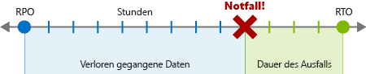
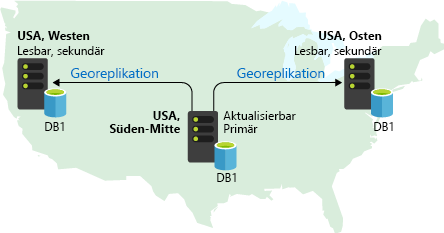
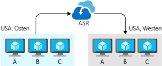

Wenn beim Entwerfen die Hochverfügbarkeit berücksichtigt wird, kann eine Anwendung oder ein Prozess auch dann weiter ausgeführt werden, wenn negative Ereignisse eintreten oder widrige Bedingungen herrschen. Aber was können Sie tun, wenn das Ereignis so schwerwiegend ist, dass Daten verloren gehen, und Sie nicht verhindern können, dass Ihre Apps und Prozesse ausfallen? Sie müssen über einen Plan für Notfälle verfügen. Sie sollten wissen, was Ihre Ziele und Erwartungen für die Wiederherstellung, sind, was sind die Kosten und die Einschränkungen für Ihren Plan, und wie Sie damit ausführen.

## Was ist die Notfallwiederherstellung?

Geht es um notfallwiederherstellung *Wiederherstellen von mit schwerwiegenden Auswirkungen Ereignisse* . Dies führt zu Ausfallzeiten und Datenverluste oder Daten. Ein Notfall ist ein einzelnes größeres Ereignis mit sehr starken und länger andauernden Auswirkungen, denen über die Hochverfügbarkeitsfunktionen der Anwendung nicht begegnet werden kann.

Das Wort "notfallszenario" erwirkt häufig Folgendes Gedanken von *natürliche* Notfällen und externe Ereignisse (Erdbeben, überschwemmungen, Tropical "Stürme" bieten und So weiter), aber viele andere Arten von Notfällen ebenfalls vorhanden. Eine Bereitstellung oder ein Upgrade, bei der bzw. dem schwere Fehler auftreten, kann dazu führen, dass sich eine App in einem nicht erkennbaren Zustand befindet. Böswillige Hacker können verschlüsseln oder Löschen von Daten und Schaden zufügen könnte andere Arten von Beschädigungen, die eine app offline zu schalten, oder entfernen Sie einige seiner Funktionen.

Unabhängig von der Ursache sind die einzigen Gegenmittel nach einem Notfall ein gut definierter, getesteter Plan für die Notfallwiederherstellung und eine Anwendung, die so entworfen wurde, dass Maßnahmen für die Notfallwiederherstellung aktiv unterstützt werden.

## Erstellen eines Plans für die Notfallwiederherstellung

Ein Plan zur Wiederherstellung ist ein einzelnes Dokument die Details für die Prozeduren, die erforderlich sind, zur Wiederherstellung nach Datenverlust und Ausfallzeiten aufgrund eines Notfalls und identifiziert, wer ist dafür verantwortlich, leiten diese Verfahren. Bediener sollten den Plan als Anleitung zum Wiederherstellen der Anwendungskonnektivität und der Daten nach einem Notfall verwenden können. Ein ausführlicher, geschrieben Plan, der für die notfallwiederherstellung bestimmt ist ist entscheidend, um einem positiven Ergebnis sicherzustellen. Das Verfahren zum Erstellen des Plans hilft um ein vollständiges Bild von der Anwendung zu assemblieren. Die resultierende geschriebene Schritte stuft gute Entscheidungen und Umsetzung aufgeregten, Chaotische danach von einem Notfall.

Zum Erstellen eines Plans für die Notfallwiederherstellung ist Expertenwissen in Bezug auf die Workflows, Daten, Infrastruktur und Abhängigkeiten einer Anwendung erforderlich.

### Risikobewertung und Prozessbestandsdaten

Der erste Schritt beim Erstellen eines Plans für die Notfallwiederherstellung ist die Durchführung einer Risikoanalyse, mit der die Auswirkungen unterschiedlicher Arten von Notfällen auf die Anwendung untersucht werden. Die genaue Art eines Notfalls ist für die Risikoanalyse nicht so wichtig wie die potenziellen Auswirkungen aufgrund von Datenverlust und Ausfallzeiten der Anwendung. Untersuchen Sie die verschiedenen Arten von hypothetischen Notfälle, und versuchen Sie spezifisch sein, wenn über die Auswirkungen nachzudenken. Beispielsweise kann gezielte böswilligen Angriffen ändern, Code oder Daten, die eine andere Art von Auswirkungen auf die als ein Erdbeben entstehen, die Konnektivität und Datacenter-netzwerkverfügbarkeit unterbricht.

Bei der Risikobewertung müssen *alle* Prozesse berücksichtigt werden, für die es nicht zu unbegrenzten Ausfallzeiten kommen kann, sowie alle Datenkategorien, für die keine unbegrenzten Datenverluste auftreten können. Wenn ein Notfall eintritt, der sich auf mehrere Anwendungskomponenten bezieht, ist es wichtig, dass die Besitzer des Plans diesen für folgende Zwecke verwenden können: Erstellung eines vollständigen Bestands der Punkte, die behandelt werden müssen, und die Priorisierung der einzelnen Elemente.

Einige Apps können unter Umständen nur einen einzelnen Prozess oder eine Klassifizierung von Daten darstellen. Dies sollte trotzdem beachtet werden, da die Anwendung wahrscheinlich eine Komponente eines größeren Plans für die Notfallwiederherstellung ist, der mehrere Anwendungen innerhalb der Organisation umfasst.

### Ziele der Wiederherstellung

Für einen vollständigen Plan müssen für jeden Prozess, der von der Anwendung implementiert wird, zwei wichtige Geschäftsanforderungen angegeben werden:

* **Recovery Point Objective (RPO)**: Die maximale Dauer des akzeptablen Datenverlusts. RPO-Wert wird in Einheiten der Zeit nicht Volume gemessen: "30 Minuten der Daten", "vier Stunden Daten", und so weiter. Beim RPO-Wert geht es um das Einschränken und Wiederherstellen des *Verlusts* von Daten, nicht um den *Diebstahl* von Daten.
* **Recovery Time Objective (RTO)**: Die maximale Dauer der akzeptablen Ausfallzeit, wobei „Ausfallzeit“ gemäß Ihrer Spezifikation definiert werden muss. Beispielsweise ist die akzeptable Ausfallzeit Dauer acht Stunden bei einem Notfall, ist Ihre RPO acht Stunden.

Jede wichtige Prozess oder Workload, die von einer Anwendung implementiert wird, müssen separate RPO- und RTO-Werte. Auch wenn Sie für unterschiedliche Prozesse zu den gleichen Werten gelangen, sollten diese jeweils anhand einer separaten Analyse generiert werden, mit der Risiken von Notfallszenarien und potenzielle Wiederherstellungsstrategien für jeden Prozess untersucht werden.

Das Angeben eines RPO- und RTO-Werts entspricht praktisch der Erstellung der Anforderungen an die Notfallwiederherstellung für Ihre Anwendung. Sie erfordert einrichten, die Priorität für jede Workload und die Kategorie der Daten und Durchführen einer Kosten-Nutzen-Analyse. Die Analyse enthält wie die Kosten für Implementierung und Verwaltung, Betriebsausgaben, Prozess Mehraufwand, Auswirkungen auf die Leistung und die Auswirkungen von Ausfallzeiten und Datenverlust. Sie müssen festlegen, welche "Downtime" genau für Ihre Anwendung bedeutet, und in einigen Fällen können Sie separate RPO- und RTO-Werte für unterschiedliche Grade an Funktionalität einrichten. Das Angeben der RPO- und RTO-Werte sollte mehr als das einfache Auswählen von willkürlichen Werten sein. Ein Großteil des Nutzens eines Plans für die Notfallwiederherstellung ergibt sich aus den Recherche- und Analyseschritten, die beim Ermitteln der potenziellen Auswirkungen eines Notfalls und der Kosten für die Risikoeindämmung ausgeführt werden.

### Detailliertes Angeben von Schritten zur Wiederherstellung

Im endgültigen Plan sollte ausführlich angegeben sein, welche Schritte ausgeführt werden sollten, um verloren gegangene Daten und die Anwendungskonnektivität wiederherzustellen. Schritte enthalten häufig Informationen zu folgenden Punkten:

* **Sicherungen**: wie oft sie erstellt werden, wo sie sich befinden und Daten daraus wiederherstellen.
* **Datenreplikate**: die Anzahl und die Speicherorte der Replikate, die Merkmale der Art und Konsistenz der replizierten Daten und wie Sie zu einem anderen Replikat wechseln.
* **Bereitstellungen**: wie Bereitstellungen ausgeführt werden, wie Rollbacks auftreten und Fehlerszenarien für Bereitstellungen.
* **Infrastruktur**: lokale und Cloudressourcen, Netzwerkinfrastruktur und die Hardwareinventur.
* **Abhängigkeiten**: externe Dienste, die werden verwendet, durch die Anwendung, einschließlich SLAs und Kontaktinformationen.
* **Konfiguration und Benachrichtigung**: Flags oder Optionen, die festgelegt werden, um die Anwendung korrekt herabgestuft und Dienste, die verwendet werden, um Benutzer der Auswirkungen der Anwendung zu benachrichtigen.

Die genauen Schritte, die erforderlich sind, stark hängt von Details zur Implementierung der app, sodass es wichtig, den Plan aktualisiert. Bei routinemäßigen Tests des Plans können Lücken und veraltete Abschnitte identifiziert werden.

## Entwerfen für die Notfallwiederherstellung

Die Notfallwiederherstellung ist kein automatisches Feature. Sie muss entworfen, erstellt und getestet werden. Eine App, für die eine robuste Strategie für die Notfallwiederherstellung unterstützt werden soll, muss im Hinblick auf die Notfallwiederherstellung von Grund auf neu erstellt werden. Azure verfügt über Dienste, Features und Anleitungen, damit Sie Apps erstellen können, die die Notfallwiederherstellung unterstützen. Es liegt aber an Ihnen, diese in Ihren Entwurf einzubauen.

Beim Entwerfen für die Notfallwiederherstellung geht es um diese beiden Hauptaspekte:

* **Datenwiederherstellung**: Sicherungen und die Replikation werden verwendet, um verlorene Daten wiederherzustellen.
* **Prozesswiederherstellung**: Die Wiederherstellung von Diensten und Bereitstellung von Code für die Wiederherstellung nach Ausfällen.

### Datenwiederherstellung und -replikation

Bei der Replikation werden gespeicherte Daten in mehreren Datenspeicherreplikaten dupliziert. Im Gegensatz zu *Sicherungen*, bei denen langlebige, schreibgeschützte Momentaufnahmen von Daten zur Verwendung bei der Wiederherstellung erstellt werden, werden bei der Replikation Echtzeitkopien (bzw. nahezu in Echtzeit) von Livedaten erstellt. Das Ziel der Replikation besteht darin, Replikate mit möglichst geringer Latenz synchron zu halten, während gleichzeitig die Reaktionsfähigkeit der Anwendung aufrechterhalten wird. Die Replikation ist eine wichtige Komponente des Entwurfs im Hinblick auf Hochverfügbarkeit und Notfallwiederherstellung und ein häufiges Feature von Anwendungen für die Produktion.

Die Replikation wird genutzt, um eine Lösung für einen ausgefallenen oder nicht erreichbaren Datenspeicher zu erzielen, indem ein *Failover* ausgeführt wird: Die Anwendungskonfiguration wird geändert, um Datenanforderungen an ein funktionierendes Replikat zu leiten. Das Failover ist häufig automatisiert und wird durch eine Fehlererkennung ausgelöst, die in ein Datenspeicherprodukt integriert ist, oder durch eine Erkennung, die Sie über Ihre Überwachungslösung implementieren. Je nach Implementierung und Szenario muss das Failover ggf. von Systembedienern manuell ausgeführt werden.

Die Replikation ist kein Vorgang, den Sie von Grund auf neu implementieren. Die meisten Datenbanksysteme mit vollem Funktionsumfang und andere Datenspeicherprodukte und -dienste enthalten im Rahmen der Funktions- und Leistungsanforderungen eine Art der Replikation als fest integriertes Feature. Es liegt aber an Ihnen, diese Features in Ihren Anwendungsentwurf zu integrieren und entsprechend einzusetzen.

Unterschiedliche Azure-Dienste unterstützen verschiedene Ebenen und Konzepte der Replikation. Beispiel:

* **Azure-Speicher** Replikationsfunktionen richten sich nach den Replikationstyp für das Speicherkonto ausgewählt. Diese Replikation lokal (in einem Rechenzentrum) sein, zonal (zwischen Rechenzentren innerhalb einer Region) oder regionale (zwischen Regionen). Weder Ihre Anwendung noch Ihre Bediener interagieren direkt damit. Failover sind automatisch und transparent, und Sie müssen lediglich eine Replikationsebene auswählen, mit der die gewünschte Balance zwischen Kosten und Risiko erzielt wird.
* Die Replikation per **Azure SQL-Datenbank** erfolgt in geringerem Umfang automatisch, aber für die Wiederherstellung nach einem vollständigen Ausfall eines Azure-Datencenters oder einer Azure-Region ist die Georeplikation erforderlich. Einrichten der geografischen Replikation ist "manuell", aber es ist ein erstklassiges Feature des Diensts und auch von Dokumentation unterstützt.
* **Cosmos DB** ist ein global verteiltes Datenbanksystem, und die Replikation ist ein zentraler Punkt der Implementierung. Mit Azure Cosmos DB konfigurieren, anstatt Replikation direkt, konfigurieren Sie Optionen, die im Zusammenhang mit der Partitionierung und Datenkonsistenz.

Es gibt viele verschiedene Replikationsentwürfe, bei denen die Datenkonsistenz, Leistung und Kosten unterschiedliche Prioritäten aufweisen. Für die Replikation vom Typ *Aktiv* müssen Updates gleichzeitig auf mehreren Replikaten durchgeführt werden, um die Konsistenz auf Kosten des Durchsatzes zu gewährleisten. Im Gegensatz dazu *passiven* Replikation führt eine Synchronisierung im Hintergrund Entfernen der Replikation als Einschränkung für die Leistung der Anwendung, aber die RPO-Wert zu erhöhen. Bei der Replikation vom Typ *Aktiv/Aktiv* oder *Multimaster* können mehrere Replikate gleichzeitig genutzt werden, sodass ein Lastenausgleich auf Kosten einer komplizierteren Datenkonsistenz durchgeführt werden kann. Bei der Replikation vom Typ *Aktiv/Passiv* werden Replikate für die Livenutzung nur während des Failovers reserviert.

> [!IMPORTANT]
> **Weder bei der Replikation noch bei Sicherungen handelt es sich um vollständige eigenständige Lösungen für die Notfallwiederherstellung**. Die Datenwiederherstellung ist nur eine Komponente der Notfallwiederherstellung, und mit der Replikation können nicht für viele Arten von Notfallwiederherstellungsszenarien alle Anforderungen erfüllt werden. Bei einem Szenario mit Datenbeschädigung kann es aufgrund der Art der Beschädigung beispielsweise dazu kommen, dass sich der Fehler vom primären Datenspeicher auf die Replikate verteilt, sodass alle Replikate nutzlos werden und eine Sicherung für die Wiederherstellung verwendet werden muss.

### Prozesswiederherstellung

Nach einer Notfallsituation müssen nicht nur die Geschäftsdaten wiederhergestellt werden. Häufig führen Notfallszenarien auch zu Ausfallzeiten, z.B. aufgrund von Problemen mit der Netzwerkverbindung, Datencenterausfällen oder beschädigten VM-Instanzen oder Softwarebereitstellungen. Ihre Anwendung muss so entworfen worden sein, dass Sie dafür die Funktionsfähigkeit wiederherstellen können.

In den meisten Fällen umfasst die Prozesswiederherstellung auch ein Failover auf eine separate funktionierende Bereitstellung. Je nach Szenario möglicherweise geografischer Standort ein wichtiger Aspekt. Beispielsweise wird eine umfangreiche Naturkatastrophe, die eine gesamte Azure-Region offline bietet nach sich ziehen Service in einer anderen Region wiederherstellen. Die Anforderungen Ihrer Anwendung Disaster Recovery, vor allem RTO und sollten Ihres Designs und können Sie wie viele replizierte Umgebungen haben sollten sie sich befinden soll, und, ob sie sollte im bereit-und-Los-Zustand beibehalten werden, oder soll Laufwerk bereit zum Akzeptieren einer Notfall-Bereitstellung sein.

Je nach Entwurf der Anwendung gibt es einige verschiedene Strategien und Azure-Dienste und Funktionen, denen Sie zur Verbesserung Ihrer app Unterstützung für die Prozess-Wiederherstellung nach einem Notfall nutzen können.

#### Azure Site Recovery

Azure Site Recovery ist ein Dienst, der speziell für das Verwalten der Prozess der Wiederherstellung für Workloads auf virtuellen Computern in Azure bereitgestellt, virtuelle Computer auf physischen Servern und Workloads, die direkt auf physischen Servern ausgeführt. Site Recovery repliziert Workloads an anderen Orten und unterstützt Sie bei der Ausführung des Failovers, wenn ein Ausfall eintritt, und beim Testen eines Plans für die Notfallwiederherstellung.

Site Recovery unterstützt das Replizieren von gesamten VMs und Images physischer Server sowie einzelner *Workloads*. Hierbei kann eine Workload eine einzelne Anwendung oder ein vollständiger virtueller Computer oder ein Betriebssystem mit den entsprechenden Anwendungen sein. Jede Anwendungsworkload kann repliziert werden, aber Site Recovery verfügt über erstklassige integrierte Unterstützung für viele Microsoft-Serveranwendungen, z.B. SQL Server und SharePoint, sowie für einige Drittanbieteranwendungen, z.B. von SAP.

Jede app, die auf VMs oder physischen Servern ausgeführt wird, sollten mindestens die Verwendung von Azure Site Recovery untersuchen. Es ist eine hervorragende Möglichkeit zum Entdecken und Erforschen von Szenarien und Möglichkeiten für die Wiederherstellung des Prozesses.

#### Dienstspezifische Features

Für Apps, die auf Azure PaaS-Angeboten wie App Service ausgeführt werden, verfügen die meisten dieser Dienste über Features und eine Anleitung zur Unterstützung der Notfallwiederherstellung. Für bestimmte Szenarien können Sie dienstspezifische Features nutzen, um eine schnelle Wiederherstellung zu unterstützen. Beispielsweise wird für Azure SQL Server die Georeplikation unterstützt, um einen Dienst schnell in einer anderen Region wiederherstellen zu können. Azure App Service verfügt über ein Feature für die Sicherung und Wiederherstellung, und die Dokumentation enthält eine Anleitung zur Verwendung von Azure Traffic Manager, um das Leiten von Datenverkehr in eine sekundäre Region zu unterstützen.

## Testen eines Plans für die Notfallwiederherstellung

Die Planung der Notfallwiederherstellung endet nicht damit, dass Sie einen abgeschlossenen Plan in der Hand halten. Das Testen des Plans ist ein entscheidender Aspekt der Notfallwiederherstellung, um sicherzustellen, dass die Anleitungen und Erläuterungen klar verständlich und aktuell sind.

Wählen Sie Intervalle für die Durchführung unterschiedlicher Testtypen und -bereiche, z.B. monatliches Testen von Sicherungen und Failovermechanismen, und einer umfassenden Simulation der Notfallwiederherstellung alle sechs Monate. Immer führen Sie die Schritte und die Details, genau, wie sie im Plan dokumentiert sind, und erwägen Sie, dass eine Person nicht vertraut, mit dem Plan Perspektive auf etwas zu geben, der klarer formuliert werden kann. Wie Sie den Test ausführen, Identifizieren von Lücken, Bereiche zur Verbesserung der und Orte zu automatisieren und diese Verbesserungen für den jeweiligen Plan hinzufügen.

Stellen Sie sicher, dass das Überwachungssystem bei Ihren Tests auch enthalten. Wenn Ihre Anwendung beispielsweise automatische Failover unterstützt, können Fehler in eine Abhängigkeit oder eine andere kritische Komponente eingebaut werden. So können Sie sich vergewissern, dass sich die Anwendung während des gesamten Prozesses richtig verhält, z.B. bei der Erkennung des Fehlers und beim Auslösen des automatisierten Failovers.

 Indem Ihre Anforderungen sorgfältig identifiziert werden und ein Plan aufgestellt wird, können Sie ermitteln, welche Arten von Diensten Sie verwenden müssen, um Ihre Wiederherstellungsziele zu erreichen. In Azure werden mehrere Dienste und Features für die Erreichung dieser Ziele bereitgestellt.
