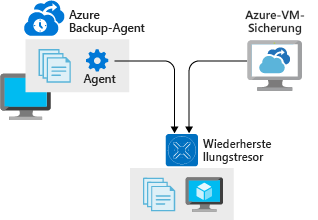

Sicherungen sind die letzte und leistungsstärkste Verteidigung gegen dauerhaften Datenverlust.Backup is the final and most powerful line of defense against permanent data loss. Eine effektive Sicherungsstrategie erfordert mehr als nur das Kopieren von Daten.An effective backup strategy requires more than simply making copies of data. Sie muss die Datenarchitektur und Infrastruktur Ihrer Anwendung berücksichtigen.It needs to take your application's data architecture and infrastructure into consideration. Mit Ihrer App werden unter Umständen viele Arten von Daten unterschiedlicher Wichtigkeit verwaltet, die über Dateisysteme, Datenbanken und andere Speicherdienste verteilt sind – in der Cloud und lokal.Your app may manage many kinds of data of varying importance, spread widely across filesystems, databases, and other storage services both in the cloud and on-premises. Indem Sie die richtigen Dienste und Produkte für den Auftrag verwenden, wird Ihr Sicherungsprozess vereinfacht und die Wiederherstellungszeit erhöht, falls eine Sicherung wiederhergestellt werden muss.Using the right services and products for the job will simplify your backup process and increase recovery time if a backup needs to be restored.

## Ermitteln der Sicherungs- und WiederherstellungsanforderungenEstablish backup and restoration requirements

Wie bei einer Strategie zur Notfallwiederherstellung auch, basieren die Sicherungsanforderungen auf einer Kosten-Nutzen-Analyse.As with a disaster recovery strategy, backup requirements are based on a cost-benefit analysis. Die Analyse der Daten Ihrer App sollte sich nach der relativen Wichtigkeit der unterschiedlichen Datenkategorien richten, die von der App verwaltet werden, sowie nach externen Anforderungen, z.B. Gesetzen zur Datenaufbewahrung.Analysis of your app's data should be guided by the relative importance of the different categories of data the app manages, as well as external requirements, such as data retention laws.

Ermitteln Sie die Sicherungsanforderungen Ihrer App, indem Sie eine Bestandsaufnahme für die Daten Ihrer Anwendung und eine anschließende Analyse durchführen, um diese anhand der folgenden Anforderungen zu gruppieren:To establish backup requirements for your app, take stock of your application's data and perform an analysis to group it based on the following requirements:

* Anteil des zulässigen Verlustanteils für einen Datentyp (nach Dauer)How much of this type of data can afford to be lost, measured in duration
* Gewünschte maximale Dauer der Wiederherstellung dieses DatentypsThe maximum amount of time a restore of this type of data should require
* Anforderungen zur Aufbewahrung von Sicherungen: Dauer und Häufigkeit der Verfügbarkeit von SicherungenBackup retention requirements: how long and at what frequency do backups need to remain available

Diese Konzepte passen gut zu den Konzepten Recovery Point Objective (RPO) und Recovery Time Objective (RTO).These concepts map neatly to the concepts of Recovery Point Objective and Recovery Time Objective (RPO and RTO). Die Dauer des zulässigen Verlusts kann normalerweise direkt in die erforderlichen Sicherungsintervalle und den RPO-Wert übersetzt werden.The duration of acceptable loss will generally translate directly to required backup intervals and RPO. Die maximale Dauer einer Wiederherstellung entspricht dem RTO-Wert für die Datenkomponente Ihrer Anwendung.The maximum amount of time a restore takes corresponds to the RTO for the data component of your application. Beide Anforderungen sollten relativ zu den Kosten für deren Erfüllung entwickelt werden.Both requirements should be developed relative to the cost of achieving them. Jede Organisation würde gerne die Aussage treffen, dass *keinerlei* Daten verloren gehen dürfen. Dies ist aber häufig nicht mehr der Fall, wenn die Kosten für die Erfüllung dieser Anforderung betrachtet werden.Every organization would like to say that they truly can't afford to lose *any* data, but often that's not the case when the cost of achieving that requirement is considered.

Sicherungen spielen bei der Notfallwiederherstellung auf jeden Fall eine Rolle, aber Sicherungen, Wiederherstellungen und die damit verbundenen Szenarien gehen über den Umfang der Notfallwiederherstellung hinaus.Backup absolutely plays a role in disaster recovery (DR), but backups, restores and their associated scenarios extend beyond the scope of DR. Sicherungen müssen unter Umständen auch in anderen Situationen als Notfallsituationen wiederhergestellt werden, z.B. wenn der RTO- und RPO-Wert keine größere Bedeutung haben.Backups may need to be restored in non-disaster situations, including those where RTO and RPO aren't of great concern. Wenn eine kleinere Menge von Daten, die älter als Ihr Sicherungsintervall ist, beschädigt oder gelöscht wird, aber es für die Anwendung nicht zu Ausfallzeit kommt, gilt beispielsweise Folgendes: Für Ihre Anwendung besteht ggf. nicht die Gefahr, dass die SLA-Vorgaben nicht erreicht werden, und eine erfolgreiche Wiederherstellung führt nicht zu einem Verlust von Daten.For example, if a small amount of data older than your backup interval is corrupted or deleted, but the application doesn't experience downtime, your application may never be in danger of missing its SLA and a successful restore will result in no data lost. Ihr Plan für die Notfallwiederherstellung kann auch eine Anleitung für die Durchführung von Wiederherstellungen in anderen Situationen als Notfallsituationen enthalten.Your disaster recovery plan may or may not include guidance on performing restores in non-disaster situations.

> [!TIP]
> Verwechseln Sie nicht die Begriffe *Archivierung*, *Replikation* und *Sicherung*.Don't confuse *archival*, *replication*, and *backup*. Archivierung ist die Speicherung von Daten für die langfristige Aufbewahrung und den Lesezugriff.Archival is the storage of data for long-term preservation and read access. Replikation ist das Kopieren von Daten zwischen Replikaten nahezu in Echtzeit, um Hochverfügbarkeit und bestimmte Szenarien der Notfallwiederherstellung zu unterstützen.Replication is the near-real-time copying of data between replicas to support high availability and certain disaster recovery scenarios. Einige Anforderungen (z.B. Gesetze zur Datenaufbewahrung) können Ihre Strategien für alle drei Anliegen beeinflussen.Some requirements, such as data retention laws, may influence your strategies for all three of these concerns. Archivierung, Replikation und Sicherung erfordern jeweils eine separate Analyse und Implementierung.Archival, replication, and backup all require separate analysis and implementation.

## Azure-Sicherungs- und -WiederherstellungsfunktionenAzure backup and restore capabilities

Azure verfügt über mehrere sicherungsbezogene Dienste und Features für unterschiedliche Szenarien, z.B. Daten in Azure und lokale Daten.Azure offers several backup-related services and features for various scenarios, including data in Azure as well as on-premises data. Die meisten Azure-Dienste umfassen eine Sicherungsfunktion.Most Azure services offer some kind of backup functionality. Hier sind einige der beliebtesten sicherungsbezogenen Azure-Angebote beschrieben.Here, we'll look at a few of the most popular backup-related Azure offerings.

### Azure BackupAzure Backup

Bei Azure Backup handelt es sich um eine Familie von Sicherungsprodukten, mit denen Daten in Azure Recovery Services-Tresoren für die Speicherung und Wiederherstellung gesichert werden.Azure Backup is a family of backup products that back up data to Azure Recovery Services vaults for storage and recovery. Recovery Services-Tresore sind Speicherressourcen in Azure, die zum Speichern von Daten- und Konfigurationssicherungen für virtuelle Computer, Server und einzelne Arbeitsstationen und Workloads dienen.Recovery Service vaults are storage resources in Azure that are dedicated to holding data and configuration backups for virtual machines, servers, and individual workstations and workloads.

> [!NOTE]
> Sowohl für Azure Backup als auch für Azure Site Recovery werden Azure Recovery Services-Tresore für die Speicherung verwendet.Both Azure Backup and Azure Site Recovery use Azure Recovery Service vaults for storage. Azure Backup ist eine allgemeine Sicherungslösung.Azure Backup is a general-purpose backup solution. Mit Azure Site Recovery können Replikationen und Failover koordiniert und Notfallwiederherstellungsvorgänge mit niedrigen RPO- und RTO-Werten unterstützt werden.Azure Site Recovery can coordinate replication and failover and support low RPO and RTO disaster recovery operations.

Azure Backup dient als allgemeine Sicherungslösung für Workflows in der Cloud und lokal, die auf virtuellen Computern oder physischen Servern ausgeführt werden.Azure Backup serves as a general-purpose backup solution for cloud and on-premises workflows that run on VMs or physical servers. Der Dienst ist als Ersatz für herkömmliche Sicherungslösungen konzipiert, und die Daten werden in Azure gespeichert, anstatt auf Archivierungsbändern oder anderen lokalen physischen Medien.It's designed to be a drop-in replacement for traditional backup solutions that stores data in Azure instead of archive tapes or other local physical media.

Für vier unterschiedliche Produkte und Dienste kann Azure Backup zum Erstellen von Sicherungen verwendet werden:Four different products and services can use Azure Backup to create backups:

* **Azure Backup-Agent** ist eine kleine Windows-Anwendung, mit der Dateien, Ordner und der Systemstatus von dem virtuellen Windows-Computer oder -Server gesichert werden, auf dem die Anwendung installiert ist.**Azure Backup Agent** is a small Windows application that backs up files, folders, and system state from the Windows VM or server on which it's installed. Sie funktioniert ähnlich wie viele andere cloudbasierte Sicherungslösungen für Verbraucher, aber es muss ein Azure Recovery-Tresor konfiguriert werden.It works in a way that's similar to many consumer cloud-based backup solutions, but requires configuration of an Azure Recovery vault. Nachdem Sie die Anwendung heruntergeladen und auf einem Windows-Server oder virtuellen Computer installiert haben, können Sie sie konfigurieren, um bis zu drei Sicherungen pro Tag zu erstellen.Once you download and install it onto a Windows server or VM, you can configure it to create backups up to three times a day.
* **System Center Data Protection Manager** ist ein robustes Sicherungs- und Wiederherstellungssystem mit vollem Funktionsumfang, das für Unternehmen geeignet ist.**System Center Data Protection Manager** is a robust, fully featured, enterprise-level backup and recovery system. Data Protection Manager ist eine Windows Server-Anwendung, mit der Dateisysteme und virtuelle Computer (Windows und Linux) gesichert, Bare-Metal-Sicherungen von physischen Servern erstellt und anwendungsabhängige Sicherungen für viele Microsoft-Serverprodukte, z.B. SQL Server und Exchange, durchgeführt werden können.Data Protection Manager is a Windows Server application that can back up filesystems and virtual machines (Windows and Linux), create bare-metal backups of physical servers, and perform application-aware backup of many Microsoft server products, such as SQL Server and Exchange. Data Protection Manager ist Teil der System Center-Produktfamilie und wird mit System Center lizenziert und verkauft. Das Produkt wird aber als Teil der Azure Backup-Familie angesehen, da damit Sicherungen in einem Azure Recovery-Tresor gespeichert werden können.Data Protection Manager is part of the System Center family of products and is licensed and sold with System Center, but it's considered part of the Azure Backup family because it can store backups in an Azure Recovery vault.
* **Azure Backup Server** ähnelt Data Protection Manager, wird aber im Rahmen eines Azure-Abonnements lizenziert und benötigt keine System Center-Lizenz.**Azure Backup Server** is similar to Data Protection Manager, but it's licensed as part of an Azure subscription and doesn't require a System Center license. Azure Backup Server unterstützt die gleichen Funktionen wie Data Protection Manager, mit Ausnahme der lokalen Bandsicherung und Integration in andere System Center-Produkte.Azure Backup Server supports the same functionality as Data Protection Manager except for local tape backup and integration with the other System Center products.
* **Azure IaaS-VM-Sicherung** ist ein nutzungsbereites Sicherungs- und Wiederherstellungsfeature von Azure Virtual Machines.**Azure IaaS VM Backup** is a turnkey backup and restore feature of Azure Virtual Machines. Für die VM-Sicherung werden Sicherungen für virtuelle Windows- und Linux-Computer ein Mal pro Tag unterstützt.VM backup supports once-per-day backups for Windows and Linux virtual machines. Sie unterstützt die Wiederherstellung einzelner Dateien, vollständiger Datenträger und vollständiger virtueller Computer und kann auch anwendungskonsistente Sicherungen ausführen.It supports recovery of individual files, full disks, and entire VMs, and can also perform application-consistent backups. Einzelne Anwendungen können für Sicherungsvorgänge aktiviert werden und ihre Dateisystemressourcen in einen konsistenten Zustand versetzen, bevor die Momentaufnahme erstellt wird.Individual applications can be made aware of backup operations and get their filesystem resources into a consistent state before the snapshot is taken.

Azure Backup kann den Nutzen erhöhen und einen Beitrag zur Sicherungs- und Wiederherstellungsstrategie für IaaS- und lokale Anwendungen nahezu jeder Größe und Form leisten.Azure Backup can add value and contribute to the backup and restore strategy for IaaS and on-premises applications of virtually any size and shape.

### Azure Blob StorageAzure Blob storage

Azure Storage enthält kein Feature für automatisierte Sicherungen, aber häufig werden Blobs verwendet, um alle möglichen Arten von Daten aus unterschiedlichen Quellen zu sichern.Azure Storage doesn't include an automated backup feature, but blobs are commonly used to back up all kinds of data from various sources. Für viele Dienste mit Sicherungsfunktionen werden Blobs genutzt, um die Daten zu speichern, und Blobs sind auch ein häufiges Ziel für Skripts und Tools bei allen Arten von Sicherungsszenarien.Many services that provide backup capabilities use blobs to store their data, and blobs are a common target for scripts and tools in every kind of backup scenario.

Speicherkonten vom Typ „Allgemein v2“ unterstützen drei verschiedene Blobspeicherebenen mit unterschiedlichen Leistungs- und Kostenaspekten.General Purpose v2 storage accounts support three different blob storage tiers of varying performance and cost. Speicher vom Typ **Cool** (Kalt) bietet für die meisten Sicherungen das beste Preis-Leistungs-Verhältnis, während beim Speicher vom Typ **Hot** (Heiß) die Zugriffskosten niedriger und die Speicherkosten höher sind.**Cool** storage offers the best cost-to-performance ratio for most backups, as opposed to **hot** storage, which offers lower access costs but higher storage costs. Die Speicherebene **Archive** (Archiv) eignet sich ggf. gut für sekundäre Sicherungen oder Sicherungen von Daten mit geringeren Anforderungen in Bezug auf die Wiederherstellungszeit.**Archive**-tier storage may be appropriate for secondary backups or backups of data with low expectations for recovery time. Die Kosten sind niedrig, die Vorlaufzeit für den Zugriff kann aber bis zu 15 Stunden betragen.It's low in cost, but requires up to 15 hours of lead time to access.

Unveränderlicher Blobspeicher kann für ein vom Benutzer angegebenes Intervall als nicht löschbar und nicht änderbar konfiguriert werden.Immutable blob storage is configurable to be non-erasable and non-modifiable for a user-specified interval. Unveränderlicher Blobspeicher soll in erster Linie strenge Anforderungen für bestimmte Arten von Daten erfüllen, z.B. für Finanzdaten.Immutable blob storage was designed primarily to fulfill strict requirements for certain kinds of data, such as financial data. Er ist eine gute Option, um sicherzustellen, dass Sicherungen vor versehentlichem Löschen oder Ändern geschützt sind.It's a great option for ensuring that backups are protected against accidental deletion or modification.

### Azure SQL-DatenbankAzure SQL Database

Die Funktionalität für umfassende, automatische Sicherungen ist ohne weitere Kosten in Azure SQL-Datenbank enthalten.Comprehensive, automatic backup functionality is included with Azure SQL Database at no extra charge. Wöchentlich werden vollständige Sicherungen erstellt, wobei alle zwölf Stunden differenzielle Sicherungen durchgeführt und alle fünf Minuten Protokollsicherungen erstellt werden.Full backups are created weekly, with differential backups performed every 12 hours, and log backups created every five minutes. Vom Dienst erstellte Sicherungen können verwendet werden, um für eine Datenbank den Stand zu einem bestimmten Zeitpunkt wiederherzustellen. Dies gilt auch, wenn diese gelöscht wurde.Backups created by the service can be used to restore a database to a specific point in time, even if it's been deleted. Wiederherstellungen können mit dem Azure-Portal, PowerShell oder der REST-API durchgeführt werden.Restores can be performed using the Azure portal, PowerShell, or the REST API. Sicherungen für Datenbanken, die per Transparent Data Encryption verschlüsselt werden, werden standardmäßig auch verschlüsselt.Backups for databases encrypted with Transparent Data Encryption, enabled by default, are also encrypted.

SQL-Datenbanksicherungen sind für Unternehmen geeignet, produktionsbereit und standardmäßig aktiviert.SQL Database backup is enterprise-grade, production ready, and enabled by default. Wenn Sie unterschiedliche Datenbankoptionen für eine App auswerten, sollte dies in die Kosten-Nutzen-Analyse einfließen, da es für den Dienst einen erheblichen Nutzen darstellt.If you're evaluating different database options for an app, it should be included as part of cost-benefit analysis, as it's a significant benefit of the service. Jede App, für die Azure SQL-Datenbank verwendet wird, sollte diese Option nutzen, indem sie in den Plan für die Notfallwiederherstellung und die Sicherungs- und Wiederherstellungsverfahren eingebunden wird.Every app that uses Azure SQL Database should take advantage of it by including it in their disaster recovery plan and backup/restore procedures.

### Azure App ServiceAzure App Service

Webanwendungen, die auf der Standard- und Premium-Ebene von Azure App Service gehostet werden, unterstützen geplante und manuelle Sicherungen, die bereit für die Nutzung sind.Web applications hosted in the Azure App Service Standard and Premium tiers support turnkey scheduled and manual backups. Die Sicherungen umfassen Konfigurations- und Dateiinhalte sowie Inhalte von Datenbanken, die von der App verwendet werden.Backups include configuration and file contents as well as contents of databases used by the app. Außerdem werden einfache Filter zum Ausschließen von Dateien unterstützt.They also support simple filters for excluding files. Wiederherstellungsvorgänge können auf verschiedene App Service-Instanzen abzielen, sodass App Service-Sicherungen eine einfache Möglichkeit darstellen, um den Inhalt einer App in eine andere App zu verschieben.Restore operations can target different App Service instances, making App Service back up a simple way to move one app's contents to another.

App Service-Sicherungen sind auf insgesamt 10 GB beschränkt, einschließlich der App- und Datenbankinhalte.App Service backups are limited to 10 GB total, including app and database content. Sie stellen eine gute Lösung für neue Apps, die aktuell entwickelt werden, sowie für kleinere Apps dar.They're a good solution for new apps under development and small-scale apps. Für ausgereiftere Anwendungen werden im Allgemeinen keine App Service-Sicherungen verwendet.More mature applications won't generally use App Service backup. Stattdessen werden robuste Bereitstellungs- und Rollbackverfahren, Speicherstrategien ohne Anwendungsdatenträgerspeicher und dedizierte Sicherungsstrategien für Datenbanken und beständigen Speicher verwendet.They will instead rely on robust deployment and rollback procedures, storage strategies that don't use application disk storage, and dedicated backup strategies for databases and persistent storage.

## Überprüfen von Sicherungen und Testen von WiederherstellungsverfahrenVerify backups and test restore procedures

Ein Sicherungssystem ist ohne eine Strategie zum Überprüfen von Sicherungen und Testen von Wiederherstellungsverfahren nicht vollständig.No backup system is complete without a strategy for verifying backups and testing restore procedures. Auch wenn Sie einen dedizierten Sicherungsdienst oder ein entsprechendes Produkt verwenden, sollten Sie Wiederherstellungsverfahren trotzdem dokumentieren und üben. So wird sichergestellt, dass die Verfahren vollständig verinnerlicht werden und das System damit in den erwarteten Zustand zurückversetzt werden kann.Even if you use a dedicated backup service or product, you should still document and practice recovery procedures to ensure that they're well-understood and return the system to the expected state.

Die Strategien zum Überprüfen von Sicherungen variieren und richten sich nach der Art Ihrer Infrastruktur.Strategies for verifying backups vary and will depend on the nature of your infrastructure. Es kann ratsam sein, die Nutzung von bestimmten Verfahren zu erwägen, z.B. die Erstellung einer neuen Bereitstellung der Anwendung, die Wiederherstellung der zugehörigen Sicherung und der Vergleich des Zustands von zwei Instanzen.You may want to consider techniques, such as creating a new deployment of the application, restoring the backup to it, and comparing the state of the two instances. In vielen Fällen entspricht dieses Verfahren den tatsächlichen Verfahren für die Notfallwiederherstellung.In many cases, this technique closely mimics actual disaster recovery procedures. Die einfache Durchführung eines Vergleichs einer Teilmenge der Sicherungsdaten mit den Livedaten direkt nach der Erstellung einer Sicherung ist hierfür ausreichend.Simply performing a comparison of a subset of the backup data with the live data immediately after creating a backup is enough. Ein häufiger Bestandteil der Sicherungsüberprüfung ist der Versuch, alte Sicherungen wiederherzustellen. So können Sie sich vergewissern, dass diese noch verfügbar und funktionsfähig sind und sich das Sicherungssystem nicht so geändert hat, dass es zu Inkompatibilitäten kommt.A common component of backup verification is attempting to restore old backups to ensure that they're still available and operational, and that the backup system hasn't changed in a way that renders them incompatible.

Jede Strategie ist besser als die Erkenntnis, dass Ihre Sicherungen beschädigt oder unvollständig sind, wenn Sie versuchen, nach einer Notfallsituation die Wiederherstellung durchzuführen.Any strategy is better than finding out that your backups are corrupted or incomplete while attempting to recover from a disaster.

Eine Sicherungs- und Wiederherstellungsstrategie ist wichtig, um sicherzustellen, dass Ihre Architektur nach dem Verlust oder der Beschädigung von Daten wiederhergestellt werden kann.A backup and restore strategy is an important part of ensuring your architecture can recover from the loss or corruption of data. Überprüfen Sie Ihre Architektur, um Ihre Anforderungen an die Sicherung und Wiederherstellung zu definieren.Review your architecture to define your backup and restore requirements. Azure enthält mehrere Dienste und Features, mit denen Sicherungs- und Wiederherstellungsfunktionen für jede Architektur bereitgestellt werden.Azure provides several services and features to provide backup and restore capabilities to any architecture.
