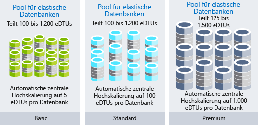

Sie sind ein Lösungsarchitekt.You are a solution architect. Ihre Organisation, Lamna Healthcare, hat ihre Workloads in die Cloud verschoben.Your organization, Lamna Healthcare has moved its workloads to the cloud. Vor Kurzem sind die Kosten für Ressourcen und Workflows stärker angestiegen als von Lamna erwartet.Recently, the bill for these resources and workflows has increased more than Lamna had anticipated. Sie wurden gebeten zu prüfen, ob es sich um natürliches, effizientes Wachstum handelt oder ob die Kosten reduziert werden können, wenn der Umgang mit den Cloudressourcen der Organisation effizienter gestaltet wird.You have been asked to determine whether the increase is natural, efficient growth, or whether the cost can be reduced by being more efficient with the organization's cloud resources.

## Kostenänderungen durch die CloudHow the cloud changes your expenses

Ein Unterschied zwischen einer öffentlichen Cloud und der lokalen Infrastruktur besteht darin, wie Sie für die von Ihnen verwendeten Dienste bezahlen.One of the differences between the public cloud and on-premises infrastructure is how you pay for the services you use. In lokalen Rechenzentren dauert es lange, Hardware zu beschaffen. Außerdem ist die Hardware auf maximale Kapazitäten ausgelegt und ein Teil der Kosten, z.B. für Strom und Lagerfläche, bleibt der Unternehmenseinheit vorenthalten, die die Ressourcen verbraucht.In an on-premises datacenter, hardware procurement time is long, hardware is sized for maximum capacity, and some of the costs, such as power and space, can be hidden from the business unit consuming the resources. Der Erwerb von physischer Infrastruktur ist mit Investitionen in langfristig verwendbare Objekte verknüpft, wodurch Sie weniger flexibel im Hinblick auf Ressourcen sind.Purchasing physical infrastructure ties up investments in long-term assets, hindering your ability to be agile with your resources.

Wenn Sie zur Cloud wechseln, zahlen Sie nur für das, was Sie tatsächlich verwenden.Shifting to the cloud introduces a pay-for-what-you-use cost model. Sie müssen keine langfristigen Investitionen mehr in Hardware tätigen, und wenn sich Ihre Anforderungen an Ressourcen ändern, können Sie darauf reagieren, indem Sie Ressourcen hinzufügen, verschieben oder entfernen.You no longer need to tie up investments in assets, and if your resource requirements change, you can respond by adding, moving, or removing resources. Workloads in Diensten unterscheiden sich voneinander (nicht nur innerhalb eines Diensts, sondern auch im Bezug auf andere Dienste), der Bedarf ist unter Umständen nicht vorhersehbar und Ihre Wachstumsmuster ändern sich mit der Zeit.Workloads vary between and within services, demand can be unpredictable, and your growth patterns shift over time. Da Sie in der Cloud nur für das zahlen, was Sie verwenden, ändert sich Ihre Kostenstruktur im Einklang mit Ihren Ressourcen.Since you only pay for what you use in the cloud, your cost structure can move in sync with the changes in resources.

Die Cloudinfrastruktur ist für Szenarien mit fluktuierender Ressourcennutzung geeignet.Cloud infrastructure can handle fluctuating resource usage scenarios. Ressourcen, die für längere Zeit nicht verwendet werden, können heruntergefahren werden und verursachen so keine Kosten.Resources that have significant periods of inactivity can be shut down when not in use and not incur any cost at all. Wenn ein erfolgreicher Dienst wächst, können auch die Ressourcen mitwachsen. Es muss nicht auf den nächsten Beschaffungszyklus gewartet werden.Resources can grow with a successful service as it grows, rather than having to wait for the next procurement cycle. Weitere Ressourcen können hinzugefügt und entfernt werden, um auf vorhersagbare und nicht vorhersagbare Bedarfsschwankungen zu reagieren.More resources can be dynamically added and removed to respond to predictable and unpredictable bursts of demand. Die folgende Abbildung zeigt, warum die lokale Infrastruktur nicht für all diese Schwankungen geeignet ist.The following illustration shows why the on-premises infrastructure cannot handle all these fluctuating scenarios.

In einer effizienten Architektur sind die bereitgestellten Ressourcen auf den jeweiligen Bedarf abgestimmt.In an efficient architecture, provisioned resources match the demand for those resources. Wenn ein virtueller Computer weniger als 10 % ausgelastet ist, verschwenden Sie Ressourcen – sowohl im Hinblick auf Computeressourcen als auch auf Kosten.If a virtual machine is less than 10% utilized the majority of the time, you are wasting resources, both in compute and cost. Wenn im Gegensatz dazu ein virtueller Computer 90 % ausgelastet ist und die meisten der verfügbaren Ressourcen verwendet, ist er effizient.Conversely, a virtual machine that is running 90% utilized is using the majority of the available resources and is an efficient use of money. Wenn ein System zu 100 % ausgelastet ist, kann dies die Leistung beeinträchtigen.Running a system to 100% utilization runs the risk of introducing performance issues. Es ist wichtig, dass Sie sicherstellen, dass die Leistung des Systems nicht beeinflusst wird, wenn Sie die Effizienz steigern.It is important to ensure that maximizing efficiency doesn't negatively impact the performance of your system. Sie können nur selten von konstantem Bedarf ausgehen. Daher ist es wichtig, dass Sie Ihre Ressourcen so konstruieren, dass sie stets an den tatsächlichen Bedarf angepasst werden können, um Effizienz zu gewährleisten.Demand is rarely constant, so adjusting resources when possible to match demand is important to ensure efficiency.

## Nachverfolgen von CloudausgabenTrack your cloud spend

Sie benötigen Daten, um intelligente Entscheidungen treffen zu können.In order to make intelligent decisions, you need data. Wenn Sie Ihre Ausgaben prüfen, können Sie diese mit der jeweiligen Auslastung vergleichen und so ermitteln, wo in Ihrer Umgebung Einsparungen möglich sind.By looking at where your money is going, you can start comparing that to utilization to uncover where you may have waste within your environment.

Sie können Ihre Abrechnungsdaten jederzeit exportieren.An export of your billing data is available at any time. Wenn Sie Ihre Abrechnungsdaten verwenden, können Sie Ihre Ausgaben nachverfolgen und feststellen, wie diese auf Ihre Ressourcen verteilt sind.Using your billing data, you can track where your costs are going and how they're allocated across your resources. Das Problem dabei ist, dass in den Abrechnungsdaten nur die Kosten und nicht die Auslastung aufgeführt sind.The challenge is that the billing data shows cost but not utilization. Sie können also sehen, dass Sie für eine große VM bezahlen, aber nicht, inwieweit diese auch verwendet wird.You'll have data that indicates you're paying for that large VM, but how much are you actually using it?

Mithilfe von Azure Cost Management können Sie nicht nur Ihre Ausgaben nachverfolgen, sondern Sie erfahren auch, welche Ressourcen nicht effizient genutzt werden.Azure Cost Management gives you insights where your spend is going, as well as underutilized resources. Azure Cost Management erfasst Ihre Gesamtausgaben, die Kosten pro Dienst sowie langfristige Kosten.Azure Cost Management tracks your total spend, cost by service, and cost over time. Sie können Detailinformationen zu Ressourcentypen und Instanzen anzeigen.You can drill down into resource types and instances. Außerdem können Sie Ihre Kosten nach Organisation oder Kostenstelle aufteilen, indem Sie Ressourcen entsprechende Kategorien zuordnen.You can also break down your costs by organization or cost center by tagging resources with those categories.

Auch der Azure Advisor verfügt über eine Kostenkomponente.Azure Advisor also has a cost component. Er empfiehlt bei Bedarf die Größenanpassung von VMs und den Kauf von reservierten Instanzen, wenn diese weniger Kosten verursachen als Instanzen mit nutzungsbasierter Bezahlung.It recommends VM resizing, buying reserved instances when more cost effective than pay-as-you-go instances. Er erkennt nicht verwendete ExpressRoute-Verbindungen und virtuelle Netzwerkgateways, die sich im Leerlauf befinden.It identifies unused ExpressRoute circuits and idle virtual network gateways. Zudem stellt der Advisor Empfehlungen im Hinblick auf Leistung, Hochverfügbarkeit und Sicherheit zur Verfügung.Advisor makes additional recommendations in the areas of performance, high availability, and security.

Dabei ist es wichtig, dass Sie sich die Zeit nehmen, Ihre Ausgaben zu prüfen.The important part is to take time to review your spend and evaluate where your money is going. Finden Sie heraus, welche Bereiche ineffizient sind, damit Sie so effizient wie möglich arbeiten können.Identify areas of inefficiency to ensure you're operating as efficiently as possible.

## Optimierung durch OrganisationOrganize to optimize

Wenn Sie Ihre Ressourcen besser organisieren, hilft Ihnen das dabei, Ihre Ausgaben einfacher nachzuverfolgen.Putting some organization to your resources can help track where some of your costs are going. Sie können Ihre Ressourcen dafür in Gruppen zusammenfassen und in Beziehung zueinander stellen, um zu prüfen, inwieweit die jeweiligen Kosten miteinander verknüpft sind.There are ways to group resources together, establishing a relationship so you know where your costs are related. Sie können Ressourcen im Hinblick auf die jeweiligen Ausgaben wie folgt gruppieren:From a billing perspective, resources can be easily grouped by:

- Sie können Ressourcen verschiedenen Abonnements zuweisen.Assigning resources to different subscriptions.
- Sie können Ressourcen verschiedenen Ressourcengruppen zuweisen.Assigning resources to different resource groups.
- Sie können Ressourcen Tags zuordnen.Applying tags to resources.

Wenn Sie Abonnements und Ressourcengruppen verwenden, um Ressourcen zu organisieren, stellt dies eine einfache Möglichkeit dar, Ressourcen auf logische Weise zu gruppieren. Sie müssen dafür nur Ihre Abrechnungsdaten prüfen.Using subscriptions and resource groups to organize resources is an easy way to logically group resources and can be leveraged when going through billing data. Tags eignen sich, wenn Ressourcenbeziehungen die Grenzen zwischen Abonnements und Ressourcengruppen umfassen.Tags come into play when resource relationships span the boundaries of subscriptions and resource groups. Tags sind Schlüssel-Wert-Paare, die zu jeder beliebigen Ressource hinzugefügt werden können. Sie sind in dem Abrechnungsdaten enthalten. So können Sie jede Ressource einer Abteilung oder Kostenstelle zuordnen.Tags are key/value pairs that can be added to any resource, and are exposed in billing data, allowing you to associate a department or cost center with your resource. Mithilfe von Tags können Sie Berichte zu Kosten verbessern und jeder Abteilung innerhalb Ihrer Organisation die Kosten zuordnen, die diese verursacht.Tags improve your ability to report on cost, as well as giving each department in your organization accountability for their own costs. Die folgende Abbildung zeigt, wie Sie das gleiche Tag auf Ressourcen in verschiedenen Ressourcengruppen und sogar in verschiedenen Abonnements anwenden können.The following illustration shows how you can apply the same tag to resources in different resource groups and even in different subscriptions.

Wenn Sie Ihre Ressourcen organisieren, hilft Ihnen das in vielerlei Hinsicht, und Sie können Ihre Ausgaben besser nachverfolgen.Adding some organization to your resources can go a long way and can really aid in your ability to understand where your costs are going. Nachfolgend wird erläutert, wie Sie Ihre Kosten optimieren können.Now let's take a look at some ways to optimize costs.

## Optimieren von IaaS-KostenOptimizing IaaS costs

In Organisationen, die virtuelle Computer verwenden, stellen die Kosten für diese Computer einen Großteil der Gesamtausgaben dar.For organizations using virtual machines, the cost associated with virtual machines is often the biggest portion of spend. Die Computekosten verursachen dabei in der Regel einen Großteil der Gesamtkosten, gefolgt vom Speicher.The compute costs are typically the biggest piece, followed by storage. Wenn Sie sich die Zeit nehmen, um die Ressourcen so zu optimieren, dass Sie nur für das bezahlen, was Sie auch verwenden, kann Ihre monatliche Rechnung bedeutend geringer ausfallen.Taking time to optimize pay-for-what-you-use resources can have a large impact on the size of your monthly bill.

Im Folgenden werden einige Best Practices zum Senken der Compute- und Speicherkosten erläutert.Let's take a look at best practices to reduce your compute and storage costs.

### ComputeCompute

Es gibt verschiedene Möglichkeiten, Kosten für virtuelle Computer zu sparen.There are different options available to achieve cost savings for virtual machines.

- Sie können die Größe der VM-Instanz reduzieren.Choose a smaller virtual machine instance size.
- Sie können die Anzahl der Stunden reduzieren, in denen ein virtueller Computer ausgeführt wird.Reduce the number of hours a virtual machine runs.
- Sie können Rabatte für die Computekosten nutzen.Use discounts for the compute costs.

#### Bestimmen der richtigen Größe von virtuellen ComputernRight size virtual machines

Eine VM hat die richtige Größe, wenn diese an den jeweiligen Ressourcenbedarf angepasst ist.Right sizing a virtual machine is the process of matching the virtual machine size with the resource demand required of the VM. Wenn sich eine VM 25 % der Zeit im Leerlauf befindet, werden Ihre Kosten automatisch verringert, sobald Sie deren Größe verringern.If a VM is running 25% idle, reducing the size of the VM will immediately reduce your cost. Innerhalb einer Instanzenfamilie sind die Kosten eines virtuellen Computers linear. Durch die Verwendung einer höheren Instanz werden die Kosten jeweils verdoppelt.Virtual machine costs are linear within an instance family; each next size larger will double your cost. Wenn Sie im Gegensatz dazu einen virtuellen Computer um eine einzelne Instanz verringern, halbieren sich Ihre Kosten.Conversely, reducing a VM by a single instance size will reduce your cost in half. Die folgende Abbildung zeigt Einsparungen in Höhe von 50 Prozent, die durch die Umstellung auf die nächstniedrigere Größe innerhalb der Serie erzielt wurden.The following illustration shows a 50% savings achieved by moving one size down within the same series.

Der Azure Advisor ermittelt, welche virtuellen Computer zu wenig ausgelastet sind.Azure Advisor identifies which virtual machines are underutilized. Advisor überwacht die Verwendung Ihrer virtuellen Computer 14 Tage lang und ermittelt virtuelle Computer mit geringer Auslastung.Advisor monitors your virtual machine usage for 14 days and then identifies underutilized virtual machines. Virtuelle Computer, deren CPU-Auslastung über einen Zeitraum von mindestens vier Tagen höchstens 5 % und deren Netzwerkauslastung höchstens 7 MB beträgt, gelten als nicht ausgelastete virtuelle Computer.Virtual machines whose CPU utilization is 5 percent or less and network usage is 7 MB or less for four or more days are considered underutilized virtual machines.

#### Implementieren von Zeitplänen zum Abschalten virtueller ComputerImplement shutdown schedules for virtual machines

Wenn Sie über VM-Workloads verfügen, die nur gelegentlich verwendet, aber dauerhaft ausgeführt werden, verschwenden Sie Geld.If you have VM workloads that are only used periodically, but are running continuously, you're wasting money. Diese VMs können bei Nichtbenutzung abgeschaltet und gemäß einem Zeitplan wiedereingeschaltet werden. So sparen Sie Computekosten, wenn die Zuordnung der VMs aufgehoben wird.These VMs can be shut down when not in use, and started back up on a schedule, saving you compute costs while the VM is deallocated. Dies gilt insbesondere für Entwicklungsumgebungen, da häufig nur während der offiziellen Geschäftszeiten entwickelt wird.This is particularly applicable for development environments, where it's often the case that development happens only during business hours. Sie können die Zuordnung für diese Systeme außerhalb der Geschäftszeiten aufheben und so Computekosten vermeiden.You can deallocate these systems in the off-hours, stopping your compute costs from accruing.

Verwenden Sie Azure Automation, um festzulegen, dass Ihre VMs nur dann ausgeführt werden, wenn dies für Ihre Workloads erforderlich ist.Use Azure Automation to limit the periods your VMs run to only those times that your workloads require.

Sie können auch das Feature zum automatischen Herunterfahren einer VM verwenden, um eine einmalige automatisierte Abschaltung zu planen.You can also use the auto-shutdown feature on a virtual machine to schedule a one-off automated shutdown.

#### Inanspruchnehmen von Rabatten für ComputekostenApply compute cost discounts

Mithilfe des Azure-Hybridvorteils können Sie Ihre Kosten für Windows Server und SQL Server optimieren, da Sie Ihre lokalen Lizenzen für Windows Server oder SQL Server zusammen mit Software Assurance verwenden können. Dadurch erhalten Sie einen Rabatt auf die Computekosten für diese VMs, da so keine Kosten für Windows Server und SQL Server auf aktivierten Instanzen entstehen.The Azure Hybrid Benefit allows you to further optimize your costs for both Windows Server and SQL Server by allowing you to use your on-premises Windows Server or SQL Server licenses with Software Assurance to be used as a discount toward the compute cost of these VMs, eliminating the costs for Windows and SQL Server on enabled instances.

Einige virtuelle Computer müssen permanent ausgeführt werden.Some virtual machines need to be up and running all the time. Dies ist z.B. bei einer Serverfarm für eine Webanwendung, die von einer Produktionsworkload benötigt wird, oder einen Domänencontroller der Fall, der verschiedene Server auf einem virtuellen Netzwerk unterstützt.Maybe you have a web application server farm for a production workload or maybe a domain controller supporting various servers on a virtual network. Wenn Sie sicher sind, dass diese virtuellen Computer mindestens ein Jahr lang ausgeführt werden, können Sie die Kosten weiter reduzieren, indem Sie auf reservierte Instanzen zurückgreifen.If you know with certainty that these virtual machines will run over the coming year or maybe longer, you can get further cost savings by purchasing a reserved instance. Azure Reserved Virtual Machine Instances können entweder für ein Jahr oder für drei Jahre an Computekapazität verwendet werden. Dabei reduzieren sich die Kosten im Vergleich zu Computeressourcen mit nutzungsbasierter BezahlungAzure Reserved Virtual Machine Instances can be purchased for one year or three years of compute capacity, at a discount compared to pay-as-you-go compute resources. Azure Reserved Virtual Machine Instances können die Kosten für virtuelle Computer mit einer Vorauszahlung für ein Jahr oder für drei Jahre erheblich reduzieren – im Vergleich zu den Preisen bei nutzungsbasierter Bezahlung um bis zu 72 Prozent.Azure Reserved Virtual Machine Instances can significantly reduce your virtual machine costs, up to 72 percent on pay-as-you-go prices, with one-year or three-year upfront commitment. Die folgende Abbildung zeigt die Einsparungen, die erzielt werden, wenn Sie Ihre lokale Lizenz mit dem Azure-Hybridvorteil kombinieren und wenn Sie Ihre lokale Lizenz sowohl mit Azure-RI als auch mit dem Azure-Hybridvorteil kombinieren.The following illustration shows savings achieved when you combine your on-premises license with the Azure Hybrid Benefit and when you combine your on-premises license with both Azure RI and the Azure Hybrid Benefit.

### Optimieren der Kosten für VM-DatenträgerspeicherVirtual machine disk storage cost optimization

Sie können bei Workloads, für die keine hohe Zuverlässigkeit und Leistung von Datenträgern benötigt wird, den kostengünstigen Standardspeicher verwenden.For workloads that do not require high reliability and performance disks, you can use the reduced-cost standard storage. Möglicherweise entscheiden Sie sich dafür, den Standardspeicher für Dev-/Testumgebungen zu verwenden, die nicht eindeutig der Produktionsworkload entsprechen.You might choose to use standard storage for development and test environments that are not required to be an identical match for a production workload.

Vergewissern Sie sich, dass in Ihrer Umgebung keine Datenträger vorhanden sind, die nicht mehr verwendet werden.Ensure you don't have any orphaned disks remaining in your environment. Auch Datenträger, die keiner VM zugewiesen sind, verursachen Speicherkosten.Disks that aren't associated with a VM still incur storage costs. Wenn Sie zwar eine VM, aber nicht die Datenträger entfernt haben, können Sie die nicht verwendeten Datenträger entfernen, um Ihre Speicherkosten zu reduzieren.If you've removed a VM but not the disks, the orphaned disks may be a place to reduce your storage cost.

Wenn Sie neben nicht verwendeten Datenträgern auch über Momentaufnahmen verfügen, die niemand mehr verwendet, nehmen Sie sich die Zeit, diese auszusortieren.Similar to orphaned disks, if you have any orphaned snapshots lingering around, take some time to clean them up. Zwar sind die Kosten für diese Momentaufnahmen geringer als für die Datenträger, aber es empfiehlt sich immer, Kosten für nicht benötigte Ressourcen zu reduzieren.Pricing for these is lower than the disks themselves, but it's still a good practice to eliminate costs of unnecessary resources.

## Optimieren der PaaS-KostenOptimizing PaaS costs

PaaS-Dienste werden in der Regel anhand der Kosten für IaaS-Dienste optimiert. Allerdings gibt es Möglichkeiten, unnötige Kosten zu ermitteln und diese auf ein Minimum zu reduzieren.PaaS services are typically optimized for costs over IaaS services, but there are opportunities to identify waste and optimize for minimal costs. Nachfolgend werden Möglichkeiten zum Reduzieren von Speicherkosten für Azure SQL-Datenbank und Azure Blob aufgeführt.Let's take a look at ways to reduce Azure SQL Database and Azure Blob storage costs.

### Optimieren der Kosten für Azure SQL-DatenbankOptimizing Azure SQL Database costs

Wenn Sie eine Datenbank mit Azure SQL-Datenbank erstellen, müssen Sie einen Server mit Azure SQL Server und eine Leistungsstufe auswählen.When creating an Azure SQL database, you have to select an Azure SQL Server and decide on a performance tier. Jede Stufe steht für eine Leistungsebene in Datenbanktransaktionseinheiten oder virtuellen Kernen.Each tier provides a performance level either in database transaction units (DTUs) or virtual cores (vCores). Bei stabiler Datenbankauslastung können Sie die Kosten ganz einfach optimieren, indem Sie eine Stufe auswählen, die der benötigten Leistung entspricht.For database loads that are steady, it's easy to optimize by selecting the properly sized tier for the needed performance. Sie fragen sich sicher, was geschieht, wenn die Aktivität für Ihre Datenbank unerwartete Schwankungen verzeichnet.But what if your database has unpredictable bursts or spikes in activity? Sie können mithilfe von Pools für elastische Datenbanken Kosten für unvorhersehbare Workloads reduzieren.Elastic pools can reduce costs for unpredictable workloads.

Pools für elastische Datenbanken mit SQL-Datenbank stellen eine einfache, kostengünstige Lösung zum Verwalten und Skalieren mehrerer Datenbanken mit variierenden und unvorhersehbaren Anforderungen dar.SQL Database elastic pools are a simple, cost-effective solution for managing and scaling several databases that have varying and unpredictable usage demands. Die Datenbanken in einem Pool für elastische Datenbanken befinden sich auf einem einzelnen Server in Azure SQL-Datenbank und nutzen gemeinsam mehrere Ressourcen zu einem festen Preis.The databases in an elastic pool are on a single Azure SQL Database server and share a set number of resources at a set price. Pools eignen sich hervorragend für eine große Anzahl an Datenbanken mit spezifischen Nutzungsmustern.Pools are well suited for a large number of databases with specific utilization patterns. Im Hinblick auf eine einzelne Datenbank wird dieses Muster durch eine geringe durchschnittliche Auslastung mit relativ wenigen Nutzungslastspitzen gekennzeichnet.For a given database, this pattern is characterized by low average utilization with relatively infrequent utilization spikes.
Je mehr Datenbanken Sie einem Pool hinzufügen können, desto mehr sparen Sie.The more databases you can add to a pool, the greater your savings become. Die folgende Abbildung zeigt die Funktionen von drei Arten von Pools für elastische Datenbanken: Basic, Standard und Premium.The following illustration shows the capabilities of the three types of Elastic Database Pools: basic, standard, and premium.  Basic bietet eine automatische Hochskalierung auf bis zu 5 eDTUs pro Datenbank, Standard bietet eine automatische Hochskalierung auf bis zu 100 eDTUs pro Datenbank, und Premium bietet eine automatische Hochskalierung auf bis zu 1.000 eDTUs pro Datenbank.Basic auto scales up to 5 eDTUs per DB, standard auto scales up to 100 eDTUs per DB, and Premium that auto scales up to 1000 eDTUs per DB.

Pools für elastische Datenbanken sind eine gute Möglichkeit, um Kosten auf mehrere Datenbanken aufzuteilen. Sie können dazu beitragen, Ihre Kosten für Azure SQL-Datenbank zu reduzieren.Elastic pools are a great way to spread costs across multiple databases and can make a significant impact on reducing your Azure SQL Database costs.

### Optimieren der Kosten für Blob StorageOptimizing Blob storage costs

Blob Storage ist zwar eine kostensparende Möglichkeit, um Daten zu speichern, aber je mehr Daten gespeichert werden, desto größer ist der Kostenvorteil, wenn Sie den Datenspeicher optimieren.Blob storage is a cost-effective way to store data, but as the amount of data grows, your bill can benefit from optimizing how the data is stored.

Im Folgenden wird nochmal auf Lamna Healthcare eingegangen.Let's return to Lamna Healthcare. Es geht um eine Anwendung für medizinische Bildgebung, die Bilder in Blob Storage speichert.You have a medical-imaging application that stores images in blob storage. Da aber eine große Menge an Bildern gespeichert werden muss, die viel Speicherplatz in Anspruch nehmen, hat die Verwendung dieses Speicherdiensts zur Folge, dass die Anwendung sehr teuer wird.Due to the quantity and size of the images, the storage ends up being a notable cost for the application. Wenn für einen Patienten ein Bild aufgenommen wird, ist es wahrscheinlich, dass dieses in der ersten Woche nach der Aufnahme mehrmals angesehen wird. Daher wird erwartet, dass die Leistung für Bildabrufe hoch ist.When an image has been taken for a patient, it's likely that in the first week, that image will be viewed several times, and the performance of image retrieval is expected to be high. Im Gegensatz dazu wird ein Bild, das vor zwei Jahren aufgenommen wurde, möglicherweise nur selten aufgerufen, und es wird eine geringere Abrufleistung erwartet.Conversely, an image taken two years ago may be accessed infrequently and has a lower retrieval performance expectation. Sie können in diesem Zusammenhang mit Speicherebenen arbeiten, um die Kosten für Bildabrufe zu optimieren, da immer weniger Leistung erforderlich ist, je älter die Bilder sind.You can use storage tiering to optimize the cost of image retrieval, given the reduced performance required as the image ages.

Azure Storage bietet drei Speicherebenen für Blob-Objektspeicher.Azure Storage offers three storage tiers for blob object storage. Die heiße Speicherebene von Azure ist für das Speichern von Daten optimiert, auf die häufig zugegriffen wird.The Azure hot storage tier is optimized for storing data that is accessed frequently. Die kalte Speicherebene von Azure ist für das Speichern von Daten optimiert, auf die selten zugegriffen wird, und die mindestens 30 Tage lang gespeichert werden.The Azure cool storage tier is optimized for storing data that is infrequently accessed and stored for at least 30 days. Die Archivzugriffsebene von Azure ist für das Speichern von Daten optimiert, auf die selten zugegriffen wird und die bei flexiblen Latenzanforderungen mindestens 180 Tage lang gespeichert werden.The Azure archive storage tier is optimized for storing data that is rarely accessed and stored for at least 180 days with flexible latency requirements.

- **Heiße Speicherebene:** die höchsten Speicherkosten, aber die geringsten Zugriffskosten.**Hot access tier** - Highest storage costs but the lowest access costs.
- **Kalte Speicherebene:** niedrigere Speicherkosten, aber höhere Zugriffskosten im Vergleich zur heißen Speicherebene.**Cool access tier** - Lower storage costs and higher access costs compared to hot storage. Diese Ebene ist für Daten bestimmt, die mindestens 30 Tage lang auf der kalten Ebene verbleiben.This tier is intended for data that will stay in the cool tier for at least 30 days.
- **Archivspeicherebene:** die niedrigsten Speicherkosten, aber die höchsten Datenabrufkosten im Vergleich zur kalten und heißen Speicherebene.**Archive access tier** - Lowest storage cost and highest data retrieval costs compared to hot and cool storage. Diese Ebene ist für Daten bestimmt, die mehrere Stunden Abrufwartezeit tolerieren und mindestens 180 Tage lang auf der Archivebene verbleiben.This tier is intended for data that can tolerate several hours of retrieval latency and will stay in the archive tier for at least 180 days.

Für Lamna Healthcare bietet es sich also an, neue Bilder einen Monat lang der heißen Speicherebene zuzuordnen, damit die neusten Bilder schnellstmöglich abgerufen werden können.For Lamna Healthcare, keeping new images on the hot access tier for a month makes sense, so that viewing the most recent images performs as fast as possible. Bilder, die älter als ein Jahr sind, könnten auf die Archivspeicherebene verschoben werden, da es wahrscheinlich ist, dass diese Bilder nicht abgerufen werden.You could then move images over one year old to the archive tier since it is likely that these images will not be retrieved. Dadurch fallen weniger Kosten für das Speichern dieser Bilder an.This would reduce their costs associated with storing these images.

## Kostenoptimierung bei Lamna HealthcareCost optimization at Lamna Healthcare

Lamna Healthcare macht Fortschritte beim Reduzieren der Unternehmenskosten.Lamna Healthcare is making strides on reducing their costs. Das Unternehmen prüft seine Ausgaben monatlich und jede Abteilung hat Zugriff auf Azure Cost Management und kann im Laufe des Monats prüfen, welche Kosten durch sie angefallen sind.They have organized a monthly review of their costs, and each department has access to Azure Cost Management, where they can review their costs throughout the month. Es wurden einige Möglichkeiten gefunden, reservierte Instanzen einzusetzen. Mehrere dieser Instanzen wurden erworben, um diesen Rabatt nutzen zu können.They've identified a number of places where reserved instances can be used and have purchased several to take advantage of this discount. Automatisierte Prozesse wurden implementiert, um Entwicklungsumgebungen außerhalb der offiziellen Geschäftszeiten auszuschalten. Dadurch werden zu Zeiten, zu denen diese Ressourcen nicht verwendet werden, Kosten gespart.They have implemented automated processes to stop development environments in off-hours, saving them additional costs during times when these resources were not being used. 

Außerdem hat das Optimieren von Blob Storage für das Speichern von Bildern dazu beigetragen, dass die Kosten im Laufe der letzten Monate gesenkt werden konnten.Along with the optimization of blob storage for their imaging storage, they've managed to drop their bill notably over the past couple of months.

## ZusammenfassungSummary

Wenn Sie die Kosten für Ihre Cloudinfrastruktur optimieren, müssen Sie Ihre Ausgaben nachverfolgen und sicherstellen, dass die Auslastung Ihrer Ressourcen dem Bedarf Ihrer Workloads entspricht.Optimizing the cost of your cloud infrastructure involves tracking your spend and ensuring that your resource utilization matches the demands of your workloads. Wenn Sie die richtige Qualität und Leistungsstufe für Ihre Ressourcen verwenden, können Ihre Cloudkosten weiter optimiert werden.Using the right quality and performance tier for your resources further optimizes your cloud costs.