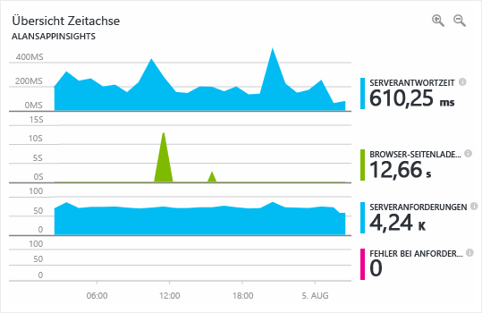

Unter Überwachung versteht man das Erfassen und Analysieren von Daten, um die Leistung, Integrität und Verfügbarkeit Ihrer Geschäftsanwendung und der Ressourcen, von denen diese abhängt, zu bestimmen.Monitoring is the act of collecting and analyzing data to determine the performance, health, and availability of your business application and the resources that it depends on. Angenommen, Sie leiten ein Team, das für Ressourcen verantwortlich ist, die in Azure ausgeführt werden.What if you ran an operations team responsible for resources running on Azure? Wie würden Sie gewährleisten, dass Sie Einblick in die Integrität Ihrer Systeme haben?What would you do to ensure you had visibility into the health of your systems? Wer soll zuerst informiert werden, wenn ein Problem auftritt? Ihr Team oder Ihre Endbenutzer?If something happens, who finds out first, your team or your end users? Mithilfe einer effektiven Überwachungsstrategie können Sie sich auf die Integrität Ihrer Anwendung konzentrieren.An effective monitoring strategy helps you focus on the health of your application. Sie hilft Ihnen auch, die Betriebszeit zu erhöhen, da Sie proaktiv über kritische Probleme benachrichtigt werden und diese beheben können, bevor sie auftreten.It also helps you increase your uptime by proactively notifying you of critical issues, so that you can resolve them before they become problems. 

Im Hinblick auf Überwachung und Analyse in Azure können Dienste in die folgenden drei Hauptbereiche gebündelt werden: umfassende Anwendungsüberwachung, umfassende Infrastrukturüberwachung und Kernüberwachung.When it comes to monitoring and analytics on Azure, we can bundle services into three specific areas of focus: deep application monitoring, deep infrastructure monitoring, and core monitoring. In dieser Einheit werden diese Bundles einzeln betrachtet und erläutert, wie Azure-Dienste diese Funktionen für Ihre Architektur aktivieren.In this unit, we'll take a look through each of these bundles and how Azure services enable these capabilities for your architecture. Obwohl diese Dienste zusammengefasst wurden, gibt es dazwischen noch viele Integrationspunkte, die es ermöglichen, wichtige Datenpunkte für die Überwachung freizugeben.Even though we've grouped these services together, there are several integration points between them, allowing for sharing of important monitoring data points between them. Die folgende Abbildung zeigt die verfügbaren Überwachungsdienste (zusammengefasst in logischen Gruppen).The following illustration shows the available monitoring services assembled into logical groups.

## KernüberwachungCore monitoring

Unter „Kernüberwachung“ versteht man die grundlegende, erforderliche Überwachung aller Azure-Ressourcen.Core monitoring provides fundamental, required monitoring across Azure resources. Unter „grundlegender Überwachung“ versteht man die Überwachung von Ressourcen auf Azure-Plattformebene.When we talk about fundamental monitoring, you can think of this as monitoring what is happening with your resources at the Azure platform level. Dieser Hauptbereich gibt Ihnen u.a. Einblick in die Integrität der Azure-Plattform, in Änderungen, die an den Ressourcen vorgenommen werden, und Leistungsmetriken.This area of focus gives you insight into things like the health of the Azure platform, insight into changes being made to your resources, and performance metrics. Wenn Sie Dienste aus diesem Bereich verwenden, können Sie die grundlegenden Elemente überwachen, die benötigt werden, damit Ihre Anwendung ausgeführt werden kann.Using services from this area gives you the ability to monitor the basic pieces you need to keep your application running.

Azure stellt Dienste bereit, damit Sie Einblick in die folgenden vier Hauptüberwachungsbereiche erhalten: Aktivitätsprotokollierung, Integrität der Dienste, Metriken und Diagnose sowie Empfehlungen zu bewährten Methoden.Azure provides services to give you visibility into four key core monitoring areas: activity logging, the health of services, metrics and diagnostics, and recommendations on best practices. Diese Dienste sind in Azure integriert, und es bedarf nur wenig Konfiguration, um diese zu aktivieren und einzurichten.These services are built in to Azure and take little to no configuration to enable and set up. Nachfolgend erhalten Sie ausführlichere Informationen.Let's take a closer look.

### AktivitätsprotokollierungActivity logging

Die Aktivitätsprotokollierung ist wichtig, um Informationen dazu abzurufen, was mit Ihren Ressourcen auf Azure-Fabric-Plattformebene geschieht.Activity logging is incredibly important to get information on what is happening with your resources at the Azure platform level. Jede Änderung, die an der Azure-Plattform vorgenommen wird, wird im Azure-Aktivitätsprotokoll festgehalten, wodurch Sie sämtliche Aktionen nachverfolgen können, die für Ihre Ressourcen ausgeführt werden.Every change submitted to the Azure platform is logged to the Azure Activity Log, giving you the ability to trace any action taken on your resources. Das Aktivitätsprotokoll enthält ausführliche Informationen zu Aktivitäten, damit Sie u.a. die folgenden Fragen beantworten können:Activity Log will contain detailed information on activities to help you answer questions like:

- Wer hat dem virtuellen Computer einen Datenträger hinzugefügt?Who has attached a disk to this virtual machine?
- Wann wurde dieser Computer heruntergefahren?When was this machine shut down?
- Wer hat die Lastenausgleichskonfiguration geändert?Who changed the load balancer configuration?
- Warum ist der Autoskalierungsvorgang für meine VM-Skalierungsgruppe fehlgeschlagen?Why did the autoscale operation on my virtual machine scale set fail?

Wenn Sie das Aktivitätsprotokoll verwenden, um diese Fragen zu beantworten, können Sie Probleme beheben, Änderungen nachverfolgen und prüfen, was in Ihrer Azure-Umgebung geschieht.Using Activity Log to answer these types of questions will help you troubleshoot issues, track changes, and provide auditing of what's happening in your Azure environment. Die Daten im Aktivitätsprotokoll werden nur für 90 Tage gespeichert und können in einem Speicherkonto archiviert oder an Azure Log Analytics gesendet werden, wenn sie länger gespeichert und weiter analysiert werden können.Activity Log data is only retained for 90 days and can be archived to a storage account or sent to Azure Log Analytics for longer retention and further analysis.

### Integrität von ClouddienstenHealth of cloud services

Jedes System kann jederzeit Probleme aufweisen. Dies gilt auch für Azure-Dienste.At some point, any system can have issues, and that's true for Azure services as well. Wenn Sie stets darüber informiert sind, wie es um die Integrität Ihrer Azure-Dienste steht, können Sie besser feststellen, ob und inwiefern ein Problem, das einen Azure-Dienst betrifft, Einfluss auf Ihre Umgebung hat.Staying informed of the health of Azure services will help you understand if and when an issue impacting an Azure service is impacting your environment. Ein Problem, das scheinbar nur lokal auftritt, könnte durch ein großflächigeres Problem entstanden sein. Azure Service Health hilft Ihnen dabei, solche Probleme zu erkennen.What may seem like a localized issue could be the result of a more widespread issue, and Azure Service Health provides this insight. Azure Service Health identifiziert Probleme mit Azure-Diensten, die sich auf Ihre Anwendung auswirken können.Azure Service Health identifies any issues with Azure services that might affect your application. Service Health unterstützt Sie außerdem bei der geplanten Wartung.Service Health also helps you plan for scheduled maintenance.

### Metriken und DiagnosenMetrics and diagnostics

Bei Problemen, die nur lokal auftreten, ist es wichtig, Einblick darin zu haben, was auf Ihrem System oder der Dienstinstanz geschieht.For issues that are more localized in nature, it's important to have visibility into what is happening on your system or service instance. Es ist wichtig, dass Metrik- und Diagnoseinformationen angezeigt werden können, damit Sie Leistungsprobleme beheben können und Sie informiert werden, wenn ein Fehler auftritt.The ability to view metrics and diagnostic information is critical to troubleshoot performance issues and stay notified when something goes wrong. Azure-Dienste haben dafür die Möglichkeit, Informationen zur Integrität, zu Metriken und zur Diagnose anzuzeigen.To provide this visibility, Azure services have a common way of showing health, metric, or diagnostic information. Azure Monitor ermöglicht Azure-Diensten die Kernüberwachung durch das Sammeln, Aggregieren und Visualisieren von Metriken, Aktivitätsprotokollen und Diagnoseprotokollen.Azure Monitor enables core monitoring for Azure services by allowing the collection, aggregation, and visualization of metrics, activity logs, and diagnostic logs.

Metriken stehen zur Verfügung und liefern Leistungsstatistiken für verschiedene Ressourcen und sogar das Betriebssystem der virtuellen Computer.Metrics are available that provide performance statistics for different resources and even the operating system inside a virtual machine. Sie können diese Daten mit einem der Explorer im Azure-Portal anzeigen und basierend auf diesen Metriken Benachrichtigungen erstellen.You can view this data with one of the explorers in the Azure portal and create alerts based on these metrics. Azure Monitor bietet die schnellste Metrikpipeline (nur zwischen einer und fünf Minuten) und sollte daher für zeitkritische Warnungen und Benachrichtigungen verwendet werden.Azure Monitor provides the fastest metrics pipeline (5 minutes down to 1 minute), so you should use it for time-critical alerts and notifications.

### Empfehlungen zu bewährten MethodenRecommendations on best practices

Wenn es um das Thema Überwachung geht, denkt man in erster Linie an die aktuelle Integrität einer Ressource.When we think of monitoring, we typically think of the current health of a resource. Aber auch wenn eine Ressource fehlerfrei läuft, kann es zu Änderungen kommen, die ein höheres Maß an Verfügbarkeit, Reduzierung von Kosten oder verbesserte Sicherheit zur Folge haben können.But even when a resource is healthy, there could be adjustments that would result in greater availability, reduced cost, or improved security. Der Azure Advisor kann Sie dabei unterstützen, indem er Ihre Ressourcen im Hinblick auf mögliche Probleme mit Leistung, Kosten, Hochverfügbarkeit und Sicherheit überwacht.Azure Advisor can help by keeping an eye out for potential performance, cost, high availability, or security issues within your resources. Der Advisor gibt basierend auf Ressourcenkonfiguration und Telemetrie Empfehlungen und leistet bessere Hilfe als die meisten traditionellen Überwachungsplattformen.Advisor makes personalized recommendations based on resource configuration and telemetry, providing guidance that most traditional monitoring platforms don't provide.

## Umfassende InfrastrukturüberwachungDeep infrastructure monitoring

Die zuvor behandelten Überwachungskomponenten bieten zwar wichtige Einblicke, sie sind jedoch nur auf die Azure-Plattform beschränkt.While the monitoring components we've covered thus far are great at offering insights, they only give visibility to the Azure platform. Für häufig verwendete IaaS-Workloads können mehr Metrik- und Diagnoseinformationen vom Netzwerk oder den tatsächlichen Betriebssystemen gesammelt werden.For typical IaaS workloads, there's more metrics and diagnostic information to gather from the network or the actual operating systems. Wenn Sie Informationen aus SQL Server entnehmen, um eine fehlerfreie Konfiguration sicherzustellen, freien Speicherplatz auf allen Servern in Ihrer Umgebung analysieren oder Netzwerkabhängigkeiten zwischen Ihren Systemen und Diensten visualisieren möchten, kann Ihnen Log Analytics helfen.Pulling information from SQL Server to ensure it's properly configured, analyzing free disk space across all the servers in your environment, or visualizing the network dependencies between your systems and services are all examples where Log Analytics can provide deep insights.

Wenn Sie eine Überwachungsstrategie entwerfen, ist es wichtig, sämtliche Komponenten zur Anwendungskette hinzuzufügen, damit Ereignisse auf verschiedenen Servern und Ressourcen korrelieren können.When designing a monitoring strategy, it's important to include every component in the application chain, so you can correlate events across services and resources. Dienste, die Azure Monitor unterstützen, können ganz leicht so konfiguriert werden, dass sie ihre Daten an einen Log Analytics-Arbeitsbereich zu senden.For services that support Azure Monitor, they can be easily configured to send their data to a Log Analytics workspace. Virtuelle Computer (sowohl in der Cloud als auch lokal) können über einen Agent verfügen, der installiert ist, um Daten an Log Analytics zu senden.Virtual machines (both in the cloud and on-premises) can have an agent installed to send data to Log Analytics. Sie können benutzerdefinierte Daten über die Log Analytics-API an Log Analytics übermitteln.You can submit custom data to Log Analytics through the Log Analytics API. Die folgende Abbildung zeigt, wie Log Analytics als zentraler Hub für die Datenüberwachung fungiert.The following illustration shows how Log Analytics acts as a central hub for monitoring data. Log Analytics empfängt Überwachungsdaten von Ihren Azure-Ressourcen und stellt sie Consumern zur Analyse oder Visualisierung zur Verfügung.Log Analytics receives monitoring data from your Azure resources and makes it available to consumers for analysis or visualization.

Mit diesen Daten in Log Analytics können Sie die Rohdaten zur Problembehandlung, Ermittlung der Grundursache und Überprüfung abfragen.With this data in Log Analytics, you can query the raw data for troubleshooting, root cause identification, and auditing purposes. Für einige bekannte Dienste (SQL Server, Windows Server Active Directory) gibt es Verwaltungslösungen, die Überwachungsdaten visualisieren und mithilfe von bewährten Methoden Konformität gewährleisten.For several known services (SQL Server, Windows Server Active Directory), there are management solutions readily available that visualize monitoring data and uncover compliance with best practices.

Mithilfe von Log Analytics können Sie Abfragen erstellen und auf deren Grundlage mit anderen Systemen interagieren.Log Analytics allows you to create queries and interact with other systems based on those queries. Warnungen stellen ein häufig auftretendes Beispiel für dieses Szenario dar.The most common example is an alert. Beispielsweise kann es sein, dass Sie eine E-Mail empfangen möchten, wenn auf einem System kein Speicherplatz mehr vorhanden ist oder eine bewährte Methode für SQL Server nicht mehr ausgeführt wird.Maybe you want to receive an email when a system runs out of disk space or a best practice on SQL Server is no longer followed. Log Analytics kann Warnungen senden, die Automatisierung starten und für Integrationsvorgänge und IT-Service-Management sogar auf benutzerdefinierte APIs zugreifen.Log Analytics can send alerts, kick off automation, and even hook into custom APIs for things like integration with IT service management (ITSM).

## Umfassende AnwendungsüberwachungDeep application monitoring

Es ist wichtig, dass Sie nachvollziehen können, was die Kerndienste und die Infrastruktur leisten. Sie können aber auch einen Schritt weitergehen, indem Sie Ihre Anwendungen ausführlich betrachten, um Leistungsprobleme, Nutzungstrends und die allgemeine Verfügbarkeit von Diensten ermitteln zu können, die Sie entwickeln und von denen Sie abhängig sind.It's important to understand how core services and infrastructure are performing, but you can take your monitoring capabilities even further by looking deep into your applications to identify performance issues, usage trends, and overall availability of services you develop and depend on. Wenn Sie ein Tool zur Verwaltung der Anwendungsleistung verwenden, können Sie Probleme in Ihren Web-Apps und Diensten besser ermitteln und eine Diagnose erstellen.By using an application performance management tool, you can better detect and diagnose issues that occur within your web apps and services.

Dabei unterstützt Sie Azure Application Insights.Azure Application Insights allows you to do exactly that. Application Insights umfasst Funktionen zur Sammlung von Telemetriedaten, zu Abfragen und Visualisierungen.Application Insights provides telemetry collection, query, and visualization capabilities. Es sind beinahe keine Codeänderungen erforderlich.Little to no code changes are required. Sie müssen nur ein kleines Instrumentierungspaket in Ihrer Anwendung installieren.You only have to install a small instrumentation package into your application. Application Insights arbeitet plattformübergreifend und unterstützt .NET, Node.js oder Java.Application Insights is cross platform, supporting .NET, Node.js, or Java.

Beispielsweise kann die Antwortzeit einer Anwendung Schwierigkeiten darstellen, wenn währenddessen Probleme behoben werden sollen.For instance, the response time of the application might be complex to troubleshoot. Ist der Webserver überladen?Is it the web server being overloaded? Handelt es sich um eine bestimmte SQL-Abfrage, die nicht optimiert wurde?Is it a specific SQL query that's not optimized? Arbeitet die API, die Sie aufrufen, langsamer als sonst?Is the API that you're calling performing slower than usual? Lösungen zur Verwaltung der Anwendungsleistung können Ihnen dabei helfen, die tatsächlichen Probleme zu ermitteln, die mithilfe einer grundlegenden Überwachungsmetrik nicht erkannt werden würden.Application performance monitoring solutions can help uncover the actual issues that basic metric monitoring can't expose. Der folgende Screenshot zeigt eine grafische Darstellung der Leistungsdetails einer Anwendung aus Azure Application Insights.The following screenshot shows a graphical display of an application’s performance details provided by Azure Application Insights.

Mithilfe einer Lösung zur Überwachung der Anwendungsleistung können Sie die Auslastung, die Leistung und die Verfügbarkeit von Anwendungen überwachen und so schneller reagieren, wenn Probleme auftreten. Diese Lösungen sollten Teil jeder Überwachungsstrategie sein.An application performance monitoring solution will help you monitor usage, performance, and availability, allowing you to respond to failure much faster, and should be included in any monitoring strategy.

## Überwachung bei Lamna HealthcareMonitoring at Lamna Healthcare

Seit die Ressourcen von Lamna Healthcare in die Cloud verschoben wurden, wird auch an der Überarbeitung der Überwachungsstrategie des Unternehmens gearbeitet.Lamna Healthcare has been revamping their monitoring strategy since moving their resources to the cloud. Das Unternehmen verwendet Azure Monitor zur Behandlung von Problemen und zum Ausgeben von Warnungen, wenn Leistungsprobleme auftreten, die sich auf die Ressourcen auswirken.They're using Monitor for troubleshooting and alerting when performance issues may be impacting their resources. Es wurden Benachrichtigungen zur Integrität der Dienste konfiguriert, die an die zuständigen Teams gesendet werden, damit sofort reagiert werden kann.They have notifications configured to send any service health notifications to their operations team for immediate engagement. Es wurde ein Prozess erstellt, um den Advisor regelmäßig zu prüfen, damit sichergestellt wird, dass dessen Empfehlungen falls möglich in die Umgebung implementiert werden.They have a process in place to regularly review Advisor to ensure the recommendations are implemented into their environment where applicable. 

Protokolldaten von allen Azure-Ressourcen und lokalen Ressourcen werden an den Log Analytics-Arbeitsbereich gesendet, sodass in mehreren Protokollquellen nach Ereigniskorrelation gesucht werden kann. Außerdem werden Verwaltungslösungen für Windows Server Active Directory und SQL Server verwendet.They send log data from all Azure and on-premises resources to a Log Analytics workspace, so they have the ability to search across log sources for event correlation and are using management solutions for Windows Server Active Directory and SQL Server.

Das Entwicklungsteam hat mit der Integration von Application Insights in die Unternehmensanwendungen begonnen. Es wurden bereits zwei Fehler ermittelt, die zuvor nicht erkannt worden waren und die Leistung beeinträchtigten.Their development team has started integrating Application Insights into their applications, and they've already uncovered two defects that were impacting performance that had previously gone undetected.

## ZusammenfassungSummary

Eine gute Überwachungsstrategie überprüft mehrere Ebenen einer Architektur, angefangen bei der Infrastruktur bis hin zu ausführlichen Telemetriedaten für Anwendungen.A good monitoring strategy looks across multiple layers of an architecture, from supporting infrastructure to deep application telemetry. So können Sie besser nachvollziehen, wie die einzelnen Komponenten Ihrer Anwendung funktionieren.It will help you understand the detailed operation of the different components of your application. Sie werden über schwerwiegende Probleme informiert, damit Sie diese frühzeitig beheben können und Protokolle und Telemetriedaten mehrerer Systeme werden korreliert, um weitere Probleme ermitteln zu können. Dadurch wird Ihre Betriebszeit erhöht.It increases your uptime by proactively notifying you of critical issues, so that you can resolve them before they become problems, and allows you to correlate logs and telemetry across systems to uncover issues. In dieser Einheit wurde einige Azure-Dienste beschrieben, die Sie in Ihrer Überwachungsstrategie einsetzen können.We've taken a look at a number of services on Azure that you can leverage in your monitoring strategy.