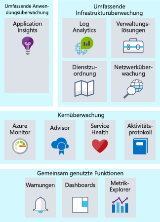
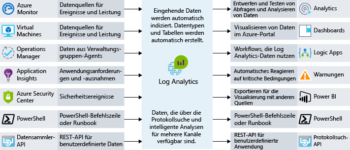

Unter Überwachung versteht man das Erfassen und Analysieren von Daten, um die Leistung, Integrität und Verfügbarkeit Ihrer Geschäftsanwendung und der Ressourcen, von denen diese abhängt, zu bestimmen. Angenommen, Sie leiten ein Team, das für Ressourcen verantwortlich ist, die in Azure ausgeführt werden. Wie würden Sie gewährleisten, dass Sie Einblick in die Integrität Ihrer Systeme haben? Wer soll zuerst informiert werden, wenn ein Problem auftritt? Ihr Team oder Ihre Endbenutzer? Mithilfe einer effektiven Überwachungsstrategie können Sie sich auf die Integrität Ihrer Anwendung konzentrieren. Sie hilft Ihnen auch, die Betriebszeit zu erhöhen, da Sie proaktiv über kritische Probleme benachrichtigt werden und diese beheben können, bevor sie auftreten. 

Im Hinblick auf Überwachung und Analyse in Azure können Dienste in die folgenden drei Hauptbereiche gebündelt werden: umfassende Anwendungsüberwachung, umfassende Infrastrukturüberwachung und Kernüberwachung. In dieser Einheit werden diese Bundles einzeln betrachtet und erläutert, wie Azure-Dienste diese Funktionen für Ihre Architektur aktivieren. Obwohl diese Dienste zusammengefasst wurden, gibt es dazwischen noch viele Integrationspunkte, die es ermöglichen, wichtige Datenpunkte für die Überwachung freizugeben. Die folgende Abbildung zeigt die verfügbaren Überwachungsdienste (zusammengefasst in logischen Gruppen).

## Kernüberwachung

Unter „Kernüberwachung“ versteht man die grundlegende, erforderliche Überwachung aller Azure-Ressourcen. Unter „grundlegender Überwachung“ versteht man die Überwachung von Ressourcen auf Fabric-Ebene. Dieser Hauptbereich gibt Ihnen u.a. Einblick in die Integrität der Azure-Plattform, in Änderungen, die an den Ressourcen vorgenommen werden, und Leistungsmetriken. Wenn Sie Dienste aus diesem Bereich verwenden, können Sie die grundlegenden Elemente überwachen, die benötigt werden, damit Ihre Anwendung ausgeführt werden kann.

Azure stellt Dienste bereit, damit Sie Einblick in die folgenden vier Hauptüberwachungsbereiche erhalten: Aktivitätsprotokollierung, Integrität der Dienste, Metriken und Diagnose sowie Empfehlungen zu bewährten Methoden. Diese Dienste sind in Azure integriert, und es bedarf nur wenig Konfiguration, um diese zu aktivieren und einzurichten. Nachfolgend erhalten Sie ausführlichere Informationen.

### Aktivitätsprotokollierung

Die Aktivitätsprotokollierung ist wichtig, um Informationen dazu abzurufen, was mit Ihren Ressourcen auf Azure-Fabric-Ebene geschieht. Jede Änderung, die an der Azure-Plattform vorgenommen wird, wird im Azure-Aktivitätsprotokoll festgehalten, wodurch Sie sämtliche Aktionen nachverfolgen können, die für Ihre Ressourcen ausgeführt werden. Das Aktivitätsprotokoll enthält ausführliche Informationen zu Aktivitäten, damit Sie u.a. die folgenden Fragen beantworten können:

- Wer hat dem virtuellen Computer einen Datenträger hinzugefügt?
- Wann wurde dieser Computer heruntergefahren?
- Wer hat die Lastenausgleichskonfiguration geändert?
- Warum ist der Autoskalierungsvorgang für meine VM-Skalierungsgruppe fehlgeschlagen?

Wenn Sie das Aktivitätsprotokoll verwenden, um diese Fragen zu beantworten, können Sie Probleme beheben, Änderungen nachverfolgen und prüfen, was in Ihrer Azure-Umgebung geschieht. Die Daten im Aktivitätsprotokoll werden nur für 90 Tage gespeichert und können in einem Speicherkonto archiviert oder an Azure Log Analytics gesendet werden, wenn sie länger gespeichert und weiter analysiert werden können.

### Integrität von Clouddiensten

Jedes System kann jederzeit Probleme aufweisen. Dies gilt auch für Azure-Dienste. Wenn Sie stets darüber informiert sind, wie es um die Integrität Ihrer Azure-Dienste steht, können Sie besser feststellen, ob und inwiefern ein Problem, das einen Azure-Dienst betrifft, Einfluss auf Ihre Umgebung hat. Ein Problem, das scheinbar nur lokal auftritt, könnte durch ein großflächigeres Problem entstanden sein. Azure Service Health hilft Ihnen dabei, solche Probleme zu erkennen. Azure Service Health identifiziert Probleme mit Azure-Diensten, die sich auf Ihre Anwendung auswirken können. Service Health unterstützt Sie außerdem bei der geplanten Wartung.

### Metriken und Diagnosen

Bei Problemen, die nur lokal auftreten, ist es wichtig, Einblick darin zu haben, was auf Ihrem System oder der Dienstinstanz geschieht. Es ist wichtig, dass Metrik- und Diagnoseinformationen angezeigt werden können, damit Sie Leistungsprobleme beheben können und Sie informiert werden, wenn ein Fehler auftritt. Azure-Dienste haben dafür die Möglichkeit, Informationen zur Integrität, zu Metriken und zur Diagnose anzuzeigen. Azure Monitor ermöglicht Azure-Diensten die Kernüberwachung durch das Sammeln, Aggregieren und Visualisieren von Metriken, Aktivitätsprotokollen und Diagnoseprotokollen.

Metriken stehen zur Verfügung und liefern Leistungsstatistiken für verschiedene Ressourcen und sogar das Betriebssystem der virtuellen Computer. Sie können diese Daten mit einem der Explorer im Azure-Portal anzeigen und basierend auf diesen Metriken Benachrichtigungen erstellen. Azure Monitor bietet die schnellste Metrikpipeline (nur zwischen einer und fünf Minuten) und sollte daher für zeitkritische Warnungen und Benachrichtigungen verwendet werden.

### Empfehlungen zu bewährten Methoden

Wenn es um das Thema Überwachung geht, denkt man in erster Linie an die aktuelle Integrität einer Ressource. Aber auch wenn eine Ressource fehlerfrei läuft, kann es zu Änderungen kommen, die ein höheres Maß an Verfügbarkeit, Reduzierung von Kosten oder verbesserte Sicherheit zur Folge haben können. Der Azure Advisor kann Sie dabei unterstützen, indem er Ihre Ressourcen im Hinblick auf mögliche Probleme mit Leistung, Kosten, Hochverfügbarkeit und Sicherheit überwacht. Der Advisor gibt basierend auf Ressourcenkonfiguration und Telemetrie Empfehlungen und leistet bessere Hilfe als die meisten traditionellen Überwachungsplattformen.

## Umfassende Infrastrukturüberwachung

Die zuvor behandelten Überwachungskomponenten bieten zwar wichtige Einblicke, sie sind jedoch nur auf die Azure-Fabric-Ebene beschränkt. Für häufig verwendete IaaS-Workloads können mehr Metrik- und Diagnoseinformationen vom Netzwerk oder den tatsächlichen Betriebssystemen gesammelt werden. Wenn Sie Informationen aus SQL Server entnehmen, um eine fehlerfreie Konfiguration sicherzustellen, freien Speicherplatz auf allen Servern in Ihrer Umgebung analysieren oder Netzwerkabhängigkeiten zwischen Ihren Systemen und Diensten visualisieren möchten, kann Ihnen Log Analytics helfen.

Wenn Sie eine Überwachungsstrategie entwerfen, ist es wichtig, sämtliche Komponenten zur Anwendungskette hinzuzufügen, damit Ereignisse auf verschiedenen Servern und Ressourcen korrelieren können. Dienste, die Azure Monitor unterstützen, können ganz leicht so konfiguriert werden, dass sie ihre Daten an einen Log Analytics-Arbeitsbereich zu senden. Virtuelle Computer (sowohl in der Cloud als auch lokal) können über einen Agent verfügen, der installiert ist, um Daten an Log Analytics zu senden. Sie können benutzerdefinierte Daten über die Log Analytics-API an Log Analytics übermitteln. Die folgende Abbildung zeigt, wie Log Analytics als zentraler Hub für die Datenüberwachung fungiert. Log Analytics empfängt Überwachungsdaten von Ihren Azure-Ressourcen und stellt sie Consumern zur Analyse oder Visualisierung zur Verfügung.

Mit diesen Daten in Log Analytics können Sie die Rohdaten zur Problembehandlung, Ermittlung der Grundursache und Überprüfung abfragen. Für einige bekannte Dienste (SQL Server, Windows Server Active Directory) verwaltungslösungen, die Überwachungsdaten zu visualisieren und entdecken die Einhaltung bewährter Methoden verfügbar sind.

Mithilfe von Log Analytics können Sie Abfragen erstellen und auf deren Grundlage mit anderen Systemen interagieren. Warnungen stellen ein häufig auftretendes Beispiel für dieses Szenario dar. Beispielsweise kann es sein, dass Sie eine E-Mail empfangen möchten, wenn auf einem System kein Speicherplatz mehr vorhanden ist oder eine bewährte Methode für SQL Server nicht mehr ausgeführt wird. Log Analytics kann Warnungen senden, die Automatisierung starten und für Integrationsvorgänge und IT-Service-Management sogar auf benutzerdefinierte APIs zugreifen.

## Umfassende Anwendungsüberwachung

Es ist wichtig, dass Sie nachvollziehen können, was die Kerndienste und die Infrastruktur leisten. Sie können aber auch einen Schritt weitergehen, indem Sie Ihre Anwendungen ausführlich betrachten, um Leistungsprobleme, Nutzungstrends und die allgemeine Verfügbarkeit von Diensten ermitteln zu können, die Sie entwickeln und von denen Sie abhängig sind. Wenn Sie ein Tool zur Verwaltung der Anwendungsleistung verwenden, können Sie Probleme in Ihren Web-Apps und Diensten besser ermitteln und eine Diagnose erstellen.

Dabei unterstützt Sie Azure Application Insights. Application Insights umfasst Funktionen zur Sammlung von Telemetriedaten, zu Abfragen und Visualisierungen. Es sind beinahe keine Codeänderungen erforderlich. Sie müssen nur ein kleines Instrumentierungspaket in Ihrer Anwendung installieren. Application Insights arbeitet plattformübergreifend und unterstützt .NET, Node.js oder Java.

Sogar die vermeintlich einfache Überprüfung des Zustands der Antwortzeit einer Anwendung kann Schwierigkeiten darstellen, wenn währenddessen Probleme behoben werden sollen. Ist der Webserver überladen? Handelt es sich um eine bestimmte SQL-Abfrage, die nicht optimiert wurde? Arbeitet die API, die Sie aufrufen, langsamer als sonst? Lösungen zur Verwaltung der Anwendungsleistung können Ihnen dabei helfen, die tatsächlichen Probleme zu ermitteln, die mithilfe einer einfachen Überwachungsmetrik nicht erkannt werden würden. Der folgende Screenshot zeigt eine grafische Darstellung der Leistungsdetails einer Anwendung aus Azure Application Insights.

Mithilfe einer Lösung zur Überwachung der Anwendungsleistung können Sie die Auslastung, die Leistung und die Verfügbarkeit von Anwendungen überwachen und so schneller reagieren, wenn Probleme auftreten. Diese Lösungen sollten Teil jeder Überwachungsstrategie sein.

## Überwachung bei Lamna Healthcare

Seit die Ressourcen von Lamna Healthcare in die Cloud verschoben wurden, wird auch an der Überarbeitung der Überwachungsstrategie des Unternehmens gearbeitet. Das Unternehmen verwendet Azure Monitor zur Behandlung von Problemen und zum Ausgeben von Warnungen, wenn Leistungsprobleme auftreten, die sich auf die Ressourcen auswirken. Es wurden Benachrichtigungen zur Integrität der Dienste konfiguriert, die an die zuständigen Teams gesendet werden, damit sofort reagiert werden kann. Es wurde ein Prozess erstellt, um den Advisor regelmäßig zu prüfen, damit sichergestellt wird, dass dessen Empfehlungen falls möglich in die Umgebung implementiert werden. 

Sie senden Protokolldaten von allen Azure und lokalen Ressourcen mit einem Log Analytics-Arbeitsbereich ab, damit sie die Möglichkeit haben, alle Protokollquellen, die für die Ereigniskorrelation zu suchen und Lösungen für die Verwaltung für Windows Server Active Directory und SQL Server verwenden.

Das Entwicklungsteam hat mit der Integration von Application Insights in die Unternehmensanwendungen begonnen. Es wurden bereits zwei Fehler ermittelt, die zuvor nicht erkannt worden waren und die Leistung beeinträchtigten.

## Zusammenfassung

Eine gute Überwachungsstrategie überprüft mehrere Ebenen einer Architektur, angefangen bei der Infrastruktur bis hin zu ausführlichen Telemetriedaten für Anwendungen. So können Sie besser nachvollziehen, wie die einzelnen Komponenten Ihrer Anwendung funktionieren. Sie werden über schwerwiegende Probleme informiert, damit Sie diese frühzeitig beheben können und Protokolle und Telemetriedaten mehrerer Systeme werden korreliert, um weitere Probleme ermitteln zu können. Dadurch wird Ihre Betriebszeit erhöht. In dieser Einheit wurde einige Azure-Dienste beschrieben, die Sie in Ihrer Überwachungsstrategie einsetzen können.