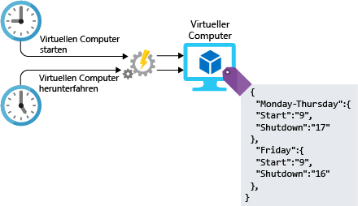

<span data-ttu-id="8f41d-101">Die Verwaltung der Infrastruktur einer beliebigen Workload umfasst Konfigurationsaufgaben.</span><span class="sxs-lookup"><span data-stu-id="8f41d-101">Managing the infrastructure of any type of workload involves configuration tasks.</span></span> <span data-ttu-id="8f41d-102">Die Konfiguration kann zwar manuell ausgeführt werden, aber manuell ausgeführte Vorgänge sind häufig aufwendig, fehleranfällig und nicht effizient.</span><span class="sxs-lookup"><span data-stu-id="8f41d-102">This configuration can be done manually, but manual steps can be labor-intensive, error prone, and inefficient.</span></span> <span data-ttu-id="8f41d-103">Und was geschieht, wenn Ihnen die Aufgabe zugeteilt wird, ein Projekt zu leiten, das die Bereitstellung von hunderten von Systemen in Azure umfasst?</span><span class="sxs-lookup"><span data-stu-id="8f41d-103">What if you are assigned to lead a project that required the deployment of hundreds of systems on Azure?</span></span> <span data-ttu-id="8f41d-104">Wie sollen Sie diese Ressourcen dann erstellen und konfigurieren?</span><span class="sxs-lookup"><span data-stu-id="8f41d-104">How would you build and configure these resources?</span></span> <span data-ttu-id="8f41d-105">Wie viel Zeit würde dies in Anspruch nehmen?</span><span class="sxs-lookup"><span data-stu-id="8f41d-105">How long would this take?</span></span> <span data-ttu-id="8f41d-106">Wäre es möglich sicherzustellen, dass alle Systeme fehlerfrei und ohne Abweichungen konfiguriert werden?</span><span class="sxs-lookup"><span data-stu-id="8f41d-106">Could you ensure that each system was configured properly, with no variance between them?</span></span> <span data-ttu-id="8f41d-107">Wenn Sie Ihre automatisierte Vorgänge in Ihre Architektur einbauen, können Sie all diese Herausforderungen meistern.</span><span class="sxs-lookup"><span data-stu-id="8f41d-107">By using automation in your architecture design, you can work past these challenges.</span></span> <span data-ttu-id="8f41d-108">Nachfolgend werden einige Möglichkeiten zur Automatisierung mit Azure vorgestellt.</span><span class="sxs-lookup"><span data-stu-id="8f41d-108">Let's take a look at some of the ways you can automate on Azure.</span></span>

## <a name="infrastructure-as-code"></a><span data-ttu-id="8f41d-109">Infrastruktur als Code</span><span class="sxs-lookup"><span data-stu-id="8f41d-109">Infrastructure as code</span></span>

<span data-ttu-id="8f41d-110">Bei Infrastruktur als Code geht es um die Verwaltung von Infrastruktur (Netzwerke, virtuelle Computer, Lastenausgleichsmodule und Verbindungstopologie) in einem beschreibenden Modell. Hierfür wird ein ähnliches Versionsverwaltungssystem wie für Quellcode genutzt.</span><span class="sxs-lookup"><span data-stu-id="8f41d-110">Infrastructure as code is the management of infrastructure (networks, virtual machines, load balancers, and connection topology) in a descriptive model, using a versioning system similar to what is used for source code.</span></span> <span data-ttu-id="8f41d-111">Wie bei dem Prinzip, dass mit dem gleichen Quellcode auch die gleichen Binärdaten generiert werden, wird mit einem IaC-Modell bei jeder Anwendung die gleiche Umgebung generiert.</span><span class="sxs-lookup"><span data-stu-id="8f41d-111">Like the principle that the same source code generates the same binary, an IaC model generates the same environment every time it is applied.</span></span> <span data-ttu-id="8f41d-112">IaC ist eine wichtige DevOps-Methode und wird häufig für Continuous Delivery-Zwecke verwendet.</span><span class="sxs-lookup"><span data-stu-id="8f41d-112">IaC is a key DevOps practice and is often used in conjunction with continuous delivery.</span></span>

<span data-ttu-id="8f41d-113">Infrastruktur als Code wurde weiterentwickelt, um das Problem der Umgebungsabweichung zu lösen.</span><span class="sxs-lookup"><span data-stu-id="8f41d-113">Infrastructure as code evolved to solve the problem of environment drift.</span></span> <span data-ttu-id="8f41d-114">Ohne IaC müssen Teams die Einstellungen einzelner Bereitstellungsumgebungen verwalten.</span><span class="sxs-lookup"><span data-stu-id="8f41d-114">Without IaC, teams must maintain the settings of individual deployment environments.</span></span> <span data-ttu-id="8f41d-115">Im Laufe der Zeit wird jede Umgebung zu einer „Schneeflocke“. Dies bedeutet, dass es sich um eine eindeutige Konfiguration handelt, die nicht automatisch reproduziert werden kann.</span><span class="sxs-lookup"><span data-stu-id="8f41d-115">Over time, each environment becomes a snowflake, that is, a unique configuration that cannot be reproduced automatically.</span></span> <span data-ttu-id="8f41d-116">Die Inkonsistenz zwischen den Umgebungen führt zu Problemen bei der Bereitstellung.</span><span class="sxs-lookup"><span data-stu-id="8f41d-116">Inconsistency among environments leads to issues during deployments.</span></span> <span data-ttu-id="8f41d-117">Bei Vorhandensein von „Schneeflocken“ sind für die Verwaltung und Wartung der Infrastruktur manuelle Prozesse erforderlich, die nur schwer nachverfolgt werden konnten und die Fehleranfälligkeit erhöht haben.</span><span class="sxs-lookup"><span data-stu-id="8f41d-117">With snowflakes, administration and maintenance of infrastructure involves manual processes which were hard to track and contributed to errors.</span></span>

<span data-ttu-id="8f41d-118">Sie können bei der Automatisierung der Bereitstellung von Diensten und Infrastruktur entweder auf imperative oder auf deklarative Weise vorgehen.</span><span class="sxs-lookup"><span data-stu-id="8f41d-118">When automating the deployment of services and infrastructure, there are two different approaches you can take: imperative and declarative.</span></span> <span data-ttu-id="8f41d-119">Bei einem imperativen Ansatz werden genau die Befehle angegeben, die ausgeführt werden müssen, um das gewünschte Ergebnis zu erzielen.</span><span class="sxs-lookup"><span data-stu-id="8f41d-119">In an imperative approach, you explicitly state the commands that are executed to produce the outcome you are looking for.</span></span> <span data-ttu-id="8f41d-120">Bei einem deklarativen Ansatz wird das gewünschte Ergebnis angegeben, aber nicht vorgeben, wie dieses erzielt werden kann.</span><span class="sxs-lookup"><span data-stu-id="8f41d-120">With a declarative approach, you specify what you want the outcome to be instead of specifying how you want it done.</span></span> <span data-ttu-id="8f41d-121">Beide Ansätze eignen sich hervorragend. Sie können also nichts falsch machen.</span><span class="sxs-lookup"><span data-stu-id="8f41d-121">Both approaches are valuable, so there's no wrong choice.</span></span> <span data-ttu-id="8f41d-122">Im Folgenden wird erläutert, wie die einzelnen Ansätze in Azure funktionieren.</span><span class="sxs-lookup"><span data-stu-id="8f41d-122">What do these different approaches look like on Azure, and how do you use them?</span></span>

### <a name="imperative-automation"></a><span data-ttu-id="8f41d-123">Imperative Automatisierung</span><span class="sxs-lookup"><span data-stu-id="8f41d-123">Imperative automation</span></span>

<span data-ttu-id="8f41d-124">Zunächst wird die imperative Automatisierung erläutert.</span><span class="sxs-lookup"><span data-stu-id="8f41d-124">Let's start with imperative automation.</span></span> <span data-ttu-id="8f41d-125">Bei der imperativen Automatisierung wird angegeben, _wie_ ein Ziel erreicht werden kann.</span><span class="sxs-lookup"><span data-stu-id="8f41d-125">With imperative automation, we're specifying _how_ things are to be done.</span></span> <span data-ttu-id="8f41d-126">Dies geschieht in der Regel programmgesteuert über eine Skriptsprache oder ein SDK.</span><span class="sxs-lookup"><span data-stu-id="8f41d-126">This is typically done programmatically through a scripting language or SDK.</span></span> <span data-ttu-id="8f41d-127">Für Azure-Ressourcen können z.B. eine Azure-Befehlszeilenschnittstelle oder Azure PowerShell verwendet werden.</span><span class="sxs-lookup"><span data-stu-id="8f41d-127">For Azure resources, we could use the Azure CLI or Azure PowerShell.</span></span> <span data-ttu-id="8f41d-128">Im folgenden Beispiel wird eine Azure-Befehlszeilenschnittstelle verwendet, um ein Speicherkonto zu erstellen.</span><span class="sxs-lookup"><span data-stu-id="8f41d-128">Let's take a look at an example that uses the Azure CLI to create a storage account.</span></span>

```azure-cli
az group create --name storage-resource-group \
        --location eastus

az storage account create --name mystorageaccount \
        --resource-group storage-resource-group \
        --kind BlobStorage \
        --access-tier hot
```

<span data-ttu-id="8f41d-129">Es wird gezeigt, wie Sie diese Ressourcen erstellen können.</span><span class="sxs-lookup"><span data-stu-id="8f41d-129">In this example, we're specifying how to create these resources.</span></span> <span data-ttu-id="8f41d-130">Erstellen Sie eine Ressourcengruppe über einen Befehl.</span><span class="sxs-lookup"><span data-stu-id="8f41d-130">Execute a command to create a resource group.</span></span> <span data-ttu-id="8f41d-131">Erstellen Sie über einen weiteren Befehl ein Speicherkonto.</span><span class="sxs-lookup"><span data-stu-id="8f41d-131">Execute another command to create a storage account.</span></span> <span data-ttu-id="8f41d-132">Azure erfährt explizit, welche Befehle ausgeführt werden müssen, um das gewünschte Ergebnis zu erzielen.</span><span class="sxs-lookup"><span data-stu-id="8f41d-132">We're explicitly telling Azure what commands to run to produce the output we need.</span></span>

<span data-ttu-id="8f41d-133">Dieser Ansatz hilft dabei, die Infrastruktur vollständig zu automatisieren.</span><span class="sxs-lookup"><span data-stu-id="8f41d-133">With this approach, we're able to fully automate our infrastructure.</span></span> <span data-ttu-id="8f41d-134">Es können Bereiche für Eingaben und Ausgaben bereitgestellt werden. Außerdem kann sichergestellt werden, dass jedes Mal die gleichen Befehle ausgeführt werden.</span><span class="sxs-lookup"><span data-stu-id="8f41d-134">We can provide areas for input and output, and can ensure that the same commands are executed every time.</span></span> <span data-ttu-id="8f41d-135">Durch die Automatisierung der Ressourcen müssen keine manuellen Schritte mehr ausgeführt werden. Dadurch wird die Ressourcenverwaltung effizienter.</span><span class="sxs-lookup"><span data-stu-id="8f41d-135">By automating our resources, we've taken the manual steps out of the process, making resource administration operationally more efficient.</span></span> <span data-ttu-id="8f41d-136">Allerdings hat dieser Ansatz auch Nachteile.</span><span class="sxs-lookup"><span data-stu-id="8f41d-136">There are some downsides to this approach though.</span></span> <span data-ttu-id="8f41d-137">Skripts zum Erstellen von Ressourcen werden schnell immer komplexer, wenn auch die Architektur komplexer wird.</span><span class="sxs-lookup"><span data-stu-id="8f41d-137">Scripts to create resources can quickly become complex as the architecture becomes more complex.</span></span> <span data-ttu-id="8f41d-138">Funktionen zur Fehlerbehandlung und Eingabeüberprüfung müssen möglicherweise hinzugefügt werden, damit alle Vorgänge vollständig ausgeführt werden können.</span><span class="sxs-lookup"><span data-stu-id="8f41d-138">Error handling and input validation may need to be added to ensure full execution.</span></span> <span data-ttu-id="8f41d-139">Die Befehle können sich ändern, weshalb die Skripte stetig verwaltet werden müssen.</span><span class="sxs-lookup"><span data-stu-id="8f41d-139">Commands may change, requiring ongoing maintenance of the scripts.</span></span>

### <a name="declarative-automation"></a><span data-ttu-id="8f41d-140">Deklarative Automatisierung</span><span class="sxs-lookup"><span data-stu-id="8f41d-140">Declarative automation</span></span>

<span data-ttu-id="8f41d-141">Bei der deklarativen Automatisierung wird das gewünschte _Ergebnis_ angegeben und offengelassen, wie das verwendete System dieses erzielt.</span><span class="sxs-lookup"><span data-stu-id="8f41d-141">With declarative automation, we're specifying _what_ we want our result to be, leaving the details of how it's done to the system we're using.</span></span> <span data-ttu-id="8f41d-142">In Azure werden im Rahmen der deklarativen Automatisierung Azure Resource Manager-Vorlagen verwendet.</span><span class="sxs-lookup"><span data-stu-id="8f41d-142">On Azure, declarative automation is done through the use of Azure Resource Manager templates.</span></span>

<span data-ttu-id="8f41d-143">Bei Resource Manager-Vorlagen handelt es sich um mit JSON strukturierte Dateien, in denen angegeben wird, was erstellt werden soll.</span><span class="sxs-lookup"><span data-stu-id="8f41d-143">Resource Manager templates are JSON-structured files that specify what we want created.</span></span> <span data-ttu-id="8f41d-144">Im nachfolgenden Beispiel wird Azure aufgefordert, ein Speicherkonto mit von uns angegebenen Namen und Eigenschaften zu erstellen.</span><span class="sxs-lookup"><span data-stu-id="8f41d-144">In the example below, we're telling Azure to create a storage account with the names and properties that we specify.</span></span> <span data-ttu-id="8f41d-145">Es wird Azure überlassen, geeignete Schritte auszuführen, um dieses Speicherkonto zu erstellen.</span><span class="sxs-lookup"><span data-stu-id="8f41d-145">The actual steps that are executed to create this storage account are left to Azure.</span></span> <span data-ttu-id="8f41d-146">Vorlagen bestehen aus vier Bereichen: Parametern, Variablen, Ressourcen und Ausgaben.</span><span class="sxs-lookup"><span data-stu-id="8f41d-146">Templates have four sections: parameters, variables, resources, and outputs.</span></span> <span data-ttu-id="8f41d-147">Parameter verarbeiten Eingaben, die in der Vorlage verwendet werden sollen.</span><span class="sxs-lookup"><span data-stu-id="8f41d-147">Parameters handle input to be used within the template.</span></span> <span data-ttu-id="8f41d-148">Mithilfe von Variablen können Werte gespeichert werden, die in der Vorlage verwendet werden sollen.</span><span class="sxs-lookup"><span data-stu-id="8f41d-148">Variables provide a way to store values for use throughout the template.</span></span> <span data-ttu-id="8f41d-149">Bei den Ressourcen handelt es sich um das, was erstellt wird, und über Ausgaben erfahren Benutzer, was erstellt wurde.</span><span class="sxs-lookup"><span data-stu-id="8f41d-149">Resources are the things that are being created, and outputs are a way to provide details to the user of what was created.</span></span>

```json
{
    "$schema": "https://schema.management.azure.com/schemas/2015-01-01/deploymentTemplate.json#",
    "contentVersion": "1.0.0.0",
    "parameters": {
        "name": {
            "type": "string"
        },
        "location": {
            "type": "string"
        },
        "accountType": {
            "type": "string",
            "defaultValue": "Standard_RAGRS"
        },
        "kind": {
            "type": "string"
        },
        "accessTier": {
            "type": "string"
        },
        "httpsTrafficOnlyEnabled": {
            "type": "bool",
            "defaultValue": true
        }
    },
    "variables": {
    },
    "resources": [
        {
            "apiVersion": "2018-02-01",
            "name": "[parameters('name')]",
            "location": "[parameters('location')]",
            "type": "Microsoft.Storage/storageAccounts",
            "sku": {
                "name": "[parameters('accountType')]"
            },
            "kind": "[parameters('kind')]",
            "properties": {
                "supportsHttpsTrafficOnly": "[parameters('httpsTrafficOnlyEnabled')]",
                "accessTier": "[parameters('accessTier')]",
                "encryption": {
                    "services": {
                        "blob": {
                            "enabled": true
                        },
                        "file": {
                            "enabled": true
                        }
                    },
                    "keySource": "Microsoft.Storage"
                }
            },
            "dependsOn": []
        }
    ],
    "outputs": {
        "storageAccountName": {
            "type": "string",
            "value": "[parameters('name')]"
        }
    }
}
```

<span data-ttu-id="8f41d-150">Sie können Vorlagen verwenden, um die meisten Dienste in Azure zu erstellen und zu bearbeiten.</span><span class="sxs-lookup"><span data-stu-id="8f41d-150">Templates can be used to create and manipulate most services on Azure.</span></span> <span data-ttu-id="8f41d-151">Sie können in Coderepositorys gespeichert, von der Quelle verwaltet und für mehrere Umgebungen freigegeben werden, um sicherzustellen, dass die Infrastruktur, die entwickelt wird, den Ansprüchen der Produktion entspricht.</span><span class="sxs-lookup"><span data-stu-id="8f41d-151">They can be stored in code repositories and source controlled, and shared across environments to ensure that the infrastructure being developed against matches what's actually in production.</span></span> <span data-ttu-id="8f41d-152">Sie stellen eine gute Möglichkeit zum Automatisieren von Bereitstellungen dar, wahren die Konsistenz, vermeiden falsche Konfigurationen von Bereitstellungen und erhöhen die Geschwindigkeit von Vorgängen.</span><span class="sxs-lookup"><span data-stu-id="8f41d-152">They are a great way to automate deployments and help ensure consistency, eliminate deployment misconfigurations, and can increase operational speed.</span></span>

<span data-ttu-id="8f41d-153">Die Automatisierung Ihrer Infrastrukturbereitstellung stellt zwar einen hilfreichen ersten Schritt dar, aber die Bereitstellung von virtuellen Computern stellt immer noch eine aufwendige Herausforderung dar.</span><span class="sxs-lookup"><span data-stu-id="8f41d-153">Automating your infrastructure deployment is a great first step, but when deploying virtual machines, there's still more work to do.</span></span> <span data-ttu-id="8f41d-154">Im Folgenden werden einige Ansätze zum Automatisieren der Konfiguration nach der Bereitstellung beschrieben.</span><span class="sxs-lookup"><span data-stu-id="8f41d-154">Let's take a look at a couple of approaches to automating configuration post deployment.</span></span>

## <a name="vm-customization-images-vs-post-deployment-configuration"></a><span data-ttu-id="8f41d-155">VM-Anpassung: Images im Gegensatz zur Konfiguration nach der Bereitstellung</span><span class="sxs-lookup"><span data-stu-id="8f41d-155">VM customization: images vs. post-deployment configuration</span></span>

<span data-ttu-id="8f41d-156">Häufig reicht es nicht, wenn der Computer ausgeführt wird. Für die Bereitstellung von virtuellen Computern sind weitere Maßnahmen erforderlich.</span><span class="sxs-lookup"><span data-stu-id="8f41d-156">For many virtual machine deployments, the job isn't done when the machine is running.</span></span> <span data-ttu-id="8f41d-157">Es ist wahrscheinlich, dass zusätzliche Konfigurationen durchgeführt werden müssen, bevor die VM wie vorgesehen verwendet werden kann.</span><span class="sxs-lookup"><span data-stu-id="8f41d-157">It's likely there's additional configuration that's needed before the VM can actually serve its intended purpose.</span></span> <span data-ttu-id="8f41d-158">Außerdem müssen möglicherweise die Datenträger formatiert, die VM mit einer Domäne verknüpft, ein Agent für eine Verwaltungssoftware installiert oder (und das ist am wahrscheinlichsten) die tatsächliche Workload ebenfalls installiert und konfiguriert werden.</span><span class="sxs-lookup"><span data-stu-id="8f41d-158">Additional disks might need formatting, the VM might need to be joined to a domain, maybe an agent for a management software needs to be installed, and most likely the actual workload requires installation and configuration as well.</span></span>

<span data-ttu-id="8f41d-159">Es werden in der Regel zwei Konfigurationsstrategien angewendet, die als Bestandteil der eigentlichen Konfiguration der VM selbst angesehen werden. Beide haben sowohl Vor- als auch Nachteile:</span><span class="sxs-lookup"><span data-stu-id="8f41d-159">There are two common strategies applied for the configuration work considered to be part the configuration of the VM itself, both of which have advantages and disadvantages:</span></span>

- <span data-ttu-id="8f41d-160">Benutzerdefinierte Images</span><span class="sxs-lookup"><span data-stu-id="8f41d-160">Custom images</span></span>
- <span data-ttu-id="8f41d-161">Skripterstellung nach der Bereitstellung</span><span class="sxs-lookup"><span data-stu-id="8f41d-161">Post-deployment scripting</span></span>

<span data-ttu-id="8f41d-162">Benutzerdefinierte Images werden erstellt, indem erst ein virtueller Computer bereitgestellt und dann eine Software auf der ausgeführten Instanz konfiguriert oder installiert wird.</span><span class="sxs-lookup"><span data-stu-id="8f41d-162">Custom images are generated by deploying a virtual machine and then configuring or installing software on that running instance.</span></span> <span data-ttu-id="8f41d-163">Wenn die Konfigurationen ohne Fehler durchgeführt wurde, kann der Computer heruntergefahren werden, und es wird über die VM ein Image erstellt.</span><span class="sxs-lookup"><span data-stu-id="8f41d-163">When everything is configured correctly, the machine can be shut down, and an image is created from the VM.</span></span> <span data-ttu-id="8f41d-164">Das Image kann als Basis für andere neue virtuelle Computer verwendet werden.</span><span class="sxs-lookup"><span data-stu-id="8f41d-164">The image can then be used as a base for other new virtual machines.</span></span> <span data-ttu-id="8f41d-165">Wenn Sie mit benutzerdefinierten Images arbeiten, kann die Bereitstellung schneller abgeschlossen werden. Dies liegt daran, dass keine zusätzliche Konfiguration mehr nötig ist, sobald ein virtueller Computer einmal bereitgestellt wurde und ausgeführt wird.</span><span class="sxs-lookup"><span data-stu-id="8f41d-165">Working with custom images can speed up the overall time of your deployment as once the virtual machine is deployed and running, no additional configuration would be needed.</span></span> <span data-ttu-id="8f41d-166">Wenn es Ihnen wichtig ist, dass Bereitstellungen schnell abgeschlossen werden, sollten Sie sich näher mit benutzerdefinierten Images auseinandersetzen.</span><span class="sxs-lookup"><span data-stu-id="8f41d-166">If deployment speed is an important factor, custom images are definitely worth exploring.</span></span>

<span data-ttu-id="8f41d-167">Bei der Skripterstellung nach der Bereitstellung wird in der Regel zunächst ein Basisimage verwendet. Anschließend wird eine Skripterstellung- oder Konfigurationsverwaltungsplattform benötigt, die die Konfiguration ausführt, nachdem die VM bereitgestellt wurde.</span><span class="sxs-lookup"><span data-stu-id="8f41d-167">Post-deployment scripting typically leverages a basic base image, then relies on scripting or a configuration management platform to do configuration after the VM is deployed.</span></span> <span data-ttu-id="8f41d-168">Führen Sie für die Skripterstellung nach der Bereitstellung mithilfe von Azure Script Extension ein Skript auf der VM aus, oder verwenden Sie eine stabilere Lösung wie Azure Automation Desired State Configuration (DSC).</span><span class="sxs-lookup"><span data-stu-id="8f41d-168">The post-deployment scripting could be done by executing a script on the VM through the Azure Script Extension or by leveraging a more robust solution such as Azure Automation Desired State Configuration (DSC).</span></span>

<span data-ttu-id="8f41d-169">Bei beiden Ansätze gibt es einiges zu beachten.</span><span class="sxs-lookup"><span data-stu-id="8f41d-169">Each approach has some considerations to keep in mind.</span></span> <span data-ttu-id="8f41d-170">Wenn Sie Images verwenden, müssen Sie sicherstellen, dass ein Prozess vorhanden ist, um Imageupdates, Sicherheitspatches und die Bestandsverwaltung der eigentlichen Images zu verarbeiten.</span><span class="sxs-lookup"><span data-stu-id="8f41d-170">When using images, you'll need to ensure there's a process to handle image updates, security patches, and inventory management of the images themselves.</span></span> <span data-ttu-id="8f41d-171">Bei der Skripterstellung nach der Bereitstellung können Buildzeiten verlängert werden, da die VM erst zu Liveworkloads hinzugefügt werden kann, wenn der Buildvorgang abgeschlossen ist.</span><span class="sxs-lookup"><span data-stu-id="8f41d-171">With post-deployment scripting, build times can be extended since the VM can't be added to live workloads until the build is complete.</span></span> <span data-ttu-id="8f41d-172">Bei eigenständigen Systemen ist dieses Problem zwar von geringerer Bedeutung, aber wenn Dienste für die automatische Skalierung verwendet werden (z.B. bei VM-Skalierungsgruppen) hat diese verlängerte Buildzeit Auswirkungen auf die Dauer der Skalierung.</span><span class="sxs-lookup"><span data-stu-id="8f41d-172">This may not be a significant issue for standalone systems, but when using services that autoscale (such as virtual machine scale sets), this extended build time can impact how quickly you can scale.</span></span> <span data-ttu-id="8f41d-173">Bei beiden Ansätzen sollten Sie darauf achten, Konfigurationsabweichungen anzugehen. Wenn eine neue Konfiguration veröffentlicht wird, sollten Sie sicherstellen, dass bereits vorhandene Systeme entsprechend angepasst werden.</span><span class="sxs-lookup"><span data-stu-id="8f41d-173">With both approaches, you'll want to ensure you address configuration drift; as new configuration is rolled out, you'll need to ensure that existing systems are updated accordingly.</span></span>

<span data-ttu-id="8f41d-174">Das Automatisieren der Bereitstellung von Ressourcen kann einen großen Vorteil für Ihre Umgebung darstellen.</span><span class="sxs-lookup"><span data-stu-id="8f41d-174">Automating resource deployment can be a massive benefit to your environment.</span></span> <span data-ttu-id="8f41d-175">Sie sparen dadurch viel Zeit, und es treten weniger Fehler auf, sodass die Vorgänge effizienter ausgeführt werden können.</span><span class="sxs-lookup"><span data-stu-id="8f41d-175">The amount of time saved, and error reduced can move your operational capabilities to another level.</span></span>

## <a name="automation-of-operational-tasks"></a><span data-ttu-id="8f41d-176">Automatisieren von Vorgängen</span><span class="sxs-lookup"><span data-stu-id="8f41d-176">Automation of operational tasks</span></span>

<span data-ttu-id="8f41d-177">Auch wenn Ihre Lösungen einmal funktionieren und ausgeführt werden, gibt es trotzdem noch weitere Vorgänge, die automatisiert werden können.</span><span class="sxs-lookup"><span data-stu-id="8f41d-177">Once your solutions are up and running, there are ongoing operational activities that can also be automated.</span></span> <span data-ttu-id="8f41d-178">Wenn Sie diese mit Azure Automation ausführen, gibt es weniger manuelle Workloads und Konfigurationen und Updates für Computeressourcen können verwaltet werden. Freigegebene Ressourcen wie Zeitpläne, Anmeldeinformationen und Zertifikate werden zentralisiert, und es wird ein Framework zum Ausführen jeder beliebigen Azure-Aufgabe bereitgestellt.</span><span class="sxs-lookup"><span data-stu-id="8f41d-178">Automating these tasks with Azure Automation reduces manual workloads, enables configuration and update management of compute resources, centralizes shared resources such as schedules, credentials, and certificates, and provides a framework for running any type of Azure task.</span></span>

<span data-ttu-id="8f41d-179">Für Ihre Arbeit mit Lamna Healthcare umfasst dies möglicherweise Folgendes:</span><span class="sxs-lookup"><span data-stu-id="8f41d-179">For your Lamna Healthcare work, this might include:</span></span>

- <span data-ttu-id="8f41d-180">Regelmäßiges Suchen nach Datenträgern für Datenträger, die nicht mehr verwendet werden</span><span class="sxs-lookup"><span data-stu-id="8f41d-180">Periodically searching for orphaned disks.</span></span>
- <span data-ttu-id="8f41d-181">Installieren der neusten Sicherheitspatches auf VMs</span><span class="sxs-lookup"><span data-stu-id="8f41d-181">Installing the latest security patches on VMs.</span></span>
- <span data-ttu-id="8f41d-182">Suchen nach und Herunterfahren von virtuellen Computern außerhalb der offiziellen Geschäftszeiten</span><span class="sxs-lookup"><span data-stu-id="8f41d-182">Searching for and shutting down virtual machines in off-hours.</span></span>
- <span data-ttu-id="8f41d-183">Tägliches Ausführen von Berichten und Erstellen eines Dashboards für die Geschäftsleitung</span><span class="sxs-lookup"><span data-stu-id="8f41d-183">Running daily reports and producing a dashboard to report to senior management.</span></span>

<span data-ttu-id="8f41d-184">Nehmen Sie beispielsweise an, Sie möchten einen virtuellen Computer nur während der Geschäftszeiten ausführen.</span><span class="sxs-lookup"><span data-stu-id="8f41d-184">As a concrete example, suppose you want to run a virtual machine only during business hours.</span></span> <span data-ttu-id="8f41d-185">Sie können ein Skript schreiben, das den virtuellen Computer am Morgen startet und am Abend wieder herunterfährt.</span><span class="sxs-lookup"><span data-stu-id="8f41d-185">You can write a script to start the VM in the morning and shut it down in the evening.</span></span> <span data-ttu-id="8f41d-186">Sie können Azure Automation so konfigurieren, dass das Skript zu bestimmten Zeiten ausgeführt wird.</span><span class="sxs-lookup"><span data-stu-id="8f41d-186">You can configure Azure Automation to run the script at set times.</span></span> <span data-ttu-id="8f41d-187">Die folgende Abbildung zeigt die Rolle von Azure Automation in diesem Prozess.</span><span class="sxs-lookup"><span data-stu-id="8f41d-187">The following illustration shows the role of Azure Automation in this process.</span></span>



## <a name="automating-development-environments"></a><span data-ttu-id="8f41d-189">Automatisieren von Entwicklungsumgebungen</span><span class="sxs-lookup"><span data-stu-id="8f41d-189">Automating development environments</span></span>

<span data-ttu-id="8f41d-190">Ihrer Cloudinfrastruktur stehen die Computer gegenüber, die von Entwicklern verwendet werden, um Anwendungen und Dienste zu schreiben, die für das Unternehmen von Bedeutung sind.</span><span class="sxs-lookup"><span data-stu-id="8f41d-190">At the other end of the pipeline of your cloud infrastructure are the development machines used by developers to write the applications and services that are the core of your business.</span></span> <span data-ttu-id="8f41d-191">Sie können Azure DevTest Labs verwenden, um VMs mit den richtigen Tools und Repositorys auszustatten, die benötigt werden.</span><span class="sxs-lookup"><span data-stu-id="8f41d-191">You can use Azure DevTest Labs to stamp out VMs with all of the correct tools and repositories that they need.</span></span> <span data-ttu-id="8f41d-192">Entwickler, die an mehreren Diensten arbeiten, können zwischen den einzelnen Entwicklungsumgebungen wechseln, ohne selbst einen neuen Computer bereitzustellen.</span><span class="sxs-lookup"><span data-stu-id="8f41d-192">Developers working on multiple services can switch between development environments without having to provision a new machine themselves.</span></span> <span data-ttu-id="8f41d-193">Diese Entwicklungsumgebungen können heruntergefahren werden, wenn niemand sie verwendet, und anschließend wieder hochgefahren werden, wenn sie benötigt werden.</span><span class="sxs-lookup"><span data-stu-id="8f41d-193">These development environments can be shut down when not in use and restarted when they are required again.</span></span>

## <a name="automation-at-lamna-healthcare"></a><span data-ttu-id="8f41d-194">Automatisierung bei Lamna Healthcare</span><span class="sxs-lookup"><span data-stu-id="8f41d-194">Automation at Lamna Healthcare</span></span>

<span data-ttu-id="8f41d-195">Im Folgenden wird erläutert, welche Verbesserungen Lamna Healthcare mithilfe von Automatisierung verzeichnet hat.</span><span class="sxs-lookup"><span data-stu-id="8f41d-195">Let's take a look at how Lamna Healthcare has improved by using automation.</span></span> <span data-ttu-id="8f41d-196">Vor der Automatisierung wurden die Infrastrukturbereitstellung und Buildvorgänge für Server vollständig manuell durchgeführt.</span><span class="sxs-lookup"><span data-stu-id="8f41d-196">When you started your journey, infrastructure deployment and server builds were entirely manual.</span></span> <span data-ttu-id="8f41d-197">Entwicklungen wurden ausschließlich über das Portal bereitgestellt.</span><span class="sxs-lookup"><span data-stu-id="8f41d-197">Engineers were deploying everything through the portal.</span></span> <span data-ttu-id="8f41d-198">Dadurch entstanden Abweichungen und Fehler im Zusammenhang mit Test- und Produktionsumgebungen. Außerdem war es aufgrund der Unterschiede schwierig, Probleme zu ermitteln, bevor der Code in Produktion ging.</span><span class="sxs-lookup"><span data-stu-id="8f41d-198">This was introducing variance and errors between test and production environments, and the differences were hindering their ability to detect problems before code hit production.</span></span>

<span data-ttu-id="8f41d-199">Jetzt wird die gesamte Infrastruktur über Resource Manager-Vorlagen bereitgestellt.</span><span class="sxs-lookup"><span data-stu-id="8f41d-199">They now deploy all their infrastructure through Resource Manager templates.</span></span> <span data-ttu-id="8f41d-200">Diese Vorlagen werden in ein GitHub-Repository eingecheckt, und der Code wird überprüft, bevor diese bereitgestellt werden.</span><span class="sxs-lookup"><span data-stu-id="8f41d-200">These templates are checked into a GitHub repository, and a code review happens before they are released for deployment.</span></span> <span data-ttu-id="8f41d-201">Außerdem kann für die Entwicklung, das Testen und die Produktion eine gemeinsame Infrastruktur erstellt werden, um so sicherzustellen, dass die Konfigurationen für sämtliche Umgebungen überprüft wurden.</span><span class="sxs-lookup"><span data-stu-id="8f41d-201">They're also able to build the same infrastructure between dev, test, and production, ensuring they have validated their configuration across all environments.</span></span>

<span data-ttu-id="8f41d-202">Für die meisten Dienste, die virtuelle Computer verwenden, werden Standardbasisimages und DSC verwendet, um die Systeme nach der Bereitstellung zu konfigurieren.</span><span class="sxs-lookup"><span data-stu-id="8f41d-202">For most services using virtual machines, they have a standard base image and use DSC to configure the systems post deployment.</span></span> <span data-ttu-id="8f41d-203">Für Webfarmen, für die die Skalierbarkeit von VM-Skalierungsgruppen von Bedeutung ist, wird ein vollständig automatisierter Prozess angewandt, um Code einzuchecken und ein neues Image mit allen erforderlichen Konfigurationen zu erstellen, bevor es in den Skalierungsgruppen zur Verfügung gestellt wird.</span><span class="sxs-lookup"><span data-stu-id="8f41d-203">For web farms where they need the scalability of virtual machine scale sets, they have a fully automated process to check in code and build a new image with all required configuration built in before making it available in their scale sets.</span></span>

<span data-ttu-id="8f41d-204">Bestimmte VMs werden automatisch außerhalb der offiziellen Geschäftszeiten heruntergefahren, um deren Kosten zu reduzieren. Zudem wurde das VM-Patching automatisiert.</span><span class="sxs-lookup"><span data-stu-id="8f41d-204">They have an Automation job to shut down identified virtual machines in off-hours to reduce costs and have automated their VM patching as well.</span></span>

<span data-ttu-id="8f41d-205">Außerdem verfügen Entwickler jetzt über eine Umgebung in DevTest Labs, die sich selbst verwaltet. In dieser können sie die Entwicklung an die neuesten Images und Konfigurationen anpassen und somit sicherstellen, dass dies den Konfigurationen in der Produktion entspricht.</span><span class="sxs-lookup"><span data-stu-id="8f41d-205">Developers now have a self-service environment in DevTest Labs where they can develop against the latest images and configuration, ensuring that what they develop against matches the configuration in production.</span></span>

<span data-ttu-id="8f41d-206">All diese Änderungen haben zwar viel Mühe gekostet, aber sie zahlen sich langfristig aus.</span><span class="sxs-lookup"><span data-stu-id="8f41d-206">All of this took some up-front effort, but the benefits have paid off in the long run.</span></span> <span data-ttu-id="8f41d-207">Die Anzahl von Fehlern wurde deutlich reduziert und die Entwicklerteams müssen weniger Zeit in die Verwaltung ihrer Umgebungen investieren.</span><span class="sxs-lookup"><span data-stu-id="8f41d-207">They've dramatically reduced error and the effort required by their operations teams to maintain their environments.</span></span> <span data-ttu-id="8f41d-208">Die Entwickler sind begeistert, dass sie ganz einfach Ressourcen für die Entwicklung bereitstellen können und das Erstellen von Umgebungen so stark vereinfacht wurde.</span><span class="sxs-lookup"><span data-stu-id="8f41d-208">Developers love that they can easily go provision resources to develop against, eliminating the back and forth to get environments created.</span></span>

## <a name="summary"></a><span data-ttu-id="8f41d-209">Zusammenfassung</span><span class="sxs-lookup"><span data-stu-id="8f41d-209">Summary</span></span>

<span data-ttu-id="8f41d-210">Es wurden einige Möglichkeiten beschrieben, wie Automatisierungsfunktionen zu Ihrer Architektur hinzugefügt werden können.</span><span class="sxs-lookup"><span data-stu-id="8f41d-210">We've taken a look at a number of ways to bring automation capabilities into your architecture.</span></span> <span data-ttu-id="8f41d-211">Angefangen bei der Bereitstellung von Infrastruktur als Code, bis hin zur Verbesserung der Produktivität von Entwicklern mithilfe von Laborumgebungen, stellt das Automatisieren von Umgebungen viele Vorteile dar.</span><span class="sxs-lookup"><span data-stu-id="8f41d-211">From deploying infrastructure as code, to improving developer productivity with lab environments, there's a ton of benefit from taking time to automate your environment.</span></span> <span data-ttu-id="8f41d-212">Wenn Sie Fehler und Abweichungen sowie Betriebskosten reduzieren, kann Ihre Organisation davon profitieren und Ihre Cloudumgebung kann deutlich verbessert werden.</span><span class="sxs-lookup"><span data-stu-id="8f41d-212">Reducing error, reducing variance, and saving operational costs can be a significant benefit to your organization and help take your cloud environment to the next level.</span></span>