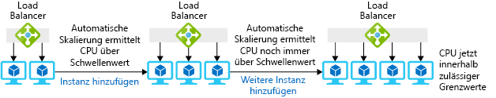

Nur selten können wir die Last auf unserem System genau vorhersagen: Öffentliche Anwendungen können schnell wachsen, oder eine interne Anwendung muss möglicherweise eine größere Benutzerbasis unterstützen, da das Unternehmen wächst.It's rare that we can exactly predict the load on our system: public facing applications might grow rapidly or an internal application might need to support a larger user base as the business grows. Und selbst wenn wir die Last vorhersagen können, ist diese nur selten gleichbleibend hoch: Einzelhändler haben vor den Feiertagen einen höheren Bedarf, während es bei Sportwebseiten bei Spitzenspielen zu Spitzenlasten kommt.Even when we can predict load, it's rarely flat: retailers have more demand during the holidays and sports websites peak during playoffs. In dieser Einheit werden wir uns eingehend mit dem _zentralen Hochskalieren/Herunterskalieren_ und dem _horizontalen Hochskalieren/Herunterskalieren_ befassen. Außerdem werden wir einige Methoden kennenlernen, wie Azure Ihre Skalierfunktionen verbessern kann und wie serverlose Technologien und Containertechnologien die Skalierfähigkeit Ihrer Architektur steigern können.Here, we'll define _scaling up/down_ and _scaling out/in_, cover some ways Azure can improve your scaling capabilities, and look at how serverless and container technologies can improve your architecture's ability to scale.

## Was versteht man unter Skalierung?What is scaling?

_Skalierung_ bezeichnet den Prozess zum Verwalten Ihrer Ressourcen, damit Ihre Anwendung eine Reihe von Leistungsanforderungen erfüllt._Scaling_ is the process of managing your resources to help your application meet a set of performance requirements.  Wenn zu viele Ressourcen für die Benutzer vorhanden sind, werden diese Ressourcen nicht effizient eingesetzt und wir verschwenden Geld.When we have too many resources serving users, we won't be using it efficiently and we'll be wasting money. Nicht genügend verfügbare Ressourcen bedeuten hingegen, dass die Leistung unserer Anwendung beeinträchtigt werden könnte.Too few available resources means that the performance of our application could be impacted. Ziel ist es, unsere definierten Leistungsanforderungen zu erfüllen und gleichzeitig die Kosten zu optimieren.The goal is to meet our defined performance requirements while optimizing for cost. 

„_Ressourcen_“ kann sich auf alles beziehen, was wir verwalten müssen, damit unsere Anwendungen ausgeführt werden können."_Resources_" can refer to anything we need to manage to run our applications. Arbeitsspeicher und CPU für virtuelle Computer (VM) sind die offensichtlichsten Ressourcen, aber für einige Azure-Dienste müssen Sie unter Umständen auch die Bandbreite oder Abstraktionen wie Cosmos DB-Anforderungseinheiten berücksichtigen.Memory and CPU for virtual machines are the most obvious resources, but some Azure services might require you to consider bandwidth or abstractions, like Cosmos DB Request Units.

In einer Welt mit einem konstanten Anwendungsbedarf lässt sich die Menge an erforderlichen Ressourcen leicht vorhersagen.In a world where application demand is constant, it's easy to predict the right amount of resources you'll need. In der Praxis ändert sich der Bedarf von Anwendungen im Laufe der Zeit aber, sodass die richtige Menge an benötigten Ressourcen häufig schwieriger vorherzusagen ist.In the real world, the demands of applications change over time, so the right amount of resources you'll need can be harder to predict. Wenn Sie Glück haben, sind diese Änderungen vorhersehbar oder saisonal, aber dies trifft nicht auf alle Anwendungen zu.If you're lucky, that change will be predictable or seasonal, but that is not typical of all applications. Im Idealfall möchten Sie die richtige Menge an Ressourcen bereitstellen, um die Nachfrage zu erfüllen, und bei Bedarfsänderungen Anpassungen vornehmen.Ideally, you want to provision the right amount of resources to meet demand and adjust as demand changes.

Eine Skalierung ist bei einem lokalen Szenario, in dem Sie Ihre eigenen Server erwerben und verwalten, schwierig.Scaling is difficult in an on-premises scenario, where you purchase and manage your own servers. Das Hinzufügen von Ressourcen kann kostspielig sein, und häufig dauert es zu lange, bis diese online gehen – manchmal sogar länger als der tatsächliche Bedarf an der erhöhten Kapazität besteht.Adding resources can be costly and often takes too much time to bring online, sometimes longer than your actual need for the increased capacity. Anschließend ist es unter Umständen ähnlich schwierig, in Zeiten mit geringem Bedarf im System die Kapazität zu verringern, sodass Sie möglicherweise auf den höheren Kosten sitzen bleiben.It can be just as difficult to then reduce capacity during times of low demand on the system, so you may be stuck with the increased cost.

Ein zentraler Vorteil von Azure ist die einfache Skalierung.Easy scaling is a key benefit of Azure. Die meisten Azure-Ressourcen können Sie problemlos mit dem sich verändernden Bedarf hinzufügen oder entfernen, und viele Dienste verfügen über automatische Optionen, die den Bedarf für Sie überwachen und anpassen.Most Azure resources let you easily add or remove resources as demand changes, and many services have automated options so they monitor demand and adjust for you. Diese Funktion der automatischen Skalierung ermöglicht Ihnen, Schwellenwerte für die Mindest- und Höchstverfügbarkeit von Instanzen festzulegen, und übernimmt das Hinzufügen bzw. Entfernen von Instanzen auf Grundlage einer Leistungsmetrik (beispielsweise der CPU-Auslastung).This automatic scaling capability, commonly known as autoscaling, lets you set thresholds for the minimum and maximum level of instances that should be available, and will add or remove instances based upon a performance metric (for example, CPU utilization).

#### Zentrales Hochskalieren und horizontales HochskalierenScaling up and out

> [!VIDEO https://www.microsoft.com/videoplayer/embed/RE2yBWi]

## Was bedeutet Hoch- oder Herunterskalieren?What is scaling up or down?

Hochskalieren bezeichnet den Prozess, mit dem wir die Kapazität einer bestimmten Instanz erhöhen.Scaling up is the process where we increase the capacity of a given instance. Ein virtueller Computer könnte von 1 vCPU und 3,5 GB RAM auf 2 vCPUs und 7 GB RAM hochgestuft werden, um mehr Verarbeitungskapazität zu bieten.A virtual machine could be increased from 1 vCPU and 3.5 GB of RAM to 2 vCPUs and 7 GB of RAM to provide more processing capacity. Herunterskalieren bezeichnet im Umkehrschluss den Prozess, bei dem die Kapazität einer bestimmten Instanz reduziert wird.On the other hand, scaling down is the process where we lower the capacity of a given instance. Dies bedeutet beispielsweise, die Kapazität eines virtuellen Computers von 2 vCPUs und 7 GB RAM auf 1 vCPU und 3,5 GB RAM zu verringern, was neben der Kapazität auch die Kosten reduziert.For example, reducing a virtual machine's capacity from 2 vCPUs and 7 GB of RAM to 1 vCPU and 3.5 GB of RAM, reducing both capacity and cost. In der folgenden Abbildung wird ein Beispiel für das Ändern der Größe einer VM veranschaulicht.The following illustration shows an example of changing the size of a virtual machine.

Sehen wir uns nun einmal an, was Hoch- bzw. Herunterskalieren im Kontext von Azure-Ressourcen bedeutet:Let's take a look at what scaling up or down means in the context of Azure resources:

- Bei virtuellen Azure-Computern erfolgt die Skalierung anhand der Größe eines virtuellen Computers.In Azure virtual machines, you scale based upon a virtual machine size. Zu dieser Größe gehören eine bestimmte Menge von zugeordneten vCPUs sowie eine bestimmte Menge von RAM und lokalem Speicher.That size has a certain amount of vCPUs, RAM, and local storage associated with it. Wir könnten beispielsweise einen virtuellen Computer mit Standard_DS1_v2 (1 vCPU und 3,5 GB RAM) auf einen virtuellen Computer mit Standard_DS2_v2 (2 vCPUs und 7 GB RAM) hochskalieren.For example, we could scale up from a Standard_DS1_v2 virtual machine (1 vCPU and 3.5 GB of RAM) to a Standard_DS2_v2 virtual machine (2 vCPUs and 7 GB of RAM).
- Azure SQL-Datenbank ist eine Paas-Implementierung (Platform-as-a-Service) von Microsoft SQL Server.Azure SQL Database is a platform as a service (PaaS) implementation of Microsoft SQL Server.  Sie können eine Datenbank anhand der Zahl der Datenbanktransaktionseinheiten (DTUs) oder vCPUs hochskalieren.You can scale up a database based upon the number of database transaction units (DTUs) or vCPUs. DTUs sind eine Abstraktion der zugrunde liegenden Ressourcen und eine Mischung aus CPU, E/A und Arbeitsspeicher.DTUs are an abstraction of underlying resources and are a blend of CPU, IO, and memory. Beispielsweise können Sie Ihre Azure SQL-Datenbank von einer Größe von P2 mit 250DTUs bis zu P4 mit 500DTUs skalieren, um Durchsatz und Kapazität der Datenbank zu steigern.For instance, you could scale your Azure SQL database from a size of P2 with 250 DTUs up to a P4 with 500 DTUs to give the database more throughput and capacity.
- Azure App Service ist ein PaaS-Websitehostingdienst in Azure.Azure App Service is a PaaS website-hosting service on Azure. Websites werden auf einer virtuellen Serverfarm ausgeführt, die auch als App Service-Plan bezeichnet wird.Websites run on a virtual server farm, also known as an App Service plan. Sie können den App Service-Plan zwischen Tarifen hoch- und herunterskalieren und verfügen innerhalb der Tarife über verschiedene Kapazitätsoptionen.You can scale the App Service plan up or down between tiers and have capacity options within tiers. Ein S1-App Service-Plan verfügt beispielsweise über 1 vCPU und 1,75 GB RAM pro Instanz.For example, an S1 App Service plan has 1 vCPU and 1.75 GB of RAM per instance. Wir könnten ihn auf einen S2-App Service-Plan hochskalieren, der 2 vCPUs und 3 GB RAM pro Instanz bietet.We could scale up to an S2 App Service plan, which has 2 vCPUs and 3 GB of RAM per instance.

Um in einer lokalen Umgebung über diese Fähigkeit zu verfügen, müssen Sie üblicherweise auf die Beschaffung der erforderlichen Hardware und deren Installation warten, bevor Sie die neue Skalierungsstufe verwenden können.To have these capabilities in an on-premises environment you typically have to wait for procurement of the needed hardware and installation before you can start using the new level of scale. In Azure sind die physischen Ressourcen bereits bereitgestellt und für Sie verfügbar.In Azure, the physical resources are already deployed and available for you. Sie müssen lediglich die andere Skalierungsstufe auswählen, die Sie verwenden möchten.You simply need to select the alternate level of scale that you are looking to use.

Möglicherweise müssen Sie die Auswirkungen der Hochskalierung in Ihrer Lösung berücksichtigen, die von den Clouddiensten abhängen, die Sie ausgewählt haben.You may need to consider the impact of scaling up in your solution, depending upon the cloud services that you have chosen.

Wenn Sie beispielsweise in einer Azure SQL-Datenbank hochskalieren möchten, skaliert der Dienst einzelne Knoten hoch und setzt den Betrieb Ihres Dienstes fort.For example, if you choose to scale up in Azure SQL Database, the service deals with scaling up individual nodes and continues the operation of your service. Wenn Sie die Dienst- und/oder Leistungsstufe einer Datenbank ändern, wird ein Replikat der ursprünglichen Datenbank auf der neuen Leistungsebene erstellt, und anschließend werden die Verbindungen auf dieses Replikat umgeschaltet.Changing the service tier and/or performance level of a database creates a replica of the original database at the new performance level, and then switches connections over to the replica. Während dieses Vorgangs gehen keine Daten verloren, und es kommt nur zu einer kurzen Unterbrechung (in der Regel von weniger als vier Sekunden), wenn der Dienst auf das Replikat umgeschaltet wird.No data is lost during this process, and there's only a brief interruption (typically less than four seconds) when the service switches over to the replica.

Wenn Sie hingegen auswählen, einen virtuellen Computer hoch- oder herunterzuskalieren, wählen Sie dazu eine andere Instanzgröße aus.Alternatively, if you choose to scale up or down a virtual machine, you do so by selecting a different instance size. In den meisten Fällen erfordert dies einen Neustart des virtuellen Computers. Rechnen Sie also sicherheitshalber damit, dass ein Neustart erforderlich ist und Sie diesen bei der Durchführung dieser Aktivität berücksichtigen müssen.In most cases this requires a restart of the VM, so it's best to have the expectation that a reboot will be required and you'll need to account for when performing this activity.

Und schließlich sollten Sie stets prüfen, ob stellenweise auch Herunterskalieren eine Option darstellt.Finally, you should always look for places where scaling down is an option. Wenn Ihre Anwendung eine angemessene Leistung auf einer niedrigeren Tarifstufe bereitstellen kann, könnte Ihre Azure-Rechnung erheblich günstiger ausfallen.If your application can provide adequate performance at a lower price tier, your Azure bill could be significantly reduced.

## Was bedeutet horizontales Hoch- oder Herunterskalieren?What is scaling out or in?

Während beim Hoch- und Herunterskalieren die Menge der verfügbaren Ressourcen einer einzelnen Instanz angepasst wird, wird beim horizontalen Hoch- und Herunterskalieren die Gesamtzahl der Instanzen angepasst.Where scaling up and down adjusts the amount of resources a single instance has available, scaling out and in adjusts the total number of instances.

_Horizontales Hochskalieren_ bezeichnet den Prozess, mit dem weitere Instanzen hinzugefügt werden, um die Last Ihrer Lösung aufzufangen._Scaling out_ is the process of adding more instances to support the load of your solution. Wenn beispielsweise Ihr Website-Front-End auf virtuellen Computern gehostet wurde, ließe sich die Zahl der virtuellen Computer erhöhen, wenn die Last zunimmt.For example, if our website front end were hosted on virtual machines, we could increase the number of virtual machines if the level of load increased.

_Horizontales Herunterskalieren_ bezeichnet den Prozess, mit dem Instanzen entfernt werden, die nicht mehr benötigt werden, um die Last Ihrer Lösung aufzufangen._Scaling in_ is the process of removing instances that are no longer needed to support the load of your solution. Wenn die Website-Front-Ends nur wenig genutzt werden, ist es unter Umständen sinnvoll, die Zahl der Instanzen zu verringern, um Kosten zu sparen.If the website front ends have low usage, we may want to lower the number of instances to save cost. Die folgende Abbildung zeigt ein Beispiel für das Ändern der Anzahl von VM-Instanzen.The following illustration shows an example of changing the number of virtual machine instances.

Nachfolgend werden einige Beispiele für horizontales Hoch- bzw. Herunterskalieren im Kontext von Azure-Ressourcen aufgeführt:Here are some examples of what scaling out or in means in the context of Azure resources:

- Für die Infrastrukturebene würden wahrscheinlich VM-Skalierungsgruppen verwendet, um das Hinzufügen und Entfernen zusätzlicher Instanzen zu automatisieren.For the infrastructure layer, you would likely use virtual machine scale sets to automate the addition and removal of extra instances.
  - Mit VM-Skalierungsgruppen können Sie eine Gruppe von identischen virtuellen Computern mit Lastenausgleich erstellen und verwalten.Virtual machine scale sets let you create and manage a group of identical, load balanced VMs.
  - Die Anzahl der VM-Instanzen kann automatisch erhöht oder verringert werden, wenn sich der Bedarf ändert, oder es kann ein Zeitplan festgelegt werden.The number of VM instances can automatically increase or decrease in response to demand or a defined schedule.
- In einer Azure SQL-Datenbankimplementierung können Sie die Last für Datenbankinstanzen durch horizontales Partitionieren teilen.In an Azure SQL Database implementation, you could share the load across database instances by sharding. Mit _Sharding_ (horizontales Partitionieren) werden große Mengen identisch strukturierter Daten auf mehrere unabhängige Datenbanken verteilt._Sharding_ is a technique to distribute large amounts of identically structured data across a number of independent databases.
- In Azure App Service handelt es sich beim App Service-Plan um die virtuelle Webserverfarm, die Ihre Anwendung hostet.In Azure App Service, the App Service plan is the virtual web server farm hosting your application. Ein solches horizontales Hochskalieren bedeutet, dass Sie die Zahl der virtuellen Computer in der Farm erhöhen.Scaling out in this way means that you're increasing the number of virtual machines in the farm. Wie bei VM-Skalierungsgruppen kann die Zahl der Instanzen automatisch anhand bestimmter Metriken oder eines Zeitplans erhöht oder gesenkt werden.As with virtual machine scale sets, the number of instances can be automatically raised or lowered in response to certain metrics or a schedule.

Horizontales Hochskalieren erfolgt in der Regel ganz einfach im Azure-Portal, in Befehlszeilentools oder Resource Manager-Vorlagen, und in den meisten Fällen erfolgt dieses Hochskalieren für den Endbenutzer nahtlos.Scaling out is typically easily performed in the Azure portal, command-line tools, or Resource Manager templates, and in most cases is seamless to the end user.

### Automatische SkalierungAutoscale

Sie können einige dieser Dienste so konfigurieren, dass sie eine Funktion namens automatische Skalierung verwenden.You can configure some of these services to use a feature called autoscale. Bei der automatischen Skalierung müssen Sie sich nicht mehr um das manuelle Skalieren von Diensten kümmern.With autoscale you no longer have to worry about scaling services manually. Stattdessen können Sie einen minimalen und maximalen Schwellenwert von Instanzen und eine Skalierung basierend auf bestimmten Metriken (Länge der Warteschlange, CPU-Auslastung) oder Zeitplänen (Mo - Fr 17:00 Uhr bis 19:00 Uhr) festlegen.Instead, you can set a minimum and maximum threshold of instances and scale based upon specific metrics (queue length, CPU utilization) or schedules (weekdays between 5:00 PM and 7:00 PM). In der folgenden Abbildung wird gezeigt, wie das Feature zur automatischen Skalierung Instanzen verwaltet, um die Last zu bewältigen.The following illustration shows how the autoscale feature manages instances to handle the load.

### Überlegungen zum horizontalen Hoch- und HerunterskalierenConsiderations when scaling in and out

Beim horizontalen Hochskalieren kann sich die Startzeit Ihrer Anwendung darauf auswirken, wie schnell Ihre Anwendung skaliert werden kann.When scaling out, the startup time of your application can impact how quickly your application can scale. Wenn Ihre Web-App zwei Minuten benötigt, um gestartet zu werden und für Benutzer zur Verfügung zu stehen, bedeutet dies, dass jede Ihrer Instanzen zwei Minuten benötigt, bis sie Ihren Benutzern zur Verfügung steht.If your web app takes two minutes to start up and be available for users, that means each of your instances will take two minutes until they are available to your users. Sie sollten diese Startzeit berücksichtigen, wenn Sie festlegen, wie schnell Sie skalieren möchten.You'll want to take this startup time into consideration when determining how fast you want to scale.

Sie müssen ferner überlegen, wie Ihre Anwendung Status behandelt.You'll also need to think about how your application handles state. Wenn die Anwendung horizontal herunterskaliert wird, sind auf einem Computer gespeicherte Status nicht mehr verfügbar.When the application scales in, any state stored on the machine is no longer available. Wenn ein Benutzer eine Verbindung zu einer Instanz herstellt, die seinen Status nicht kennt, könnte er gezwungen werden, sich anzumelden oder erneut Daten auszuwählen, was die Benutzerfreundlichkeit beeinträchtigen würde.If a user connects to an instance that doesn't have its state, it could force them to sign in or re-select data, leading to a poor user experience. Ein gängiges Muster besteht darin, Status an einen anderen Dienst wie Redis Cache oder SQL-Datenbank auszulagern, wodurch Ihre Webserver statusfrei werden.A common pattern is to externalize state to another service like Redis Cache or SQL Database, making your web servers stateless. Wenn Ihre Web-Front-Ends nun statusfrei sind, ist es nicht mehr relevant, welche individuellen Instanzen verfügbar sind.Now that our web front ends are stateless, we don't need to worry about which individual instances are available. Alle Instanzen führen denselben Auftrag aus und werden auf die gleiche Weise bereitgestellt.They are all doing the same job and are deployed in the same way.

## DrosselungThrottling

Wir haben bereits festgestellt, dass die Last einer Anwendung im Laufe der Zeit variieren kann.We've established that the load on an application will vary over time. Dies kann auf die Zahl der aktiven oder gleichzeitigen Benutzer und die ausgeführten Aktivitäten zurückzuführen sein.This may be due to the number of active or concurrent users and the activities being performed. Wir könnten die automatische Skalierung verwenden, um Kapazität hinzuzufügen. Wir können jedoch auch einen Drosselungsmechanismus verwenden, um die Zahl der Anforderungen von einer Quelle zu beschränken.While we could use autoscaling to add capacity, we could also use a throttling mechanism to limit the number of requests from a source. Sie können die Leistungsgrenzwerte schützen, indem Sie bekannte Einschränkungen auf Anwendungsebene festlegen, die die Anwendung vor Ausfällen bewahrt.We can safeguard performance limits by putting known limits into place at the application level, preventing the application from breaking. Die Drosselung wird hauptsächlich bei Anwendungen verwendet, die API-Endpunkte verfügbar machen.Throttling is most frequently used in applications exposing API endpoints.

Nachdem die Anwendung festgestellt hat, dass sie einen Grenzwert überschreiten würde, kann mit der Drosselung begonnen werden, und es wird sichergestellt, dass nicht gegen die Gesamtsystem-SLA verstoßen wird.Once the application has identified that it would breach a limit, throttling could begin and ensure the overall system SLA isn't breached. Wenn wir eine API für Kunden zum Abrufen von Daten verfügbar machen, könnten wir beispielsweise die Anzahl der Anforderungen auf 100 pro Minute begrenzen.For example, if we exposed an API for customers to get data, we could limit the number of requests to 100 per minute. Sobald ein einzelner Kunde diese Grenze überschritten hat, könnten wir mit einem HTTP 429-Statuscode antworten und dabei die Wartezeit angeben, bis eine weitere Anforderung erfolgreich übermittelt werden kann.If any single customer exceeded this limit, we could respond with an HTTP 429 status code, including the wait time before another request can successfully be submitted.

## ServerlosServerless

Serverloses Computing stellt eine in der Cloud gehostete Ausführungsumgebung bereit, die Ihre Apps ausführt, die zugrunde liegende Umgebung jedoch vollständig abstrahiert.Serverless computing provides a cloud-hosted execution environment that runs your apps but completely abstracts the underlying environment. Sie erstellen eine Instanz des Dienstes und fügen Ihren Code hinzu. Die Verwaltung oder Wartung der Infrastruktur ist weder erforderlich noch zulässig.You create an instance of the service, and you add your code; no infrastructure management or maintenance is required, or even allowed.

Sie konfigurieren Ihre serverlosen Apps, um auf Ereignisse zu reagieren.You configure your serverless apps to respond to events. Dabei kann es sich um einen REST-Endpunkt, einen Timer oder eine von einem anderen Azure-Dienst empfangene Nachricht handeln.This could be a REST endpoint, a timer, or a message received from another Azure service. Die serverlose App wird nur ausgeführt, wenn sie durch ein Ereignis ausgelöst wird.The serverless app runs only when it's triggered by an event.

Für die Infrastruktur sind Sie nicht verantwortlich.Infrastructure isn't your responsibility. Die Skalierung und Leistungsanpassung erfolgt automatisch. Es werden nur die Ressourcen in Rechnung gestellt, die Sie verwenden.Scaling and performance are handled automatically, and you are billed only for the exact resources you use. Das Reservieren von Kapazität ist nicht notwendig.There's no need to even reserve capacity. Azure Functions, Azure Container Instances und Logic Apps sind Beispiele für in Azure verfügbares serverloses Computing.Azure Functions, Azure Container Instances, and Logic Apps are examples of serverless computing available on Azure.

Sehen wir uns nochmals das Beispiel von Lamna Healthcare an.Let's revisit the Lamna Healthcare example. Dort gibt es möglicherweise ein gewisses Potenzial für Kosteneinsparungen und die Vereinfachung der Verwaltung.There could be some potential for cost saving and ease of management. Betrachten wir einen API-Endpunkt.Consider an API endpoint. Anstatt die API in Azure App Service zu hosten, wo für reservierte Kapazität gezahlt werden muss, könnte der Kunde stattdessen eine Azure-Funktions-App verwenden, die durch eine HTTP-Anforderung ausgelöst wird.Instead of hosting the API in Azure App Service, where they must pay for reserved capacity, they could use an Azure Function App triggered by an HTTP request. Azure-Funktionen würden es dem Team ermöglichen, nur für die Ressourcen zu zahlen, die für die Verarbeitung der einzelnen Transaktionen benötigt werden.Azure functions would enable the team to pay only for the resources required to process each transaction. Die Kosten und die Skalierung würden genau der Zahl der Transaktionen im System entsprechen.The cost and scale would be directly in line with the number of transactions in the system.

## ContainerContainers

Ein Container ist eine Methode, um Anwendungen in einer virtualisierten Umgebung auszuführen.A container is a method running applications in a virtualized environment. Ein virtueller Computer wird auf Hardwareebene virtualisiert, wo es ein Hypervisor ermöglicht, mehrere virtualisierte Betriebssysteme auf einem einzelnen physischen Server auszuführen.A virtual machine is virtualized at the hardware level, where a hypervisor makes it possible to run multiple virtualized operating systems on a single physical server. Container verbessern die Virtualisierung, Containers take the virtualization up a level. denn sie erfolgt auf der Betriebssystemebene, wodurch es möglich wird, mehrere identische Anwendungsinstanzen in demselben Betriebssystem auszuführen.The virtualization is done at the OS level, making it possible to run multiple identical application instances within the same OS.

Container eignen sich gut für Skalierungsszenarios.Containers are well suited to scale out scenarios. Sie sind kompakt und dafür konzipiert, dynamisch erstellt, hochskaliert und beendet zu werden, wenn sich die Umgebung oder der Bedarf verändert.They are meant to be lightweight and are designed to be created, scaled out, and stopped dynamically as environment and demand change.

Die Verwendung von Containern hat den Vorteil, dass auf jedem einzelnen virtuellen Computer mehrere isolierte Anwendungen ausgeführt werden können.A benefit of using containers is the ability to run multiple isolated applications on each virtual machine. Da Container selbst gesichert und auf Kernelebene isoliert sind, benötigen Sie nicht unbedingt separate VMs für separate Workloads.Since containers themselves are secured and isolated at a kernel level, you don't necessarily need separate VMs for separate workloads.

Zwar können Sie Container auf virtuellen Computern ausführen, es gibt jedoch eine Reihe von Azure-Diensten, die die Verwaltung und Skalierung von Containern vereinfachen:While you can run containers on virtual machines, there are a couple of Azure services that focus on easing the management and scaling of containers:

- **Azure Kubernetes Service (AKS)****Azure Kubernetes Service (AKS)**

  Mit Azure Kubernetes Service können Sie virtuelle Computer einrichten, die als Ihre Knoten fungieren.Azure Kubernetes Service allows you to set up virtual machines to act as your nodes. Azure hostet die Kubernetes-Verwaltungsebene und berechnet nur die ausgeführten Workerknoten, die Ihre Container hosten.Azure hosts the Kubernetes management plane and only bills for the running worker nodes that host your containers.

  Um die Zahl Ihrer Workerknoten in Azure zu erhöhen, könnten Sie die Azure CLI verwenden, um diese Erhöhung manuell vorzunehmen.To increase the number of your worker nodes in Azure, you could use the Azure CLI to increase that manually. Zum Redaktionszeitpunkt ist eine Vorschau von Cluster Autoscaler auf AKS verfügbar, welcher die automatische Skalierung Ihrer Workerknoten ermöglicht.At time of writing, there is a preview of Cluster Autoscaler on AKS available that enables autoscaling of your worker nodes. In Ihrem Kubernetes-Cluster können Sie den Horizontal Pod Autoscaler verwenden, um die Zahl der Instanzen des bereitzustellenden Containers horizontal hochzuskalieren.On your Kubernetes cluster, you could use the Horizontal Pod Autoscaler to scale out the number of instances of the container to be deployed.

  AKS können auch mit dem unten beschriebenen Virtual Kubelet skaliert werden.AKS can also scale with the Virtual Kubelet described below.

- **Azure Container Instances (ACI)****Azure Container Instances (ACI)**
  
  Azure Container Instances ist ein serverloser Ansatz, mit dem Sie Container bei Bedarf erstellen und ausführen können.Azure Container Instances is a serverless approach that lets you create and execute containers on demand. Nur die Ausführungszeit pro Sekunde wird Ihnen in Rechnung gestellt.You're charged only for the execution time per second.

  Sie können Virtual Kubelet verwenden, um Azure Container Instances mit Ihrer Kubernetes-Umgebung zu verbinden, einschließlich AKS.You can use Virtual Kubelet to connect Azure Container Instances into your Kubernetes environment, including AKS. Wenn bei Virtual Kubelet Ihr Kubernetes-Cluster zusätzliche Containerinstanzen anfordert, kann dieser Bedarf von ACI erfüllt werden.With Virtual Kubelet, when your Kubernetes cluster demands additional container instances, those demands can be met from ACI. Da ACI serverlos sind, muss keine Kapazität reserviert werden.Since ACI is serverless, there is no need to have reserved capacity. Sie können somit die Kontrolle und Flexibilität der Kubernetes-Skalierung mit der sekundenbasierten Abrechnung des serverlosen Konzepts nutzen.You can therefore take advantage of the control and flexibility of Kubernetes scaling with the per-second-billing of serverless. Zum Redaktionszeitpunkt fällt das Virtual Kubelet unter die experimentelle Software und sollte daher nicht in Produktionsszenarios verwendet werden.At time of writing, the Virtual Kubelet is described as experimental software and should not be used in production scenarios.

## Skalierung bei Lamna HealthcareScaling at Lamna Healthcare

Lamna Healthcare betreibt ein Patientenverwaltungs- und -buchungssystem.Lamna Healthcare operates a patient management and booking system. Das Verwaltungssystem wird für Terminbuchungen und Patientendatensätze in Dutzenden von Krankenhäusern und medizinischen Einrichtungen verwendet.The management system handles appointment bookings and patient records across dozens of hospitals and medical facilities. Der lokale Gesundheitsdienst arbeitet mit voller Kapazität, und gegenwärtig wird mit keinem Wachstum gerechnet.The local health service is running at full capacity, and no growth is expected at the moment. Das System wird auf einer PHP-Website ausgeführt, die in Azure App Service gehostet wird.The system is running on a PHP website hosted in Azure App Service.

Das Auslastungsmuster der Anwendung ist vorhersehbar, da sie hauptsächlich von Montag bis Freitag zwischen 9 Uhr und 17 Uhr verwendet wird.The load pattern of the application is predictable, as they primarily operate Monday to Friday between the hours of 9 to 5.  Von Dienstag bis Freitag führt das System durchschnittlich im gesamten System 1.200 Transaktionen pro Stunde aus.From Tuesday through to Friday, the system averages 1,200 transactions per hour across the entire system. Am Wochenende verarbeitet es 500 Transaktionen pro Stunde.During the weekend, it handles 500 transactions per hour. Nach dem ruhigen Wochenende fallen an Montagen hingegen durchschnittlich 2.000 Transaktionen pro Stunde an.After the quiet of the weekend, Mondays are busy with an average of 2,000 transactions per hour.

Die Anwendung wird auf einem S1-App Service-Plan gehostet, aber das Betriebsteam hat eine hohe CPU-Auslastung (über 95 %) bei allen Instanzen festgestellt.The application is hosted on an S1 App Service plan, but the operations team have noticed a high level of CPU utilization (over 95%) across all instances. Die hohe Auslastung hat Auswirkungen auf die Verarbeitungs- und Ladezeiten der Anwendung.The high usage is having an impact on the processing and loading times of the application. In einer Cloudumgebung ist eine hohe Auslastung von Ressourcen nicht unbedingt etwas Schlechtes.In a cloud environment, having highly utilized resources is not necessarily a bad thing. Es bedeutet vielmehr, dass die bereitgestellten Ressourcen ihr Geld wert sind, da sie gut genutzt werden.It means that they are getting value for their money, as the resources deployed are being well used. 

Das Team entscheidet sich, den App Service-Plan für die bereitgestellten Instanzen von S1 (1 vCPU und 1,75 GB RAM) auf S2 (2 vCPUs und 3 GB RAM) _hochzuskalieren_.The team decide to _scale up_ the App Service plan level for the deployed instances from S1 (1 vCPU and 1.75 GB of RAM) to S2 (2 vCPUs and 3 GB of RAM). Dies lässt sich mit dem Azure-Portal problemlos realisieren. Dasselbe Ergebnis ließe sich jedoch auch mit einem einzigen Befehl in Azure CLI, Azure PowerShell oder mithilfe von Resource Manager-Vorlagen erzielen.They easily achieve this using the Azure portal, but could have achieved the same thing using a single command in the Azure CLI, Azure PowerShell, or using Resource Manager templates.

Das Team beschließt, dass es die Zahl der bereitgestellten Instanzen basierend auf einem Zeitplan automatisieren möchte, da das Auslastungsprofil vorhersagbar ist.The team decide that they want to automate the number of instances deployed based upon a schedule, as their load profile is predictable. Es konfiguriert den Zeitplan für die automatische Skalierung des App Service-Plans.They configure the App Service plan's autoscale schedule. Nehmen wir einmal an, dass zwei Instanzen 500 Transaktionen pro Stunde angemessen verarbeiten können.Let's assume two instances sufficiently handle 500 transactions per hour. Das Team könnte dann eine Skalierung auf sechs Instanzen von Dienstag bis Freitag und auf acht Instanzen an Montagen vornehmen, um die Anforderungen (basierend auf den Erfahrungen und einer Überwachung in Form von Auslastungstests) zu erfüllen.The team could then scale to six instances for Tuesday - Friday and eight instances for a Monday to meet the requirements (based upon insight and monitoring from load tests).

Die automatische Skalierung bietet dem Team außerdem einen zusätzlichen Vorteil, da Vorsorge für unvorhergesehene Szenarios getroffen wird.Autoscale also gives them an added benefit, preparing for those unforeseen scenarios. Auf der Site könnte es plötzlich am Wochenende zu einer Auslastung kommen, die höher ist als erwartet (mehr Termine im Winter aufgrund von Erkältungen und Grippeerkrankungen).The site may suddenly take higher than expected load on the weekend (more appointments in the winter season because of colds and flu). Das Team kann die automatische Skalierung so einrichten, dass eine Erhöhung um eine Instanz erfolgt, wenn die CPU-Auslastung mehr als 70% beträgt, und eine Reduzierung um eine Instanz erfolgt, wenn die Auslastung unter 15% beträgt.The team can set up autoscale to increase by one instance when CPU percentage is above 70% and reduce by one instance when usage is below 15%.

Das Team hat somit das Drosselungsmuster in der API für Patientenbuchungen verwendet, das es hinter einer Azure API Management-Instanz verfügbar gemacht hat.The team have used the throttling pattern inside of the patient booking API they have exposed behind an Azure API Management instance. So wird eine schwache Systemleistung verhindert, indem nur ein bestimmtes Durchsatzvolumen im System erlaubt wird.This helps prevent the system from performing poorly by only allowing a certain volume of throughput through the system.

Wir haben das zentrale und das horizontale Hoch- und Herunterskalieren behandelt und gelernt, wie Sie diese Optionen in Ihrer Architektur nutzen können.We've talked about scaling up and down and scaling in and out, and how you can leverage these options in your architecture. Wir haben ferner erfahren, wie serverlose Technologien und Container Ihre Skalierungsmöglichkeiten weiter verbessern können.We've also looked at how serverless technologies and containers can help evolve your scaling capabilities.