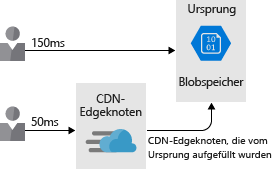

Die Netzwerkleistung kann erhebliche Auswirkungen auf die Benutzerfreundlichkeit haben.Network performance can have a dramatic impact on a user's experience. In komplexen Architekturen mit vielen verschiedenen Diensten kann die Minimierung der Wartezeit bzw. Latenz an den einzelnen Hops enorme Auswirkungen auf die Leistung insgesamt haben.In complex architectures with many different services, minimizing the latency at each hop can have a huge impact on the overall performance. In dieser Einheit wird die Bedeutung der Netzwerklatenz erläutert und erklärt, wie Sie diese in Ihrer Architektur reduzieren können.In this unit, we'll talk about the importance of network latency and how to reduce it within your architecture. Ferner wird beschrieben, wie bei Lamna Healthcare Strategien zur Minimierung der Netzwerklatenz zwischen den Azure-Ressourcen sowie zwischen den Benutzern und Azure eingeführt wurden.We'll also discuss how Lamna Healthcare adopted strategies to minimize network latency between their Azure resources as well as between their users and Azure.

## Die Bedeutung der NetzwerklatenzThe importance of network latency

Latenz ist ein Maß für die Verzögerung.Latency is a measure of delay. Die Netzwerklatenz ist die Zeit, die benötigt wird, um von einer Quelle über eine Netzwerkinfrastruktur an ein Ziel zu gelangen.Network latency is the time needed to get from a source to a destination across some network infrastructure. Dieser Zeitraum wird allgemein als Roundtripverzögerung bezeichnet oder als die erforderliche Zeit für die Route von der Quelle zum Ziel und wieder zurück.This time period is commonly known as a round-trip delay, or the time taken to get from the source to destination and back again.

In einer herkömmlichen Datencenterumgebung kann die Wartezeit minimal sein, da sich Ressourcen häufig am selben Standort befinden und eine gemeinsame Infrastruktur nutzen.In a traditional datacenter environment, latency may be minimal since resources often share the same location and a common set of infrastructure. Die Zeit von der Quelle zum Ziel ist kürzer, wenn der physische Abstand zwischen Ressourcen gering ist.The time taken to get from source to destination is lower when resources are physically close together.

Eine Cloudumgebung ist im Gegensatz dazu für Skalierung konzipiert.In comparison, a cloud environment is built for scale. In der Cloud gehostete Ressourcen befinden sich möglicherweise nicht im selben Rack oder im selben Datencenter oder nicht einmal in derselben Region.Cloud-hosted resources may not be in the same rack, datacenter, or even region. Dieses Konzept der Verteilung kann sich bei der Netzwerkkommunikation auf die Roundtripzeit auswirken.This distributed approach can have an impact on the round-trip time of your network communications. Zwar sind alle Azure-Regionen über ein schnelles Glasfaserbackbone miteinander verbunden, doch stellt die Lichtgeschwindigkeit nach wie vor eine physikalische Beschränkung dar.While all Azure regions are interconnected by a high-speed fiber backbone, the speed of light is still a physical limitation. Bei Aufrufen zwischen Diensten an unterschiedlichen physischen Standorten tritt nach wie vor eine Netzwerklatenz auf, die in direktem Zusammenhang mit dem Abstand zwischen den Diensten steht.Calls between services in different physical locations will still have network latency directly correlated to the distance between them.

Hinzu kommt, dass umso mehr Roundtrips benötigt werden, je aktiver eine Anwendung ist.On top of this, the chattier an application, the more round trips that are required. Jeder Roundtrip erzeugt eine Wartezeit und trägt somit zur Gesamtwartezeit bei.Each round trip comes with a latency tax, with each round trip adding to the overall latency. Die folgende Abbildung zeigt, dass es sich bei der vom Benutzer wahrgenommenen Wartezeit um die Kombination der Roundtrips handelt, die zum Verarbeiten der Anforderung erforderlich sind.The following illustration shows how the latency perceived by the user is the combination of the roundtrips required to service the request.

Betrachten wir nun, wie die Leistung zwischen den einzelnen Azure-Ressourcen und zwischen Endbenutzern und Azure-Ressourcen verbessert werden kann.Now let's take a look at how to improve performance between Azure resources and from your end users to your Azure resources.

## Latenz zwischen Azure-RessourcenLatency between Azure resources

Angenommen, Lamna Healthcare erprobt ein neues Patientenbuchungssystem, das auf mehreren Webservern und in einer Datenbank in der Azure-Region „Europa, Westen“ ausgeführt wird.Imagine that Lamna Healthcare is piloting a new patient booking system running on several web servers and a database in the West Europe Azure region. Bei dieser Architektur sind die Daten nur kurze Zeit unterwegs, da sich die Ressourcen innerhalb einer Region befinden.This architecture minimizes the data time on the wire as resources are co-located inside an Azure region.

Angenommen, der Pilottest verläuft gut und wird auf Benutzer in Australien ausgeweitet.Suppose that the pilot of the system went well and has been expanded to users in Australia. Für Benutzer in Australien macht sich die Roundtripzeit zu den Ressourcen in Westeuropa bemerkbar, wenn sie eine Website anzeigen möchten, und die Benutzerfreundlichkeit lässt aufgrund der Netzwerklatenz zu wünschen übrig.Users in Australia will incur the round-trip time to the resources in West Europe to view the website, and their end-user experience will be poor due to the network latency.

Das Lamna Healthcare-Team beschließt, eine weitere Front-End-Instanz in der Region „Australien, Osten“ zu hosten, um die Wartezeit für Benutzer zu verringern.The Lamna Healthcare team decide to host another front-end instance in the Australia East region to reduce user latency. Mit diesem Design wird zwar die Zeit verkürzt, die der Webserver benötigt, um Inhalte für Endbenutzer zurückzugeben, die Benutzerfreundlichkeit ist jedoch weiterhin unzureichend, da bei der Kommunikation zwischen den Front-End-Webservern in der Region „Australien, Osten“ und der Datenbank in der Region „Europa, Westen“ eine erhebliche Wartezeit auftritt.While this design helps reduce the time for the web server to return content to end users, their experience is still poor since there's significant latency communicating between the front-end web servers in Australia East and the database in West Europe.

Es gibt mehrere Möglichkeiten, wie wir die übrige Wartezeit verringern können:There are a few ways we could reduce the remaining latency:

- Erstellen eines Lesereplikats der Datenbank in der Region „Australien, Osten“.Create a read-replica of the database in Australia East. Dadurch funktionieren Lesevorgänge gut, bei Schreibvorgängen tritt jedoch nach wie vor eine Latenz auf.This would allow reads to perform well, but writes would still incur latency. Die Georeplikation einer Azure SQL-Datenbank ermöglicht Lesereplikate.Azure SQL Database geo-replication allows for read-replicas.
- Synchronisieren der Daten zwischen den einzelnen Regionen mit Azure SQL-Datensynchronisierung.Sync your data between regions with Azure SQL Data Sync.
- Verwenden einer global verteilten Datenbank wie Azure Cosmos DB.Use a globally distributed database such as Azure Cosmos DB. Dies würde es ermöglichen, dass sowohl Lese- als auch Schreibvorgänge unabhängig vom Standort stattfinden können, kann aber Änderungen an der Art und Weise erfordern, wie Ihre Anwendung Daten speichert und auf diese verweist.This would allow both reads and writes to occur regardless of location, but may require changes to the way your application stores and references data.
- Verwenden Sie Cachingtechnologien wie Azure Redis Cache, um Aufrufe mit hoher Latenzzeit zu Remotedatenbanken für häufig abgerufene Daten zu minimieren.Use caching technology such as Azure Redis Cache to minimize high-latency calls to remote databases for frequently accessed data.

Das Ziel hierbei ist es, die Netzwerklatenz zwischen den einzelnen Ebenen der Anwendung zu minimieren.The goal here is to minimize the network latency between each layer of the application. Wie diese Aufgabe gelöst wird, hängt von der Anwendung und der Datenarchitektur ab. Azure stellt jedoch Mechanismen zur Bewältigung dieser Aufgabe bei verschiedenen Diensten bereit.How this is solved depends on your application and data architecture, but Azure provides mechanisms to solve this on several services.

## Latenz zwischen Benutzern und Azure-RessourcenLatency between users and Azure resources

Bisher haben wir die Latenz zwischen den Azure-Ressourcen betrachtet. Wir sollten jedoch auch die Latenz zwischen Benutzern und der Cloudanwendung berücksichtigen.We've looked at the latency between our Azure resources, but we should also consider the latency between users and our cloud application. Ziel ist es, die Bereitstellung der Front-End-Benutzeroberfläche für die Benutzer zu optimieren.We're looking to optimize delivery of the front end-user interface to our users. Betrachten wir einige Möglichkeiten zur Verbesserung der Netzwerkleistung zwischen Endbenutzern und der Anwendung.Let's take a look at some ways to improve the network performance between end users and the application.

### Verwenden eines DNS-Lastenausgleichs zur Optimierung des EndpunktpfadsUse a DNS load balancer for endpoint path optimization

Bei dem Lamna Healthcare-Beispiel haben wir gesehen, dass das Team einen zusätzlichen Front-End-Webknoten in der Region „Australien, Osten“ erstellt hat.In the Lamna Healthcare example, we saw that the team created an additional web front-end node in Australia East. Endbenutzer müssen jedoch explizit angeben, welchen Front-End-Endpunkt sie verwenden möchten.However, end users have to explicitly specify which front-end endpoint they want to use. Als Entwickler einer Lösung möchte Lamna Healthcare das System für seine Benutzer so angenehm wie möglich gestalten.As the designer of a solution, Lamna Healthcare wants to make the experience as smooth as possible for their users.

Hier könnte Microsoft Azure Traffic Manager helfen.Azure Traffic Manager could help. Traffic Manager ist ein DNS-basierter Lastenausgleich, mit dessen Hilfe Sie Datenverkehr innerhalb und zwischen Azure-Regionen verteilen können.Traffic Manager is a DNS-based load balancer that enables you to distribute traffic within and across Azure regions. Benutzer müssen bei der Verwendung dieses Diensts nicht mehr zu einer bestimmten Instanz des Web-Front-Ends navigieren, sondern werden von Traffic Manager anhand einer Reihe von Merkmalen weitergeleitet:Rather than having the user browse to a specific instance of our web front end, Traffic Manager can route users based upon a set of characteristics:

- **Priorität**: Sie geben eine sortierte Liste von Front-End-Servern an.**Priority** - You specify an ordered list of front-end instances. Wenn der Server mit der höchsten Priorität nicht verfügbar ist, wird der Benutzer von Traffic Manager zur nächsten verfügbaren Instanz weitergeleitet.If the one with the highest priority is unavailable, Traffic Manager will route the user to the next available instance.
- **Gewichtet**: Sie legen für jede Front-End-Instanz eine Gewichtung fest.**Weighted** - You would set a weight against each front-end instance. Traffic Manager verteilt den Datenverkehr entsprechend diesen definierten Verhältnissen.Traffic Manager then distributes traffic according to those defined ratios.
- **Leistung**: Benutzer werden basierend auf der Netzwerklatenz von Traffic Manager an die nächstgelegene Front-End-Instanz weitergeleitet.**Performance** - Traffic Manager routes users to the closest front-end instance based on network latency.
- **Geografisch**: Sie können für Front-End-Bereitstellungen geografische Regionen einrichten und Benutzer basierend auf Datenhoheitsmandaten oder auf der Lokalisierung von Inhalten weiterleiten.**Geographic** - You could set up geographical regions for front-end deployments, routing your users based upon data sovereignty mandates or localization of content.

Traffic Manager-Profile können auch geschachtelt werden.Traffic Manager profiles can also be nested. Sie könnten Benutzer zunächst mit geografischem Routing durch verschiedene geografische Regionen (beispielsweise Europa und Australien) und anschließend mithilfe der leistungsorientierten Routingmethode an lokale Front-End-Bereitstellungen weiterleiten.You could first route your users across different geographies (for example, Europe and Australia) using geographic routing and then route them to local front-end deployments using the performance routing method.

Beachten Sie, dass Lamna Healthcare einen Web-Front-End in Westeuropa und Australien bereitgestellt hat.Consider that Lamna Healthcare has deployed a web front end in West Europe and Australia. Gehen wir davon aus, dass mit der primären Bereitstellung in „Europa, Westen“ eine Azure SQL-Datenbank und in „Australien, Osten“ ein Lesereplikat bereitgestellt wurde.Assume they have deployed Azure SQL Database with their primary deployment in West Europe, and a read replica in Australia East. Gehen wir ferner davon aus, dass die Anwendung für Leseabfragen eine Verbindung mit der lokalen SQL-Instanz herstellen kann.Let's also assume the application can connect to the local SQL instance for read queries.

Das Team stellt eine Traffic Manager-Instanz im Leistungsmodus bereit und fügt die beiden Front-End-Instanzen als Traffic Manager-Profile hinzu.The team deploy a Traffic Manager instance in performance mode and add the two front-end instances as Traffic Manager profiles. Als Endbenutzer navigieren Sie zu einem benutzerdefinierten Domänennamen (z. B. „lamnahealthcare.com“), und von dort aus werden Sie zu Traffic Manager weitergeleitet.As an end user, you navigate to a custom domain name (for example, lamnahealthcare.com) which routes to Traffic Manager. Traffic Manager gibt den DNS-Namen der Front-Ends in „Europa, Westen“ oder „Australien, Osten“ basierend auf der besten Netzwerklatenzleistung zurück.Traffic Manager then returns the DNS name of the West Europe or Australia East front end based on the best network latency performance.

Dabei ist zu beachten, dass dieser Lastenausgleich nur über DNS gesteuert wird und weder ein Inline-Lastenausgleich noch eine Zwischenspeicherung stattfindet. Traffic Manager gibt einfach den DNS-Namen des nächsten Front-Ends an den Benutzer zurück.It's important to note that this load balancing is only handled via DNS, there's no inline load balancing or caching that's happening here, Traffic Manager is simply returning the DNS name of the closest front end to the user.

### Verwenden von CDN zum Zwischenspeichern von Inhalten in der Nähe von BenutzernUse CDN to cache content close to users

Auf der Website wird wahrscheinlich irgendeine Art von statischem Inhalt verwendet (entweder ganze Seiten oder Objekte wie Bilder und Videos).The website will likely be using some form of static content (either whole pages or assets such as images and videos). Dieser Inhalt könnte Benutzern bei Verwendung eines Inhaltsübermittlungsnetzwerks (CDN, Content Delivery Network) wie Azure CDN schneller bereitgestellt werden.This content could be delivered to users faster by using a content delivery network (CDN) such as Azure CDN. 

Wenn Lamna Inhalte in Azure CDN bereitstellt, werden die jeweiligen Elemente auf mehrere Server weltweit kopiert.When Lamna deploys content to Azure CDN, those items are copied to multiple servers around the globe. Angenommen, eines dieser Elemente ist ein aus Blob-Speicher bereitgestelltes Video: `HowToCompleteYourBillingForms.MP4`.Let's say one of those items is a video served from blob storage: `HowToCompleteYourBillingForms.MP4`. Das Team konfiguriert die Website anschließend so, dass jeder Benutzerzugriff auf das Video nicht auf den Blob-Speicher verweist, sondern auf den nächstgelegenen CDN-Edgeserver.The team then configure the website so that each user's link to the video will actually reference the CDN edge server nearest them, rather than referencing blob storage. Bei diesem Ansatz befinden sich Inhalte näher am Ziel, wodurch die Wartezeit reduziert und die Benutzerfreundlichkeit verbessert wird.This approach puts content closer to the destination, reducing latency and improving user experience. Die folgende Abbildung zeigt, wie Inhalte durch die Verwendung von Azure CDN näher am Ziel platziert und dadurch die Wartezeit reduziert sowie die Benutzerfreundlichkeit verbessert werden.The following illustration shows how using Azure CDN puts content closer to the destination which reduces latency and improves the user experience.

Content Delivery Networks _können_ auch zum Hosten von zwischengespeicherten dynamischen Inhalten verwendet werden.Content delivery networks _can_ also be used to host cached dynamic content. Hier ist jedoch besondere Aufmerksamkeit gefordert, da zwischengespeicherte Inhalte im Vergleich zur Quelle veraltet sein können.Extra consideration is required, though, since cached content may be out of date compared with the source. Der Kontextablauf kann durch Festlegen einer Gültigkeitsdauer (Time To Live, TTL) gesteuert werden.Context expiration can be controlled by setting a time to live (TTL). Wenn für die Gültigkeitsdauer ein zu hoher Wert festgelegt wird, werden möglicherweise veraltete Inhalte angezeigt, und der Cache muss bereinigt werden.If the TTL is too high, out-of-date content may be displayed and the cache would need to be purged.

Eine Möglichkeit zur Verarbeitung zwischengespeicherter Inhalte ist die Funktion **Beschleunigung dynamischer Websites**, mit der die Leistung von Webseiten mit dynamischen Inhalten verbessert werden kann.One way to handle cached content is with a feature called **dynamic site acceleration**, which can increase performance of webpages with dynamic content. Mit der Funktion „Beschleunigung dynamischer Websites“ kann außerdem ein Pfad mit geringer Wartezeit zu weiteren Diensten in der Lösung (z. B. zu einem API-Endpunkt) bereitgestellt werden.Dynamic site acceleration can also provide a low-latency path to additional services in your solution (for example, an API endpoint).

### Verwenden von ExpressRoute für die Konnektivität zwischen lokalen Umgebungen und AzureUse ExpressRoute for connectivity from on-premises to Azure

Darüber hinaus sollte auch die Netzwerkkonnektivität zwischen der lokalen Umgebung und Azure optimiert werden.Optimizing network connectivity from your on-premises environment to Azure is also important. Für Benutzer, die eine Verbindung mit Anwendungen herstellen, die auf VMs oder in PaaS-Angeboten wie Azure App Service gehostet werden, sollten Sie eine optimale Verbindung mit Ihren Anwendungen sicherstellen.For users connecting to applications, whether they're hosted on virtual machines or on PaaS offerings like Azure App Service, you'll want to ensure they have the best connection to your applications. 

Sie können immer das öffentliche Internet verwenden, um Benutzer mit Ihren Diensten zu verbinden. Die Leistung des Internets kann jedoch schwanken und durch äußere Faktoren beeinträchtigt werden.You can always use the public internet to connect users to your services, but internet performance can vary and may be impacted by outside issues. Zudem werden Sie nicht all Ihre Dienste über das Internet verfügbar machen und eine private Verbindung mit Ihren Azure-Ressourcen nutzen wollen.On top of that, you may not want to expose all of your services over the internet, and you may want a private connection to your Azure resources.

Site-to-Site-VPN über das Internet ist ebenfalls eine Option. Bei Architekturen mit hohem Durchsatz kann sich die Wartezeit aufgrund des Mehraufwands durch das VPN und der Schwankungen bei der Internetverbindung jedoch erheblich erhöhen.Site-to-site VPN over the internet is also an option, but for high throughput architectures, VPN overhead and internet variability can increase latency noticeably.

Hier kann Azure ExpressRoute Abhilfe schaffen.Azure ExpressRoute can help. ExpressRoute ist eine private, dedizierte Verbindung zwischen Ihrem Netzwerk und Azure, die eine garantierte Leistung bietet und sicherstellt, dass Endbenutzer den besten Pfad zu all Ihren Azure-Ressourcen nutzen.ExpressRoute is a private, dedicated connection between your network and Azure, giving you guaranteed performance and ensuring that your end users have the best path to all of your Azure resources. Die folgende Abbildung zeigt, wie eine ExpressRoute-Verbindung Konnektivität zwischen lokalen Anwendungen und Azure-Ressourcen bereitstellt.The following illustration shows how ExpressRoute Circuit provides connectivity between on-premises applications and Azure resources.

Betrachten wir noch einmal das Lamna-Szenario. Bei Lamna wurde beschlossen, die Endbenutzererfahrung für Benutzer in den Einrichtungen des Unternehmens durch die Bereitstellung einer ExpressRoute-Verbindung in „Australien, Osten“ und „Europa, Westen“ weiter zu verbessern.Once again looking at Lamna's scenario, they decide to further improve end-user experience for users who are in their facilities by provisioning an ExpressRoute circuit in both Australia East and West Europe. So kann für die Endbenutzer eine direkte Verbindung mit dem Buchungssystem bereitgestellt und die geringstmögliche Wartezeit für die Anwendung sichergestellt werden.This gives their end users a direct connection to their booking system and ensures the lowest latency possible for their application.

Um Endbenutzern die bestmögliche Leistung gewährleisten zu können, muss bei der Architektur die Netzwerklatenz berücksichtigt werden.Considering the impact of network latency on your architecture is important to ensure the best possible performance for your end users. Vor diesem Hintergrund haben wir einige Möglichkeiten zur Verringerung der Netzwerklatenz zwischen Endbenutzern und Azure sowie zwischen den einzelnen Azure-Ressourcen betrachtet.We've taken a look at some options to lower network latency between end users and Azure and between Azure resources.