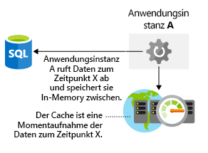

Es ist wichtig, Überlegungen zur Speicherleistung in Ihrer Architektur zu berücksichtigen. Genau wie die Netzwerklatenz kann eine schlechte Leistung auf Speicherebene die Endbenutzererfahrung beeinträchtigen. Wie können Sie Ihren Datenspeicher optimieren? Welche Aspekte müssen Sie berücksichtigen, um sicherzustellen, dass Sie in der Architektur keine Speicherengpässe verursachen? Hier sehen wir uns an, wie Sie die Speicherleistung in Ihrer Architektur optimieren können.

## Optimieren der Speicherleistung für virtuelle Computer

Zuerst untersuchen wir das Optimieren von Speicher für virtuelle Computer. Datenträgerspeicher spielt eine wichtige Rolle in Bezug auf die Leistung Ihrer virtuellen Computer, und die Wahl des richtigen Datenträgertyps für Ihre Anwendung ist eine wichtige Entscheidung.

Unterschiedliche Anwendungen haben unterschiedliche Speicheranforderungen. Ihre Anwendung reagiert möglicherweise empfindlich auf die Latenz von Lese- und Schreibvorgängen auf dem Datenträger, oder sie erfordert die Fähigkeit, eine große Anzahl von Eingabe-/Ausgabevorgänge pro Sekunde (IOPS) oder einen größeren Datenträger-Gesamtdurchsatz verarbeiten zu können.

Welchen Typ von Datenträger sollten Sie beim Erstellen einer IaaS-Workload verwenden? Es gibt vier Optionen:

- **Lokaler SSD-Speicher:** Jeder virtuelle Computer verfügt über einen temporären Datenträger, der auf lokalem SSD-Speicher basiert. Die Größe dieses Datenträgers hängt von der Größe des virtuellen Computers ab. Da dies ein lokaler SSD-Datenträger ist, ist die Leistung zwar hoch, bei einer Wartung oder erneuten Bereitstellung des virtuellen Computers gehen jedoch möglicherweise Daten verloren. Dieser Datenträger ist nur für die temporäre Speicherung von Daten geeignet, die Sie nicht dauerhaft benötigen. Dieser Datenträger eignet sich hervorragend für Auslagerungsdateien und beispielsweise für „tempdb“ in SQL Server. Für diesen Speicher fallen keine Gebühren an. Er ist in den Kosten für den virtuellen Computer enthalten.

- **HDD-Standardspeicher:** Dies ist ein Spindel-Datenträgerspeicher, und er ist möglicherweise gut geeignet, wenn inkonsistente Wartezeit oder ein geringerer Durchsatz keinen Einfluss auf Ihre Anwendung haben. Eine Dev/Test-Workload, für die keine garantierte Leistung benötigt wird, ist ein hervorragender Anwendungsfall für diesen Datenträgertyp.

- **SSD-Standardspeicher:** Dies ist ein SSD-gestützter Speicher mit der geringen Wartezeit von SSD, aber geringerem Durchsatz. Ein nicht für die Produktion verwendeter Webserver wäre ein guter Anwendungsfall für diesen Datenträgertyp.

- **Storage Premium-SSD:** Dieser SSD-gestützte Speicher eignet sich gut für Workloads in der Produktion, die höchste Zuverlässigkeit, konsistent niedrige Wartezeit oder hohen Durchsatz und hohe IOPS-Werte erfordern. Da diese Datenträger höhere Leistung und Zuverlässigkeit bieten, werden sie für alle Produktionsworkloads empfohlen.

Storage Premium kann nur virtuellen Computern bestimmter Größe angefügt werden. Größen für Storage Premium haben ein „s“ im Namen – etwa „D2**s**_v3“ oder „Standard_F2**s**_v2“. Jeder Art von virtuellem Computer (mit oder ohne „s“ im Namen) können HDD- oder SSD-Laufwerke als Standardspeicher angefügt werden.

Auf alle Datenträger können Stripingtechnologien (wie „Direkte Speicherplätze“ unter Windows oder „mdadm“ unter Linux) angewendet werden, um den Durchsatz und die IOPS-Werte zu erhöhen, indem die Datenträgeraktivität auf mehrere Datenträger verteilt wird. Über Datenträgerstriping können Sie die Leistung für Datenträger enorm steigern. Es wird häufig in Hochleistungs-Datenbanksystemen und anderen Systemen mit hohen Speicheranforderungen verwendet.

Wenn Sie auf die Workloads virtueller Computer angewiesen sind, müssen Sie die Leistungsanforderungen Ihrer Anwendung bewerten, um den zugrunde liegenden Speicher zu bestimmen, den Sie für Ihre virtuellen Computer bereitstellen müssen.

## Optimieren der Speicherleistung für Ihre Anwendung

Sie können unterschiedliche Speichertechnologien zum Verbessern der Leistung der RAW-Datenträger verwenden, Sie können aber auch die Leistung beim Zugriff auf Daten auf Anwendungsebene beeinflussen. Sehen wir uns einige dafür geeignete Möglichkeiten an.

### Caching

Eine gängige Methode zum Verbessern der Anwendungsleistung ist, eine Cachingebene zwischen Ihrer Anwendung und Ihrem Datenspeicher zu integrieren. Ein Cache speichert Daten in der Regel im Arbeitsspeicher und ermöglicht schnelles Abrufen. Bei diesen Daten kann es sich um häufig verwendete Daten, um Daten aus einer Datenbank oder um temporäre Daten wie etwa den Benutzerstatus handeln. Sie steuern, welche Art von Daten gespeichert wird, wie oft die Daten aktualisiert werden und wann sie ablaufen. Wenn Sie diesen Cache in der gleichen Region implementieren wie die Anwendung und die Datenbank, verringert sich die Gesamtwartezeit zwischen den beiden. Das Abrufen von Daten aus dem Cache ist fast immer schneller als das Abrufen der gleichen Daten aus einer Datenbank. Mit einer Cachingebene können Sie also die Gesamtleistung der Anwendung erheblich verbessern. In der folgenden Abbildung wird veranschaulicht, wie eine Anwendung Daten aus einer Datenbank abruft, sie in einem Cache speichert und den zwischengespeicherten Wert nach Bedarf verwendet.

Azure Redis Cache ist ein Cachedienst in Azure, mit dem im Arbeitsspeicher befindliche Daten gespeichert werden. Er basiert auf Open-Source-Redis Cache und ist ein vollständig verwaltetes Dienstangebot von Microsoft. Sie wählen die Leistungsstufe aus, die Sie benötigen, und konfigurieren Ihre Anwendung zur Verwendung des Diensts.

### Mehrsprachige Persistenz

Mehrsprachige Persistenz ist die Verwendung unterschiedlicher Datenspeichertechnologien, um Ihre Speicheranforderungen zu erfüllen.

Betrachten wir ein Beispiel aus dem E-Commerce-Bereich. Sie können Anwendungsressourcen in einem Blobspeicher, Produktbewertungen und Empfehlungen in einem NoSQL-Speicher und Benutzerprofil- bzw. Kontodaten in einer SQL-­Datenbank speichern. In der folgenden Abbildung wird veranschaulicht, wie eine Anwendung mehrere Datenspeichertechniken verwenden kann, um unterschiedliche Arten von Daten zu speichern.

Dies ist wichtig, da verschiedene Datenspeicher für bestimmte Anwendungsfälle vorgesehen oder aufgrund der Kosten besser geeignet sind. Der Zugriff auf in einer SQL-Datenbank gespeicherte Blobs kann beispielsweise teurer und langsamer sein als der direkte Zugriff über einen Blobspeicher.

Die Aufrechterhaltung der Datenkonsistenz über verteilte Datenspeicher hinweg kann eine erhebliche Herausforderung darstellen. Das Problem ist, dass Strategien, z.B. in Bezug auf das Serialisieren und Sperren, nur gut funktionieren, wenn für alle Anwendungsinstanzen derselbe Datenspeicher verwendet wird und die Anwendung so konzipiert ist, dass die Kurzlebigkeit der Sperren sichergestellt ist. Wenn Daten über unterschiedliche Datenspeicher hinweg partitioniert oder repliziert werden, kann das Sperren und Serialisieren des Datenzugriffs zur Wahrung der Konsistenz zu teurem Mehraufwand führen, aus dem sich Auswirkungen auf Durchsatz, Antwortzeit und Skalierbarkeit eines Systems ergeben. Aus diesem Grund werden die geänderten Daten in den meisten modernen verteilten Anwendungen nicht gesperrt, und für die Konsistenz wird ein eher entspannter Ansatz gewählt. Dies wird als „letztliche Konsistenz“ bezeichnet.

Letztliche Konsistenz bedeutet, dass Replikatdatenspeicher letztendlich konvergieren, wenn keine weiteren Schreibvorgänge auftreten. Wenn ein Schreibvorgang in einem der Datenspeicher vorgenommen wird, können Lesevorgänge aus einem anderen Datenspeicher zu geringfügig veralteten Daten führen. Letztliche Konsistenz ermöglicht eine höhere Skalierung, da die Wartezeit für Lese- und Schreibvorgänge gering ist. Es muss nicht überprüft werden, ob Informationen in allen Speichern konsistent sind.

## Lamna Healthcare-Beispiel

Das Patientenbuchungssystem von Lamna Healthcare wird in zwei Azure-Regionen gehostet: „Europa, Westen“ und „Australien, Osten“. Sie verwenden virtuelle Computer als Front-End-Knoten, um ihre Website bereitzustellen, und haben Azure SQL-Datenbank in „Europa, Westen“ als primäres und in „Australien, Osten“ als lesbares sekundäres Replikat bereitgestellt. Für ihre Front-End-Knoten ist kein hoher Datenträgerdurchsatz erforderlich, jedoch eine konsistente Wartezeit und Zuverlässigkeit für die Produktion. Dafür wird SSD Premium-gestützter Speicher verwendet.

Sie hosten eine lokale Azure Redis Cache-Instanz in jeder Azure-Region, um die allgemeinen Benutzeranforderungen und die Verfügbarkeit der Ärzte zu speichern. Caching wurde implementiert, um die Leistung der am häufigsten auftretenden Datenleseaktivitäten, die in der Anwendung ermittelt wurden, zu optimieren.

In diesem Artikel wurden einige Beispiele dazu behandelt, wie Sie die Speicherleistung in Ihrer Infrastrukturebene durch die Wahl der richtigen Datenträgerarchitektur und auf Anwendungsebene durch die Verwendung von Caching und die Wahl der richtigen Datenplattform für Ihre Daten verbessern können. Durch eine Lösung mit geeigneter Architektur wird sichergestellt, dass die Leistung beim Zugriff auf Daten möglichst hoch ist.