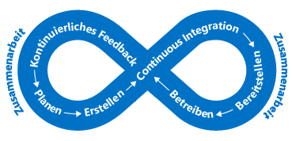
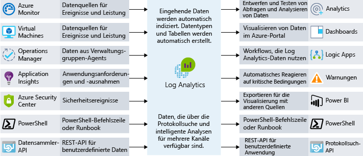

Endbenutzer erwarten mehr von ihren Anwendungen.End users are expecting more from their applications. Sie erwarten eine besonders hohe Benutzerfreundlichkeit und möchten nicht durch Leistungsprobleme beeinträchtigt werden.They want to have a great user experience and not be impacted by performance issues. Wie lässt sich die Erkennung von Leistungsengpässen in Ihre Architektur integrieren?How do you integrate performance bottleneck identification into your architecture? In dieser Einheit betrachten wir Prozesse und Tools, mit deren Hilfe Sie eine optimale Leistung Ihrer Anwendung sicherstellen und bei Bedarf die Ursache einer Leistungsbeeinträchtigung ermitteln können.In this unit, we will look at both processes and tools that can help ensure that your application performs well, and help you track down why if it doesn't.

## Die Bedeutung von AnforderungenImportance of requirements

Bevor wir uns über die Leistung unterhalten, sollten wir über Anforderungen sprechen.Before we talk about performance, it's important to talk about requirements. Theoretisch könnten wir Skalierbarkeit und Leistung ohne Ende immer weiter verbessern.In theory, we could keep improving scalability and performance further and further without end. Ab einem bestimmten Punkt wird die Verbesserung jedoch unbezahlbar, schwierig und wirkt sich nicht mehr genügend auf den Geschäftsbetrieb aus.At some point, however, more improvement is prohibitively expensive, difficult, and doesn't have enough business impact to be worthwhile. 

Unsere **nicht funktionsbezogenen Anforderungen** helfen uns dabei, diesen Punkt zu finden.Our **non-functional requirements** help us find that point. Diese speziellen Anforderungen sagen nichts darüber aus, was unsere App *tun* muss.These particular requirements don't tell us what our app must *do*. Vielmehr geben sie Aufschluss darüber, welche Qualitätsstufen unsere App erreichen muss.Instead, they tell us what quality levels it must meet. Diese nicht funktionsbezogenen Anforderungen können beispielsweise für folgende Angaben definiert werden:As examples, we can define these non-functional requirements to tell us:

- Geschwindigkeit, mit der eine Transaktion unter einer gegebenen Last Ergebnisse zurückgeben muss.How fast a transaction must return under a given load.
- Anzahl gleichzeitiger Verbindungen, die wir unterstützen müssen, bevor ein Fehler zurückgegeben wird.How many simultaneous connections we need to support before we start returning errors.
- Maximale Zeitdauer, für die unsere Anwendung bei einem Serverfehler nicht verfügbar sein darf, bevor eine Sicherung online geschaltet wird.In the event of server failure, what is the maximum amount of time our application is allowed be down before a back-up is online.

Es ist wichtig, diese Anforderungen vor dem Erstellen einer Lösung zu definieren, um sicherzustellen, dass die Anwendung die Erwartungen erfüllt, jedoch keinen größeren Aufwand erfordert oder mehr Geld kostet als nötig.Defining these requirements in advance of building your solution is critical to ensure that the application meets expectations but doesn't require more effort or expend more money than necessary. Wir können auch unsere Überwachungs- und Betriebsregeln unter Einbeziehung dieser nicht funktionsbezogenen Anforderungen planen.We can also plan our monitoring and operations rules around these non-functional requirements. 

Besprechen Sie Anforderungen mit Ihren Projektbeteiligten oder Kunden, dokumentieren Sie sie, und machen Sie sie allgemein bekannt, um sicherzustellen, dass alle wissen, was mit „guter Leistung“ gemeint ist.Discuss requirements with your stakeholders or customers, document them, and communicate them broadly to ensure that everyone agrees on what "good performance" means.

## DevOps und AnwendungsleistungDevOps and application performance

Hinter DevOps verbirgt sich die Vorstellung, dass wir keine Entwicklungs- und Infrastruktursilos in unserer Organisation haben.The idea behind DevOps is that we don't have development and infrastructure silos in our organization. Vielmehr findet eine Zusammenarbeit statt, um Apps in einem optimierten Prozess effektiv zu erstellen, bereitzustellen, zu überwachen und zu verwalten.Instead, they work together to effectively build, deploy, monitor, and maintain apps in streamlined process.

Planung, Entwicklung, Tests und Überwachung werden in einem iterativen Ansatz durchgeführt.The planning, development, testing, and monitoring is carried out in an iterative approach. Die Leistung und Qualität unserer Anwendung werden Teil unseres Softwareentwicklungs-Lebenszyklus und sind nicht mehr nur ein Nebenaspekt bei der Bereitstellung in einer Liveumgebung.Performance and quality of our application become a part of our software development life cycle, rather than an afterthought as we deploy into a live environment. In der folgenden Abbildung werden Gelegenheiten für die Zusammenarbeit im Softwareentwicklungs-Lebenszyklus dargestellt.The following illustration shows where opportunities for collaboration exist in the software development lifecycle.

Dieser Ansatz entspricht dem DevOps-Konzept der sogenannten Linksverschiebung.This approach aligns with a DevOps concept called "shifting left". Dieser besagt, dass die Qualitätslenkungsprüfungen früher im Bereitstellungs- und Freigabeprozess erfolgen müssen.In other words, bring your quality control checks earlier into your deployment and release process. Dadurch können Sie Probleme, die sich auf den Endbenutzer auswirken, früher im Prozess auffangen.This allows you to catch end-user impacting issues earlier in the process. Da wir in einem fortlaufenden Zyklus arbeiten, begrenzen wir die Anzahl manueller Eingriffe und automatisieren so viel wie möglich.As we operate in a continuous cycle, we limit the amount of manual interaction and automate as much as possible. 

Eine Möglichkeit, wie wir die Leistung zu einem Teil unseres DevOps-Prozesses machen können, besteht darin, vor der Bereitstellung in einer Produktionsumgebung Leistungs- oder Auslastungstests durchzuführen, um zu prüfen, ob die Anwendung den nicht funktionsbezogenen Anforderungen entspricht.One way we make performance part of our DevOps process is to carry out performance or load tests to validate that the application meets the non-functional requirements prior to a deployment into production.

Im Idealfall können wir Leistungs- und Auslastungstests in einer Umgebung durchführen, die exakt der Produktionsumgebung entspricht, jedoch keine Auswirkungen auf die eigentlichen Produktionsserver hat.Ideally, we could carry out performance and load tests in an environment that is exactly like production while not impacting our actual production servers. Wenn Sie die Cloud nutzen, haben Sie genau diese Möglichkeit.When leveraging the cloud, you fully have this ability. Sie können die Erstellung einer mit der Produktionsumgebung vergleichbaren Umgebung automatisieren, Tests durchführen und anschließend die Umgebung zerstören, um Kosten zu sparen.You can automate the creation of a production-like environment, perform testing, and then destroy the environment to minimize cost. Mit diesem Automatisierungsansatz können Sie dafür sorgen, dass Ihre Anwendung nicht nur Ihren aktuellen Anforderungen gewachsen, sondern auch für zukünftiges Wachstum gerüstet ist.This approach to automation can provide reassurance that your application can handle the scale you require now, as well as respond to future growth.

Die Überwachung der Anwendungsleistung wird zum zentralen Teil dieses Ansatzes.Application performance monitoring becomes a core part of this. Wenn wir Leistungs- und Auslastungstests für unsere Anwendung durchführen oder unsere Produktionsleistung unter Kontrolle halten möchten, müssen wir wissen, welche Teile unserer Anwendung möglicherweise nicht optimal funktionieren.If we're running performance and load tests on our application or want to keep our production performance in check, we want to understand what parts of our application may be performing non-optimally. Betrachten wir nun einige Möglichkeiten, die uns hierzu zur Verfügung stehen.Let's take a look at some ways to do this.

## Möglichkeiten für die Leistungsüberwachung in AzurePerformance monitoring options in Azure

Überwachung ist das Erfassen und Analysieren von Daten, um die Leistung, Integrität und Verfügbarkeit Ihrer Geschäftsanwendung und der jeweiligen Ressourcen zu bestimmen.Monitoring is the act of collecting and analyzing data to determine the performance, health, and availability of your business application and associated resources.

Wir möchten darüber informiert werden, ob unsere Anwendung reibungslos ausgeführt wird.We want to be kept informed that our application is running smoothly. Proaktive Benachrichtigungen können verwendet werden, um über kritische Probleme zu informieren, die auftreten können.Proactive notifications can be used to inform about critical issues that arise. Es gibt viele Überwachungsebenen, die berücksichtigt werden müssen, in erster Linie die Infrastrukturebene und die Anwendungsebene.There are many layers of monitoring to consider, mainly the infrastructure layer and the application layer.

### Azure MonitorAzure Monitor

Azure Monitor stellt einen zentralen Verwaltungspunkt für Protokolle auf Infrastrukturebene sowie für die Überwachung der meisten Ihrer Azure-Dienste bereit.Azure Monitor provides a single management point for infrastructure-level logs and monitoring for most of your Azure services. Die Lösung erfasst Metriken, Aktivitäts- und Diagnoseprotokolle und vieles mehr.It collects metrics, activity logs, and diagnostic logs and more. Azure Monitor bietet eine Reihe von Features. Dazu zählen unter anderem folgende:Azure Monitor provides us with a range of features including:

- Azure-Warnungen, um proaktiv über Verstöße gegen Metriken oder Aktivitäten zu informieren oder entsprechende Maßnahmen zu ergreifenAzure alerts to proactively notify or take action on any breaches to metrics or activities arising.
- Verwendung von Azure-Dashboards, um verschiedene Überwachungsquellen in einer zentralen Ansicht der Anwendung zu vereinenUse Azure Dashboards to combine many monitoring sources into one view of our application.

Azure Monitor ist der Ausgangspunkt für sämtliche Einblicke in Ressourcenmetriken nahezu in Echtzeit.Azure Monitor is the place to start for all your near real-time resource metric insights. Viele Azure-Ressourcen beginnen nach der Bereitstellung automatisch mit der Ausgabe von Metriken.Many Azure resources will start outputting metrics automatically once deployed. Azure-Web-App-Instanzen geben beispielsweise Metriken für Compute- und Anwendungsanforderungen aus.For example, Azure Web App instances will output compute and application request metrics. Neben VM-Host-Diagnosemetriken werden hier auch Metriken aus Application Insights sortiert.Metrics from Application Insights are also collated here in addition to VM host diagnostic metrics. Und auch VM-Gast-Diagnosemetriken werden angezeigt, nachdem Sie sich angemeldet haben.VM guest diagnostic metrics will also appear once you opt in.

### Log AnalyticsLog Analytics

Mithilfe der zentralen Protokollierung können Sie versteckte Probleme aufdecken, die möglicherweise schwierig aufzuspüren sind.Centralized logging can help you uncover hidden issues that may be difficult to track down. Mit Log Analytics können Sie Daten protokollübergreifend abfragen und aggregieren.With Log Analytics you can query and aggregate data across logs. Dank dieser quellenübergreifenden Korrelation können Sie Probleme oder Leistungsengpässe erkennen, die bei Betrachtung einzelner Protokolle oder Metriken möglicherweise nicht offensichtlich sind.This cross-source correlation can help you identify issues or performance problems that may not be evident when looking at logs or metrics individually. In der folgenden Abbildung wird veranschaulicht, wie Log Analytics als zentraler Hub für die Datenüberwachung fungiert.The following illustration shows how Log Analytics acts as a central hub for monitoring data. Log Analytics empfängt Überwachungsdaten von Ihren Azure-Ressourcen und stellt sie Consumern zur Analyse oder Visualisierung zur Verfügung.Log Analytics receives monitoring data from your Azure resources and makes it available to consumers for analysis or visualization.

Sie können eine Vielzahl von Datenquellen, Sicherheitsprotokollen, Azure-Aktivitätsprotokollen, Servern, Netzwerken und Anwendungsprotokollen sortieren.You can collate a wide range of data sources, security logs, Azure activity logs, server, network, and application logs. Ferner können Sie in Hybridbereitstellungsszenarien lokale System Center Operations Manager-Daten an Log Analytics pushen und dafür sorgen, dass Azure SQL-Datenbank Diagnoseinformationen zur detaillierten Leistungsüberwachung direkt an Log Analytics sendet.You can also push on-premises System Center Operations Manager data to Log Analytics in hybrid deployment scenarios and have Azure SQL Database send diagnostic information directly into Log Analytics for detailed performance monitoring.

Die zentralisierte Protokollierung kann für die Problembehandlung bei allen Arten von Szenarios, auch bei Leistungsproblemen, extrem vorteilhaft sein.Centralized logging can be massively beneficial for troubleshooting all types of scenarios, including performance issues. Sie ist ein wichtiger Bestandteil einer guten Überwachungsstrategie für jede Architektur.It's a key part of a good monitoring strategy for any architecture.

## Steuerung der AnwendungsleistungApplication performance management

Tiefliegende Anwendungsprobleme sind oft schwierig aufzuspüren.Deep application issues are often tricky to track down. Hier kann die Integration von Telemetrie in eine Anwendung mithilfe einer APM-Lösung (Application Performance Management, Steuerung der Anwendungsleistung) zum Aufspüren schlechter Anwendungsleistung und ungünstigem Anwendungsverhalten vorteilhaft sein.This is where integrating telemetry into an application by using an application performance management solution (APM) to track down low-level application performance and behavior can be beneficial. Diese Telemetriedaten können einzelne Seitenanforderungszeiten, Ausnahmen in Ihrer Anwendung und sogar benutzerdefinierte Metriken zur Überwachung von Geschäftslogiken enthalten.This telemetry can include individual page request times, exceptions within your application, and even custom metrics to track business logic. Ferner können diese Telemetriedaten eine Fülle von Einblicken in die Abläufe in Ihrer Anwendung bieten.This telemetry can provide a wealth of insight into what is going on within your application.

Bei Azure ist Application Insights ein Dienst, der diese ausführliche Steuerung der Anwendungsleistung ermöglicht.On Azure, Application Insights is a service that provides this deep application performance management. Sie installieren ein kleines Instrumentierungspaket in Ihrer Anwendung und richten eine Application Insights-Ressource im Microsoft Azure-Portal ein.You install a small instrumentation package in your application, and set up an Application Insights resource in the Microsoft Azure portal. Die Instrumentierung überwacht Ihre App und sendet Telemetriedaten an das Portal.The instrumentation monitors your app and sends telemetry data to the portal.

Telemetriedaten aus Hostumgebungen (etwa Leistungsindikatoren, Azure-Diagnosen und Docker-Protokolle) können erfasst werden.Telemetry from the host environments, such as performance counters, Azure diagnostics, and Docker logs, can be ingested. Sie können auch Webtests einrichten, die in regelmäßigen Abständen synthetische Anforderungen an den Webdienst senden.You can also set up web tests that periodically send synthetic requests to your web service. Sie können Ihre Anwendung sogar so konfigurieren, dass benutzerdefinierte Ereignisse und Metriken gesendet werden, die Sie selbst in den Client- oder Servercode schreiben.You could even configure your application to send custom events and metrics that you write yourself in the client or server code. Beispielsweise anwendungsspezifische Ereignisse wie verkaufte Artikel oder gewonnene Spiele.For example, application-specific events such as items sold or games won.

Application Insights speichert die eigenen Daten in einem gemeinsamen Repository, und Metriken werden für Azure Monitor freigegeben.Application Insights stores its data in a common repository, and metrics are shared with Azure Monitor. Sie können gemeinsame Funktionen wie Warnungen, Dashboards und umfassende Analysen mit der Log Analytics-Abfragesprache nutzen.It can take advantage of shared functionality such as alerts, dashboards, and deep analysis with the Log Analytics query language.

Das Muster für die Überwachung der Integrität von Endpunkten ist eine gängige Lösung für die Ermittlung der Verfügbarkeit einer Webanwendung.A common pattern used in determining the availability of a web application is the health endpoint monitoring pattern. Es wird zur Überwachung von Webanwendungen und entsprechenden Back-End-Diensten verwendet, um sicherzustellen, dass sie verfügbar sind und einwandfrei funktionieren.This pattern is used to monitor web applications and associated back-end services, to ensure that they're available and performing correctly. Das Muster wird durch Abfragen eines bestimmten URI implementiert.The pattern is implemented by querying a particular uri. Der Endpunkt überprüft nicht nur die Verfügbarkeit des Front-Ends, sondern auch den Status zahlreicher Komponenten (einschließlich der Back-End-Dienste, von denen die App abhängig ist).The endpoint checks on the status of many components, including the back-end services that the app depends on, rather than just the availability of the front end itself. Dies dient als Integritätsprüfung auf Dienstebene und gibt Aufschluss über die allgemeine Integrität des Diensts.This acts as a service-level health check that returns an indication of the overall health of the service.

Verwenden Sie eine APM-Lösung wie Application Insights, um ausführliche Informationen zu Ihrer Anwendung zu erhalten und Aktivitäten in der gesamten Anwendung zu korrelieren.Use an APM solution such as Application Insights to gain a deep understanding of your application and correlate activity across your application. Diese Lösung kann dabei hilfreich sein, die Funktionsweise einer bestimmten Aktion im Clientbrowser, auf dem Server und in den Downstreamdiensten nachzuvollziehen.This can help you understand how a specific action works in the client browser, on the server, and through to downstream services. Darüber hinaus liefert sie Informationen zu Trends, stellt bei Problemen Benachrichtigungen bereit und hilft beim Aufspüren und Beheben des Problems, bevor Benutzer es bemerken.It will also provide insight into trends, provide notifications when there is a problem, and help identify where the problem is and how to fix it, before your users are aware.

## Leistungsüberwachung bei Lamna HealthcarePerformance monitoring at Lamna Healthcare

Bei Lamna Healthcare wurde ein webbasiertes Patientenbuchungssystem mit virtuellen Computern und einer Azure SQL-Datenbank in zwei Azure-Regionen implementiert.Lamna Healthcare has implemented a web-based patient booking system using virtual machines and an Azure SQL database across two Azure regions. Es wurde entschieden, zur Überwachung der Leistung der zugrunde liegenden virtuellen Front-End-Computer den VM-Agent und Log Analytics zu verwenden.They've decided to use the VM Agent and Log Analytics to monitor the performance of the underlying front-end virtual machines.

Azure Monitor wird verwendet, um Informationen zur Leistung der Azure SQL-Datenbanken abzurufen und wichtige Leistungsmetriken wie prozentuale CPU-Auslastung und Deadlocks zu erfassen.They use Azure Monitor to understand the performance of their Azure SQL databases and capture key performance metrics including CPU % and deadlocks.

Application Insights wurde so konfiguriert, dass Informationen zur Verfügbarkeit und Telemetrie erfasst werden.Application Insights has been configured to capture availability and telemetry information. Das Team hat die neue Buchungsfunktion so geändert, dass benutzerdefinierte Telemetriedaten an Application Insights gesendet werden.The team has changed their new booking functionality to send custom event telemetry to Application Insights. So verfügt das Team nun über ein Konzept zur Ermittlung von Informationen zum Umfang geschäftlicher Ereignisse und erhält damit bessere Einblicke in die Abläufe der eigenen Anwendung.The team now has an approach to understanding the volume of business-related events taking place, and they can get much better insight into what's going on within their application.

Wir haben einige Prozesse, Tools und bewährte Methoden zum Aufspüren von Leistungsproblemen sowie zum Sicherstellen einer optimalen Funktionsweise Ihrer Anwendung betrachtet.We've looked at some processes, tools, and best practices to help you track down performance issues and ensure that your application is performing at its best.