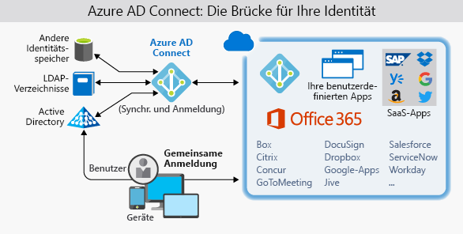
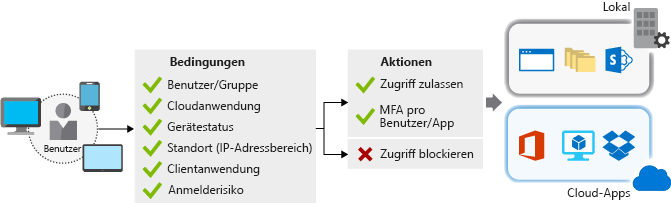

Lamna Healthcare hostet eine ältere interne Anwendung und ein Webportal für Ärzte zur Verwaltung von Patientendaten.Lamna Healthcare hosts a legacy internal application and web portal for its clinicians to manage patient health data. Die Organisation hat viele Anfragen erhalten, diese Anwendung Pflegekräften zur Verfügung zu stellen, die sich oft vor Ort bei Patienten und somit außerhalb des Netzwerks befinden.The organization has received many requests for this application to be available to caregivers who are often on-site with patients and therefore outside of the network. 

Aufgrund eines kürzlich durch schädliche Agents verursachten Datenverlusts hat das Unternehmen die Kennwortrichtlinien verschärft.A recent data leak by malicious agents has forced the company to tighten its password policies. Benutzer müssen nun ihre Kennwörter häufiger ändern und längere, komplexere Kennwörter verwenden.They are now requiring users to change their passwords more frequently and use longer, more complex passwords. Dies hat den unerwünschten Nebeneffekt, dass Benutzer Schwierigkeiten haben, komplexe Kennwörter aufzubewahren, die mehrere Sätze Anmeldeinformationen enthalten, die für verschiedene Administratorrollen erstellt wurden.This has led to the unwanted side-effect of users recording complex passwords insecurely as they struggle to remember multiple sets of credentials created for different administrative roles. 

In dieser Einheit werden die Identität als Sicherheitsebene für interne und externe Anwendungen, die Vorteile des einmaligen Anmeldens (Single Sign-On, SSO) und der mehrstufigen Authentifizierung (MFA) zur Gewährleistung der Identitätssicherheit sowie die Gründe für die Replikation lokaler Identitäten in Azure Active Directory behandelt.Here, we'll discuss identity as a security layer for internal and external applications, the benefits of single sign-on (SSO) and multi-factor authentication (MFA) to provide identity security, and why to consider replicating on-premises identities to Azure Active Directory.

## Identität als SicherheitsebeneIdentity as a layer of security

Digitale Identitäten sind ein integraler Bestandteil der heutigen geschäftlichen und sozialen Interaktionen vor Ort und online.Digital identities are an integral part of today's business and social interactions on-premises and online. In der Vergangenheit beschränkten sich Identitäts- und Zugriffsdienste auf das interne Netzwerk eines Unternehmens unter Verwendung von Protokollen wie Kerberos und LDAP, die für diesen Zweck entwickelt wurden.In the past, identity and access services were restricted to operating within a company's internal network, using protocols such as Kerberos and LDAP that were designed for this purpose. In jüngster Zeit sind mobile Geräte zur wichtigsten Form der Interaktion mit digitalen Diensten geworden.More recently, mobile devices have become the primary way people interact with digital services. Kunden und Mitarbeiter erwarten, dass sie jederzeit und von überall auf Dienste zugreifen können. Dies hat die Entwicklung von Identitätsprotokollen vorangetrieben, die im Internet über mehrere verschiedene Geräte und Betriebssysteme hinweg ausgeführt werden können.Customers and employees alike expect to be able to access services from anywhere at any time, which has driven the development of identity protocols that can work at internet scale across many disparate devices and operating systems.

Während die Fähigkeiten der Architektur rund um die Identität bewertet werden, prüft Lamna Healthcare, wie die folgenden Funktionen in Anwendungen integriert werden können:As they evaluate the capabilities their architecture has around identity, Lamna Healthcare is looking at ways they can bring the following capabilities into their application:

- Bereitstellen des einmaligen Anmeldens für AnwendungsbenutzerProvide single-sign on to application users
- Verbessern der älteren Anwendung, um moderne Authentifizierung mit minimalem Aufwand zu nutzenEnhance the legacy application to use modern authentication with minimal effort
- Erzwingen der mehrstufigen Authentifizierung für alle Anmeldungen außerhalb des UnternehmensnetzwerksEnforce multi-factor authentication for all logins outside the company's network
- Entwickeln einer Anwendung, mit der Patienten ihre Kontodaten registrieren und sicher verwalten könnenDevelop an application to allow patients to enroll and securely manage their account data

## Einmaliges AnmeldenSingle sign-on

Je mehr Identitäten ein Benutzer verwalten muss, desto größer ist das Risiko eines Sicherheitsincidents in Zusammenhang mit Anmeldeinformationen.The more identities a user has to manage, the greater the risk of a credential-related security incident. Mehrere Identitäten implizieren mehrere Kennwörter, die verwaltet und geändert werden müssen.More identities mean more passwords to remember and change. Kennwortrichtlinien können zwischen den Anwendungen variieren, und da die erforderliche Kennwortkomplexität zunimmt, wird es für Benutzer immer schwieriger, sich an diese zu erinnern.Password policies can vary between applications, and as complexity requirements increase, it makes it more difficult for users to remember them.

Außerdem ist die Verwaltung all dieser Identitäten erforderlich.On the other side is the management required for all those identities. Helpdesks werden beim Bearbeiten von Kontosperrungen und Kennwortzurücksetzungen zusätzlich belastet.Additional strain is placed on help desks as they deal with account lockouts and password reset requests. Wenn ein Benutzer ein Unternehmen verlässt, kann es zudem schwierig sein, alle seine Identitäten zu finden und zu deaktivieren.If a user leaves an organization, tracking down all those identities and ensuring they are disabled can be challenging. Falls eine Identität übersehen wird, könnte der Benutzer weiterhin unerwünschten Zugriff erhalten.If an identity is overlooked, this could allow access when it should have been eliminated.

Einmaliges Anmelden erfordert nur eine Identität und nur ein Kennwort.With single sign-on, users only need to remember one ID and one password. Der anwendungsübergreifende Zugriff wird einer einzigen, benutzerspezifischen Identität gewährt, wodurch das Sicherheitsmodell vereinfacht wird.Access across applications is granted to a single identity tied to a user, simplifying the security model. Wenn Benutzer die Rolle wechseln oder ein Unternehmen verlassen, sind Zugriffsänderungen an die einzelne Identität gebunden. So wird der Aufwand für das Ändern oder Deaktivieren von Konten erheblich reduziert.As users change roles or leave an organization, access modifications are tied to the single identity, greatly reducing the effort needed to change or disable accounts. Das einmalige Anmelden für Konten erleichtert Benutzern die Verwaltung ihrer Identitäten und erhöht die Sicherheitsfunktionen in Ihrer Umgebung.Using single sign-on for accounts will make it easier for users to manage their identities, and will increase the security capabilities in your environment.

### Einmaliges Anmelden mit Azure Active DirectorySSO with Azure Active Directory

Azure Active Directory (AAD) ist ein cloudbasierter Identitätsdienst.Azure Active Directory (AD) is a cloud-based identity service. Er verfügt über eine integrierte Unterstützung für die Synchronisierung mit Ihrem vorhandenen lokalen Active Directory-Verzeichnis oder kann einzeln verwendet werden.It has built-in support for synchronizing with your existing on-premises Active Directory or can be used stand-alone. Das bedeutet, dass alle Ihre Anwendungen – ob lokal, in der Cloud (einschließlich Office 365) oder mobil – dieselben Anmeldeinformationen verwenden können.This means that all your applications, whether on-premises, in the cloud (including Office 365), or even mobile can share the same credentials. Administratoren und Entwickler können den Zugriff auf Daten und Anwendungen mithilfe zentralisierter Regeln und Richtlinien steuern, die in Azure AD konfiguriert sind.Administrators and developers can control access to data and applications using centralized rules and policies configured in Azure AD.

Durch die Nutzung von Azure AD für das einmalige Anmelden können Sie auch mehrere Datenquellen in Intelligent Security Graph kombinieren.By leveraging Azure AD for SSO you'll also have the ability to combine multiple data sources into an intelligent security graph. Intelligent Security Graph ermöglicht es, Bedrohungsanalysen und Echtzeit-Identitätsschutz für alle Konten in Azure AD bereitzustellen, einschließlich der mit der lokalen AD-Instanz synchronisierten Konten.This security graph enables the ability to provide threat analysis and real-time identity protection to all accounts in Azure AD, including accounts that are synchronized from your on-premises AD. Durch die Verwendung eines zentralen Identitätsanbieters können Sie die Sicherheitskontrollen, die Berichterstellung, die Benachrichtigungen und die Verwaltung Ihrer Identitätsinfrastruktur zentralisieren.By using a centralized identity provider, you'll have centralized the security controls, reporting, alerting, and administration of your identity infrastructure.

### Synchronisieren von Verzeichnissen mit AD ConnectSynchronize directories with AD Connect

Azure AD Connect integriert Ihre lokalen Verzeichnisse in Azure Active Directory.Azure AD Connect will integrate your on-premises directories with Azure Active Directory. Azure AD Connect bietet die neuesten Funktionen und ersetzt ältere Versionen von Identitätsintegrationstools wie DirSync und Azure AD Sync.Azure AD Connect provides the newest capabilities and replaces older versions of identity integration tools such as DirSync and Azure AD Sync.

Es handelt sich um ein zentrales Tool, das Synchronisierung und Anmeldung vereinfacht.It's a single tool to provide an easy deployment experience for synchronization and sign in.

Lamna Healthcare erfordert die Authentifizierung primär mit lokalen Domänencontrollern (DC) und eine Cloudauthentifizierung in einem Notfallwiederherstellungsszenario.Lamna Healthcare requires that authentication occurs primarily against on-premises DCs, but also requires cloud authentication in a disaster recovery scenario. Es gibt keine Anforderungen, die nicht von Azure AD unterstützt werden.They don't have any requirements not already supported by Azure AD.

Lamna Healthcare hat sich entschieden, mit der folgenden Konfiguration fortzufahren:Lamna Healthcare has made the decision to move forward with the following configuration:

- Verwenden von Azure AD Connect, um Gruppen, Benutzerkonten und Kennworthashes aus dem lokalen Active Directory-Verzeichnis mit Azure AD zu synchronisierenUse Azure AD Connect to synchronize groups, user accounts, and password hashes stored in their on-premises Active Directory to Azure AD
  - Dies kann der Sicherung dienen, wenn die Passthrough-Authentifizierung nicht verfügbar ist.This can be used as a backup if pass-through authentication is unavailable
- Konfigurieren der Passthrough-Authentifizierung mit einem lokalen Authentifizierungs-Agent (auf einem lokalen Windows Server)Configure pass-through authentication using an on-premises authentication agent installed on an on-premises Windows Server
- Einmaliges Anmelden mit der nahtlos integrierten Azure AD-Funktion, um Benutzer von lokalen PCs, die in Domänen eingebunden sind, automatisch anzumelden.Use the seamless single sign-on feature of Azure AD to automatically sign in users from on-premises domain-joined PCs
  - Reibungslose Benutzeranmeldung durch Unterdrückung mehrerer Authentifizierungsanforderungen.Reduces user friction by suppressing multiple authentication requests

## Authentifizierung und ZugriffAuthentication & access

Die Sicherheitsrichtlinie von Lamna Healthcare verlangt, dass alle Anmeldungen, die außerhalb des Umkreisnetzwerks des Unternehmens erfolgen, mit einer zusätzlichen Authentifizierungsstufe authentifiziert werden.Lamna Healthcare's security policy requires that all logins occurring outside the company's perimeter network are authenticated with an additional factor of authentication. Diese Anforderung vereint zwei Aspekte von Azure AD: die mehrstufige Authentifizierung und Richtlinien für bedingten Zugriff.This requirement combines two aspects of the Azure AD service: multi-factor authentication and conditional access policies.

### Mehrstufige AuthentifizierungMulti-factor authentication

Multi-Factor Authentication (MFA) bietet zusätzliche Sicherheit für Identitäten, indem mindestens zwei Methoden für eine vollständige Authentifizierung benötigt werden.Multi-factor authentication (MFA) provides additional security for your identities by requiring two or more elements for full authentication. Diese Methoden umfassen drei Kategorien:These elements fall into three categories:

- *Authentifizierung mit einem Kennwort**something you know*
- *Authentifizierung mit einem Gerät**something you possess*
- *Authentifizierung mit persönlichen Merkmalen**something you are*

Für die **Authentifizierung mit einem Kennwort** können Sie ein Kennwort oder die Antwort auf eine Sicherheitsfrage verwenden.**Something you know** would be a password, or the answer to a security question. Für die **Authentifizierung mit einem Gerät** können Sie eine mobile App verwenden, die eine Benachrichtigung empfängt, oder ein Gerät, das Token generiert.**Something you possess** could be a mobile app that receives a notification or a token generating device. Die **Authentifizierung mit persönlichen Merkmalen** erfolgt in der Regel anhand biometrischer Eigenschaften, z.B. über einen Fingerabdruck oder einen Gesichtsscan auf vielen mobilen Geräten.**Something you are** is typically some sort of biometric property such as a fingerprint or face scan used on many mobile devices.

Die mehrstufige Authentifizierung erhöht die Sicherheit Ihrer Identität, indem sie die Auswirkungen der Offenlegung von Anmeldeinformationen einschränkt.Using multi-factor authentication increases security of your identity by limiting the impact of credential exposure. Ein Angreifer, der das Kennwort eines Benutzers hat, benötigt ebenfalls sein Telefon oder einen Scan von seinem Gesicht, um sich vollständig zu authentifizieren.An attacker who has a user's password would also need to have possession of their phone or their face in order to fully authenticate. Die Authentifizierung mit einer einzigen Methode ist nicht möglich, und der Angreifer kann diese Anmeldeinformationen nicht zum Authentifizieren verwenden.Authentication with only a single factor verified is insufficient and the attacker would be unable to use those credentials to authenticate. Die Sicherheitsvorteile sind enorm, sodass die Verwendung von MFA sofern möglich dringend empfohlen wird.The benefits this brings to security are huge, and it can't be repeated enough to enable MFA wherever possible.

Azure AD verfügt über integrierte MFA-Funktionen und lässt sich in andere Drittanbieter-MFA integrieren.Azure AD has MFA capabilities built in, and will integrate with other third-party MFA providers. Die Verwendung steht jedem Benutzer mit der Rolle „Globaler Administrator“ in Azure AD kostenlos zur Verfügung, da es sich um sehr sensible Konten handelt.It's provided free of charge to any user who has the Global Administrator role in Azure AD, as these are highly sensitive accounts. Für alle anderen Konten können Sie MFA aktivieren, indem Sie spezielle Lizenzen erwerben und diese dem Konto zuweisen.All other accounts can have MFA enabled by purchasing licenses with this capability and assigning a license to the account.

### Richtlinien für bedingten ZugriffConditional access policies

Sie können eine weitere Schutzebene hinzufügen, indem Sie neben der mehrstufigen Authentifizierung Richtlinien für bedingten Zugriff verwenden, die sicherstellen, dass zusätzliche Anforderungen erfüllt werden, bevor der Zugriff gewährt wird.Along with MFA, ensuring that additional requirements are met before granting access can add another layer of protection. Wenn Sie Anmeldungen von einer verdächtigen IP-Adresse blockieren oder den Zugriff von Geräten ohne Schutz vor Schadsoftware verweigern, kann der Zugriff von riskanten Anmeldungen eingeschränkt werden.Blocking logins from a suspicious IP address, or denying access from devices without malware protection could limit access from risky sign ins.

Azure Active Directory bietet eine Funktion für Richtlinien für den bedingten Zugriff, die die Unterstützung von Zugriffsrichtlinien basierend auf Gruppen, Standort oder Gerätestatus umfasst.Azure Active Directory provides a conditional access policies (CAP) feature that includes support for access policies based on group, location, or device state. Die Standortfunktion ermöglicht es Lamna, IP-Adressen zu erkennen, die nicht zum Unternehmensnetzwerk gehören, und erfüllt die Sicherheitsanforderung der mehrstufigen Authentifizierung für alle entsprechenden Standorte.The location feature allows Lamna to differentiate IP addresses that don't belong to their network, and satisfies their security policy to require multi-factor authentication from all such locations.

Lamna Healthcare hat eine [Richtlinie für bedingten Zugriff](https://docs.microsoft.com/azure/active-directory/conditional-access/overview) erstellt, die erfordert, dass Benutzer, die von einer IP-Adresse außerhalb des Unternehmensnetzwerks auf die Anwendung zugreifen, Multi-Factor Authentifizierung verwenden müssen.Lamna Healthcare has created a [conditional access policy](https://docs.microsoft.com/azure/active-directory/conditional-access/overview) that requires users accessing the application from an IP address outside of the company network to be challenged with MFA.

## Sichern von älteren AnwendungenSecuring legacy applications

Lamna Healthcare-Mitarbeiter benötigen einen sicheren Remotezugriff auf ihre Verwaltungsanwendung, die lokal gehostet wird.Lamna Healthcare employees require secure remote access to their administrative application hosted on-premises. Benutzer authentifizieren sich in der Anwendung derzeit über die integrierte Windows-Authentifizierung (IWA) von ihren in die Domäne eingebundenen Computern hinter der Unternehmensfirewall.Users currently authenticate to the application using Windows Integrated Authentication (WIA) from their domain-joined machines, behind the corporate firewall. Auch wenn ein Projekt zur Integration moderner Authentifizierungsmechanismen in die Anwendung geplant ist, sollten so schnell wie möglich Remotezugriffsfunktionen bereitgestellt werden.Although a project to incorporate modern authentication mechanisms into the application has been planned, there's considerable business pressure to enable remote access capabilities as soon as possible. Der Azure-Anwendungsproxy kann schnell, einfach und sicher den Remotezugriff auf die Anwendung ohne Codeänderungen ermöglichen.Azure Application Proxy can quickly, easily, and securely allow the application to be accessed remotely without any code changes.

Der Azure AD-Anwendungsproxy hat folgende Merkmale:Azure AD Application Proxy is:

- EinfachSimple
  - Sie müssen Ihre Anwendungen weder ändern noch aktualisieren, damit Sie mit dem Anwendungsproxy funktionieren.You don't need to change or update your applications to work with Application Proxy.
  - Ihre Benutzer verwenden einen einheitlichen Authentifizierungsvorgang.Your users get a consistent authentication experience. Sie können über das MyApps-Portal das einmalige Anmelden für SaaS-Apps in der Cloud und Ihre lokalen Apps erhalten.They can use the MyApps portal to get single sign-on to both SaaS apps in the cloud and your apps on-premises.
- SicherSecure
  - Wenn Sie Ihre Apps mit dem Azure AD-Anwendungsproxy veröffentlichen, können Sie die umfassenden Autorisierungssteuerungen und Sicherheitsanalysen in Azure nutzen.When you publish your apps using Azure AD Application Proxy, you can take advantage of the rich authorization controls and security analytics in Azure. Sie erhalten Sicherheit auf Cloudebene und Azure-Sicherheitsfunktionen wie den bedingten Zugriff und die zweistufige Überprüfung.You get cloud-scale security and Azure security features like conditional access and two-step verification.
  - Sie müssen keine eingehenden Verbindungen über Ihre Firewall öffnen, um Benutzern Remotezugriff zu gewähren.You don't have to open any inbound connections through your firewall to give your users remote access.
- KosteneffizientCost-effective
  - Der Anwendungsproxy funktioniert in der Cloud, sodass Sie Zeit und Geld sparen können.Application Proxy works in the cloud, so you can save time and money. Für lokale Lösungen müssen Sie in der Regel DMZs, Edgeserver oder andere komplexe Infrastrukturen einrichten und verwalten.On-premises solutions typically require you to set up and maintain DMZs, edge servers, or other complex infrastructures.

Der Azure Active Directory-Anwendungsproxy besteht aus zwei Teilen: einem Connector-Agent, der sich auf einem Windows-Server in Ihrem Unternehmensnetzwerk befindet, und einem externen Endpunkt – dem MyApps-Portal oder einer externen URL.Azure AD Application Proxy is comprised of two components: a connector agent that sits on a Windows server within your corporate network and an external endpoint, either the MyApps portal or an external URL. Wenn ein Benutzer zum Endpunkt navigiert, authentifiziert er sich bei Azure AD und wird über den Connector-Agent an die lokale Anwendung weitergeleitet.When a user navigates to the endpoint, they authenticate with Azure AD and are routed to the on-premises application via the connector agent.

## Verwenden von EndbenutzeridentitätenWorking with consumer identities

Seit der Integration der modernen Authentifizierung in bestehende Anwendungen hat Lamna Healthcare schnell erkannt, welche Vorteile ein verwaltetes Identitätssystem wie Azure AD Unternehmen bringen kann.Since integrating modern authentication with their existing application, Lamna Healthcare has quickly acknowledged the power a managed identity system such as Azure AD can bring to their organization. Das Führungsteam ist nun daran interessiert, andere Möglichkeiten zu finden, um mithilfe der Identitätsdienste von Microsoft den Geschäftswert steigern zu können.The leadership team is now interested in exploring other ways Microsoft identity services can add business value. Sie haben nun ihre Aufmerksamkeit auf externe Kunden gerichtet und prüfen, wie die Modernisierung bestehender Kundeninteraktionen eine enge Integration in externe Identitätsanbieter wie Google, Facebook und LinkedIn ermöglichen könnte.They have now focused their attention on external customers and how modernization of existing customer interactions could provide tight integration with third-party identity providers such as Google, Facebook, and LinkedIn.

Azure AD B2C ist ein Identitätsverwaltungsdienst, der auf den soliden Grundlagen von Azure Active Directory basiert, mit dem Sie die Kundenregistrierung und -anmeldung anpassen und steuern sowie Profile bei der Verwendung Ihrer Anwendungen verwalten können.Azure AD B2C is an identity management service built on the solid foundations of Azure Active Directory that enables you to customize and control how customers sign up, sign in, and manage their profiles when using your applications. Dazu gehören u.a. für iOS, Android und .NET entwickelte Anwendungen.This includes applications developed for iOS, Android, and .NET, among others. Azure AD B2C bietet eine Identitätsanmeldung für soziale Netzwerke und schützt gleichzeitig Ihre Kundenidentitäts-Profilinformationen.Azure AD B2C provides a social identity login experience, while at the same time protecting your customer identity profile information. Azure AD B2C-Verzeichnisse unterscheiden sich von Standard-Azure AD-Verzeichnissen und können im Azure-Portal erstellt werden.Azure AD B2C directories are distinct from standard Azure AD directories and can be created in the Azure portal.

## Identitätsverwaltung mit Lamna HealthcareIdentity management at Lamna Healthcare

Sie haben erfahren, wie Lamna Healthcare Identitätsverwaltungslösungen in Azure einsetzt, um die Umgebungssicherheit zu verbessern.We've seen here how Lamna Healthcare has used identity management solutions on Azure to improve the security of their environment. Es wurde damit begonnen, Benutzern das einmalige Anmelden anzubieten, damit sie mit weniger Konten zu tun haben. Dies reduziert die Komplexität aufgrund zu vieler Konten.They've started by providing users a single sign-on experience to minimize the accounts users have to deal with, and reduce the operational complexity that excess accounts bring. MFA wird für den Zugriff auf Anwendungen erzwungen und eine ältere Anwendung wurde aktualisiert, um moderne Authentifizierung mit minimalem Aufwand zu nutzen.They have enforced MFA for access to their application and have updated a legacy application to use modern authentication with minimal effort. Außerdem haben Sie erfahren, wie Lamna Healthcare die Arbeit mit Endbenutzeridentitäten und die Benutzerfreundlichkeit von Anwendungen für Patienten verbessern kann.They've also learned how they can improve their ability to work with consumer identities, improving the application's usability for their patients.

## ZusammenfassungSummary

In dieser Lektion haben Sie gelernt, wie mehrere Azure Active Directory-Funktionen kombiniert werden können, um eine solide Identitätslösung für den sicheren Zugriff auf Anwendungen unabhängig vom Standort zu bieten.In this unit, we have seen how a number of Azure Active Directory features can be combined to provide a solid identity solution for securing access to applications, regardless of their location. Identität ist eine wichtige Sicherheitsebene.Identity is a critical layer of security. Wenn sie gut konzipiert und in Ihre Architektur integriert ist, profitieren Sie von einer sicheren Umgebung.When designed well and included in your architecture, you can ensure your environment is secure.