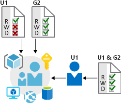
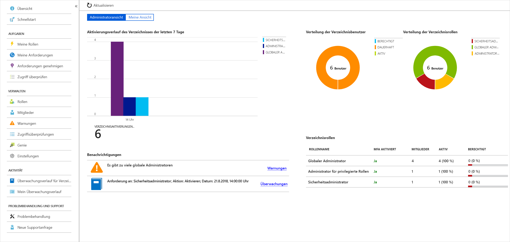

Bei Lamna Healthcare ist vor Kurzem bei einer Kunden betreffenden Webanwendung ein erheblicher Ausfall aufgetreten. Einem Techniker wurde Vollzugriff auf eine Ressourcengruppe gewährt, die die Produktionswebanwendung enthält. Dieser hat versehentlich die Ressourcengruppe mit allen untergeordneten Ressourcen sowie die Datenbank gelöscht, in der aktive Kundendaten gehostet werden. 

Zum Glück waren Anwendungsquellcode und Ressourcen in der Quellcodeverwaltung verfügbar und die Datenbank wurde regelmäßig nach einem Zeitplan automatisch gesichert. Daher konnte der Dienst relativ einfach wiederhergestellt werden. Hier untersuchen wir nun, wie dieser Ausfall mithilfe der Funktionen in Azure zum Schutz des Zugriffs auf die Infrastruktur hätte vermieden werden können.

## Bedeutung der Infrastruktur

Die Cloudinfrastruktur ist inzwischen ein wichtiger Bestandteil vieler Unternehmen. Dabei muss darauf geachtet werden, dass Benutzer und Prozesse nur die Rechte erhalten, die sie benötigen, um ihre Arbeit zu erledigen. Die Zuweisung falscher Zugriffsrechte kann Datenverluste und Datenlecks zur Folge haben und Ursache dafür sein, dass Dienste nicht mehr verfügbar sind. 

Systemadministratoren können für eine große Anzahl von Benutzern, Systemen und Berechtigungssätzen verantwortlich sein. Daher kann die ordnungsgemäße Zuweisung von Zugriffsberechtigungen schnell unüberschaubar werden und eine Universallösung zur Folge haben. Damit wird die Verwaltung zwar unkomplizierter, es ist jedoch wesentlich einfacher, versehentlich einen freizügigeren Zugriff als erforderlich zu gewähren.

## Rollenbasierte Zugriffssteuerung

Hier bietet die rollenbasierte Zugriffssteuerung (Role-Based Access Control, RBAC) ein etwas anderes Konzept. Rollen werden als Sammlungen von Zugriffsberechtigungen definiert. Sicherheitsprinzipale werden Rollen direkt oder über eine Gruppenmitgliedschaft zugeordnet. Die Trennung von Sicherheitsprinzipalen, Zugriffsberechtigungen und Ressourcen ermöglicht eine einfachere Verwaltung und differenziertere Steuerung.

In Azure werden Benutzer, Gruppen und Rollen in Azure Active Directory (Azure AD) gespeichert. Bei der Azure Resource Manager-API wird die rollenbasierte Zugriffssteuerung verwendet, um die Verwaltung des Zugriffs auf alle Ressourcen innerhalb von Azure zu gewährleisten.

<!-- 
 -->

### Rollen und Verwaltungsgruppen

Rollen sind bestimmte Berechtigungen, z.B. „Schreibgeschützt“ oder „Mitwirkender“, die Benutzern für den Zugriff auf eine Azure-Dienstinstanz zugewiesen werden können. Rollen können auf der jeweiligen Dienstinstanzebene zugewiesen werden, werden jedoch auch in der Azure Resource Manager-Hierarchie nach unten weitergegeben. Rollen, die in einem höheren Bereich zugewiesen werden, wie etwa ein ganzes Abonnement, werden an untergeordnete Bereiche, wie etwa Dienstinstanzen, vererbt. 

Bei Verwaltungsgruppen handelt es sich um eine zusätzliche hierarchische Ebene, die vor Kurzem beim RBAC-Modell eingeführt wurde. Verwaltungsgruppen bieten die zusätzliche Möglichkeit, Abonnements zu gruppieren und Richtlinien auf einer noch höheren Ebene anzuwenden.

Dank der Möglichkeit der Weitergabe von Rollen in einer beliebig definierten Abonnementhierarchie können Administratoren authentifizierten Benutzern auch vorübergehenden Zugriff auf eine ganze Umgebung gewähren. Dies ist beispielsweise möglich, wenn ein Prüfer temporären schreibgeschützten Zugriff auf alle Abonnements benötigt.

### Privileged Identity Management

Bei einem umfassenden Konzept zum Schutz der Infrastruktur sollte neben der Verwaltung des Zugriffs auf Azure-Ressourcen mittels RBAC mit Änderung und Weiterentwicklung der Organisation die Einbindung einer laufenden Überwachung von Rollenmitgliedern in Betracht gezogen werden. Azure AD Privileged Identity Management (PIM) ist ein zusätzliches kostenpflichtiges Angebot, das einen Überblick über Rollenzuweisungen, die Aktivierung von Self-Service- und Just-In-Time-Rollen sowie die Überprüfung des Zugriffs auf Azure AD- und Azure-Ressourcen bietet.

## Bereitstellen von Identitäten für Dienste

Für Dienste ist es oft nützlich, eine Identität zu besitzen. Anmeldeinformationen sind entgegen allen bewährten Methoden häufig in Konfigurationsdateien enthalten. Wenn für diese Konfigurationsdateien keine Sicherheitsrichtlinien gelten, kann jeder Benutzer mit Zugriff auf die Systeme oder Repositorys auf diese Anmeldeinformationen zugreifen und stellt somit ein potenzielles Risiko dar.

Bei Azure AD wurde dieses Problem auf zwei Arten gelöst: mit Dienstprinzipalen und verwalteten Identitäten für Azure-Dienste.

### Dienstprinzipale

Zum Verständnis des Konzepts von Dienstprinzipalen müssen zunächst die Begriffe **Identität** und **Prinzipal** erläutert werden, da diese in der Welt der Identitätsverwaltung verwendet werden.

Eine **Identität** ist lediglich etwas, das authentifiziert werden kann. Hierzu gehören natürlich Benutzer mit Benutzername und Kennwort, aber auch Anwendungen und andere Server, die möglicherweise mit geheimen Schlüsseln oder Zertifikaten authentifiziert werden. Zusätzliche Definition: Bei einem **Konto** handelt es sich um Daten, die einer Identität zugeordnet sind.

Ein **Prinzipal** ist eine Identität mit bestimmten Rollen oder Ansprüchen. Betrachten Sie die Verwendung des Befehls „sudo“ in einer Bash-Eingabeaufforderung oder von „Als Administrator ausführen“ in Windows. In beiden Fällen bleiben Sie mit derselben Identität wie bisher angemeldet, nehmen jedoch eine andere Rolle an, unter der Sie Befehle ausführen.

Ein **Dienstprinzipal** trägt somit seinen Namen zurecht. Er stellt eine Identität dar, die von einem Dienst oder einer Anwendung verwendet wird. Wie anderen Identitäten können auch ihm verschiedene Rollen zugewiesen werden. 

Bei Lamna Healthcare können beispielsweise die eigenen Bereitstellungsskripts zugewiesen werden, sodass sie authentifiziert als Dienstprinzipal ausgeführt werden. Wenn dies die einzige Identität mit der Berechtigung zum Durchführen von destruktiven Aktionen ist, hat Lamna vermutlich einen langen Weg zurückgelegt, um sicherzustellen, dass Ressourcen nicht noch einmal versehentlich gelöscht werden.

### Verwaltete Identitäten für Azure-Ressourcen

Die Erstellung von Dienstprinzipalen kann sehr aufwändig sein, und es gibt jede Menge Berührungspunkte, die die Verwaltung erschweren. Das Verwalten von Identitäten für Azure-Ressourcen ist viel einfacher und nimmt Ihnen einen Großteil der Arbeit ab.

Eine verwaltete Identität kann sofort für jeden Azure-Dienst erstellt werden, der diese Funktionalität unterstützt (und die Liste wird immer länger). Wenn Sie eine verwaltete Identität für einen Dienst erstellen, erstellen Sie ein Konto für den Azure AD-Mandanten. Die Azure-Infrastruktur übernimmt automatisch die Authentifizierung des Diensts und die Verwaltung des Kontos. Danach können Sie dieses Konto wie jedes andere AD-Konto verwenden und beispielsweise dafür sorgen, dass der authentifizierte Dienst sicher auf andere Azure-Ressourcen zugreift.

Lamna Healthcare geht mit seiner Identitätsverwaltung einen Schritt weiter und verwendet verwaltete Identitäten für alle unterstützten Dienste, die Aufgaben der Infrastrukturverwaltung und -bereitstellung durchführen können müssen.

## Infrastrukturschutz bei Lamna Healthcare

Wir haben gesehen, wie bei Lamna Healthcare die Probleme ab dem Vorfall angegangen wurden, bei dem versehentlich Infrastruktur gelöscht wurde. Es wird eine rollenbasierte Zugriffssteuerung verwendet, um die Sicherheit der Infrastruktur besser gewährleisten zu können, und es werden verwaltete Identitäten verwendet, damit keine Anmeldeinformationen in den Code gelangen und die für die Dienste erforderlichen Identitäten einfacher zu verwalten sind.

## Zusammenfassung

Um die Verfügbarkeit und Integrität der Infrastruktur sicherzustellen, muss die Infrastruktur entsprechend geschützt werden. Durch die richtige Verwendung von Features wie RBAC und verwaltete Identitäten können Sie Ihre Azure-Umgebung vor nicht autorisiertem und unabsichtlichem Zugriff schützen und die Identitätssicherheitsfunktionen in Ihrer Architektur verbessern.