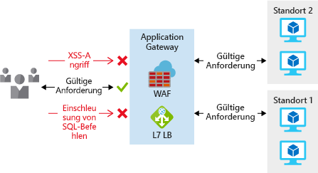
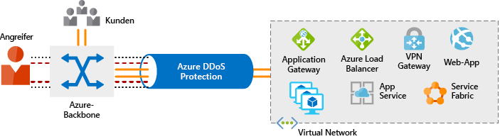
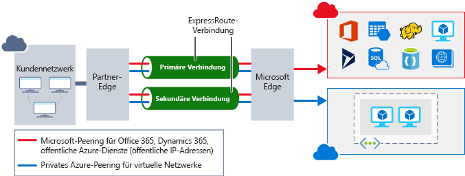

Der Schutz von Netzwerken vor Angriffen und unbefugtem Zugriff ist ein wichtiger Bestandteil jeder Architektur.Securing your network from attacks and unauthorized access is an important part of any architecture. Im Rahmen der Planung der Cloudmigration nahm sich Lamna Healthcare die Zeit, seine Netzwerkinfrastruktur zu planen, um sicherzustellen, dass es über die richtigen Netzwerksicherheitskontrollen verfügt, um seine Netzwerkinfrastruktur vor Angriffen zu schützen.As part of the planning for its cloud migration, Lamna Healthcare took the time to plan out its network infrastructure to ensure it had the proper network security controls in place to protect its network infrastructure from attack. Hier schauen wir uns die Netzwerksicherheit an, wie Sie einen mehrstufigen Ansatz in Ihre Architektur integrieren, und wie Sie mit Azure Netzwerksicherheit für Ihre Umgebung gewährleisten.Here, we'll take a look at what network security looks like, how to integrate a layered approach into your architecture, and how Azure can help you provide network security for your environment.

## Was ist Netzwerksicherheit?What is network security

Netzwerksicherheit schützt die Kommunikation von Ressourcen innerhalb und außerhalb Ihres Netzwerks.Network security is protecting the communication of resources within and outside of your network. Ziel ist es, das Risiko für Ihre Dienste und Systeme auf Netzwerkebene einzuschränken.The goal is to limit exposure at the network layer across your services and systems. Indem Sie das Risiko einschränken, verringern Sie die Wahrscheinlichkeit für einen Angriff auf Ihre Ressourcen.By limiting this exposure, you decrease the likelihood that your resources can be attacked. Die Netzwerksicherheit konzentriert sich vor allem auf folgende Bereiche:In the focus on network security, efforts can be focused on the following areas:

- Schützen des Datenverkehrs zwischen Anwendungen und InternetSecuring traffic flow between applications and the internet
- Schützen des Datenverkehrs zwischen AnwendungenSecuring traffic flow amongst applications
- Schützen des Datenverkehrs zwischen Benutzern und AnwendungenSecuring traffic flow between users and the application

Der Schutz des Datenverkehrs zwischen Anwendungen und Internet konzentriert sich darauf, das Risiko außerhalb Ihres Netzwerks einzuschränken.Securing traffic flow between applications and the internet focuses on limiting exposure outside your network. Netzwerkangriffe beginnen meist außerhalb Ihres Netzwerks, sodass durch die Begrenzung des Internetrisikos und den Schutz des Umkreises die Gefahr eines Angriffs reduziert werden kann.Network attacks will most frequently start outside your network, so by limiting the internet exposure and securing the perimeter, the risk of being attacked can be reduced.

Der Schutz des Datenverkehrs zwischen Anwendungen konzentriert sich auf Daten, die zwischen Anwendungen, deren Schichten, verschiedenen Umgebungen und anderen Diensten in Ihrem Netzwerk übertragen werden.Securing traffic flow amongst applications focuses on  data between applications and their tiers, between different environments, and in other services within your network. Durch die Einschränkung der Gefährdung zwischen diesen Ressourcen verringern Sie die Auswirkungen einer möglicherweise beschädigten Ressource.By limiting exposure between these resources, you reduce the effect a compromised resource can have. Dies kann dazu beitragen, die weitere Verbreitung innerhalb eines Netzwerks zu einzudämmen.This can help reduce further propagation within a network.

Der Schutz des Datenverkehrs zwischen Benutzern und Anwendungen konzentriert sich auf den Schutz des Netzwerkflusses Ihrer Endbenutzer.Securing traffic flow between users and the application focuses on securing the network flow for your end users. Dadurch wird die Gefährdung Ihrer Ressourcen durch Angriffe von außen begrenzt und ein sicherer Mechanismus für Benutzer geschaffen, Ihre Ressourcen zu nutzen.This limits the exposure your resources have to outside attacks, and provides a secure mechanism for users to utilize your resources. 

## Mehrstufiger NetzwerksicherheitsansatzA layered approach to network security

Ein roter Faden in diesem Modul ist der mehrstufige Sicherheitsansatz – der auch auf Netzwerkebene gilt.A common thread throughout this module has been taking a layered approach to security, and this approach is no different at the network layer. Es reicht nicht aus, sich nur dem Schutz des Netzwerkumkreises oder der Netzwerksicherheit zwischen Diensten innerhalb eines Netzwerks zu widmen.It's not enough to just focus on securing the network perimeter, or focusing on the network security between services inside a network. Ein mehrstufiger Ansatz bietet mehrere Schutzebenen. Das heißt, wenn ein Angriff eine Ebene passiert, sind weitere Schutzmechanismen vorhanden, um weitere Angriffe einzuschränken.A layered approach provides multiple levels of protection, so that if an attacker gets through one layer, there are further protections in place to limit further attack.

Sehen wir uns an, wie Azure Tools für einen mehrstufigen Ansatz zum Schutz Ihres Netzwerks bereitstellen kann.Let's take a look at how Azure can provide the tools for a layered approach to securing your network footprint.

### InternetschutzInternet protection

Wenn wir im Umkreis des Netzwerks beginnen, konzentrieren wir uns darauf, Angriffe aus dem Internet einzuschränken und zu eliminieren.If we start on the perimeter of the network, we're focused on limiting and eliminating attacks from the internet. Ein guter Ausgangspunkt ist, die Ressourcen zu bewerten, mit denen das Internet konfrontiert ist, und ein- und ausgehende Kommunikation nur dann zu erlauben, wenn sie erforderlich ist.A great first place to start is to assess the resources that are internet-facing, and only allow inbound and outbound communication where necessary. Identifizieren Sie alle Ressourcen, die eingehenden Netzwerkdatenverkehr jeglicher Art zulassen, und stellen Sie sicher, dass dieser notwendig und auf die erforderlichen Ports/Protokolle beschränkt ist.Identify all resources that are allowing inbound network traffic of any type, and ensure they are necessary and restricted to only the ports/protocols required. Das Azure Security Center eignet sich hervorragend, um nach diesen Informationen zu suchen, da es Internetressourcen identifiziert, denen keine Netzwerksicherheitsgruppen (NSG) zugeordnet sind, sowie Ressourcen, die nicht hinter einer Firewall geschützt sind.Azure Security Center is a great place to look for this information, as it will identify internet-facing resources that don't have network security groups (NSG) associated with them, as well as resources that are not secured behind a firewall.

Es gibt mehrere Möglichkeiten, Schutz für eingehenden Datenverkehr im Umkreis zu gewährleisten.To provide inbound protection at the perimeter, there are a couple of ways to do this. Application Gateway ist ein Layer 7-Lastenausgleich, der auch eine Web Application Firewall (WAF) bietet, um erweiterte Sicherheit für Ihre HTTP-basierten Dienste zu bieten.Application Gateway is a Layer 7 load balancer that also includes a web application firewall (WAF) to provide advanced security for your HTTP-based services. Die WAF basiert auf den Kernregeln von OWASP 3.0 bzw. 2.2.9 und bietet Schutz vor bekannten Sicherheitsrisiken wie Cross-Site-Scripting und Einschleusung von SQL-Befehlen.The WAF is based on rules from the OWASP 3.0 or 2.2.9 core rule sets, and provides protection from commonly-known vulnerabilities such as cross-site scripting and SQL injection.

Zum Schutz von Diensten, die nicht auf HTTP basieren, oder zur besseren Anpassung können virtuelle Netzwerkappliances zum Schutz Ihrer Netzwerkressourcen eingesetzt werden.For protection of non-HTTP-based services or for increased customization, network virtual appliances (NVA) can be used to secure your network resources. Virtuelle Netzwerkappliances sind ähnlich wie Firewallappliances auf lokalen Netzwerken und über viele gängige Anbieter von Netzwerksicherheit erhältlich.NVAs are similar to firewall appliances you might find in on-premises networks, and are available from many of the most popular network security vendors. Sie können eine bessere Anpassung der Sicherheitsmaßnahmen bieten, die Anwendungen benötigen. Allerdings sind sie ggf. komplexer, sodass eine sorgfältige Berücksichtigung der Anforderungen empfohlen wird.NVAs can provide greater customization of security for those applications that require it, but can come with increased complexity, so careful consideration of requirements is advised.

Für alle Ressourcen, die im Internet zur Verfügung stehen, besteht die Gefahr eines Denial-of-Service-Angriffs.Any resource exposed to the internet is at risk of being attacked by a denial-of-service attack. Bei diesem Angriff wird eine Netzwerkressource überlastet, indem so viele Anforderungen gesendet werden, dass die Ressource langsam oder gar nicht mehr reagiert.These types of attacks attempt to overwhelm a network resource by sending so many requests that the resource becomes slow or unresponsive. Damit diese Angriffe abgewehrt werden können, bietet Azure DDoS einen Basisschutz für alle Azure-Dienste und einen erweiterten Schutz für weitere Anpassungen Ihrer Ressourcen.To mitigate these attacks, Azure DDoS provides basic protection across all Azure services and enhanced protection for further customization for your resources. DDoS Protection sperrt Angriffsdatenverkehr und leitet den verbleibenden Datenverkehr an das vorgesehene Ziel weiter.DDoS protection blocks attack traffic and forwards the remaining traffic to its intended destination. Innerhalb weniger Minuten nach Angriffserkennung werden Sie mithilfe der Metriken von Azure Monitor benachrichtigt.Within a few minutes of attack detection, you are notified using Azure Monitor metrics.

### Sicherheit in virtuellen NetzwerkenVirtual network security

Es ist wichtig, in einem virtuellen Netzwerk (VNET) die Kommunikation zwischen den Ressourcen auf das erforderliche Maß zu beschränken.Once inside a virtual network (VNet), it's important to limit communication between resources to only what is required.

Bei der Kommunikation zwischen VMs spielen Netzwerksicherheitsgruppen (NSGs) eine wichtige Rolle, um unnötige Kommunikation zu verhindern.For communication between virtual machines, network security groups (NSG) are a critical piece to restrict unnecessary communication. NSGs werden auf den Ebenen 3 und 4 ausgeführt und stellen eine Liste der zulässigen und verweigerten Kommunikation von und zu Netzwerkschnittstellen und Subnetzen bereit.NSGs operate at layers 3 & 4, and provide a list of allowed and denied communication to and from network interfaces and subnets. NSGs sind vollständig anpassbar und bieten Ihnen die Möglichkeit, die Netzwerkkommunikation zu und von Ihren VMs vollständig zu sperren.NSGs are fully customizable, and give you the ability to fully lock down network communication to and from your virtual machines. Mit NSGs können Sie Anwendungen zwischen Umgebungen, Ebenen und Diensten isolieren.By using NSGs, you can isolate applications between environments, tiers, and services.

![Eine Abbildung zeigt die Verwendung der Netzwerksicherheitsgruppe, um die Kommunikation des Back-End und der mittleren Ebene mit dem Internet zu unterbinden.An illustration showing usage of network security group to restrict backend and mid-tier from communicating directly with the Internet. Die Internetanforderungen werden vom Front-End empfangen, das sie dann an die mittlere Ebene weiterleitet.The Internet requests are received by the frontend, which then passes them to the mid-tier. Die mittleren Ebene kommuniziert mit dem Back-End.The mid-tier communicates with the backend. ](../media/azure-network-security.png)

Verwenden Sie VNET-Dienstendpunkte, um Azure-Dienste zu isolieren, damit nur die Kommunikation aus virtuellen Netzwerken zugelassen wird.To isolate Azure services to only allow communication from virtual networks, use VNet service endpoints. Mit Dienstendpunkten können Ressourcen von Azure-Diensten auf Ihr virtuelles Netzwerk beschränkt und so geschützt werden.With service endpoints, Azure service resources can be secured to your virtual network. Das Schützen von Dienstressourcen in einem virtuellen Netzwerk erhöht die Sicherheit, da der Zugriff über das öffentliche Internet auf Ressourcen vollständig verhindert, und nur Datenverkehr aus Ihrem virtuellen Netzwerk zugelassen wird.Securing service resources to a virtual network provides improved security by fully removing public internet access to resources, and allowing traffic only from your virtual network. Dies verringert die Angriffsfläche Ihrer Umgebung, reduziert den Verwaltungsaufwand, um die Kommunikation zwischen Ihren VNET- und Azure-Diensten einzuschränken, und bietet ein optimales Routing für diese Kommunikation.This reduces the attack surface for your environment, reduces the administration required to limit communication between your VNet and Azure services, and provides optimal routing for this communication.

### NetzwerkintegrationNetwork integration

Es ist üblich, dass eine vorhandene Netzwerkinfrastruktur integriert werden soll, um die Kommunikation aus lokalen Netzwerken zu ermöglichen, oder um eine verbesserte Kommunikation zwischen den Diensten in Azure zu ermöglichen.It's common to have existing network infrastructure that needs to be integrated to provide communication from on-premises networks, or to provide improved communication between services in Azure. Es gibt einige grundlegende Methoden, diese Integration auszuführen, und die Sicherheit Ihres Netzwerks zu verbessern.There are a few key ways to handle this integration and improve the security of your network.

VPN-Verbindungen (virtuelles privates Netzwerk) sind ein gängiger Weg, um sichere Kommunikationskanäle zwischen Netzwerken herzustellen – das ist auch bei virtuellen Netzwerken in Azure nicht anders.Virtual private network (VPN) connections are a common way of establishing secure communication channels between networks, and this is no different when working with virtual networking on Azure. Die Verbindung zwischen Azure-VNETs und einem lokalen VPN-Gerät ist eine großartige Möglichkeit, eine sichere Kommunikation zwischen Ihrem Netzwerk und Ihren VMs in Azure bereitzustellen.Connection between Azure VNets and an on-premises VPN device is a great way to provide secure communication between your network and your virtual machines on Azure.

Um eine dedizierte, private Verbindung zwischen Ihrem Netzwerk und Azure herzustellen, lässt sich ExpressRoute verwenden.To provide a dedicated, private connection between your network and Azure, you can use ExpressRoute. Mit ExpressRoute können Sie Ihre lokalen Netzwerke über eine private Verbindung, die von einem Konnektivitätsanbieter bereitgestellt wird, auf die Microsoft Cloud ausdehnen.ExpressRoute lets you extend your on-premises networks into the Microsoft cloud over a private connection facilitated by a connectivity provider. Mit ExpressRoute können Sie Verbindungen zu Microsoft-Clouddiensten herstellen, z.B. Microsoft Azure, Office 365 und Dynamics 365.With ExpressRoute, you can establish connections to Microsoft cloud services, such as Microsoft Azure, Office 365, and Dynamics 365. Dies verbessert die Sicherheit Ihrer lokalen Kommunikation, indem dieser Datenverkehr über die private Leitung anstatt über das Internet übertragen wird.This improves the security of your on-premises communication by sending this traffic over the private circuit instead of over the internet. Sie müssen Ihren Endbenutzern den Zugriff auf diese Dienste nicht über das Internet gestatten und können diesen Datenverkehr über Appliances zur weiteren Überprüfung des Datenverkehrs senden.You don't need to allow access to these services for your end users over the internet, and you can send this traffic through appliances for further traffic inspection.

Um mehrere VNETs einfach in Azure zu integrieren, stellt das VNET-Peering eine direkte Verbindung zwischen bestimmten VNETs her.To easily integrate multiple VNets in Azure, VNet peering establishes a direct connection between designated VNets. Sobald die Verbindung hergestellt ist, können Sie mit NSGs die Isolierung zwischen den Ressourcen genauso einrichten, wie Sie Ressourcen in einem VNET schützen.Once established, you can use NSGs to provide isolation between resources in the same way you secure resources within a VNet. Diese Integration gibt Ihnen die Möglichkeit, die gleiche grundlegende Sicherheitsebene für alle VNETs mit Peering bereitzustellen.This integration gives you the ability to provide the same fundamental layer of security across any peered VNets. Die Kommunikation ist nur zwischen direkt verbundenen VNETs zulässig.Communication is only allowed between directly connected VNets.

## Netzwerksicherheit bei Lamna HealthcareNetwork security at Lamna Healthcare

Lamna Healthcare hat viele dieser Dienste zum Aufbau einer sicheren Netzwerkinfrastruktur genutzt.Lamna Healthcare has taken advantage of many of these services to build out a secure network infrastructure. Die Kommunikation zwischen den Ressourcen wird standardmäßig verweigert und nur bei Bedarf zugelassen.Communication between resources is denied by default, and allowed only when required. Eingehende Verbindungen über das Internet sind nur für Dienste aktiviert, die diese benötigen. RDP und SSH werden nicht von Internetendpunkten aus zugelassen, sondern nur von vertrauenswürdigen internen Ressourcen.Inbound connectivity from the internet is enabled only for services that require it; RDP and SSH are not permitted from internet endpoints, only from trusted internal resources.

Zum Schützen internetbasierter Webdiensten platziert Lamna Healthcare sie hinter Application Gateways mit aktivierter WAF.To secure their internet-facing web services, they place them behind Application Gateways with WAF enabled. Dies gilt sowohl für Dienste, die auf VMs als auch in App Service ausgeführt werden.This is true both for services running on virtual machines as well as on App Service. Application Gateways schützen die Organisation vor den meisten häufigsten Sicherheitsrisiken.By using Application Gateways, they have protection from many of the common vulnerabilities.

Der DDoS-Standardschutz ist aktiviert, um die Internetendpunkte vor Denial-of-Service-Angriffen zu schützen.They have DDoS standard enabled, to provide protection for their internet-facing endpoints from denial-of-service attacks.

Durch die Verwendung von NSGs ist Lamna Healthcare in der Lage, die Kommunikation zwischen Anwendungsdiensten und Umgebungen vollständig zu isolieren.Through the use of NSGs, they are able to fully isolate communication between application services and between environments. Die Organisation lässt nur die notwendige Kommunikation zwischen Diensten innerhalb einer Umgebung zu, und erlaubt keinen Zugriff zwischen Produktions- und Nicht-Produktionsumgebungen.They only allow the necessary communication between services within an environment, and no access is allowed between production and non-production environments.

Um eine dedizierte Konnektivität zwischen Endbenutzern und Anwendungen in Azure zu bieten, hat Lamna Healthcare eine ExpressRoute-Leitung mit Konnektivität zum lokalen Netzwerk bereitgestellt.To provide dedicated connectivity between their end users and applications in Azure, they have provisioned an ExpressRoute circuit with connectivity to their on-premises network. So wird der Datenverkehr zu Azure nicht über das Internet übertragen, und es wird eine private Verbindung für die Dienste in Azure geschaffen, um mit lokalen Systemen zu kommunizieren.This keeps their traffic to Azure off the internet and a private connection for their services in Azure to communicate with systems remaining on-premises.

Mit diesem Ansatz hat Lamna Healthcare mithilfe der Azure-Dienste Sicherheit auf mehreren Ebenen in der Netzwerkinfrastruktur des Unternehmens gewährleistet.With this approach, Lamna Healthcare has leveraged Azure services to provide security at multiple layers of their network infrastructure.

## ZusammenfassungSummary

Mit einem mehrstufigen Ansatz für Netzwerksicherheit können Sie das Gefährdungsrisiko durch netzwerkbasierte Angriffe reduzieren.A layered approach to network security helps reduce your risk of exposure through network-based attacks. Azure bietet mehrere Dienste und Funktionen, um Ihre Internetressourcen, interne Ressourcen und die Kommunikation zwischen lokalen Netzwerken zu schützen.Azure provides several services and capabilities to secure your internet-facing resource, internal resources, and communication between on-premises networks. Diese Funktionen ermöglichen, sichere Lösungen in Azure zu erstellen.These features make it possible to create secure solutions on Azure.