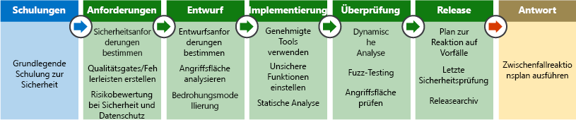

Im Vergleich zu üblichen lokalen Bereitstellungen bietet das Hosten von Anwendungen auf einer Cloudplattform mehrere Vorteile. Das cloudmodell geteilte Verantwortung verschiebt Sicherheit auf dem physischen Netzwerk, erstellen und Host-Ebenen unter die Kontrolle über den Cloud-Anbieter. Für einen Angreifer würde sich die Kompromittierung der Plattform auf dieser Ebene kaum lohnen, da dessen Aufwand erheblichen Investitionen und umfassenden Erkenntnissen des Anbieters gegenübersteht, der seine Infrastruktur auf diese Weise sichert und überwacht.

Angreifer sind daher vielmehr an der Ausnutzung von Sicherheitsrisiken interessiert, die durch Kunden der Cloudplattform auf der Anwendungsebene eingeführt werden. Durch den Einsatz einer PaaS-Strategie (Platform-as-a-Service) zum Hosten von Anwendungen müssen Kunden darüber hinaus ihre Ressourcen nicht mehr zum Verwalten der Betriebssystemsicherheit aufwenden. Stattdessen können diese zur Härtung von Anwendungscode und Überwachung von Identitäten im Zusammenhang mit dem Zugriff auf Anwendungen eingesetzt werden. In dieser Einheit erfahren Sie, wie die Anwendungssicherheit über das Anwendungsdesign verbessert werden kann.

## Szenario

Kunden des Unternehmens Lamna Healthcare müssen über ein Webportal auf ihre vertraulichen Patientenakten zugreifen können. Einhaltung der Health Insurance Portability und Accountability Act (HIPAA) ist obligatorisch und verhelfen dem Unternehmen erheblichen Risiken Geldstrafen, wenn eine sicherheitsverletzung personenbezogener Daten auftritt; aus diesem Grund ist das Sichern der Anwendung und persönliche Daten, die Interaktion mit größter.

Für Kundenanwendungen sind primär die folgenden Bereiche relevant:

- sicherer Anwendungsentwurf
- Datensicherheit
- Identitäts- und Zugriffsverwaltung
- Sicherheit des Endpunkts

## Security Development Lifecycle

Der [Security Development Lifecycle](https://www.microsoft.com/sdl) (SDL) von Microsoft kann während der Entwurfsphase der Anwendung verwendet werden, um sicherzustellen, dass Sicherheitsrisiken während des gesamten Lebenszyklus der Softwareentwicklung berücksichtigt werden. Sicherheits- und Konformitätsprobleme können in der Entwurfsphase einer Anwendung deutlicher leichter als in anderen Phasen behoben werden. So lassen sich häufig auftretende Fehler vermeiden, die zu Sicherheitslücken im Endprodukt führen können. Wenn Probleme in der frühen Entwicklungsphase behoben werden, führt dies außerdem zu geringeren Kosten. Für Softwareprojekt werden üblicherweise die folgenden SDL-Schritte umgesetzt:

1. Schulungen

    - Schulungen zum Thema grundlegender Sicherheit

1. Anforderungen

    - Definieren von Anforderungen und Quality Gates (Meilensteine, bei denen mithilfe definierter Qualitätskriterien über den weiteren Projektverlauf entschieden wird)
    - Analysieren von Risiken für Sicherheit und Datenschutz
 
1. Entwurf

    - Analysieren der Angriffsfläche
    - Modellierung von Bedrohungen
 
1. Implementierung

    - Festlegen von Tools zur Messung der Codequalität
    - Gesperrte APIs und Funktionen erzwingen
    - Führen statischer Codeanalysen aus
    - Überprüfen von Repositorys auf gespeicherte Geheimnisse
 
1. Überprüfung

    - Dynamische Tests und Fuzzing
    - Überprüfen der Bedrohungsmodelle/Angriffsflächen
 
1. Release

    - Entwerfen eines Sicherheitsplans für Bedrohungen
    - Ausführen einer abschließenden Sicherheitsüberprüfung
    - Releasearchiv
 
1. Reaktion auf Bedrohungen 

    - Ausführen eines Reaktionsplans bei Bedrohungen

SDL ist nicht einfach nur ein Prozess oder Toolset, sondern in gleichem Maße ein Aspekt einer Unternehmenskultur. Erstellen eine Kultur, in denen Sicherheit ist ein primärer Fokus und Anforderung alle der Entwicklung von Anwendungen kann große Fortschritte bei der Weiterentwicklung der Funktionen von einer Organisation Hinblick auf Sicherheit.

<!-- Bear in mind that the migration of un-modified applications (especially COTS procured software systems) will not be able to perform many of the steps listed above.
 -->

## Bewertung der Betriebssicherheit

Sobald eine Anwendung bereitgestellt wurde, ist es wichtig, immer wieder seinen Sicherheitsstatus zu bewerten, zu bestimmen, wie mögliche Probleme zu minimieren, die ermittelt, und das Wissen zurück in den Softwareentwicklungszyklus feed. Wie genau diese Vorgänge umgesetzt werden, entscheidet über den Reifegrad der Softwareentwicklung, der operativen Teams und der Datenschutzanforderungen.

Mit Scansoftware für Sicherheitsrisiken stehen Dienste bereit, mit denen Sie diesen Prozess automatisieren und mögliche Sicherheitsprobleme in regelmäßigen Abständen bewerten können, ohne dabei Teams mit kostspieligen manuellen Vorgängen wie Penetrationtests zu belasten.

Azure Security Center ist ein kostenloser Dienst, der mittlerweile standardmäßig für alle Azure-Abonnements aktiviert ist. Er ist fest in andere Azure-Dienste auf Anwendungsebene wie Azure Application Gateway und Azure Web Application Firewall integriert. Durch die Analyse von Sicherheitsprotokollen von diesen Diensten, ASC kann Berichte über bekannte Schwachstellen in Echtzeit wird empfohlen, Antworten zu deren Behebung. und auch konfiguriert werden, um die automatische Ausführung von Playbooks in Reaktion auf Angriffe.

<!-- SDL culture
Key Vault / MSI
CSE = App  -> DB & App Storage
Mention approach of code scanning & SDL
Scanning for passwords - Git
 -->

## Identität als Zugriffskriterium

Die Identitätsüberprüfung wird beim Schutz von Anwendungen zunehmend zur ersten Verteidigungslinie. Wenn der Zugriff auf eine Webanwendung durch die Authentifizierung und Autorisierung von Sitzungen eingeschränkt wird, kann dies die Angriffsfläche deutlich reduzieren. Azure AD und Azure AD B2C stellen eine wirksame Methode bereit, die Identitäts- und Zugriffsverwaltung an einen vollständig verwalteten Dienst auszulagern. Azure AD-Richtlinien für bedingten Zugriff, privileged Identitätsmanagement und Identity Protection Steuerelemente weiter verbessern die Fähigkeit von Kunden zu verhindern, dass nicht autorisierte Zugriffe, und Verfolgen von Änderungen.

## Schutz von Daten

Bei den meisten, wenn nicht sogar allen Angriffen auf Webanwendungen, sind Kundendaten das Ziel. Die sichere Speicherung und Übertragung von Daten zwischen einer Anwendung und der Datenspeicherebene ist von allergrößter Bedeutung.

Lamna Healthcare speichert überaus sensible Daten im Zusammenhang mit Patientenakten und greift auf diese Daten zu. Im HIPAA-Gesetz, das 1996 vom US-Kongress erlassen wurde, werden im Zusammenspiel mit einigen weiteren Regulierungen nationale Standards für elektronische Transaktionen von Patientendaten definiert. Diese Standards gelten für Gesundheitsdienstleister und Arbeitgeber. Lamna muss stellen Sie sicher, dass Patienten und autorisierte Parteien, z. B. die Ärzte, sicheren Zugriff auf medizinische Daten verfügen.

Um diese Anforderungen erfüllen, wurde geändert, Lamna Healthcare ihre Anwendungen in der alle Patientendaten im Ruhezustand und während der Übertragung zu verschlüsseln. Mit Transport Layer Security (TLS) werden beispielsweise Daten zwischen der Webanwendung und den Back-End-SQL-Datenbanken verschlüsselt. Daten werden ebenfalls verschlüsselt im Ruhezustand in SQL Server mithilfe von Transparent Data Encryption (TDE), die sicherstellen, dass selbst wenn die Umgebung gefährdet ist, Daten für alle Benutzer ohne die richtigen Entschlüsselungsschlüssel praktisch nutzlos ist.

Um in Blob Storage gespeicherte Daten verschlüsseln, kann der clientseitigen Verschlüsselung verwendet werden, um die Daten im Arbeitsspeicher zu verschlüsseln, bevor sie auf den Storage-Dienst geschrieben werden. Bibliotheken, die diese Verschlüsselung unterstützen, sind für .NET, Java und Python verfügbar. Mit diesen können Technologien zur Datenverschlüsselung direkt in Anwendungen integriert werden, wodurch die Datenintegrität erhöht wird.

### Sichere Schlüssel und Geheimnisspeicher

Anwendungsgeheimnisse (beispielsweise Verbindungszeichenfolgen und Kennwörter) und Verschlüsselungsschlüssel, die für den Zugriff auf Daten benötigt werden, dürfen unter keinen Umständen in der Anwendung hinterlegt sein. Derartige Daten sollten nie im Anwendungscode von Konfigurationsdateien gespeichert werden. Stattdessen sollte ein sicherer Speicher wie Azure Key Vault verwendet werden. Zugriff auf diese vertraulichen Daten kann dann auf Anwendungsidentitäten mit verwalteten Dienstidentitäten beschränkt werden, und Schlüssel in regelmäßigen Abständen zum Schutz vor unautorisierter Offenlegung, im Fall von Encryption Key Datenlecks gedreht werden können. Kunden können auch ihre eigenen Verschlüsselungsschlüssel, die von einem lokalen Hardwaresicherheitsmodule (HSMS) generiert und sogar festlegen, dass es sich bei Azure Key Vault-Instanzen in nur einem Mandanten, implementiert werden diskrete HSMs.

<!-- ### Secure and immutable file storage

All Azure storage accounts are encrypted by default using Microsoft managed keys. Azure customers also have the ability to use their own encryption keys (BYOK) to encrypt blob, file and queue data so that even the hosting provider has no access to unencrypted data. Data immutability is often required for auditing purposes or when legal disputes call for data to be effectively frozen for a determined amount of time. Azure has recently introduced an [immutable data storage](https://docs.microsoft.com/azure/storage/blobs/storage-blob-immutable-storage) option known as Write-Once, Read many (WORM) for this scenario. -->
