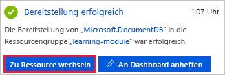
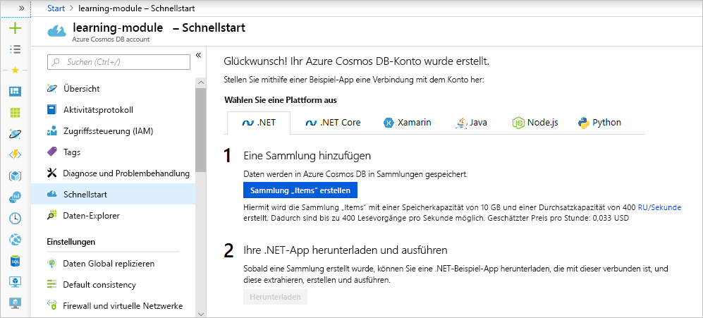

Ihren Kunden den schnellsten Zugang zu den Produkten auf Ihrer Bekleidungswebsite zu bieten, ist für Ihre Kunden und den Erfolg Ihres Unternehmens ausschlaggebend.Providing your customers the fastest access to the products on your online clothing site is paramount to your customers, and your businesses success. Verkürzen Sie die Wege, die Daten zu den Benutzern zurücklegen müssen, um mehr Inhalte schneller bereitzustellen.By decreasing the distance data has to travel to your users, you can deliver more content faster. Wenn Ihre Daten in Azure Cosmos DB gespeichert sind, ist die Replikation der Websitedaten in mehrere Regionen auf der ganzen Welt ein Kinderspiel.If your data is stored in Azure Cosmos DB, replicating your site's data to multiple regions around the world is a point and click operation.

<!-- Activate the sandbox -->
[!include]

In dieser Einheit lernen Sie die Vorteile der globalen Verteilung und eines nativen Multimaster-Datenbankdiensts kennen und replizieren Ihr Konto anschließend in drei weitere Regionen.In this unit you'll learn the benefits of global distribution and a natively multi-mastered database service, and then replicate your account into three additional regions.

## Grundlagen der globalen VerteilungGlobal distribution basics

Die globale Verteilung ermöglicht es Ihnen, Daten aus einer Region in mehrere Azure-Regionen zu replizieren.Global distribution enables you to replicate data from one region into multiple Azure regions. Sie können jederzeit Regionen hinzufügen oder entfernen, in denen Ihre Datenbank repliziert ist. Dabei stellt Azure Cosmos DB sicher, dass Ihre Daten, wenn Sie eine zusätzliche Region hinzufügen, innerhalb von 30 Minuten für Vorgänge verfügbar sind, vorausgesetzt, Ihre Daten sind nicht größer als 100 TB.You can add or remove regions in which your database is replicated at any time, and Azure Cosmos DB ensures that when you add an additional region, your data is available for operations within 30 minutes, assuming your data is 100 TBs or less.

Es gibt zwei gängige Szenarios für die Replikation von Daten in zwei oder mehr Regionen:There are two common scenarios for replicating data in two or more regions:

1. Bereitstellen von Datenzugriff mit geringer Latenz für Endbenutzer, unabhängig davon, wo sie sich befindenDelivering low-latency data access to end users no matter where they are located around the globe
2. Hinzufügen von regionaler Resilienz für Geschäftskontinuität und Notfallwiederherstellung (Business Continuity & Disaster Recovery, BCDR)Adding regional resiliency for business continuity and disaster recovery (BCDR)

Um Kunden den Zugriff mit geringer Latenz zu ermöglichen, wird empfohlen, die Daten in Regionen zu replizieren, die dem Standort Ihrer Benutzer am nächsten liegen.To deliver low-latency access to customers, it is recommended that you replicate the data to regions closest to where your users are. Der Onlineshop Ihres Bekleidungsunternehmen hat Kunden in Los Angeles, New York und Tokio.For your online clothing company, you have customers in Los Angeles, New York, and Tokyo. Sehen Sie sich die Seite mit den [Azure-Regionen](https://azure.microsoft.com/global-infrastructure/regions/) an, und legen Sie die Regionen fest, die diesen Kundengruppen am nächsten liegen, da Sie Benutzer an diese Orte replizieren werden.Take a look at the [Azure regions](https://azure.microsoft.com/global-infrastructure/regions/) page, and determine the closest regions to those sets of customers, as those are the locations you'll replicate users to.

Als BCDR-Lösung empfiehlt es sich, die Regionen basierend auf den Regionspaaren hinzuzufügen, die im Artikel [Geschäftskontinuität und Notfallwiederherstellung: Azure-Regionspaare](https://azure.microsoft.com/documentation/articles/best-practices-availability-paired-regions/) beschrieben werden.To provide a BCDR solution, it is recommended to add regions based on the region pairs described in the [Business continuity and disaster recovery (BCDR): Azure Paired Regions](https://azure.microsoft.com/documentation/articles/best-practices-availability-paired-regions/) article.

Wenn eine Datenbank repliziert wird, werden auch der Durchsatz und der Speicher gleichermaßen repliziert.When a database is replicated, the throughput and storage are replicated equally as well. Wenn also Ihre ursprüngliche Datenbank einen Speicherplatz von 10 GB und einen Durchsatz von 1.000 RU/s hätte und Sie diese in drei weitere Regionen repliziert hätten, würde jede Region über 10 GB an Daten und einen Durchsatz von 1.000 RU/s verfügen.So if your original database had 10GB of storage, and throughput of 1,000 RU/s, and if you replicated that to three additional regions, each region would have 10GB of data and 1,000 RU/s of throughput. Da der Speicher und der Durchsatz in jede Region repliziert werden, sind die Kosten für die Replikation in eine andere Region die gleichen wie für die ursprüngliche Region. Folglich fallen bei der Replikation in drei zusätzliche Regionen insgesamt etwa die vierfachen Kosten der ursprünglichen, nicht replizierten Datenbank an.Because the storage and throughput is replicated in each region, the cost of replicating to a region is the same as the original region, so replicating to 3 additional regions, would cost approximately four times the original non-replicated database.

## Erstellen eines Azure Cosmos DB-Kontos im PortalCreating an Azure Cosmos DB account in the portal

1. Melden Sie sich beim [Azure-Portal](https://portal.azure.com/learn.docs.microsoft.com?azure-portal=true) mit demselben Konto an, das Sie zum Aktivieren der Sandbox verwendet haben.Sign in to the [Azure portal](https://portal.azure.com/learn.docs.microsoft.com?azure-portal=true) using the same account you used to activate the sandbox.

    > [!IMPORTANT]
    > Melden Sie sich beim Azure-Portal und der Sandbox mit demselben Konto an.Login to the Azure portal and the sandbox with the same account.
    >
    > Melden Sie sich beim Azure-Portal über den obigen Link an, um sicherzustellen, dass Sie mit der Sandbox verbunden sind, die Zugriff auf ein Concierge-Abonnement ermöglicht.Login to the Azure portal using the link above to ensure you are connected to the sandbox, which provides access to a Concierge Subscription.

1. Klicken Sie auf **Ressource erstellen** > **Datenbanken** > **Azure Cosmos DB**.Click **Create a resource** > **Databases** > **Azure Cosmos DB**.

   

1. Geben Sie auf der Seite **Azure Cosmos DB-Konto erstellen** die Einstellungen für das neue Azure Cosmos DB-Konto einschließlich des Standorts ein.On the **Create Azure Cosmos DB Account** page, enter the settings for the new Azure Cosmos DB account, including the location.

    <!-- Resource selection --> [!include]<!-- Resource selection --> [!include]

    EinstellungSetting|WertValue|BeschreibungDescription
    ---|---|---
    IDID|*Ein eindeutiger Name**Enter a unique name*|Geben Sie einen eindeutigen Namen ein, der das Azure Cosmos DB-Konto identifiziert.Enter a unique name to identify this Azure Cosmos DB account. Da *documents.azure.com* an die ID angefügt wird, die Sie bereitstellen, um Ihren URI zu erstellen, sollten Sie eine eindeutige, aber identifizierbare ID verwenden.Because *documents.azure.com* is appended to the ID that you provide to create your URI, use a unique but identifiable ID.  Die ID darf nur Kleinbuchstaben, Zahlen und einen Bindestrich (-) enthalten, und sie muss zwischen 3 und 50 Zeichen lang sein.The ID can contain only lowercase letters, numbers, and the hyphen (-) character, and it must contain 3 to 50 characters.
    APIAPI|SQLSQL|Die API bestimmt den Typ des zu erstellenden Kontos.The API determines the type of account to create. Azure Cosmos DB stellt fünf APIs bereit, die Sie für Ihre Anwendung auswählen können: SQL (Dokumentdatenbank), Gremlin (Diagrammdatenbank), MongoDB (Dokumentdatenbank), Azure Table und Cassandra. Für jede ist derzeit ein separates Konto erforderlich.Azure Cosmos DB provides five APIs to suit the needs of your application: SQL (document database), Gremlin (graph database), MongoDB (document database), Azure Table, and Cassandra, each of which currently requires a separate account.   Wählen Sie **SQL** aus, da Sie in diesem Modul eine Dokumentdatenbank erstellen, die mit SQL-Syntax abgefragt werden kann und für die SQL-API zugänglich ist.Select **SQL** because in this module you are creating a document database that is queryable using SQL syntax and accessible with the SQL API.|
    AbonnementSubscription|*Concierge-Abonnement**Concierge Subscription*|Wählen Sie Ihr Concierge-Abonnement aus.Select your Concierge Subscription. Wenn das Concierge-Abonnement nicht aufgelistet wird, haben Sie mehrere Mandanten in Ihrem Abonnement aktiviert und müssen die Mandanten wechseln.If you do not see the Concierge Subscription listed, you have multiple tenants enabled on your subscription, and you need to change tenants. Hierzu melden Sie sich erneut über den folgenden Link beim Portal an: [Azure-Portal für die Sandbox](https://portal.azure.com/learn.docs.microsoft.com?azure-portal=true).To do so, login again using the following portal link: [Azure portal for sandbox](https://portal.azure.com/learn.docs.microsoft.com?azure-portal=true).
    RessourcengruppeResource Group|Vorhandene verwendenUse existing  <rgn>[Name der Sandboxressourcengruppe]</rgn><rgn>[sandbox resource group name]</rgn>|Klicken Sie auf **Vorhandene verwenden**, und geben Sie dann <rgn>[Name der Sandboxressourcengruppe]</rgn> ein.Select **Use existing**, and then enter <rgn>[sandbox resource group name]</rgn>.
    StandortLocation|*Auswählen der am nächsten gelegenen Region**Select the region closest to you*|Wählen Sie aus der obigen Liste der Regionen die Region aus, die Ihnen am nächsten liegt.Select the region closest to you from the list of regions above.
    GeoredundanzGeo-Redundancy| DeaktivierenDisable | Durch diese Einstellung wird eine replizierte Version Ihrer Datenbank in einer zweiten (zugeordneten) Region erstellt.This setting creates a replicated version of your database in a second (paired) region. Lassen Sie diese Einstellung vorerst deaktiviert, da Sie die Datenbank später replizieren werden.Leave this set to disabled for now, as you will replicate the database later.
    MultimasterMulti Master | AktivierenEnable | Durch diese Einstellung können Sie in mehreren Regionen gleichzeitig schreiben.This setting enables you to write to multiple regions at the same time. Diese Einstellung kann nur bei der Kontoerstellung konfiguriert werden.This setting can only be configured during account creation.
    Virtuelles NetzwerkVirtual Network|Nicht ausfüllenLeave blank|Lassen Sie das Feld für virtuelle Netzwerke vorerst leer.Leave virtual networks blank for now. Dies kann später konfiguriert werden.This can be configured later.

1. Klicken Sie auf **Überprüfen + erstellen**.Click **Review + Create**.

    

1. Nach Überprüfung der Einstellungen klicken Sie auf **Erstellen**, um das Konto zu erstellen.After the settings are validated, click **Create** to create the account.

1. Die Kontoerstellung dauert einige Minuten.The account creation takes a few minutes. Warten Sie, bis das Portal die Benachrichtigung anzeigt, dass die Bereitstellung erfolgreich war, und klicken Sie auf die Benachrichtigung.Wait for the portal to display the notification that the deployment succeeded and click the notification.

    

1. Klicken Sie im Benachrichtigungsfenster auf **Zu Ressource wechseln**.In the notification window, click **Go to resource**.

    

    Im Portal wird **Glückwunsch! Ihr Azure Cosmos DB-Konto wurde erstellt** angezeigt.The portal displays the **Congratulations! Your Azure Cosmos DB account was created** page.

    

## Replizieren von Daten in mehrere RegionenReplicate data in multiple regions

Als Nächstes replizieren Sie Ihre Datenbank in Regionen, die Ihren Benutzern in Los Angeles, New York und Tokio am nächsten sind.Let's now replicate your database closest to your global users in Los Angeles, New York, and Tokyo.

1. Klicken Sie auf der Kontoseite im Menü auf **Daten global replizieren**.In the account page, click **Replicate data globally** from the menu.
1. Wählen Sie auf der Seite **Daten global replizieren** die Regionen „USA, Westen 2“, „USA, Osten“ und „Japan, Osten“ aus, und klicken Sie dann auf **Speichern**.In the **Replicate data globally** page, select the West US 2, East US, and Japan East regions, and then click **Save**.

    Wenn Sie die Karte im Azure-Portal nicht sehen, minimieren Sie die Menüs auf der linken Seite der Anzeige, um sie anzuzeigen.If you don't see the map in the Azure portal, minimize the menus of the left side of the screen to display it.

    Auf der Seite wird die Meldung **Wird aktualisiert** angezeigt, während die Daten in die neuen Regionen geschrieben werden.The page will display an **Updating** message while the data is written to the new regions. Die Daten werden innerhalb von 30 Minuten in den neuen Regionen verfügbar sein.Data in the new regions will be available within 30 minutes.

    

## ZusammenfassungSummary

In dieser Einheit haben Sie Ihre Datenbank in die Regionen der Welt repliziert, in denen sich die meisten Ihrer Benutzer befinden, um ihnen einen Zugriff mit geringer Latenz auf die Daten Ihrer Website zu ermöglichen.In this unit, you replicated your database to the regions of the world in which your users are most concentrated, providing them lower-latency access to the data on your site.
