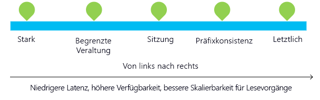

Azure Cosmos DB bietet Entwicklern die Auswahl zwischen fünf klar definierten Konsistenzmodellen aus dem gesamten Konsistenzspektrum: starke Konsistenz, Konsistenz mit begrenzter Veraltung, Sitzungskonsistenz, Präfixkonsistenz und letztliche Konsistenz.Azure Cosmos DB allows developers to choose between five well-defined consistency models along the consistency spectrum – strong, bounded staleness, session, consistent prefix, and eventual. Diese Konsistenzebenen ermöglichen es Ihnen, die Verfügbarkeit und Leistung Ihrer Datenbank je nach Ihren Anforderungen zu maximieren.These consistency levels enable you to maximize the availability and performance of your database, depending on your needs. In Fällen, in denen Daten in einer bestimmten Reihenfolge verarbeitet werden müssen, kann starke Konsistenz die richtige Wahl sein.For cases when data must be processed in a specific order, strong consistency might be the right choice. Für Fälle, in denen die Daten nicht sofort konsistent sein müssen, könnte letztliche Konsistenz die richtige Wahl sein.Or for cases when data doesn't need to be immediately consistent, eventual consistency might be the right choice. 

In dieser Einheit machen Sie sich mit den verfügbaren Konsistenzebenen in Azure Cosmos DB vertraut und bestimmen die richtige Konsistenzebene für Ihre Online-Bekleidungswebsite.In this unit, you'll familiarize yourself with the available consistency levels in Azure Cosmos DB and determine the correct consistency level for your online clothing site.

## Grundlagen der KonsistenzConsistency basics

Jedes Datenbankkonto verfügt über eine Standardkonsistenzebene, die die Konsistenz der Daten innerhalb des Kontos bestimmt.Each database account has a default consistency level, which determines the consistency of data within the account. An einem Ende des Spektrums befindet sich starke Konsistenz, die eine Linearisierungsgarantie bietet, bei der die Lesezugriffe garantiert die neueste Version eines Elements zurückgeben.At one end of the spectrum is Strong consistency, which offers a linearizability guarantee with the reads guaranteed to return the most recent version of an item. Am anderen Ende des Spektrums befindet sich letztliche Konsistenz, die garantiert, dass in Abwesenheit weiterer Schreibvorgänge die Replikate innerhalb der Gruppe schließlich konvergieren.At the other end of the spectrum is Eventual consistency, which guarantees that in absence of any further writes, the replicas within the group eventually converge. In der Mitte befindet sich die Sitzungskonsistenz, die am häufigsten verwendet wird, weil sie monotone Lesevorgänge, monotone Schreibvorgänge und das Lesen eigener Schreibvorgänge (RYW) garantiert.In the middle is Session consistency, which is the most popular because it guarantees monotonic reads, monotonic writes, and read your own writes (RYW) guarantees.

Die Garantien für jede Konsistenzebene werden in der folgenden Tabelle aufgeführt.Guarantees about each consistency level are listed in the following table.
 
**Konsistenzebenen und Garantien****Consistency levels and guarantees**

| KonsistenzebeneConsistency Level | GarantienGuarantees |
| --- | --- |
| StarkStrong | Linearisierbarkeit.Linearizability. Lesevorgänge geben garantiert die neueste Version eines Elements zurück.Reads are guaranteed to return the most recent version of an item.|
| Begrenzte VeraltungBounded Staleness | Präfixkonsistenz.Consistent Prefix. Lesevorgänge bleiben hinter Schreibvorgängen höchstens um Präfix k oder Intervall t zurück.Reads lag behind writes by at most k prefixes or t interval. |
| SitzungSession   | Präfixkonsistenz.Consistent Prefix. Monotone Lesevorgänge, monotone Schreibvorgänge, Lesen der eigenen Schreibvorgänge, Schreibvorgänge folgen Lesevorgängen.Monotonic reads, monotonic writes, read-your-writes, write-follows-reads. |
| PräfixkonsistenzConsistent Prefix | Die zurückgegebenen Aktualisierungen sind ein bestimmtes Präfix aller Aktualisierungen ohne Lücken.Updates returned are some prefix of all the updates, with no gaps. |
| LetztlichEventual  | Lesevorgänge in falscher Reihenfolge.Out of order reads. |

Sie können die Standardkonsistenzebene für Ihr Azure Cosmos DB-Konto im Azure-Portal konfigurieren (und die Konsistenz später für eine bestimmte Leseanforderung außer Kraft setzen).You can configure the default consistency level on your Azure Cosmos DB account (and later override the consistency on a specific read request) in the Azure portal. Intern gilt die Standardkonsistenzebene für Daten innerhalb der Partitionssätze, die sich über mehrere Regionen erstrecken können.Internally, the default consistency level applies to data within the partition sets, which may span regions.

In Azure Cosmos DB sind Lesevorgänge mit Sitzungs-, Präfix- und letztlicher Konsistenz zweimal günstiger (was die Nutzung von Anforderungseinheiten betrifft) als Lesevorgänge mit starker Konsistenz oder begrenzter Veraltung.In Azure Cosmos DB, reads served at session, consistent prefix and eventual consistency are twice as cheap, in terms of request unit consumption, as reads with strong or bounded staleness consistency.

### Verwenden der KonsistenzebenenUse of consistency levels

Etwa 73 Prozent der Azure Cosmos DB-Mandanten arbeiten mit Sitzungskonsistenz. 20 Prozent bevorzugen die begrenzte Veraltung.About 73% of Azure Cosmos DB tenants use session consistency and 20% prefer bounded staleness. Etwa drei Prozent der Azure Cosmos DB-Kunden experimentieren zunächst mit verschiedenen Konsistenzebenen, ehe sie sich für eine bestimmte Konsistenzoption für ihre Anwendung entscheiden.Approximately 3% of Azure Cosmos DB customers experiment with various consistency levels initially before settling on a specific consistency choice for their application. Nur zwei Prozent der Azure Cosmos DB-Mandanten überschreiben Konsistenzebenen auf der Grundlage individueller Anforderungen.Only 2% of Azure Cosmos DB tenants override consistency levels on a per request basis.

## Konsistenzebenen im DetailConsistency levels in detail

Um mehr über die Konsistenzebenen zu erfahren, untersuchen Sie die Konsistenzbeispiele auf Musiknotenbasis im Azure-Portal, und lesen Sie dann die folgenden Informationen zu den einzelnen Ebenen.To learn more about the consistency levels, review the music-note based consistency examples provided in the Azure portal, then review the information below about each level.

1. Klicken Sie im Azure-Portal auf **Standardkonsistenz**.In the Azure portal, click **Default consistency**.
2. Klicken Sie auf jedes der verschiedenen Konsistenzmodelle, und sehen Sie sich die musikalischen Beispiele an.Click through each of the different consistency models and watch the musical examples. Sehen Sie sich an, wie Daten in die verschiedenen Regionen geschrieben werden und wie sich die Wahl der Konsistenz auf das Schreiben der Notendaten auswirkt.See how data is written to the different regions and how the choice of consistency impacts how the note data is written. Beachten Sie, dass die starke Konsistenz ausgegraut ist, da sie nur für Daten verfügbar ist, die in eine Region geschrieben werden.Note that Strong is grayed out as it is only available for data written to a single region.

    

Beschäftigen wir uns ausführlicher mit den Konsistenzebenen.Let's learn more about the consistency levels. Denken Sie darüber nach, wie jede dieser Konsistenzebenen für Ihre Produkt- und Benutzerdaten für Ihre Bekleidungswebsite funktionieren könnte.Think about how each of these consistency levels could work for your product and user data for your clothing retail site.

### Starke KonsistenzStrong consistency

* „Starke Konsistenz“ bietet garantierte [Linearisierbarkeit](https://aphyr.com/posts/313-strong-consistency-models). Dies bedeutet, dass die Lesevorgänge auf jeden Fall die neueste Version eines Elements zurückgeben.Strong consistency offers a [linearizability](https://aphyr.com/posts/313-strong-consistency-models) guarantee with the reads guaranteed to return the most recent version of an item.
* Mit der Konsistenzebene STARK wird gewährleistet, dass ein Schreibvorgang erst sichtbar ist, nachdem er dauerhaft vom Mehrheitsquorum der Replikate bestätigt wurde.Strong consistency guarantees that a write is only visible after it is committed durably by the majority quorum of replicas. Ein Schreibvorgang wird entweder synchron dauerhaft sowohl vom primären Replikat als auch vom Quorum der sekundären Replikate bestätigt oder abgebrochen.A write is either synchronously committed durably by both the primary and the quorum of secondaries, or it is aborted. Ein Lesevorgang wird immer von dem Mehrheitslesequorum bestätigt. Ein Client kann niemals einen unbestätigten oder unvollständigen Schreibvorgang sehen, wodurch gewährleistet wird, dass er immer auf die neuesten bestätigten Schreibvorgänge zugreift.A read is always acknowledged by the majority read quorum, a client can never see an uncommitted or partial write and is always guaranteed to read the latest acknowledged write. 
* Azure Cosmos DB-Konten, die mit dem Modell „Starke Konsistenz“ konfiguriert sind, kann nur eine Azure-Region zugeordnet werden.Azure Cosmos DB accounts that are configured to use strong consistency cannot associate more than one Azure region with their Azure Cosmos DB account.  
* Die Kosten eines Lesevorgangs (im Sinne genutzter Anforderungseinheiten) mit der Konsistenzebene „Stark“ sind höher als bei „Sitzung“ und „Letztlich“, jedoch identisch mit „Begrenzte Veraltung“.The cost of a read operation (in terms of request units consumed) with strong consistency is higher than session and eventual, but the same as bounded staleness.

### Konsistenzebene „Begrenzte Veraltung“Bounded staleness consistency

* Die Konsistenzebene „Begrenzte Veraltung“ garantiert, dass Lesevorgänge hinter Schreibvorgängen höchstens *K* Versionen oder Präfixe eines Elements oder mit dem Zeitintervall *t* zurückbleiben.Bounded staleness consistency guarantees that the reads may lag behind writes by at most *K* versions or prefixes of an item or *t* time-interval.
* Bei Wahl von „Begrenzte Veraltung“ kann die „Veraltung“ auf zwei Weisen konfiguriert werden: Anzahl der *K*-Versionen des Elements, um das die Lesevorgänge den Schreibvorgängen hinterherhinken, und das Zeitintervall *t*.Therefore, when choosing bounded staleness, the "staleness" can be configured in two ways: number of versions *K* of the item by which the reads lag behind the writes, and the time interval *t*.
* „Begrenzte Veraltung“ bietet eine vollständige globale Reihenfolge (nur nicht innerhalb des „Veraltungsfensters“).Bounded staleness offers total global order except within the "staleness window." Die monotonen Lesegarantien bestehen innerhalb einer Region sowohl innerhalb als auch außerhalb des „Veraltungszeitfensters“.The monotonic read guarantees exist within a region both inside and outside the "staleness window."
* Die begrenzte Veraltung bietet eine höhere Konsistenzgarantie als die Konsistenzebenen „Sitzung“, „Präfixkonsistenz“ und „Letztlich“.Bounded staleness provides a stronger consistency guarantee than session, consistent-prefix, or eventual consistency. Für global verteilte Anwendungen wird empfohlen, begrenzte Veraltung in Szenarien zu nutzen, in denen Sie eine hohe Konsistenz, aber auch eine Verfügbarkeit von 99,99 % und niedrige Latenz wünschen.For globally distributed applications, we recommend you use bounded staleness for scenarios where you would like to have strong consistency but also want 99.99% availability and low latency.
* Azure Cosmos DB-Konten, die mit der Konsistenz „Begrenzte Veraltung“ konfiguriert sind, kann eine beliebige Anzahl von Azure-Regionen zugeordnet werden.Azure Cosmos DB accounts that are configured with bounded staleness consistency can associate any number of Azure regions with their Azure Cosmos DB account. 
* Die Kosten eines Lesevorgangs (im Sinne genutzter Anforderungseinheiten) mit der Konsistenzebene „Begrenzte Veraltung“ sind höher als bei „Sitzung“ und „Letztlich“, jedoch identisch mit „Starke Konsistenz“.The cost of a read operation (in terms of RUs consumed) with bounded staleness is higher than session and eventual consistency, but the same as strong consistency.

### SitzungskonsistenzSession consistency

* Anders als die globalen Konsistenzmodelle, die von den Konsistenzebenen „Stark“ und „Begrenzte Veraltung“ geboten werden, ist die Konsistenzebene „Sitzung“ auf eine bestimmte Clientsitzung beschränkt.Unlike the global consistency models offered by strong and bounded staleness consistency levels, session consistency is scoped to a client session.
* Die Konsistenzebene SITZUNG ist ideal für alle Szenarien, an denen eine Geräte- oder Benutzersitzung beteiligt ist, da sie monotone Lese- und Schreibvorgänge garantiert und RYW-Garantien bietet (Read Your Own Writes, eigene Schreibvorgänge lesen).Session consistency is ideal for all scenarios where a device or user session is involved since it guarantees monotonic reads, monotonic writes, and read your own writes (RYW) guarantees.
* Die Konsistenzebene SITZUNG bietet vorhersagbare Konsistenz für eine Sitzung, einen maximalen Lesedurchsatz und Lese- und Schreibvorgänge mit niedrigster Latenz.Session consistency provides predictable consistency for a session, and maximum read throughput while offering the lowest latency writes and reads.
* Azure Cosmos DB-Konten, die mit „Sitzungskonsistenz“ konfiguriert sind, kann eine beliebige Anzahl von Azure-Regionen zugeordnet werden.Azure Cosmos DB accounts that are configured with session consistency can associate any number of Azure regions with their Azure Cosmos DB account.
* Die Kosten für einen Lesevorgang (hinsichtlich genutzter Anforderungseinheiten) mit der Konsistenzebene „Sitzung“ sind geringer als bei „Stark“ und „Begrenzte Veraltung“, aber höher als bei „Letztlich“.The cost of a read operation (in terms of RUs consumed) with session consistency level is less than strong and bounded staleness, but more than eventual consistency.

### PräfixkonsistenzConsistent prefix consistency

* Die Präfixkonsistenz garantiert bei Fehlen weiterer Schreibvorgänge, dass es bei den Replikaten innerhalb der Gruppe letztendlich zur Konvergenz kommt.Consistent prefix guarantees that in absence of any further writes, the replicas within the group eventually converge. 
* Präfixkonsistenz stellt sicher, dass Lesevorgänge keine Schreibvorgänge außerhalb der Reihenfolge angezeigt werden.Consistent prefix guarantees that reads never see out of order writes. Wenn Schreibvorgänge in der Reihenfolge `A, B, C` erfolgen, wird einem Client entweder `A`, `A,B` oder `A,B,C`, aber niemals eine falsche Reihenfolge wie `A,C` oder `B,A,C` angezeigt.If writes were performed in the order `A, B, C`, then a client sees either `A`, `A,B`, or `A,B,C`, but never out of order like `A,C` or `B,A,C`.
* Azure Cosmos DB-Konten, die mit Präfixkonsistenz konfiguriert sind, kann eine beliebige Anzahl von Azure-Regionen zugeordnet werden.Azure Cosmos DB accounts that are configured with consistent prefix consistency can associate any number of Azure regions with their Azure Cosmos DB account. 

### Letztliche KonsistenzEventual consistency

* „Letztliche Konsistenz“ garantiert bei Fehlen weiterer Schreibvorgänge, dass es bei den Replikaten innerhalb der Gruppe letztendlich zur Konvergenz kommt.Eventual consistency guarantees that in absence of any further writes, the replicas within the group eventually converge.
* Die Konsistenzebene LETZTLICH stellt die schwächste Form von Konsistenz dar, bei der ein Client ggf. ältere Werte als die ihm zuvor angezeigten abruft.Eventual consistency is the weakest form of consistency where a client may get the values that are older than the ones it had seen before.
* Die Konsistenzebene „Letztlich“ bietet die schwächste Lesekonsistenz, jedoch die niedrigste Latenz für Lese- und Schreibvorgänge.Eventual consistency provides the weakest read consistency but offers the lowest latency for both reads and writes.
* Azure Cosmos DB-Konten, die mit „Letztliche Konsistenz“ konfiguriert sind, kann eine beliebige Anzahl von Azure-Regionen zugeordnet werden.Azure Cosmos DB accounts that are configured with eventual consistency can associate any number of Azure regions with their Azure Cosmos DB account. 
* Die Kosten eines Lesevorgangs (hinsichtlich genutzter Anforderungseinheiten) mit der Ebene „Letztliche Konsistenz“ sind die niedrigsten aller Konsistenzebenen von Azure Cosmos DB.The cost of a read operation (in terms of RUs consumed) with the eventual consistency level is the lowest of all the Azure Cosmos DB consistency levels.

## ZusammenfassungSummary

In dieser Einheit haben Sie gelernt, wie Konsistenzebenen verwendet werden können, um die Hochverfügbarkeit zu maximieren und die Latenzzeit zu minimieren.In this unit, you've learned how consistency levels can be used to maximize high-availability and minimize latency.