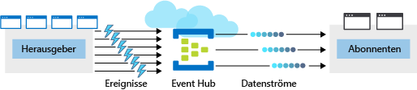

Ihr Team hat sich entschieden, die Möglichkeiten von Azure Event Hubs zu nutzen, um das steigende Transaktionsvolumen in Ihrem System zu bewältigen und zu verarbeiten.

Ein Event Hub ist eine Azure-Ressource. Daher ist Ihr erster Schritt das Erstellen eines neuen Hubs in Azure, den Sie entsprechend den spezifischen Anforderungen Ihrer Anwendungen konfigurieren.

## Was ist ein Azure Event Hub?

Azure Event Hubs ist ein cloudbasierter Dienst zur Ereignisverarbeitung, der pro Sekunde Millionen von Ereignissen empfangen und verarbeiten kann. Event Hubs fungiert als Zugang zu einer Ereignispipeline, in der eingehende Daten empfangen und gespeichert werden, bis Verarbeitungsressourcen verfügbar sind.

Eine Entität, die Daten an die Event Hubs sendet, wird als *Herausgeber* und eine Entität, die Daten von den Event Hubs liest, als *Consumer* oder *Abonnent* bezeichnet. Azure Event Hubs befindet sich zwischen diesen beiden Entitäten, um die Produktion (durch den Herausgeber) und den Verbrauch (durch den Abonnenten) eines Ereignisdatenstroms aufzuteilen. Diese Entkopplung hilft, Szenarios zu bewältigen, in denen mehr Ereignisse erzeugt als genutzt werden. In der folgenden Abbildung ist die Rolle eines Event Hubs dargestellt.

### Ereignisse

Ein **Ereignis** ist ein kleines Paket mit Informationen (ein *Datagramm*), das eine Benachrichtigung enthält. Ereignisse können einzeln oder in Batches veröffentlicht werden, aber eine einzelne Veröffentlichung (ob einzeln oder als Batch) darf 256 KB nicht überschreiten.

### Herausgeber und Abonnenten

Ereignisherausgeber sind alle Anwendungen oder Geräte, die Ereignisse über HTTPS oder Advanced Message Queuing Protocol (AMQP) 1.0 senden können.

Für Herausgeber, die Daten häufig senden, bietet AMQP eine bessere Leistung. Es weist jedoch einen höheren anfänglichen Sitzungsaufwand auf, da zunächst ein persistentes bidirektionales Socket und Transport Level Security (TLS) oder SSL/TLS eingerichtet werden müssen. 

Für ein Veröffentlichen mit häufigerer Unterbrechung ist HTTPS die bessere Option. Obwohl HTTPS für jede Anforderung zusätzlichen Aufwand mit sich bringt, fällt kein Aufwand für die Sitzungsinitialisierung an.

> [!NOTE] 
> Bestehende Kafka-basierte Clients, die Apache Kafka 1.0 und neuere Clientversionen verwenden, können auch als Event Hubs-Herausgeber fungieren.

Ereignisabonnenten sind Anwendungen, die eine von zwei unterstützten programmgesteuerten Methoden verwenden, um Ereignisse von einem Event Hub zu empfangen und zu verarbeiten.

- **EventHubReceiver**: Eine einfache Methode, die eingeschränkte Optionen für die Verwaltung bereitstellt.
- **EventProcessorHost**: Eine effiziente Methode, die wir später in diesem Modul verwenden.

### Consumergruppen

Eine Event Hub-**Consumergruppe** stellt eine spezifische Ansicht eines Event Hub-Datenstroms dar. Durch die Verwendung separater Consumergruppen können mehrere Abonnentenanwendungen einen Ereignisdatenstrom unabhängig und ohne Auswirkungen auf andere Anwendungen verarbeiten. Allerdings ist die Verwendung mehrerer Consumergruppen keine Voraussetzung, und für viele Anwendungen ist die einzelne Standardconsumergruppe ausreichend.

### Preise

Für Azure Event Hubs gibt es drei Tarife: Basic, Standard und Dedicated. Die Tarife unterscheiden sich hinsichtlich der unterstützten Verbindungen, der Anzahl verfügbarer Consumergruppen und des Durchsatzes. Wenn Sie mit der Azure CLI einen Event Hubs-Namespace erstellen und keinen Tarif angeben, wird **Standard** (20 Consumergruppen, 1.000 vermittelte Verbindungen) zugewiesen.

## Erstellen und Konfigurieren eines neuen Azure Event Hubs

Es gibt zwei unverzichtbare Schritte beim Erstellen und Konfigurieren eines neuen Azure Event Hubs. Der erste Schritt ist das Definieren eines Event Hubs-**Namespace**. Der zweite Schritt ist das Erstellen eines Event Hubs in diesem Namespace.

### Definieren eines Event Hubs-Namespace

Ein Event Hubs-Namespace ist eine Containerentität für die Verwaltung eines oder mehrerer Event Hubs. Das Erstellen einen Event Hubs-Namespace umfasst in der Regel Folgendes:

1. Definieren von Einstellungen auf Namespace-Ebene. Bestimmte Einstellungen wie Namespacekapazität (die mit **Durchsatzeinheiten** konfiguriert wird), Tarif und Leistungsmetriken werden auf Namespace-Ebene definiert. Diese gelten für alle Event Hubs innerhalb dieses Namespace. Wenn Sie diese Einstellungen nicht festlegen, wird ein Standardwert verwendet: *1* für Kapazität und *Standard* für Tarif.

    Sie können die Durchsatzeinheit nicht ändern, nachdem Sie sie festgelegt haben. Sie müssen Ihre Konfiguration auf Ihr verfügbares Azure-Budget abstimmen. Sie können für unterschiedliche Durchsatzanforderungen verschiedene Event Hubs konfigurieren. Wenn Sie beispielsweise eine Vertriebsdatenanwendung betreiben und zwei Event Hubs planen (einen für die Telemetrieerfassung von Vertriebsdaten in Echtzeit mit hohem Durchsatz und einen für die gelegentliche Sammlung von Ereignisprotokollen), wäre es sinnvoll, für jeden Hub einen eigenen Namespace zu verwenden. Auf diese Weise müssen Sie nur eine hohe Durchsatzkapazität für den Telemetrie-Event Hub konfigurieren (und bezahlen).

1. Auswählen eines eindeutigen Namens für den Namespace. Auf den Namespace kann über diese URL zugegriffen werden: *_Namespace_.servicebus.windows.net*

1. Definieren der folgenden optionalen Eigenschaften:

    - Aktivieren Sie Kafka. Diese Option ermöglicht Kafka-Anwendungen das Veröffentlichen von Ereignissen für den Event Hub.
    - Richten Sie diesen Namespace zonenredundant ein. Zonenredundanz ermöglicht die Replikation von Daten in separaten Rechenzentren mit eigener unabhängiger Energieversorgung, Netzwerk- und Kühlinfrastruktur.
    - Aktivieren Sie „Automatische Vergrößerung“ und „Maximale Durchsatzeinheiten für die automatische Vergrößerung“. „Automatische Vergrößerung“ bietet eine Option für automatisches Hochskalieren, bei der die Anzahl von Durchsatzeinheiten bis zu einem Maximalwert erhöht wird. Dies ist nützlich, um in Situationen, in denen ein- oder ausgehende Datenraten die aktuell festgelegte Anzahl von Durchsatzeinheiten überschreiten, eine Drosselung zu vermeiden.

### Azure CLI-Befehle zum Erstellen eines Event Hubs-Namespace

Sie verwenden den Befehl `az eventhubs namespace`, um einen neuen Event Hubs-Namespace zu erstellen. Hier ist eine kurze Beschreibung der untergeordneten Befehle angegeben, die wir in dieser Übung verwenden.

| Befehl | Beschreibung |
|---------|-------------|
| `create` | Erstellen des Event Hubs-Namespace |
| `authorization-rule` | Für alle Event Hubs in demselben Event Hubs-Namespace gelten für die Verbindungsherstellung dieselben Anmeldeinformationen. Sie benötigen diese Anmeldeinformationen, wenn Sie Anwendungen zum Senden und Empfangen von Nachrichten über den Event Hub konfigurieren. Mit diesem Befehl wird die Verbindungszeichenfolge für Ihren Event Hubs-Namespace zurückgegeben. |

### Konfigurieren eines neuen Event Hubs

Nachdem der Event Hubs-Namespace erstellt wurde, können Sie einen Event Hub erstellen. Beim Erstellen eines neuen Event Hubs sind mehrere obligatorische Parameter zu beachten.

Die folgenden Parameter sind erforderlich:

- **Event Hub-Name**: Der Event Hub-Name muss innerhalb Ihres Abonnements eindeutig sein und folgende Eigenschaften aufweisen:
  - 1 bis 50 Zeichen
  - Nur Buchstaben, Ziffern, Punkte, Bindestriche und Unterstriche
  - Mit einem Buchstaben oder einer Ziffer beginnen und enden
- **Partitionsanzahl**: Die Anzahl von in einem Event Hub erforderlichen Partitionen (2 bis 32). Dies sollte in direktem Zusammenhang mit der erwarteten Anzahl gleichzeitiger Consumer stehen. Dieser Wert kann nach der Erstellung des Event Hubs nicht mehr geändert werden. Die Partition trennt den Nachrichtendatenstrom ab, sodass Consumer- oder Empfängeranwendungen nur eine bestimmte Teilmenge des Datenstroms lesen müssen. Falls nicht definiert, lautet der Standardwert *4*.
- **Nachrichtenaufbewahrung**: Die Anzahl von Tagen (1 bis 7), die Nachrichten verfügbar bleiben, wenn der Datenstrom aus beliebigem Grund erneut wiedergegeben werden muss. Wenn nichts definiert wird, lautet der Standardwert *7*.

Sie können auch optional einen Event Hub konfigurieren, um Daten an ein Azure Blob Storage- oder Azure Data Lake Store-Konto zu streamen.

### Azure CLI-Befehle zum Erstellen eines Event Hubs

Sie verwenden den Befehlssatz `az eventhubs eventhub`, um mit der Azure CLI einen neuen Event Hub zu erstellen. Hier ist eine kurze Beschreibung der verwendeten untergeordneten Befehle angegeben:

| Befehl | Beschreibung |
|---------|-------------|
| `create` | Hiermit wird der Event Hub im angegebenen Namespace erstellt. |
| `show` | Hiermit werden die Details Ihres Event Hubs angezeigt. |

## Zusammenfassung

Zum Bereitstellen von Azure Event Hubs müssen Sie zuerst einen Event Hubs-Namespace und dann den eigentlichen Event Hub konfigurieren. Im nächsten Abschnitt führen Sie die ausführlichen Konfigurationsschritte aus, um einen neuen Namespace und Event Hub zu erstellen.