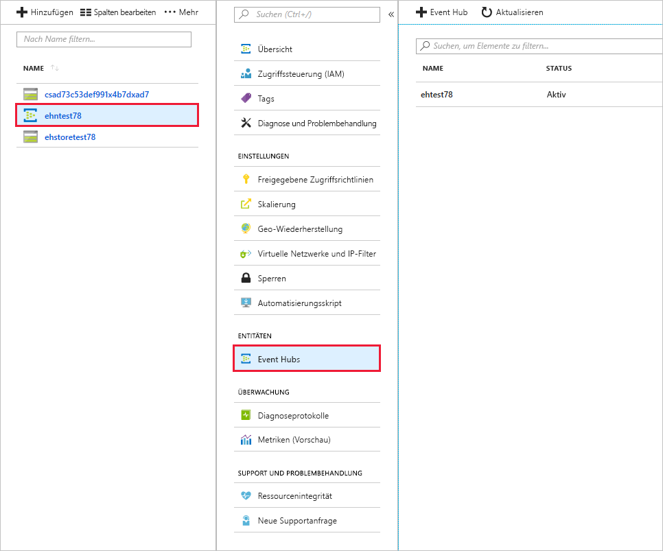

<span data-ttu-id="64909-101">Sie können nun einen neuen Event Hub erstellen.</span><span class="sxs-lookup"><span data-stu-id="64909-101">You're now ready to create a new Event Hub.</span></span> <span data-ttu-id="64909-102">Nachdem der Event Hub erstellt wurde, verwenden Sie das Azure-Portal, um Ihren neuen Hub anzuzeigen.</span><span class="sxs-lookup"><span data-stu-id="64909-102">After creating the Event Hub, you'll use the Azure portal to view your new hub.</span></span>

[!include[](../../../includes/azure-sandbox-activate.md)]

## <a name="set-some-defaults-in-the-azure-cli"></a><span data-ttu-id="64909-103">Festlegen von Standardwerten in der Azure CLI</span><span class="sxs-lookup"><span data-stu-id="64909-103">Set some defaults in the Azure CLI</span></span>

<span data-ttu-id="64909-104">Zunächst geben wir einige Standardwerte für die Azure CLI in Cloud Shell an.</span><span class="sxs-lookup"><span data-stu-id="64909-104">Let's start by providing some default values for the Azure CLI in the Cloud Shell.</span></span> <span data-ttu-id="64909-105">So wird verhindert, dass Sie diese Werte jedes Mal eingeben müssen.</span><span class="sxs-lookup"><span data-stu-id="64909-105">This will keep you from having to type these in every time.</span></span> <span data-ttu-id="64909-106">Es geht hierbei vor allem um die _Ressourcengruppe_ und den _Standort_.</span><span class="sxs-lookup"><span data-stu-id="64909-106">In particular, let's set the _resource group_ and _location_.</span></span> <span data-ttu-id="64909-107">Wählen Sie in der folgenden Liste einen Standort aus.</span><span class="sxs-lookup"><span data-stu-id="64909-107">Select a location from the following list.</span></span>

[!include[](../../../includes/azure-sandbox-regions-first-mention-note.md)]

<span data-ttu-id="64909-108">Geben Sie anschließend den folgenden Befehl in die Azure CLI ein, und ersetzen Sie den Standort durch einen Standort in Ihrer Nähe.</span><span class="sxs-lookup"><span data-stu-id="64909-108">Then type the following command into the Azure CLI, make sure to replace the location with one close to you.</span></span>

```azurecli
az configure --defaults group=<rgn>[sandbox Resource Group]</rgn> location=westus2
```

## <a name="create-an-event-hubs-namespace"></a><span data-ttu-id="64909-109">Erstellen eines Event Hubs-Namespace</span><span class="sxs-lookup"><span data-stu-id="64909-109">Create an Event Hubs namespace</span></span>

<span data-ttu-id="64909-110">Wenn Sie die folgenden Schritte ausführen, können Sie einen Event Hubs-Namespace mithilfe der von Azure Cloud Shell unterstützten Bash-Shell erstellen:</span><span class="sxs-lookup"><span data-stu-id="64909-110">Use the following steps to create an Event Hubs namespace using bash shell supported by Azure Cloud shell:</span></span>

1. <span data-ttu-id="64909-111">Erstellen Sie mit dem Befehl `az eventhubs namespace create` den Event Hubs-Namespace.</span><span class="sxs-lookup"><span data-stu-id="64909-111">Create the Event Hubs namespace using the `az eventhubs namespace create` command.</span></span> <span data-ttu-id="64909-112">Verwenden Sie die folgenden Parameter.</span><span class="sxs-lookup"><span data-stu-id="64909-112">Use the following parameters.</span></span>

    > [!div class="mx-tableFixed"]
    > |<span data-ttu-id="64909-113">Parameter</span><span class="sxs-lookup"><span data-stu-id="64909-113">Parameter</span></span>      |<span data-ttu-id="64909-114">Beschreibung</span><span class="sxs-lookup"><span data-stu-id="64909-114">Description</span></span>|
    > |---------------|-----------|
    > |<span data-ttu-id="64909-115">--name (erforderlich)</span><span class="sxs-lookup"><span data-stu-id="64909-115">--name (required)</span></span>      |<span data-ttu-id="64909-116">Geben Sie Ihrem Event Hubs-Namespace einen eindeutigen Namen, der zwischen 6 und 50 Zeichen lang ist.</span><span class="sxs-lookup"><span data-stu-id="64909-116">Enter a 6-50 characters-long unique name for your Event Hubs namespace.</span></span> <span data-ttu-id="64909-117">Der Name darf nur Buchstaben, Zahlen und Bindestriche enthalten.</span><span class="sxs-lookup"><span data-stu-id="64909-117">The name should contain only letters, numbers, and hyphens.</span></span> <span data-ttu-id="64909-118">Er muss zudem mit einem Buchstaben beginnen und mit einem Buchstaben oder einer Zahl enden.</span><span class="sxs-lookup"><span data-stu-id="64909-118">It should start with a letter and end with a letter or number.</span></span>|
    > |<span data-ttu-id="64909-119">--resource-group (erforderlich)</span><span class="sxs-lookup"><span data-stu-id="64909-119">--resource-group (required)</span></span> | <span data-ttu-id="64909-120">Dies ist die vorab erstellte Ressourcengruppe der Azure-Sandbox, die über die Standardwerte bereitgestellt wird.</span><span class="sxs-lookup"><span data-stu-id="64909-120">This will be the pre-created Azure sandbox resource group supplied from the defaults.</span></span> |
    > |<span data-ttu-id="64909-121">--l (optional)</span><span class="sxs-lookup"><span data-stu-id="64909-121">--l (optional)</span></span>     |<span data-ttu-id="64909-122">Geben Sie den Standort Ihres nächstgelegenen Azure-Rechenzentrums ein. Hierfür wird Ihr Standardwert verwendet.</span><span class="sxs-lookup"><span data-stu-id="64909-122">Enter the location of your nearest Azure datacenter, this will use your default.</span></span>|
    > |<span data-ttu-id="64909-123">--sku (optional)</span><span class="sxs-lookup"><span data-stu-id="64909-123">--sku (optional)</span></span> | <span data-ttu-id="64909-124">Der Tarif für den Namespace [Basic</span><span class="sxs-lookup"><span data-stu-id="64909-124">The pricing tier for the namespace [Basic</span></span> | <span data-ttu-id="64909-125">Standard], standardmäßig _Standard_.</span><span class="sxs-lookup"><span data-stu-id="64909-125">Standard], defaults to _Standard_.</span></span> <span data-ttu-id="64909-126">Hiermit werden die Verbindungen und Consumerschwellenwerte bestimmt.</span><span class="sxs-lookup"><span data-stu-id="64909-126">This determines the connections and consumer thresholds.</span></span> |

    <span data-ttu-id="64909-127">Legen Sie den Namen in einer Umgebungsvariablen fest, damit Sie ihn wiederverwenden können.</span><span class="sxs-lookup"><span data-stu-id="64909-127">Set the name into an environment variable so we can reuse it.</span></span>

    ```azurecli
    NS_NAME=myEvt-HubNs1
    ````

    [!include[](../../../includes/azure-cloudshell-copy-paste-tip.md)]

    ```azurecli
    az eventhubs namespace create --name $NS_NAME
    ```

    > [!NOTE]
    > <span data-ttu-id="64909-128">Azure ist beim Namen sehr wählerisch, und die CLI gibt **Ungültige Anforderung** zurück, wenn der Name bereits vorhanden oder ungültig ist.</span><span class="sxs-lookup"><span data-stu-id="64909-128">Azure is very picky about the name and the CLI returns **Bad Request** if the name exists or is invalid.</span></span> <span data-ttu-id="64909-129">Probieren Sie es mit einem anderen Namen, indem Sie die Umgebungsvariable ändern und den Befehl erneut ausführen.</span><span class="sxs-lookup"><span data-stu-id="64909-129">Try a different name by changing your environment variable and reissuing the command.</span></span>


1. <span data-ttu-id="64909-130">Rufen Sie die Verbindungszeichenfolge für Ihren Event Hubs-Namespace mithilfe des folgenden Befehls ab.</span><span class="sxs-lookup"><span data-stu-id="64909-130">Fetch the connection string for your Event Hubs namespace using the following command.</span></span> <span data-ttu-id="64909-131">Sie benötigen diese, wenn Sie Anwendungen zum Senden und Empfangen von Nachrichten über Ihren Event Hub konfigurieren.</span><span class="sxs-lookup"><span data-stu-id="64909-131">You'll need this to configure applications to send and receive messages using your Event Hub.</span></span>

    ```azurecli
    az eventhubs namespace authorization-rule keys list --name RootManageSharedAccessKey --namespace-name $NS_NAME
    ```

    > [!div class="mx-tableFixed"]
    > |<span data-ttu-id="64909-132">Parameter</span><span class="sxs-lookup"><span data-stu-id="64909-132">Parameter</span></span>      |<span data-ttu-id="64909-133">Beschreibung</span><span class="sxs-lookup"><span data-stu-id="64909-133">Description</span></span>|
    > |---------------|-----------|
    > |<span data-ttu-id="64909-134">--resource-group (erforderlich)</span><span class="sxs-lookup"><span data-stu-id="64909-134">--resource-group (required)</span></span>  | <span data-ttu-id="64909-135">Dies ist die vorab erstellte Ressourcengruppe der Azure-Sandbox, die über die Standardwerte bereitgestellt wird.</span><span class="sxs-lookup"><span data-stu-id="64909-135">This will be the pre-created Azure sandbox resource group supplied from the defaults.</span></span> |
    > |<span data-ttu-id="64909-136">--namespace-name (erforderlich)</span><span class="sxs-lookup"><span data-stu-id="64909-136">--namespace-name (required)</span></span>  | <span data-ttu-id="64909-137">Geben Sie den Namen des von Ihnen erstellten Namespace ein.</span><span class="sxs-lookup"><span data-stu-id="64909-137">Enter the name of the namespace you created.</span></span> |

    <span data-ttu-id="64909-138">Dieser Befehl gibt einen JSON-Block mit der Verbindungszeichenfolge für Ihren Event Hubs-Namespace zurück, den Sie später zum Konfigurieren Ihrer Herausgeber- und Consumeranwendungen verwenden.</span><span class="sxs-lookup"><span data-stu-id="64909-138">This command returns a JSON block with the connection string for your Event Hubs namespace that you'll use later to configure your publisher and consumer applications.</span></span> <span data-ttu-id="64909-139">Speichern Sie den Wert der folgenden Schlüssel für den späteren Gebrauch.</span><span class="sxs-lookup"><span data-stu-id="64909-139">Save the value of the following keys for later use.</span></span>

    - <span data-ttu-id="64909-140">**primaryConnectionString**</span><span class="sxs-lookup"><span data-stu-id="64909-140">**primaryConnectionString**</span></span>
    - <span data-ttu-id="64909-141">**primaryKey**</span><span class="sxs-lookup"><span data-stu-id="64909-141">**primaryKey**</span></span>

## <a name="create-an-event-hub"></a><span data-ttu-id="64909-142">Erstellen eines Event Hubs</span><span class="sxs-lookup"><span data-stu-id="64909-142">Create an Event Hub</span></span>

<span data-ttu-id="64909-143">Führen Sie die folgenden Schritte aus, um Ihren neuen Event Hub zu erstellen:</span><span class="sxs-lookup"><span data-stu-id="64909-143">Use the following steps to create your new Event Hub:</span></span>

1. <span data-ttu-id="64909-144">Erstellen Sie mit dem Befehl `eventhub create` einen neuen Event Hub.</span><span class="sxs-lookup"><span data-stu-id="64909-144">Create a new Event Hub using the `eventhub create` command.</span></span> <span data-ttu-id="64909-145">Hierfür sind die folgenden Parameter erforderlich:</span><span class="sxs-lookup"><span data-stu-id="64909-145">It needs the following parameters:</span></span>

    > [!div class="mx-tableFixed"]
    > |<span data-ttu-id="64909-146">Parameter</span><span class="sxs-lookup"><span data-stu-id="64909-146">Parameter</span></span>      |<span data-ttu-id="64909-147">Beschreibung</span><span class="sxs-lookup"><span data-stu-id="64909-147">Description</span></span>|
    > |---------------|-----------|
    > |<span data-ttu-id="64909-148">--name (erforderlich)</span><span class="sxs-lookup"><span data-stu-id="64909-148">--name (required)</span></span>  |<span data-ttu-id="64909-149">Geben Sie einen Namen für Ihren Event Hub ein.</span><span class="sxs-lookup"><span data-stu-id="64909-149">Enter a name for your Event Hub.</span></span>|
    > |<span data-ttu-id="64909-150">--resource-group (erforderlich)</span><span class="sxs-lookup"><span data-stu-id="64909-150">--resource-group (required)</span></span>  |<span data-ttu-id="64909-151">Ressourcengruppenbesitzer</span><span class="sxs-lookup"><span data-stu-id="64909-151">Resource group owner.</span></span>|
    > |<span data-ttu-id="64909-152">--namespace-name (erforderlich)</span><span class="sxs-lookup"><span data-stu-id="64909-152">--namespace-name (required)</span></span>      |<span data-ttu-id="64909-153">Geben Sie den Namespace ein, den Sie erstellt haben.</span><span class="sxs-lookup"><span data-stu-id="64909-153">Enter the namespace you created.</span></span>|

    <span data-ttu-id="64909-154">Wir definieren den Event Hub-Namen zuerst in einer Umgebungsvariablen.</span><span class="sxs-lookup"><span data-stu-id="64909-154">Let's define the Event Hub name in an environment variable first.</span></span>

    ```azurecli
    HUB_NAME=[name]
    ```

    ```azurecli
    az eventhubs eventhub create --name $HUB_NAME --namespace-name $NS_NAME
    ```

1. <span data-ttu-id="64909-155">Zeigen Sie mit dem Befehl `eventhub show` die Informationen zu Ihrem Event Hub an.</span><span class="sxs-lookup"><span data-stu-id="64909-155">View the details of your Event Hub using the `eventhub show` command.</span></span> <span data-ttu-id="64909-156">Hierfür wird Folgendes verwendet:</span><span class="sxs-lookup"><span data-stu-id="64909-156">It takes:</span></span>

    > [!div class="mx-tableFixed"]
    > |<span data-ttu-id="64909-157">Parameter</span><span class="sxs-lookup"><span data-stu-id="64909-157">Parameter</span></span>      |<span data-ttu-id="64909-158">Beschreibung</span><span class="sxs-lookup"><span data-stu-id="64909-158">Description</span></span>|
    > |---------------|-----------|
    > |<span data-ttu-id="64909-159">--resource-group (erforderlich)</span><span class="sxs-lookup"><span data-stu-id="64909-159">--resource-group (required)</span></span>  |<span data-ttu-id="64909-160">Ressourcengruppenbesitzer</span><span class="sxs-lookup"><span data-stu-id="64909-160">Resource group owner.</span></span>|
    > |<span data-ttu-id="64909-161">--namespace-name (erforderlich)</span><span class="sxs-lookup"><span data-stu-id="64909-161">--namespace-name (required)</span></span>      |<span data-ttu-id="64909-162">Geben Sie den Namespace ein, den Sie erstellt haben.</span><span class="sxs-lookup"><span data-stu-id="64909-162">Enter the namespace you created.</span></span>|
    > |<span data-ttu-id="64909-163">--name (erforderlich)</span><span class="sxs-lookup"><span data-stu-id="64909-163">--name  (required)</span></span>|<span data-ttu-id="64909-164">Name des Event Hubs.</span><span class="sxs-lookup"><span data-stu-id="64909-164">Name of the Event Hub.</span></span>|

    ```azurecli
    az eventhubs eventhub show --namespace-name $NS_NAME --name $HUB_NAME
    ```

## <a name="view-the-event-hub-in-the-azure-portal"></a><span data-ttu-id="64909-165">Anzeigen des Event Hubs im Azure-Portal</span><span class="sxs-lookup"><span data-stu-id="64909-165">View the Event Hub in the Azure portal</span></span>

<span data-ttu-id="64909-166">Als Nächstes wird beschrieben, wie dies im Azure-Portal aussieht.</span><span class="sxs-lookup"><span data-stu-id="64909-166">Next, let's see what this looks like in the Azure portal.</span></span>

1. <span data-ttu-id="64909-167">Melden Sie sich beim [Azure-Portal](https://portal.azure.com/learn.docs.microsoft.com?azure-portal=true) mit demselben Konto an, über das Sie die Sandbox aktiviert haben.</span><span class="sxs-lookup"><span data-stu-id="64909-167">Sign into the [Azure portal](https://portal.azure.com/learn.docs.microsoft.com?azure-portal=true) using the same account you activated the sandbox with.</span></span>

1. <span data-ttu-id="64909-168">Suchen Sie über die Suchleiste am oberen Rand des Portals nach Ihrem Event Hubs-Namespace.</span><span class="sxs-lookup"><span data-stu-id="64909-168">Find your Event Hubs namespace using the Search bar at the top of portal.</span></span>

1. <span data-ttu-id="64909-169">Wählen Sie Ihren Namespace aus, um ihn zu öffnen.</span><span class="sxs-lookup"><span data-stu-id="64909-169">Select your namespace to open it.</span></span>

1. <span data-ttu-id="64909-170">Wählen Sie unter dem Abschnitt **ENTITÄTEN** die Option **Event Hubs-Namespace**.</span><span class="sxs-lookup"><span data-stu-id="64909-170">Select **Event Hubs namespace** under the **ENTITIES** section.</span></span>

1. <span data-ttu-id="64909-171">Klicken Sie auf **Event Hubs**.</span><span class="sxs-lookup"><span data-stu-id="64909-171">Click **Event Hubs**.</span></span>

    <span data-ttu-id="64909-172">Ihr Event Hub wird mit dem Zustand **Aktiv** sowie mit den Standardwerten für die **Nachrichtenaufbewahrung** (*7*) und **Partitionsanzahl** (*4*) angezeigt.</span><span class="sxs-lookup"><span data-stu-id="64909-172">Your Event Hub displays with a status of **Active**, and default values for **Message Retention** (*7*) and **Partition Count** of (*4*).</span></span>

    

## <a name="summary"></a><span data-ttu-id="64909-174">Zusammenfassung</span><span class="sxs-lookup"><span data-stu-id="64909-174">Summary</span></span>

<span data-ttu-id="64909-175">Sie haben nun einen neuen Event Hub erstellt. Sie verfügen über alle erforderlichen Informationen zum Konfigurieren Ihrer Herausgeber- und Consumeranwendungen.</span><span class="sxs-lookup"><span data-stu-id="64909-175">You've now created a new Event Hub, and you've all the necessary information ready to configure your publisher and consumer applications.</span></span>
