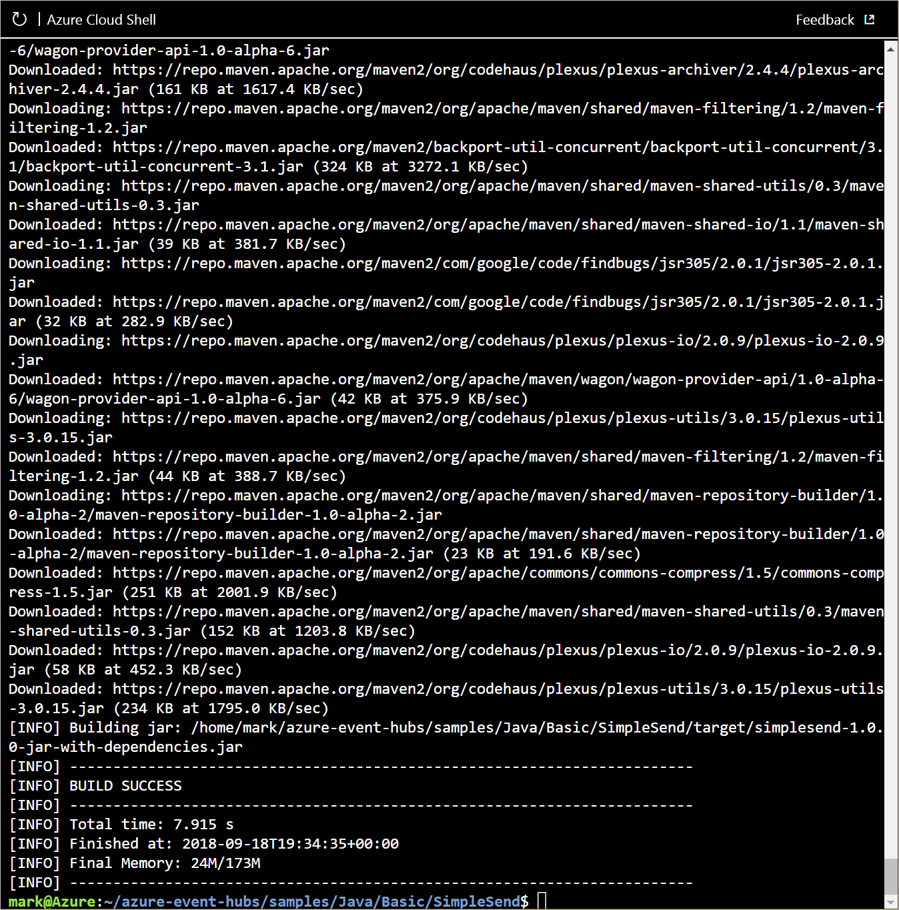

<span data-ttu-id="27129-101">Sie können nun Ihre Herausgeber- und Consumeranwendungen für Ihren Event Hub konfigurieren.</span><span class="sxs-lookup"><span data-stu-id="27129-101">You're now ready to configure your publisher and consumer applications for your Event Hub.</span></span>

<span data-ttu-id="27129-102">In dieser Einheit konfigurieren Sie diese Anwendungen zum Senden oder Empfangen von Nachrichten über Ihren Event Hub.</span><span class="sxs-lookup"><span data-stu-id="27129-102">In this unit, you'll configure these applications to send or receive messages through your Event Hub.</span></span> <span data-ttu-id="27129-103">Diese Anwendungen werden in einem GitHub-Repository gespeichert.</span><span class="sxs-lookup"><span data-stu-id="27129-103">These applications are stored in a GitHub repository.</span></span>

<span data-ttu-id="27129-104">Sie konfigurieren zwei getrennte Anwendungen. Eine fungiert als Nachrichtenabsender (**SimpleSend**), die andere als Nachrichtenempfänger (**EventProcessorSample**).</span><span class="sxs-lookup"><span data-stu-id="27129-104">You'll configure two separate applications; one acts as the message sender (**SimpleSend**), the other as the message receiver (**EventProcessorSample**).</span></span> <span data-ttu-id="27129-105">Dies sind Java-Anwendungen, die es Ihnen ermöglichen, sämtliche Aufgaben im Browser zu erledigen.</span><span class="sxs-lookup"><span data-stu-id="27129-105">These are Java applications, which enable you to do everything within the browser.</span></span> <span data-ttu-id="27129-106">Die gleiche Konfiguration wird jedoch für jede Plattform benötigt, wie z.B. .NET.</span><span class="sxs-lookup"><span data-stu-id="27129-106">However, the same configuration is needed for any platform, such as .NET.</span></span>

## <a name="create-a-general-purpose-standard-storage-account"></a><span data-ttu-id="27129-107">Erstellen eines allgemeinen Standardspeicherkontos</span><span class="sxs-lookup"><span data-stu-id="27129-107">Create a general-purpose, standard storage account</span></span>

<span data-ttu-id="27129-108">Die Java-Empfängeranwendung, die Sie in dieser Einheit konfigurieren, speichert Nachrichten in Azure Blob Storage.</span><span class="sxs-lookup"><span data-stu-id="27129-108">The Java receiver application, that you'll configure in this unit, stores messages in Azure Blob Storage.</span></span> <span data-ttu-id="27129-109">Für Blob Storage ist ein Speicherkonto erforderlich.</span><span class="sxs-lookup"><span data-stu-id="27129-109">Blob Storage requires a storage account.</span></span>

1. <span data-ttu-id="27129-110">Erstellen Sie mit dem Befehl `storage account create` ein Speicherkonto (Allgemein V2).</span><span class="sxs-lookup"><span data-stu-id="27129-110">Create a storage account (general-purpose V2) using the `storage account create` command.</span></span> <span data-ttu-id="27129-111">Zur Erinnerung: Wir haben eine Standardressourcengruppe und einen Standort festgelegt, sodass wir diese Parameter, obwohl sie normalerweise _benötigt_ werden, weglassen können.</span><span class="sxs-lookup"><span data-stu-id="27129-111">Remember we set a default resource group and location, so even though those parameters are normally _required_, we can leave them off.</span></span>

    |<span data-ttu-id="27129-112">Parameter</span><span class="sxs-lookup"><span data-stu-id="27129-112">Parameter</span></span>      |<span data-ttu-id="27129-113">Beschreibung</span><span class="sxs-lookup"><span data-stu-id="27129-113">Description</span></span>|
    |---------------|-----------|
    |<span data-ttu-id="27129-114">--name (erforderlich)</span><span class="sxs-lookup"><span data-stu-id="27129-114">--name (required)</span></span>  | <span data-ttu-id="27129-115">Ein Name für Ihr Speicherkonto.</span><span class="sxs-lookup"><span data-stu-id="27129-115">A name for your storage account.</span></span> |
    |<span data-ttu-id="27129-116">--resource-group (erforderlich)</span><span class="sxs-lookup"><span data-stu-id="27129-116">--resource-group (required)</span></span>  |<span data-ttu-id="27129-117">Der Ressourcengruppenbesitzer.</span><span class="sxs-lookup"><span data-stu-id="27129-117">The resource group owner.</span></span> <span data-ttu-id="27129-118">Wir verwenden die vorab erstellte Sandboxressourcengruppe.</span><span class="sxs-lookup"><span data-stu-id="27129-118">We'll use the pre-created sandbox resource group.</span></span>|
    |<span data-ttu-id="27129-119">--location (optional)</span><span class="sxs-lookup"><span data-stu-id="27129-119">--location (optional)</span></span>    |<span data-ttu-id="27129-120">Ein optionaler Standort, wenn Sie das Speicherkonto an einem bestimmten Ort und nicht am Standort der Ressourcengruppe wünschen.</span><span class="sxs-lookup"><span data-stu-id="27129-120">An optional location if you want the storage account in a specific place vs. the resource group location.</span></span>|

    <span data-ttu-id="27129-121">Geben Sie den Namen des Speicherkontos in eine Variable ein.</span><span class="sxs-lookup"><span data-stu-id="27129-121">Set the storage account name into a variable.</span></span> <span data-ttu-id="27129-122">Dieser darf nur als Kleinbuchstaben und Zahlen mit Bindestrichen als Trennzeichen bestehen.</span><span class="sxs-lookup"><span data-stu-id="27129-122">It must be composed of all lower-case letters, numbers, with hyphen separators allowed.</span></span> <span data-ttu-id="27129-123">Außerdem muss er in Azure eindeutig sein.</span><span class="sxs-lookup"><span data-stu-id="27129-123">It also must be unique within Azure.</span></span>

    ```azurecli
    STORAGE_NAME=[name]
    ```

    <span data-ttu-id="27129-124">Führen Sie nun diesen Befehl zum Erstellen des Speicherkontos aus.</span><span class="sxs-lookup"><span data-stu-id="27129-124">Then use this command to create the storage account.</span></span>

    ```azurecli
    az storage account create --name $STORAGE_NAME --sku Standard_RAGRS --encryption blob
    ```

    > [!TIP]
    > <span data-ttu-id="27129-125">Wenn die Erstellung des Speicherkonto nicht erfolgreich ist, ändern Sie Ihre Umgebungsvariable, und versuchen Sie es erneut.</span><span class="sxs-lookup"><span data-stu-id="27129-125">If the storage account creation fails, change your environment variable and try again.</span></span>

1. <span data-ttu-id="27129-126">Listen Sie mit dem Befehl `account keys list` alle Zugriffsschlüssel auf, die Ihrem Speicherkonto zugeordnet sind.</span><span class="sxs-lookup"><span data-stu-id="27129-126">List all the access keys associated with your storage account using the `account keys list` command.</span></span> <span data-ttu-id="27129-127">Der Befehl verwendet den Namen Ihres Kontos und die Ressourcengruppe (die als Standardwert vorgegeben ist).</span><span class="sxs-lookup"><span data-stu-id="27129-127">It takes your account name and the resource group (which is defaulted).</span></span>

    ```azurecli
    az storage account keys list --account-name $STORAGE_NAME
    ```

     <span data-ttu-id="27129-128">Die Ihrem Speicherkonto zugeordneten Zugriffsschlüssel werden aufgeführt.</span><span class="sxs-lookup"><span data-stu-id="27129-128">Access keys associated with your storage account are listed.</span></span> <span data-ttu-id="27129-129">Kopieren und speichern Sie den Wert von **key** für die künftige Verwendung.</span><span class="sxs-lookup"><span data-stu-id="27129-129">Copy and save the value of **key** for future use.</span></span> <span data-ttu-id="27129-130">Sie benötigen diesen Schlüssel für den Zugriff auf Ihr Speicherkonto.</span><span class="sxs-lookup"><span data-stu-id="27129-130">You'll need this key to access your storage account.</span></span>

1. <span data-ttu-id="27129-131">Zeigen Sie die Verbindungszeichenfolge für Ihr Speicherkonto mit dem folgenden Befehl an:</span><span class="sxs-lookup"><span data-stu-id="27129-131">View the connections string for your storage account using the following command:</span></span>

    ```azurecli
    az storage account show-connection-string -n $STORAGE_NAME
    ```

    <span data-ttu-id="27129-132">Dieser Befehl gibt die Verbindungsdetails für das Speicherkonto zurück.</span><span class="sxs-lookup"><span data-stu-id="27129-132">This command returns the connection details for the storage account.</span></span> <span data-ttu-id="27129-133">Kopieren und speichern Sie den _Wert_ von **connectionString**.</span><span class="sxs-lookup"><span data-stu-id="27129-133">Copy and save the _value_ of **connectionString**.</span></span> <span data-ttu-id="27129-134">Dieser sollte ungefähr wie folgt aussehen:</span><span class="sxs-lookup"><span data-stu-id="27129-134">It should look something like:</span></span>

    ```output
    "DefaultEndpointsProtocol=https;EndpointSuffix=core.windows.net;AccountName=storage_account_name;AccountKey=VZjXuMeuDqjCkT60xX6L5fmtXixYuY2wiPmsrXwYHIhwo736kSAUAj08XBockRZh7CZwYxuYBPe31hi8XfHlWw=="
    ```

1. Erstellen Sie mit dem folgenden Befehl in Ihrem Speicherkonto einen Container namens **messages**. <span data-ttu-id="27129-136">Verwenden Sie den Wert von **connectionString**, den Sie im vorherigen Schritt kopiert haben:</span><span class="sxs-lookup"><span data-stu-id="27129-136">Use the **connectionString** you copied in the previous step:</span></span>

    ```azurecli
    az storage container create -n messages --connection-string "<connection string here>"
    ```

## <a name="clone-the-event-hubs-github-repository"></a><span data-ttu-id="27129-137">Klonen des GitHub-Repositorys „Event Hubs“</span><span class="sxs-lookup"><span data-stu-id="27129-137">Clone the Event Hubs GitHub repository</span></span>

<span data-ttu-id="27129-138">Klonen Sie das GitHub-Repository „Event Hubs“ mit `git`, indem Sie die folgenden Schritte ausführen.</span><span class="sxs-lookup"><span data-stu-id="27129-138">Use the following steps to clone the Event Hubs GitHub repository with `git`.</span></span> <span data-ttu-id="27129-139">Sie verfügen in Cloud Shell über die Berechtigung dazu.</span><span class="sxs-lookup"><span data-stu-id="27129-139">You can execute this right in the Cloud Shell.</span></span>

1. <span data-ttu-id="27129-140">Die Quelldateien für die Anwendung, die Sie in dieser Einheit erstellen, befinden sich in einem [GitHub-Repository](https://github.com/Azure/azure-event-hubs).</span><span class="sxs-lookup"><span data-stu-id="27129-140">The source files for the applications that you'll build in this unit are located in a [GitHub repository](https://github.com/Azure/azure-event-hubs).</span></span> <span data-ttu-id="27129-141">Stellen Sie mit den folgenden Befehlen sicher, dass Sie sich in Cloud Shell in Ihrem Basisverzeichnis befinden, und klonen Sie dann dieses Repository:</span><span class="sxs-lookup"><span data-stu-id="27129-141">Use the following commands to make sure that you are in your home directory in Cloud Shell, and then to clone this repository:</span></span>

    ```bash
    cd ~
    git clone https://github.com/Azure/azure-event-hubs.git
    ```
    <span data-ttu-id="27129-142">Das Repository wird in Ihren Basisordner geklont.</span><span class="sxs-lookup"><span data-stu-id="27129-142">The repository is cloned to your home folder.</span></span>

## <a name="edit-simplesendjava"></a><span data-ttu-id="27129-143">Bearbeiten von „SimpleSend.java“</span><span class="sxs-lookup"><span data-stu-id="27129-143">Edit SimpleSend.java</span></span>

<span data-ttu-id="27129-144">Wir werden mit dem integrierten Cloud Shell-Code-Editor arbeiten.</span><span class="sxs-lookup"><span data-stu-id="27129-144">We're going to use the built-in Cloud Shell Code editor.</span></span> <span data-ttu-id="27129-145">Dieser basiert auf dem Monaco-Editor und ist Visual Studio Code ähnlich, aber vollständig online.</span><span class="sxs-lookup"><span data-stu-id="27129-145">This is based on the Monaco editor and is similar to Visual Studio Code, but completely online.</span></span>

<span data-ttu-id="27129-146">Wir verwenden den Editor, um die Anwendung SimpleSend zu bearbeiten, und fügen den Namespace und Namen Ihres Event Hubs, den Namen der freigegebenen Zugriffsrichtlinie und den Primärschlüssel hinzu.</span><span class="sxs-lookup"><span data-stu-id="27129-146">We'll use the editor to modify the SimpleSend application and add your Event Hubs namespace, Event Hub name, shared access policy name, and primary key.</span></span> <span data-ttu-id="27129-147">Die wichtigsten Befehle werden im Fenster des Editors am unteren Rand angezeigt.</span><span class="sxs-lookup"><span data-stu-id="27129-147">The main commands are displayed at the bottom of the editor window.</span></span> 

<span data-ttu-id="27129-148">Sie müssen Ihre Bearbeitungen mit <kbd>STRG+O</kbd> speichern, dann die <kbd>EINGABETASTE</kbd> drücken, um den Namen der Ausgabedatei zu bestätigen, und den Editor mit <kbd>STRG+X</kbd> zu beenden.</span><span class="sxs-lookup"><span data-stu-id="27129-148">You'll need to write out your edits using <kbd>Ctrl+O</kbd>, and then <kbd>ENTER</kbd> to confirm the output file name, and exit the editor using <kbd>Ctrl+X</kbd>.</span></span> <span data-ttu-id="27129-149">Alternativ verfügt der Editor rechts oben über das Menü „...“, das alle Bearbeitungsbefehle enthält.</span><span class="sxs-lookup"><span data-stu-id="27129-149">Alternatively, the editor has a "..." menu in the top/right corner for all the editing commands.</span></span>

1. <span data-ttu-id="27129-150">Navigieren Sie zum Ordner **SimpleSend**.</span><span class="sxs-lookup"><span data-stu-id="27129-150">Change to the **SimpleSend** folder.</span></span>

    ```bash
    cd azure-event-hubs/samples/Java/Basic/SimpleSend/src/main/java/com/microsoft/azure/eventhubs/samples/SimpleSend
    ```

1. <span data-ttu-id="27129-151">Öffnen Sie den Code-Editor im aktuellen Ordner.</span><span class="sxs-lookup"><span data-stu-id="27129-151">Open the code editor in the current folder.</span></span> <span data-ttu-id="27129-152">Auf der linken Seite wird eine Liste der Dateien und auf der rechten Seite ein Editierbereich angezeigt.</span><span class="sxs-lookup"><span data-stu-id="27129-152">This will show a list of files on the left and an editor space on the right.</span></span>

    ```bash
    code .
    ```

1. <span data-ttu-id="27129-153">Öffnen Sie Datei **SimpleSend.java**, indem Sie sie in der Liste auswählen.</span><span class="sxs-lookup"><span data-stu-id="27129-153">Open the **SimpleSend.java** file by selecting it from the file list.</span></span>

1. <span data-ttu-id="27129-154">Suchen und ersetzen Sie im Editor die folgenden Zeichenfolgen:</span><span class="sxs-lookup"><span data-stu-id="27129-154">In the editor, locate and replace the following strings:</span></span>

    - <span data-ttu-id="27129-155">`"Your Event Hubs namespace name"` durch den Namen Ihres Event Hub-Namespace.</span><span class="sxs-lookup"><span data-stu-id="27129-155">`"Your Event Hubs namespace name"` with the name of your Event Hub namespace.</span></span>
    - <span data-ttu-id="27129-156">`"Your Event Hub"` durch den Namen Ihres Event Hubs.</span><span class="sxs-lookup"><span data-stu-id="27129-156">`"Your Event Hub"` with the name of your Event Hub.</span></span>
    - <span data-ttu-id="27129-157">`"Your policy name"` durch **RootManageSharedAccessKey**.</span><span class="sxs-lookup"><span data-stu-id="27129-157">`"Your policy name"` with **RootManageSharedAccessKey**.</span></span>
    - <span data-ttu-id="27129-158">`"Your primary SAS key"` durch den Wert des Schlüssels **primaryKey** für Ihren Event Hub-Namespace, den Sie zuvor gespeichert haben.</span><span class="sxs-lookup"><span data-stu-id="27129-158">`"Your primary SAS key"` with the value of the **primaryKey** key for your Event Hub namespace that you saved earlier.</span></span>
 
    > [!TIP]
    > <span data-ttu-id="27129-159">Im Gegensatz zum Terminalfenster können Sie im Editor die üblichen Tastenkombinationen zum Kopieren/Einfügen Ihres Betriebssystems verwenden.</span><span class="sxs-lookup"><span data-stu-id="27129-159">Unlike the terminal window, the editor can use typical copy/paste keyboard accelerator keys for your OS.</span></span>

    <span data-ttu-id="27129-160">Wenn Sie einige davon vergessen haben, können Sie zum Terminalfenster unter dem Editor wechseln und mit dem Befehl `echo` eine der Umgebungsvariablen auswählen.</span><span class="sxs-lookup"><span data-stu-id="27129-160">If you've forgotten some of them, you can switch down to the terminal window below the editor and use the `echo` command to list out one of the environment variables.</span></span> <span data-ttu-id="27129-161">Beispiele:</span><span class="sxs-lookup"><span data-stu-id="27129-161">For example:</span></span>

    ```bash
    echo $NS_NAME
    ```
    <span data-ttu-id="27129-162">Wenn Sie einen Event Hubs-Namespace erstellen, wird ein 256-Bit-SAS-Schlüssel namens **RootManageSharedAccessKey** erstellt. Diesem ist ein Paar von Primär- und Sekundärschlüsseln zugeordnet, die Sende-, Lausch- und Verwaltungsrechte für den Namespace gewähren.</span><span class="sxs-lookup"><span data-stu-id="27129-162">When you create an Event Hubs namespace, a 256-bit SAS key called **RootManageSharedAccessKey** is created that has an associated pair of primary and secondary keys that grant send, listen, and manage rights to the namespace.</span></span> <span data-ttu-id="27129-163">Im vorherigen Kapitel haben Sie den Schlüssel mit einem Azure CLI-Befehl angezeigt. Sie können diesen Schlüssel auch ermitteln, indem Sie im Azure-Portal die Seite **Freigegebene Zugriffsrichtlinien** für Ihren Event Hubs-Namespace öffnen.</span><span class="sxs-lookup"><span data-stu-id="27129-163">In the previous unit, you displayed the key using an Azure CLI command, and you can also find this key by opening the **Shared access policies** page for your Event Hubs namespace in the Azure portal.</span></span>

1. <span data-ttu-id="27129-164">Speichern Sie **SimpleSend.java** entweder über das Menü („...“) oder per Tastenkombination (<kbd>STRG+S</kbd> unter Windows und Linux, <kbd>Cmd+S</kbd> unter macOS).</span><span class="sxs-lookup"><span data-stu-id="27129-164">Save **SimpleSend.java** either through the "..." menu, or the accelerator key (<kbd>Ctrl+S</kbd> on Windows and Linux, <kbd>Cmd+S</kbd> on macOS).</span></span>

1. <span data-ttu-id="27129-165">Schließen Sie den Editor über das Kontextmenü „...“.oder die Tastenkombination <kbd>STRG+Q</kbd>.</span><span class="sxs-lookup"><span data-stu-id="27129-165">Close the editor through the "..." menu, or the accelerator key <kbd>CTRL+Q</kbd>.</span></span>

## <a name="use-maven-to-build-simplesendjava"></a><span data-ttu-id="27129-166">Verwenden von Maven zum Erstellen von „SimpleSend.java“</span><span class="sxs-lookup"><span data-stu-id="27129-166">Use Maven to build SimpleSend.java</span></span>

<span data-ttu-id="27129-167">Nun erstellen Sie mit **mvn**-Befehlen die Java-Anwendung.</span><span class="sxs-lookup"><span data-stu-id="27129-167">You'll now build the Java application using **mvn** commands.</span></span>

1. <span data-ttu-id="27129-168">Navigieren Sie zurück zum Hauptordner **SimpleSend**.</span><span class="sxs-lookup"><span data-stu-id="27129-168">Change back to the main **SimpleSend** folder.</span></span>

    ```bash
    cd ~/azure-event-hubs/samples/Java/Basic/SimpleSend
    ```

1. <span data-ttu-id="27129-169">Führen Sie den Buildvorgang für die Java-Anwendung SimpleSend durch.</span><span class="sxs-lookup"><span data-stu-id="27129-169">Build the Java SimpleSend application.</span></span> <span data-ttu-id="27129-170">Dadurch wird sichergestellt, dass Ihre Anwendung die Verbindungsdetails für Ihren Event Hub verwendet:</span><span class="sxs-lookup"><span data-stu-id="27129-170">This ensures that your application  uses the connection details for your Event Hub:</span></span>

    ```bash
    mvn clean package -DskipTests
    ```

    <span data-ttu-id="27129-171">Der Buildprozess kann mehrere Minuten dauern.</span><span class="sxs-lookup"><span data-stu-id="27129-171">The build process may take several minutes to complete.</span></span> <span data-ttu-id="27129-172">Stellen Sie sicher, dass die Meldung **[INFO] BUILD SUCCESS** angezeigt wird, ehe Sie fortfahren.</span><span class="sxs-lookup"><span data-stu-id="27129-172">Ensure that you see the **[INFO] BUILD SUCCESS** message before continuing.</span></span>

    

## <a name="edit-eventprocessorsamplejava"></a><span data-ttu-id="27129-174">Bearbeiten von „EventProcessorSample.java“</span><span class="sxs-lookup"><span data-stu-id="27129-174">Edit EventProcessorSample.java</span></span>

<span data-ttu-id="27129-175">Sie konfigurieren nun eine **Empfängeranwendung** (auch **Abonnenten-** oder **Consumeranwendung** genannt), um Daten von Ihrem Event Hub zu erfassen.</span><span class="sxs-lookup"><span data-stu-id="27129-175">You'll now configure a **receiver** (also known as **subscribers** or **consumers**) application to ingest data from your Event Hub.</span></span>

<span data-ttu-id="27129-176">Für die Empfängeranwendung stehen zwei Methoden zur Verfügung: **EventHubReceiver** und **EventProcessorHost**.</span><span class="sxs-lookup"><span data-stu-id="27129-176">For the receiver application, two methods are available; **EventHubReceiver** and **EventProcessorHost**.</span></span> <span data-ttu-id="27129-177">EventProcessorHost setzt auf EventHubReceiver auf, bietet aber eine einfachere Programmierschnittstelle als EventHubReceiver.</span><span class="sxs-lookup"><span data-stu-id="27129-177">EventProcessorHost is built on top of EventHubReceiver, but provides simpler programmatic interface than EventHubReceiver.</span></span> <span data-ttu-id="27129-178">EventProcessorHost kann Nachrichtenpartitionen unter Verwendung desselben Speicherkontos automatisch auf mehrere Instanzen von EventProcessorHost verteilen.</span><span class="sxs-lookup"><span data-stu-id="27129-178">EventProcessorHost can automatically distribute message partitions across multiple instances of EventProcessorHost using the same storage account.</span></span>

<span data-ttu-id="27129-179">In dieser Einheit verwenden Sie die EventProcessorHost-Methode.</span><span class="sxs-lookup"><span data-stu-id="27129-179">In this unit, you’ll use the EventProcessorHost method.</span></span> <span data-ttu-id="27129-180">Sie bearbeiten die EventProcessorSample-Anwendung, um Ihren Event Hubs-Namespace, den Namen des Event Hubs und der SAS-Richtlinie sowie den Primärschlüssel, den Namen des Speicherkontos, die Verbindungszeichenfolge und den Containernamen hinzuzufügen.</span><span class="sxs-lookup"><span data-stu-id="27129-180">You'll edit the EventProcessorSample application to add your Event Hubs namespace, Event Hub name, shared access policy name and primary key, storage account name, connection string, and container name.</span></span>

1. <span data-ttu-id="27129-181">Wechseln Sie mit dem folgenden Befehl zum Ordner **EventProcessorSample**:</span><span class="sxs-lookup"><span data-stu-id="27129-181">Change to the **EventProcessorSample** folder using the following command:</span></span>

    ```bash
    cd ~/azure-event-hubs/samples/Java/Basic/EventProcessorSample/src/main/java/com/microsoft/azure/eventhubs/samples/eventprocessorsample
    ```

1. <span data-ttu-id="27129-182">Öffnen Sie den Code-Editor.</span><span class="sxs-lookup"><span data-stu-id="27129-182">Open the code editor.</span></span>

    ```bash
    code .
    ```
    
1. <span data-ttu-id="27129-183">Wählen Sie die Datei **EventProcessorSample.java** aus.</span><span class="sxs-lookup"><span data-stu-id="27129-183">Select the **EventProcessorSample.java** file.</span></span>

1. <span data-ttu-id="27129-184">Suchen und ersetzen Sie im Editor die folgenden Zeichenfolgen:</span><span class="sxs-lookup"><span data-stu-id="27129-184">Locate and replace the following strings in the editor:</span></span>

    - <span data-ttu-id="27129-185">`----ServiceBusNamespaceName----` durch den Namen Ihres Event Hubs-Namespace.</span><span class="sxs-lookup"><span data-stu-id="27129-185">`----ServiceBusNamespaceName----` with the name of your Event Hubs namespace.</span></span>
    - <span data-ttu-id="27129-186">`----EventHubName----` durch den Namen Ihres Event Hubs.</span><span class="sxs-lookup"><span data-stu-id="27129-186">`----EventHubName----` with the name of your Event Hub.</span></span>
    - <span data-ttu-id="27129-187">`----SharedAccessSignatureKeyName----` durch **RootManageSharedAccessKey**.</span><span class="sxs-lookup"><span data-stu-id="27129-187">`----SharedAccessSignatureKeyName----` with **RootManageSharedAccessKey**.</span></span>
    - <span data-ttu-id="27129-188">`----SharedAccessSignatureKey----` durch den Wert des Schlüssels **primaryKey** für Ihren Event Hubs-Namespace, den Sie zuvor gespeichert haben.</span><span class="sxs-lookup"><span data-stu-id="27129-188">`----SharedAccessSignatureKey----` with the value of the **primaryKey** key for your Event Hubs namespace that you saved earlier.</span></span>
    - <span data-ttu-id="27129-189">`----AzureStorageConnectionString----` durch die Verbindungszeichenfolge des Speicherkontos, die Sie zuvor gespeichert haben.</span><span class="sxs-lookup"><span data-stu-id="27129-189">`----AzureStorageConnectionString----` with your storage account connection string that you saved earlier.</span></span>
    - <span data-ttu-id="27129-190">`----StorageContainerName----` durch **messages**.</span><span class="sxs-lookup"><span data-stu-id="27129-190">`----StorageContainerName----` with **messages**.</span></span>
    - <span data-ttu-id="27129-191">`----HostNamePrefix----` durch den Namen Ihres Speicherkontos.</span><span class="sxs-lookup"><span data-stu-id="27129-191">`----HostNamePrefix----` with the name of your storage account.</span></span>

1. <span data-ttu-id="27129-192">Speichern Sie **EventProcessorSample.java** entweder über das Menü („...“) oder per Tastenkombination (<kbd>STRG+S</kbd> unter Windows und Linux, <kbd>Cmd+S</kbd> unter macOS).</span><span class="sxs-lookup"><span data-stu-id="27129-192">Save **EventProcessorSample.java** either through the "..." menu, or the accelerator key (<kbd>Ctrl+S</kbd> on Windows and Linux, <kbd>Cmd+S</kbd> on macOS).</span></span>

1. <span data-ttu-id="27129-193">Schließen Sie den Editor.</span><span class="sxs-lookup"><span data-stu-id="27129-193">Close the editor.</span></span>

## <a name="use-maven-to-build-eventprocessorsamplejava"></a><span data-ttu-id="27129-194">Verwenden von Maven zum Durchführen des Buildvorgangs für „EventProcessorSample.java“</span><span class="sxs-lookup"><span data-stu-id="27129-194">Use Maven to build EventProcessorSample.java</span></span>

1. <span data-ttu-id="27129-195">Wechseln Sie mit dem folgenden Befehl zum Hauptordner **EventProcessorSample**:</span><span class="sxs-lookup"><span data-stu-id="27129-195">Change to the main **EventProcessorSample** folder using the following command:</span></span>

    ```bash
    cd ~/azure-event-hubs/samples/Java/Basic/EventProcessorSample
    ```

1. <span data-ttu-id="27129-196">Führen Sie den Buildvorgang für die Java-Anwendung SimpleSend mit dem folgenden Befehl durch.</span><span class="sxs-lookup"><span data-stu-id="27129-196">Build the Java SimpleSend application using the following command.</span></span> <span data-ttu-id="27129-197">Dadurch wird sichergestellt, dass Ihre Anwendung die Verbindungsdetails für Ihren Event Hub verwendet:</span><span class="sxs-lookup"><span data-stu-id="27129-197">This ensures that your application uses the connection details for your Event Hub:</span></span>

    ```bash
    mvn clean package -DskipTests
    ```

    <span data-ttu-id="27129-198">Der Buildprozess kann mehrere Minuten dauern.</span><span class="sxs-lookup"><span data-stu-id="27129-198">The build process may take several minutes to complete.</span></span> <span data-ttu-id="27129-199">Stellen Sie sicher, dass die Meldung **[INFO] BUILD SUCCESS** angezeigt wird, ehe Sie fortfahren.</span><span class="sxs-lookup"><span data-stu-id="27129-199">Ensure that you see a **[INFO] BUILD SUCCESS** message before continuing.</span></span>

    

## <a name="start-the-sender-and-receiver-apps"></a><span data-ttu-id="27129-201">Starten der Absender- und Empfänger-App</span><span class="sxs-lookup"><span data-stu-id="27129-201">Start the sender and receiver apps</span></span>

1. <span data-ttu-id="27129-202">Führen Sie die Java-Anwendung über die Befehlszeile aus, indem Sie den Befehl **java** verwenden und ein JAR-Paket angeben.</span><span class="sxs-lookup"><span data-stu-id="27129-202">Run Java application from the command line by using the **java** command, and specifying a .jar package.</span></span> <span data-ttu-id="27129-203">Verwenden Sie die folgenden Befehle, um die Anwendung SimpleSend zu starten:</span><span class="sxs-lookup"><span data-stu-id="27129-203">Use the following commands to start the SimpleSend application:</span></span>

    ```bash
    cd ~/azure-event-hubs/samples/Java/Basic/SimpleSend
    java -jar ./target/simplesend-1.0.0-jar-with-dependencies.jar
    ```

1. <span data-ttu-id="27129-204">Wenn **Send Complete...** (Sendevorgang abgeschlossen) angezeigt wird, drücken Sie die <kbd>EINGABETASTE</kbd>.</span><span class="sxs-lookup"><span data-stu-id="27129-204">When you see **Send Complete...**, press <kbd>ENTER</kbd>.</span></span>

    ```output
    jar-with-dependencies.jar
    SLF4J: Failed to load class "org.slf4j.impl.StaticLoggerBinder".
    SLF4J: Defaulting to no-operation (NOP) logger implementation
    SLF4J: See http://www.slf4j.org/codes.html#StaticLoggerBinder for further details.
    2018-09-18T19:42:15.146Z: Send Complete...
    ```

1. <span data-ttu-id="27129-205">Starten Sie die Anwendung EventProcessorSample mit dem folgenden Befehl.</span><span class="sxs-lookup"><span data-stu-id="27129-205">Start the EventProcessorSample application using the following command.</span></span>

    ```bash
    cd ~/azure-event-hubs/samples/Java/Basic/EventProcessorSample
    java -jar ./target/eventprocessorsample-1.0.0-jar-with-dependencies.jar
    ```

1. <span data-ttu-id="27129-206">Wenn in der Konsole keine Meldungen mehr angezeigt werden, drücken Sie die <kbd>EINGABETASTE</kbd> oder <kbd>STRG+C</kbd>, um das Programm zu beenden.</span><span class="sxs-lookup"><span data-stu-id="27129-206">When messages stop being displayed to the console, press <kbd>ENTER</kbd> or <kbd>CTRL+C</kbd> to end the program.</span></span>

    ```output
    ...
    SAMPLE: Partition 0 checkpointing at 1064,19
    SAMPLE (3,1120,20): "Message 80"
    SAMPLE (3,1176,21): "Message 84"
    SAMPLE (3,1232,22): "Message 88"
    SAMPLE (3,1288,23): "Message 92"
    SAMPLE (3,1344,24): "Message 96"
    SAMPLE: Partition 3 checkpointing at 1344,24
    SAMPLE (2,1120,20): "Message 83"
    SAMPLE (2,1176,21): "Message 87"
    SAMPLE (2,1232,22): "Message 91"
    SAMPLE (2,1288,23): "Message 95"
    SAMPLE (2,1344,24): "Message 99"
    SAMPLE: Partition 2 checkpointing at 1344,24
    SAMPLE: Partition 1 batch size was 3 for host mystorageacct2018-46d60a17-7060-4b53-b0e0-cca70c970a47
    SAMPLE (0,1120,20): "Message 81"
    SAMPLE (0,1176,21): "Message 85"
    SAMPLE: Partition 0 batch size was 10 for host mystorageacct2018-46d60a17-7060-4b53-b0e0-cca70c970a47
    SAMPLE: Partition 0 got event batch
    SAMPLE (0,1232,22): "Message 89"
    SAMPLE (0,1288,23): "Message 93"
    SAMPLE (0,1344,24): "Message 97"
    SAMPLE: Partition 0 checkpointing at 1344,24
    SAMPLE: Partition 3 batch size was 8 for host mystorageacct2018-46d60a17-7060-4b53-b0e0-cca70c970a47
    SAMPLE: Partition 2 batch size was 9 for host mystorageacct2018-46d60a17-7060-4b53-b0e0-cca70c970a47
    SAMPLE: Partition 0 batch size was 3 for host mystorageacct2018-46d60a17-7060-4b53-b0e0-cca70c970a47
    ```

## <a name="summary"></a><span data-ttu-id="27129-207">Zusammenfassung</span><span class="sxs-lookup"><span data-stu-id="27129-207">Summary</span></span>

<span data-ttu-id="27129-208">Sie haben soeben eine Absenderanwendung konfiguriert, die zum Senden von Nachrichten an Ihren Event Hub bereit ist.</span><span class="sxs-lookup"><span data-stu-id="27129-208">You've now configured a sender application ready to send messages to your Event Hub.</span></span> <span data-ttu-id="27129-209">Sie haben außerdem eine Empfängeranwendung konfiguriert, die zum Empfangen von Nachrichten von Ihrem Event Hub bereit ist.</span><span class="sxs-lookup"><span data-stu-id="27129-209">You've also configured a receiver application ready to receive messages from your Event Hub.</span></span>