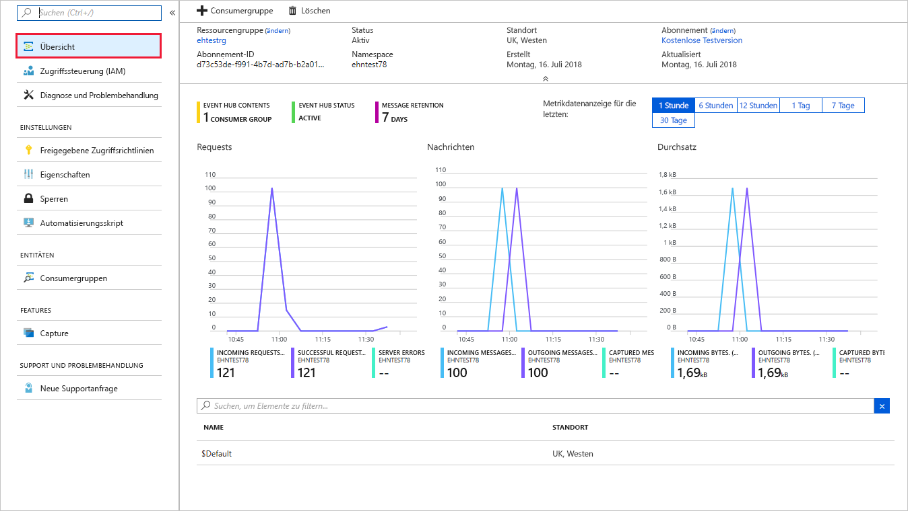
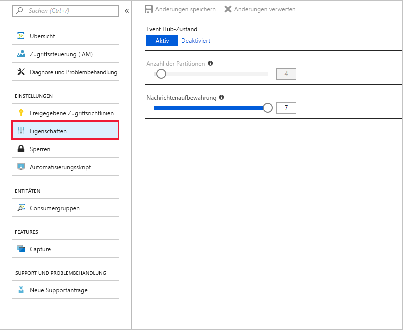
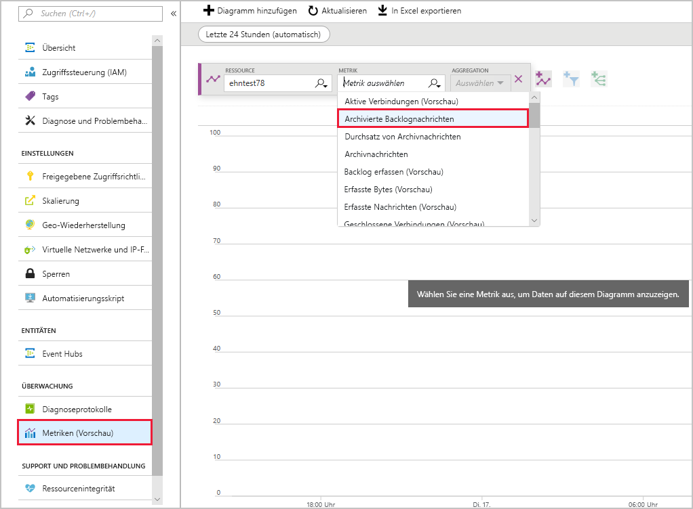

<span data-ttu-id="def13-101">In dieser Einheit verwenden Sie das Azure-Portal, um zu überprüfen, ob Ihr Event Hub gemäß den gewünschten Anforderungen funktioniert.</span><span class="sxs-lookup"><span data-stu-id="def13-101">In this unit, you'll use the Azure portal to verify your Event Hub is working and performing according to the desired expectations.</span></span> <span data-ttu-id="def13-102">Sie testen auch, wie das Event Hub-Messaging arbeitet, wenn es zeitweise nicht verfügbar ist. Des Weiteren testen Sie Event Hubs-Metriken, um die Leistung Ihres Event Hubs zu überprüfen.</span><span class="sxs-lookup"><span data-stu-id="def13-102">You'll also test how Event Hub messaging works when it's temporarily unavailable and use Event Hubs metrics to check the performance of your Event Hub.</span></span>

## <a name="view-event-hub-activity"></a><span data-ttu-id="def13-103">Anzeigen der Event Hub-Aktivität</span><span class="sxs-lookup"><span data-stu-id="def13-103">View Event Hub activity</span></span>

1. <span data-ttu-id="def13-104">Melden Sie sich beim [Azure-Portal](https://portal.azure.com/learn.docs.microsoft.com?azure-portal=true) mit dem gleichen Konto an, über das Sie die Sandbox aktiviert haben.</span><span class="sxs-lookup"><span data-stu-id="def13-104">Sign into the [Azure portal](https://portal.azure.com/learn.docs.microsoft.com?azure-portal=true) using the same account you activated the sandbox with.</span></span>

1. <span data-ttu-id="def13-105">Suchen Sie über die Suchleiste nach Ihrem Event Hub, und öffnen Sie ihn.</span><span class="sxs-lookup"><span data-stu-id="def13-105">Find your Event Hub, using the Search bar, and open it.</span></span>

1. <span data-ttu-id="def13-106">Zeigen Sie auf der Übersichtsseite die Nachrichtenanzahl an.</span><span class="sxs-lookup"><span data-stu-id="def13-106">On the Overview page, view the message counts.</span></span>

    

1. <span data-ttu-id="def13-108">Die Anwendungen „SimpleSend“ und „EventProcessorSample“ werden zum Senden bzw. Empfangen von 100 Nachrichten konfiguriert.</span><span class="sxs-lookup"><span data-stu-id="def13-108">The SimpleSend and EventProcessorSample applications are configured to send/receive 100 messages.</span></span> <span data-ttu-id="def13-109">Sie sehen, dass der Event Hub 100 Nachrichten der SimpleSend-Anwendung verarbeitet und 100 Nachrichten an die EventProcessorSample-Anwendung übertragen hat.</span><span class="sxs-lookup"><span data-stu-id="def13-109">You'll see that the Event Hub has processed 100 messages from the SimpleSend application and has transmitted 100 messages to the EventProcessorSample application.</span></span>

## <a name="test-event-hub-resilience"></a><span data-ttu-id="def13-110">Testen der Event Hub-Resilienz</span><span class="sxs-lookup"><span data-stu-id="def13-110">Test Event Hub resilience</span></span>

<span data-ttu-id="def13-111">Wenn Sie die folgenden Schritte ausführen, sehen Sie, was passiert, wenn eine Anwendung Nachrichten an einen Event Hub sendet, während dieser vorübergehend nicht verfügbar ist.</span><span class="sxs-lookup"><span data-stu-id="def13-111">Use the following steps to see what happens when an application sends messages to an Event Hub while it's temporarily unavailable.</span></span>

1. <span data-ttu-id="def13-112">Senden Sie Nachrichten mithilfe der SimpleSend-Anwendung erneut an den Event Hub.</span><span class="sxs-lookup"><span data-stu-id="def13-112">Resend messages to the Event Hub using the SimpleSend application.</span></span> <span data-ttu-id="def13-113">Verwenden Sie den folgenden Befehl:</span><span class="sxs-lookup"><span data-stu-id="def13-113">Use the following command:</span></span>

    ```azurecli
    cd ~
    cd azure-event-hubs/samples/Java/Basic/SimpleSend
    java -jar ./target/simplesend-1.0.0-jar-with-dependencies.jar
    ```

1. <span data-ttu-id="def13-114">Wenn **Send Complete...** (Sendevorgang abgeschlossen) angezeigt wird, drücken Sie die <kbd>EINGABETASTE</kbd>.</span><span class="sxs-lookup"><span data-stu-id="def13-114">When you see **Send Complete...**, press <kbd>ENTER</kbd>.</span></span>

1. <span data-ttu-id="def13-115">Wählen Sie Ihren Event Hub im Bildschirm **Übersicht** aus. Nun werden für den Event Hub spezifische Details angezeigt.</span><span class="sxs-lookup"><span data-stu-id="def13-115">Select your Event Hub in the **Overview** screen - this will show details specific to the Event Hub.</span></span> <span data-ttu-id="def13-116">Sie können zu diesem Bildschirm auch über den Eintrag **Event Hubs** auf der Namespaceseite gelangen.</span><span class="sxs-lookup"><span data-stu-id="def13-116">You can also get to this screen through the **Event Hubs** entry from the namespace page.</span></span>

1. <span data-ttu-id="def13-117">Wählen Sie **Einstellungen** > **Eigenschaften** aus.</span><span class="sxs-lookup"><span data-stu-id="def13-117">Select **Settings** > **Properties**.</span></span>

1. <span data-ttu-id="def13-118">Klicken Sie unter dem Event Hub-Zustand auf **Deaktiviert**.</span><span class="sxs-lookup"><span data-stu-id="def13-118">Under Event Hub state, click **Disabled**.</span></span> <span data-ttu-id="def13-119">Speichern Sie die Änderungen.</span><span class="sxs-lookup"><span data-stu-id="def13-119">Save the changes.</span></span>

    

    <span data-ttu-id="def13-121">**Warten Sie mindestens fünf Minuten.**</span><span class="sxs-lookup"><span data-stu-id="def13-121">**Wait for a minimum of five minutes.**</span></span>

1. <span data-ttu-id="def13-122">Klicken Sie unter dem Event Hub-Zustand auf **Aktiv**, um Ihren Event Hub erneut zu aktivieren und Ihre Änderungen zu speichern.</span><span class="sxs-lookup"><span data-stu-id="def13-122">Click **Active** under Event Hub state to re-enable your Event Hub and save your changes.</span></span>

1. <span data-ttu-id="def13-123">Ausführen der EventProcessorSample-Anwendung zum Empfangen von Nachrichten</span><span class="sxs-lookup"><span data-stu-id="def13-123">Rerun the EventProcessorSample application to receive messages.</span></span> <span data-ttu-id="def13-124">Verwenden Sie den folgenden Befehl.</span><span class="sxs-lookup"><span data-stu-id="def13-124">Use the following command.</span></span>

    ```azurecli
    cd ~
    cd azure-event-hubs/samples/Java/Basic/EventProcessorSample
    java -jar ./target/eventprocessorsample-1.0.0-jar-with-dependencies.jar
    ```

1. <span data-ttu-id="def13-125">Wenn in der Konsole keine Nachrichten mehr angezeigt werden, drücken Sie die <kbd>EINGABETASTE</kbd>.</span><span class="sxs-lookup"><span data-stu-id="def13-125">When messages stop being displayed to the console, press <kbd>ENTER</kbd>.</span></span>

1. <span data-ttu-id="def13-126">Zurück im Azure-Portal navigieren Sie zurück zu Ihrem Event Hub-Namespace.</span><span class="sxs-lookup"><span data-stu-id="def13-126">Back in the Azure portal, go back to your Event Hub Namespace.</span></span> <span data-ttu-id="def13-127">Wenn Sie sich noch auf der Seite „Event Hub“ befinden, können Sie mit dem Breadcrumb oben auf dem Bildschirm zurücknavigieren.</span><span class="sxs-lookup"><span data-stu-id="def13-127">If you are still on the Event Hub page, you can use the breadcrumb on the top of the screen to go backwards.</span></span> <span data-ttu-id="def13-128">Sie können auch nach dem Namespace suchen und ihn auswählen.</span><span class="sxs-lookup"><span data-stu-id="def13-128">Or you can search for the namespace and select it.</span></span>

1. <span data-ttu-id="def13-129">Klicken Sie auf **ÜBERWACHUNG** > **Metriken (Vorschau)**.</span><span class="sxs-lookup"><span data-stu-id="def13-129">Click **MONITORING** > **Metrics (preview)**.</span></span>

    

1. <span data-ttu-id="def13-131">Wählen Sie aus der Liste **Metrik** die Option **Eingehende Nachricht** aus, und klicken Sie auf **Metrik hinzufügen**.</span><span class="sxs-lookup"><span data-stu-id="def13-131">From the **Metric** list, select **Incoming Messages** and click **Add Metric**.</span></span>

1. <span data-ttu-id="def13-132">Wählen Sie aus der Liste **Metrik** die Option **Ausgehende Nachricht** aus, und klicken Sie auf **Metrik hinzufügen**.</span><span class="sxs-lookup"><span data-stu-id="def13-132">From the **Metric** list, select **Outgoing Messages** and click **Add Metric**.</span></span>

1. <span data-ttu-id="def13-133">Klicken Sie am oberen Rand des Diagramms auf **Letzte 24 Stunden (automatisch)**, um den Zeitraum in **Letzte 30 Minuten** zu ändern und das Datendiagramm zu erweitern.</span><span class="sxs-lookup"><span data-stu-id="def13-133">At the top of the chart, click **Last 24 hours (Automatic)** to change the time period to **Last 30 minutes** to expand the data graph.</span></span>

<span data-ttu-id="def13-134">Sie sehen nun, dass alle 100 Nachrichten erfolgreich übermittelt wurden, obwohl diese gesendet wurden, bevor der Event Hub für einen Zeitraum offline war.</span><span class="sxs-lookup"><span data-stu-id="def13-134">You'll see that though the messages were sent before the Event Hub was taken offline for a period, all 100 messages were successfully transmitted.</span></span>

## <a name="summary"></a><span data-ttu-id="def13-135">Zusammenfassung</span><span class="sxs-lookup"><span data-stu-id="def13-135">Summary</span></span>

<span data-ttu-id="def13-136">In dieser Einheit haben Sie die Event Hubs-Metriken verwendet, um zu testen, ob Ihr Event Hub den Sende- und Empfangsvorgang von Nachrichten erfolgreich verarbeitet.</span><span class="sxs-lookup"><span data-stu-id="def13-136">In this unit, you used the Event Hubs metrics to test that your Event Hub is successfully processing the sending and receiving messages.</span></span>
