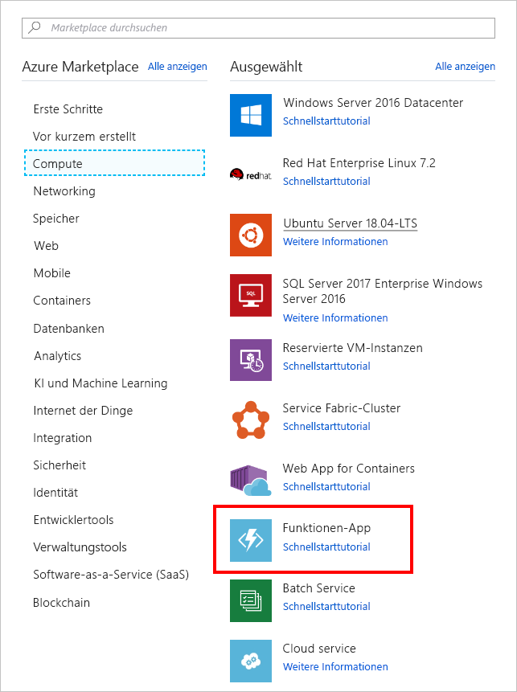
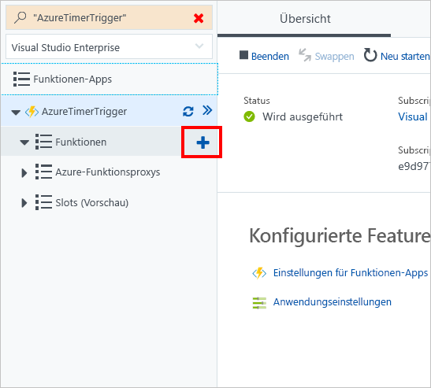

In this unit, we create an Azure function that's invoked every 20 seconds using a timer trigger.

## Create an Azure function

Let’s start by creating an Azure Function in the portal.

1. Sign into the [Azure portal](https://portal.azure.com?azure-portal=true).

1. In the left navigation, select **Create a resource**.

1. Select **Compute**.

1. Locate and select **Function App**. You can also optionally use the search bar to locate the template.

    

1. Enter a unique **App name**.

1. Select a **Subscription**.

1. Create a new **Resource Group**.

1. Choose **Windows** as your **OS**.

1. Choose **Consumption Plan** for your **Hosting Plan**. You're charged for each execution of your function. Resources are automatically allocated based on your application workload.

1. Select a **Location**.

1. Create a new **Storage** account, you can change the name if you like - it will default to a variation of the App name

1. Turn off **Application Insights**.

1. Select **Create**. This will take a few minutes to complete, you can watch the **Notifications** icon in the toolbar area - once it has finished creating the resource it will have a button there to open it in the Azure Portal.

## Create a timer trigger

Now we're going to create a timer trigger inside our Azure function.

1. After the Azure function is created, select **All resources** from the left navigation.

1. Locate and select your Azure function.

1. On the new blade, point to **Functions** and select the plus (+) icon.

    

1. Select **Timer**.

1. Select **CSharp** as the language.

1. Select **Create this function**.

## Configure the timer trigger

We have an Azure function with logic to print a message to the log window. We're going to set the schedule of the timer to execute every 20 seconds.

1. Select **Integrate**.

1. Enter the following value into the **Schedule** box:

    ```log
    */20 * * * * *
    ```

1. Select **Save**.

## Start the timer

Now that we've configured the timer, we're ready to start it.

1. Select **TimerTriggerCSharp1**.

    > [!NOTE]
    > **TimerTriggerCSharp1** is a default name. It's automatically selected when you create the trigger.

1. Select **Run**.

At this point, you should see a message every 20 seconds in the log window.

## Clean up
<!---TODO: Update for sandbox?--->

To ensure that you aren't charged for this function, above the log window, select **Pause** to stop the timer.


