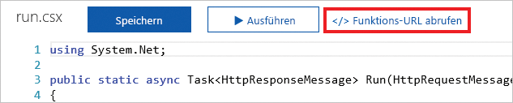

Eine HTTP-Anforderung ist ein gängiger Vorgang auf den meisten Plattformen und Geräten. Ob mit der Anforderung ein Wort in einem Wörterbuch nachgeschlagen oder der lokale Wetterbericht aufgerufen werden soll, wir senden ständig HTTP-Anforderungen. Azure Functions ermöglicht es uns, schnell ein Stück Logik zu erstellen, das beim Empfangen einer HTTP-Anforderung ausgeführt wird.

Hier erfahren Sie, wie eine Azure-Funktion mit einem HTTP-Trigger erstellt und ausgelöst wird. Darüber hinaus untersuchen Sie einige der verfügbaren Anpassungsoptionen.

## Was ist ein HTTP-Trigger?

Ein HTTP-Trigger ist ein Trigger, der eine Funktion ausführt, wenn er eine HTTP-Anforderung empfängt. HTTP-Trigger weisen viele Funktionen und Anpassungen auf, Beispiele:

- Sie stellen autorisierten Zugriff durch die Angabe von Schlüsseln bereit.
- Sie beschränken, welche HTTP-Verben unterstützt werden.
- Sie geben Daten an den Aufrufer zurück.
- Sie empfangen Daten über Abfragezeichenfolgen-Parameter oder den Anforderungstext.
- Sie unterstützen URL-Routenvorlagen zum Ändern der Funktions-URL.

Wenn Sie einen HTTP-Trigger erstellen, wählen Sie eine Programmiersprache aus, geben einen Triggernamen an und wählen eine Autorisierungsstufe aus.

## Was ist eine HTTP-Triggerautorisierungsstufe?

Eine HTTP-Triggerautorisierungsstufe ist ein Flag, das angibt, ob eine eingehende HTTP-Anforderung zur Authentifizierung einen API-Schlüssel benötigt.

Es gibt drei Autorisierungsstufen:

1. Funktion
2. Anonym
3. Administrator

Die Stufen **Funktion** und **Administrator** sind schlüsselbasiert. Um eine HTTP-Anforderung senden zu können, müssen Sie einen Schlüssel für die Authentifizierung angeben. Es gibt zwei Arten von Schlüsseln: *Funktions-* und *Hostschlüssel*. Der Unterschied zwischen den beiden Typen ist ihr Geltungsbereich. Schlüssel mit dem Typ „Funktion“ gelten für eine Funktion. Schlüssel mit dem Typ „Host“ gelten für alle Funktionen innerhalb der Funktions-App. Wenn Ihre Autorisierungsstufe auf **Funktion** festgelegt ist, können Sie einen Schlüssel mit dem Typ *Funktion* oder „Host“ verwenden. Wenn Ihre Autorisierungsstufe auf **Administrator** festgelegt ist, geben Sie einen Schlüssel mit dem Typ „Host“ an.

Die Stufe **Anonym** bedeutet, dass keine Authentifizierung erforderlich ist. In unserer Übung verwenden wir diese Stufe.

## Erstellen eines HTTP-Triggers

Sie können einen HTTP-Trigger wie einen Zeitgebertrigger über das Azure-Portal erstellen. Wählen Sie in Ihrer Azure-Funktion die Option **HTTP-Trigger** aus der Liste der vordefinierten Triggertypen aus. Geben Sie dann die Logik ein, die Sie ausführen möchten, und nehmen Sie Anpassungen vor, wie z.B. die Verwendung bestimmter HTTP-Verben einzuschränken.

Eine Einstellung, die Sie kennen sollten, ist **Anforderungsparametername**. Diese Einstellung ist eine Zeichenfolge, die den Namen des Parameters darstellt, der die Informationen über eine eingehende HTTP-Anforderung enthält. Standardmäßig ist der Name des Parameters *req*.

## Aufrufen eines HTTP-Triggers

Um einen HTTP-Trigger aufzurufen, senden Sie eine HTTP-Anforderung an die URL für Ihre Funktion. Wechseln Sie zum Abrufen dieser URL zur Codepage Ihrer Funktion, und wählen Sie den Link **Funktions-URL abrufen** aus.

Sobald Sie über die URL für Ihre Funktion verfügen, können Sie HTTP-Anforderungen senden. Wenn Ihre Funktion Daten empfängt, denken Sie daran, dass Sie entweder Abfragezeichenfolgen-Parameter verwenden oder die Daten über den Anforderungstext bereitstellen können.

Ein HTTP-Trigger ruft eine Azure-Funktion beim Empfang einer HTTP-Anforderung an der Funktions-URL auf. Über HTTP-Trigger können Sie Daten empfangen und Daten an den Aufrufer zurückgegeben.