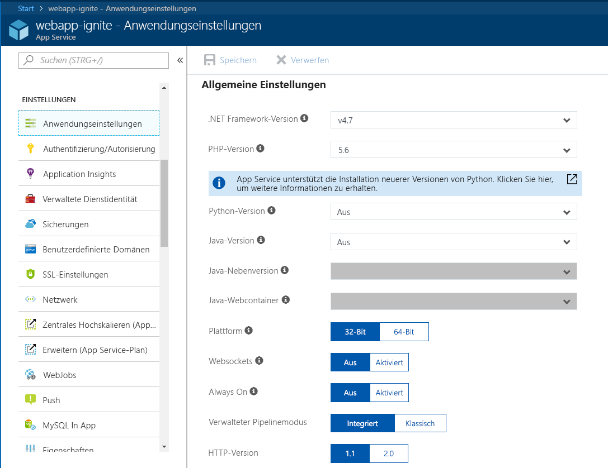
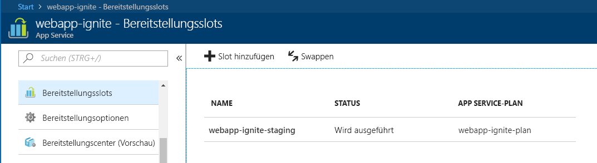
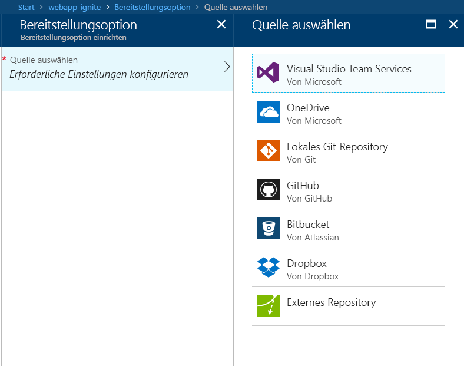

Hier erfahren Sie, wie Sie eine Web-app in Azure App Service mithilfe von Azure-Portal zu erstellen.

## Gründe für das Azure-Portal

Der erste Schritt beim Hosten der Webanwendung ist die Erstellung eine Web-app (eine App Service-app) in Ihrem Azure-Abonnement.

Es gibt mehrere Möglichkeiten, die Sie eine Web-app erstellen können. Sie können das Azure-Portal, die Azure-Befehlszeilenschnittstelle (Azure CLI), ein Skript oder eine IDE (integrierte Entwicklungsumgebung) verwenden.

Hier nutzen wir das Portal, weil es eine grafische Oberfläche bietet, die es zu einem großartigen Lehrmittel macht. Das Portal hilft Ihnen, verfügbare Funktionen zu ermitteln, zusätzliche Ressourcen hinzuzufügen und vorhandene Ressourcen anzupassen.

## Was ist Azure App Service?

Azure App Service ist ein vollständig verwalteter computing-Plattform in der Azure-Umgebung, die für das Hosten von Web-apps-REST-APIs und mobilen Back-Ends optimiert ist.

Mit diesem PaaS-Angebot (Platform as a Service) von Microsoft Azure können Sie sich auf die Entwicklung konzentrieren, während Azure sich um die Infrastruktur zum Ausführen und Skalieren Ihrer Anwendungen kümmert.

## Vorgehensweise: erstellen eine Web-app

Wenn es Zeit, die zum Hosten Ihrer eigenen app ist, Sie finden Sie auf das Azure-Portal und erstellen eine **Web-App**. Durch das Erstellen einer **Web-App** im Azure-Portal, erstellen Sie einen Satz von hosting von Ressourcen in App Service, die Sie verwenden können, zum Hosten von eine beliebige webbasierte Anwendung, die von Azure unterstützt wird, ob sie die ASP.NET Core, Node.js, PHP usw. sein. Die folgende Abbildung zeigt, wie einfach es ist, das Framework bzw. die Sprache der App zu konfigurieren.

Das Azure-Portal bietet es sich um eine Vorlage zum Erstellen einer WebApp. Diese Vorlage hat die folgenden Pflichtfelder:

- **App-Name** : Der Name der Web-App.
- **Abonnement**: Eine gültiges und aktives Abonnement.
- **Ressourcengruppe**: Eine gültige Ressourcengruppe. In den folgenden Abschnitten wird ausführlich erläutert, was eine Ressourcengruppe ist.
- **Betriebssystem**: Das Betriebssystem. Die Optionen sind: Windows, Linux und Docker-Container. Unter Windows können Sie jede Art von Anwendung mit einer Vielzahl von Technologien hosten. Dasselbe gilt für das Linux-Hosting mit Ausnahme der Tatsache, dass Sie nur ASP.NET Core-Web-Apps erstellen können, die das .NET Core-Framework über Linux verwenden. Bei anderen ASP.NET-Apps, die das gesamte .NET Framework verwenden, muss das Hosting über das Windows-Betriebssystem erfolgen. Die letzte Option sind Docker-Container, bei denen Sie Ihre eigenen lokalen Docker-Container direkt in von Azure gehosteten und verwalteten Containern bereitstellen können. Grundsätzlich kann also jede Web-App, die eine Open-Source-Technologie (PHP, ASP.NET Core, usw.) nutzt, unter einem Linux-Betriebssystem gehostet werden.
- **App Service-Plan/Standort**: Ein gültiger Azure App Service-Plan. In den folgenden Abschnitten wird ausführlich erläutert, was ein App Service-Plan ist.
- **Application Insights**: Sie können Azure Application Insights aktivieren und von den Überwachungs- und Metriktools des Azure-Portals profitieren, die Ihnen helfen, die Leistung Ihrer Apps im Auge zu behalten.

Das Azure-Portal gibt Ihnen durch die vielen verfügbaren Tools die Kontrolle über die Verwaltung, Überwachung und Steuerung Ihrer Webanwendung.

### Bereitstellungsslots

Über das Azure-Portal können Sie problemlos hinzufügen **bereitstellungsslots** in einer App Service-Web-app. Sie können z.B. einen Bereitstellungsslot für das **Staging** erstellen, in den Sie Ihren zu testenden Code in Azure übertragen. Sobald Sie mit Ihrem Code zufrieden sind, können Sie ganz einfach den Bereitstellungsslot „Staging“ gegen den Bereitstellungsslot „Produktion“ **tauschen**. Dies erledigen Sie alles über ein paar einfache Mausklicks im Azure-Portal.

### Unterstützung für Continuous Integration/Continuous Deployment

Das Azure-Portal bietet die Out-of-the-Box continuous Integration und Continuous Deployment mit Visual Studio Team Services, GitHub, Bitbucket, Dropbox, OneDrive oder ein lokales Git-Repository auf Ihrem Entwicklungscomputer. Verbinden Ihrer Web-app mit einer der oben aufgeführten Quellen und App Service der Rest erfolgt automatisch für Sie von Code automatisch synchronisiert und zukünftigen Änderungen am Code in der Web-app. Darüber hinaus können Sie mit Visual Studio Team Services Ihren eigenen Build- und Release-Prozess definieren, der am Ende dazu führt, dass Ihr Quellcode kompiliert, die Tests ausgeführt, eine Version erstellt und schließlich die Version jedes Mal, wenn Sie für den Code ein Commit durchführen, per Push in eine Web-App übertragen wird. Das alles geschieht implizit, ohne dass Sie eingreifen müssen.

### Integrierte Visual Studio- und FTP-Veröffentlichung

Neben der Möglichkeit, Continuous Integration/Continuous Deployment für Ihre Web-App einzurichten, können Sie jederzeit von der engen Integration mit Visual Studio profitieren, um Ihre Web-App über die Web Deploy-Technologie in Azure zu veröffentlichen. Darüber hinaus unterstützt Azure FTP, obwohl es besser ist, FTP nicht für die Veröffentlichung zu verwenden, da diese Technologie nicht die Möglichkeiten von Web Deploy bietet, nur die Dateien auszuwählen, die geändert oder hinzugefügt wurden, sodass Sie stets alles in Azure veröffentlichen müssen!

### Integrierte automatische Skalierung unterstützt (automatische Skalierung basierend auf realen Last)

In die Web-App integriert ist die Möglichkeit zum zentrales Hoch- bzw. Herunterskalieren bzw. zum Erweitern. Je nach Nutzung der Web-App können Sie sie zentral hoch- bzw. herunterskalieren, indem Sie die Ressourcen des zugrunde liegenden Computers, der Ihre Web-App hostet soll, erhöhen bzw. verringern. Ressourcen können die Anzahl der Kerne oder die Menge des verfügbaren Arbeitsspeichers sein.

Die Erweiterung ist dagegen die Fähigkeit, die Anzahl der VM-Instanzen zu erhöhen, auf denen Ihre Web-App ausgeführt wird.

## Was ist eine Ressourcengruppe?

Eine Ressourcengruppe ist eine Methode, voneinander abhängige Ressourcen und Dienste wie virtuelle Computer, Web-Apps, Datenbanken und mehr für eine bestimmte Anwendung und Umgebung zu gruppieren. Stellen Sie sie sich als **Ordner** vor, in dem Sie Elemente Ihrer App gruppieren können.

Ressourcengruppen bieten eine einfache Möglichkeit, Ressourcen zu verwalten und zu löschen. Sie bieten auch eine Möglichkeit zur Überwachung, Zugriffssteuerung, Bereitstellung und Verwaltung der Abrechnung von Sammlungen von Ressourcen, die für den Betrieb einer Anwendung erforderlich sind oder von einem Kunden verwendet werden.

## Was ist ein App Service-Plan?

Ein App Service-Plan ist eine Zusammenstellung von physischen Ressourcen und Kapazität, die für die Bereitstellung Ihrer App Service-Apps zur Verfügung stehen.

Das Azure-Portal bietet eine Vorlage zum Erstellen eines neuen App Service-Plans. Diese Vorlage fordert die folgenden grundlegenden Informationen an:

- Region (USA, Westen, Europa, Norden usw.)
- Skalierung (Anzahl der Instanzen)
- Instanzgröße (klein, mittel, groß)
- SKU oder den Tarif (Free, Shared, Basic, Standard, Premium, PremiumV2 und isoliert)

Web-apps, mobile apps und API-apps in Azure App Service sowie Azure Functions, die jeweils ausgeführt, in einem App Service-Plan gehostet. Während Sie eine unbegrenzte Anzahl von Anwendungen in einem App Service-Plan bereitstellen können, hängt die Anzahl der von Ihnen verwendeten Anwendungen in hohem Maß von der Art der bereitgestellten Anwendungen und ihren erforderlichen Ressourcen bei der CPU-Auslastung ab.

Sie können Ihren App Service-Plan jederzeit im Azure-Portal verwenden, um Ihre CPU- und Speicherauslastung zu visualisieren und Ihren Bedarf an Skalierung oder Verlagerung von Anwendungen in einen anderen App Service-Plan zu ermitteln.
