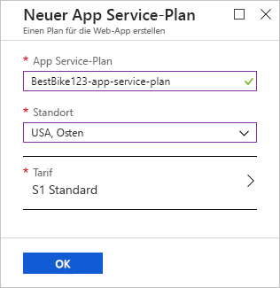
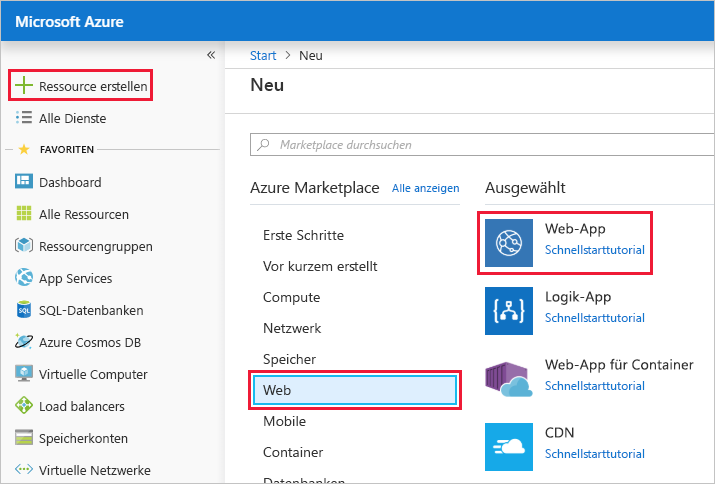
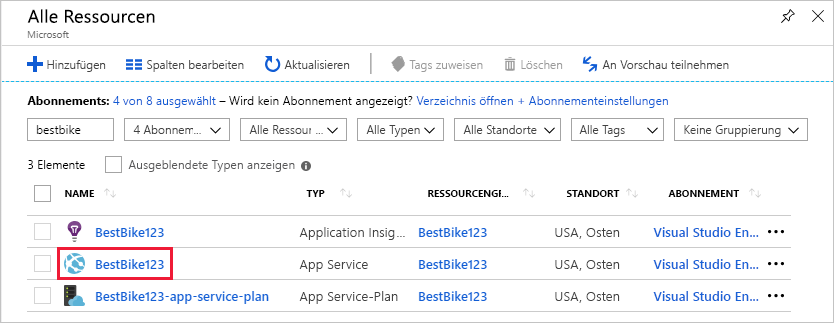
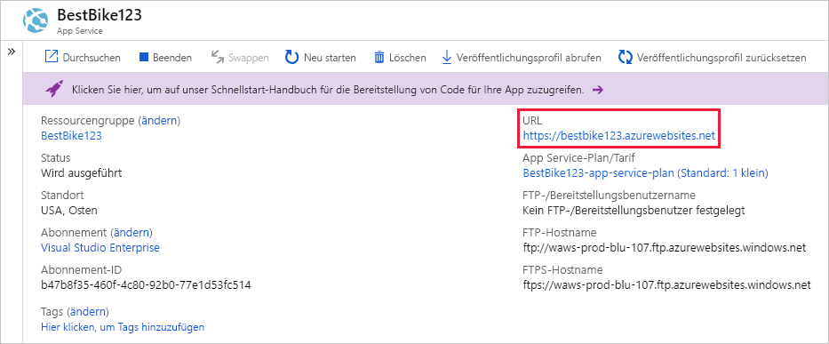

In dieser Einheit verwenden Sie das Azure-Portal, um eine Web-App zu erstellen.In this unit, you will use the Azure portal to create a web app.

[!include]

## Erstellen einer Web-AppCreate a web app

Melden Sie sich beim [Azure-Portal](https://portal.azure.com/triplecrownlabs.onmicrosoft.com?azure-portal=true) mit demselben Konto an, über das Sie die Sandbox aktiviert haben.Sign into the [Azure portal](https://portal.azure.com/triplecrownlabs.onmicrosoft.com?azure-portal=true) using the same account you activated the sandbox with.

1. Klicken Sie oben im linken Navigationsbereich auf den Link **Ressource erstellen**.Click the **Create a resource** link at the top of the left-hand navigation. Alle Elemente, die Sie in Azure erstellen, werden als „ Ressource“ bezeichnet.Everything you create on Azure is a resource.

1. Sie gelangen im Portal zur Seite **Marketplace**.The portal navigates you to the **Marketplace** page. Von hier aus können Sie nach der Ressource suchen, die Sie erstellen möchten, oder eine der beliebten Ressourcen auswählen, die andere Benutzer im Azure-Portal erstellen.From here, you can search for the resource you want to create or select one of the popular resources that people create in the Azure portal.

1. Klicken Sie auf **Web** > **-Web-App**.Click **Web** > **Web App**. Das Portal leitet Sie zur Seite **Neue Web-App erstellen** weiter.The portal redirects you to the **Create New Web App** page.

1. Wenn Sie eine neue Web-App erstellen, fordert das Azure-Portal für das Erstellen der App einige Informationen von Ihnen an.When you create a new web app, the Azure portal requests some information to create the app for you. In diesem Abschnitt müssen Sie die folgenden grundlegenden Informationen angeben:In this section, you need to provide the following basic information:

    1. **App-Name**: Ihr Kunde möchte die Anwendung `BestBike` nennen.**App name**: Your client wants to name the application `BestBike`. Geben Sie den Namen in dieses Feld ein.Type the name in this field. Dieser Wert muss für alle anderen in Azure gehosteten Web-Apps global eindeutig sein, und das Portal überprüft, ob der App-Name bereits vergeben ist.This value must be globally unique among all other web apps hosted on Azure, and the portal will make sure no one else has used the app name. Fügen Sie dem App-Namen einige Zahlen hinzu, um eine eindeutige Variante zu generieren und sicherzustellen, dass Ihr Name eindeutig ist.To ensure your name is unique, add some numbers to your app's name until you find a unique variant.

    2. **Abonnement:** In diesem Feld müssen Sie über die Dropdownliste ein aktives Azure-Abonnement auswählen.**Subscription**: In this field, you need to select an active Azure subscription from the drop-down list. Wählen Sie das Concierge-Abonnement aus.Select the Concierge subscription.

    3. **Betriebssystem:** In diesem Feld müssen Sie angeben, ob Sie zum Hosten Ihrer neuen Webanwendung **Windows** oder **Linux** verwenden möchten.**OS**: In this field, you need to decide whether to use **Windows** or **Linux** to host your new web app. Diese Einstellung wirkt sich direkt auf den App Service-Plan aus, den Sie unten auswählen oder erstellen.This setting directly affects the App Service plan that you are going to select or create below. Zur Erinnerung: Ein App Service-Plan ähnelt einem virtuellen Computer, der ein Betriebssystem mit allen Ressourcen (CPU, RAM usw.) ist, die auf diesem Computer benötigt werden, um Ihre Anwendung auszuführen.If you remember, an App Service plan resembles a virtual machine that is an operating system with all the resource (CPU, RAM, etc.) needed on that machine to run your application. In diesem Fall möchte Ihr Kunde die Web-App lieber über eine Windows-VM hosten.In this case, your client prefers to host the web app over a Windows machine. Wählen Sie daher **Windows** aus.Therefore, make the selection **Windows**.

    4. **Application Insights**: Azure Application Insights hilft Ihnen bei der Erkennung und Diagnose von Qualitätsproblemen in Ihren Web-Apps und Webdiensten macht es leichter, die Aktionen von Benutzern nachzuvollziehen.**Application Insights**: Azure Application Insights helps you detect and diagnose quality issues in your web apps and web services, and helps you understand what your users actually do with it. Der Kunde möchte unter anderem Berichte über den Datenverkehr für seine Website einsehen und Trends für hohen und geringen Datenverkehr untersuchen können.One of the requirements of your client is the ability to view some insight reports about the traffic coming over their website and to study some trends of when the traffic goes high and when it goes low. Wählen Sie in diesem Fall die Option **Ein**, um Application Insights für diese Web-App zu aktivieren.In this case, select the **On** option to turn on Application Insights for this web app. Nachdem Sie die Option **Ein** gewählt haben, müssen Sie auch den Standort oder die Region für die Speicherung der Application Insights-Daten auswählen.Once you select the **On** option, you are also required to select the location or region that will store the Application Insights data. Beachten Sie, dass Application Insights nur in einer begrenzten Anzahl von Regionen verfügbar ist.Note that Application Insights are available in only a limited number of regions. Wählen Sie für diese Demo eine der verfügbaren Regionen aus.For this demo, select any of the available regions.

## Verwenden der Sandbox-RessourcengruppeUse the sandbox resource group

Eine Azure-Web-App muss einer Ressourcengruppe angehören.An Azure web app must be part of a resource group. Wählen Sie **Vorhandene verwenden** aus, und klicken Sie auf <rgn>[Sandbox-Ressourcengruppenname]</rgn>.Select **Use existing** and choose <rgn>[Sandbox resource group name]</rgn>.

## Erstellen eines App Service-PlansCreate an App Service plan

In diesem Feld müssen Sie einen App Service-Plan auswählen, mit dem die Anwendung ausgeführt werden soll.In this field, you need to select an App Service plan to run your application. Standardmäßig wählt das Portal den aktuellsten App Service-Plan aus, den Sie erstellt haben.By default, the portal selects the most recent App Service plan that you created. Klicken Sie auf das Feld **App Service-Plan/Standort**, um zur Seite **App Service-Plan** zu navigieren.Click on the **App Service plan/Location** field to navigate to the **App Service plan** page.

Klicken Sie auf den Link **Neu erstellen**, um zur Seite **Neuer App Service-Plan** zu navigieren.Click on the **Create new** link to navigate to the **New App Service Plan** page. Das Portal fordert einige Informationen von Ihnen an, um den neuen App Service-Plan zu erstellen.The portal requests some information from you in order to create the new App Service plan.

1. **App Service-Plan**: In dieses Feld geben Sie einen Namen für den neuen App Service-Plan ein.**App Service plan**: In this field, you provide a name for the new App Service plan. Geben Sie für diese App den gleichen Web-App-Namen ein, den Sie weiter oben gewählt haben, und fügen Sie das Suffix `-app-service-plan` hinzu, um diese Ressource leichter von anderen unterscheiden zu können.For this app, type the same web app name you chose above and append a suffix of `-app-service-plan` to easily distinguish this resource from others.

2. **Standort**: In diesem Feld müssen Sie die Region auswählen, in der sich dieser App Service-Plan befindet.**Location**: In this field, you need to select the region where this App Service plan resides. Wählen Sie also den geografischen Ort aus, an dem gemäß dem App Service-Plan die virtuellen Computer eingerichtet werden, die für die Ausführung Ihrer Anwendung erforderlich sind.In other words, select the geographical location where the App Service plan will set up the virtual machine(s) that are required to run your application. In diesem Fall können Sie eine beliebige Option aus der Liste verwenden.In this case, you can select any of the options in the list below.

[!include]

3. **Tarif:** In diesem Feld müssen Sie die Größe des virtuellen Computers auswählen, der Ihre Anwendung hosten soll.**Pricing tier**: In this field, you need to select the size of the virtual machine that is going to host your application. Klicken Sie auf das Zeichen **>**, um zur Seite **Tarif** zu navigieren.Click on the **>** sign to navigate to the **Pricing tier** page.

    Hier stehen zahlreiche Optionen zur Auswahl.Here you have many options to choose from. Das Portal gruppiert diese Optionen anhand des Umfangs der benötigten Workload.The portal groups those options by the level of workload needed. Die drei verfügbaren Kategorien von Workloads sind „Dev/Test“, „Produktion“ und „App Service (isoliert)“.The three workload categories available are Dev/Test, Production, and Isolated. Wählen Sie je nach den Anforderungen der Anwendung, die Sie in Azure hosten möchten, die passende Workloadkategorie aus.Depending on the requirements of the application you want to host on Azure, you will select the relevant workload category. Da die Anwendung **BestBike** sich gerade erst im Aufbau befindet, beginnen Sie mit der minimalen Workloadkategorie, die für Sie am besten geeignet ist.As the **BestBike** application is building and shaping up, you will start with the minimal workload category that works for you. Denken Sie daran, dass eine der Anforderungen des Kunden die Möglichkeit war, alle neuen Änderungen, die an der Anwendung vorgenommen wurden, live zu testen.Remember, one of the client's requirements was the ability to test live any new changes coming over the application. In den kommenden Einheiten werden Sie sehen, dass Sie zur Erfüllung dieser Anforderung **Bereitstellungsslots** hinzufügen müssen.In the coming units, you will see that to achieve this requirement, you will need to add **deployment slots**. Bereitstellungsslots sind erst ab dem Tarif **S1** verfügbar.Deployment slots are available starting at a minimum pricing tier of **S1**. Wählen Sie deshalb in der Kategorie **Produktionsworkload** den Tarif **S1** aus.Therefore, select the **S1** pricing tier under the **Production Workload** category. Klicken Sie dann auf **Übernehmen**, um den Tarif zu bestätigen, den Sie oben ausgewählt haben.Then, click on **Apply** to confirm the pricing tier you have selected above.

    > [!NOTE]
    > Sie werden in diesem Modul feststellen, dass nur die Workloadkategorien **Produktion** und **App Service (isoliert)**  Ihnen erlauben, **Bereitstellungsslots** zu Ihrer Web-App hinzuzufügen.You will notice throughout this module that only **Production** and **Isolated** workload categories allow you to add **deployment slots** to your web app.

    Nun befinden Sie sich wieder auf der Seite **Neuer App Service-Plan**.Now, you are back to the **New App Service plan** page.

    

4. Klicken Sie auf die Schaltfläche **OK**, um Ihren neuen App Service-Plan zu verwenden.Click the **OK** button to use your new App Service Plan.

    Im Portal gelangen Sie zurück zur Hauptseite **Web-App erstellen**.The portal navigates you back to the main **Create Web App** page.

    

5. Klicken Sie auf die Schaltfläche **Erstellen**, um die Erstellung der Web-App zu starten.Click the **Create** button to start the process of creating the web app.

    > [!NOTE]
    > Es dauert unter Umständen ein paar Sekunden, bis Ihre Web-App erstellt wurde und einsatzbereit ist.It can take a few seconds to get your web app created and ready for your use.

Das Portal zeigt die Dashboardseite an und benachrichtigt Sie, sobald die Web-App erstellt wurde.The portal redirects you to the dashboard page and notifies you once it creates the web app.

Wenn die App bereit ist, navigieren Sie im Azure-Portal zu der neuen App.Once the app is ready, navigate to the new app in the Azure portal.

1. Klicken Sie im linken Navigationsbereich auf das Menü **Alle Ressourcen**.Click the **All resources** menu on the left side navigation. Auf der Seite **Alle Ressourcen** werden alle Ressourcen aufgelistet, die Sie im Azure-Portal erstellt haben.The **All resources** page lists all the resources that you have created in the Azure portal.

2. Klicken Sie sich durch den App Service „BestBike“, der soeben für Sie erstellt wurde.Click through the BestBike App Service just created for you.

    > [!NOTE]
    > Wenn Sie anhand des Namens „BestBike“ nach Ihrer App suchen, finden Sie unter Umständen auch die Application Insights- und App Service-Plan-Ressourcen, die für Ihre neue Web-App erstellt wurden.If you search for your app by the name "BestBike", you may also find the Application Insights and App Service Plan resources created for your new web app. Achten Sie darauf, dass Sie sich durch die Ressource vom Typ **App Service** klicken.Make sure you are clicking through the resource with the type of **App Service**.

    

Das Portal öffnet die Startseite des Web-App-Diensts. Dabei ist der Abschnitt **Übersicht** ausgewählt.The portal opens the web app service home page with the **Overview** section selected.

Klicken Sie rechts oben im Azure-Portal auf die **URL**, um eine Vorschau des Standardinhalts Ihrer neuen Web-App anzuzeigen.To preview your new web app's default content, click on the **URL** in the top right of the Azure portal. Wird eine Platzhalter-Webseite angezeigt, haben Sie die Web-App erfolgreich erstellt.If you see a placeholder web page, it means you have successfully created the web app.
