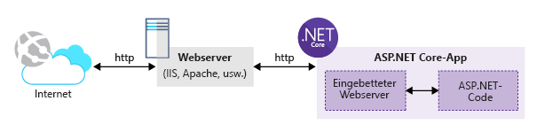

Sie möchten zum Erstellen einer Webanwendung eine Open-Source-Technologie verwenden. Sie wissen, dass ASP.NET Core ein plattformübergreifendes Open-Source-Framework ist. Möchten Ihre Web-app in einer Linux-Entwicklungsumgebung, die mithilfe von ASP.NET Core entwickeln!

Azure App Service können Sie Ihre bevorzugten Technologien wie Node.js, PHP oder .NET Core zu verwenden.

Hier erstellen Sie eine ASP.NET Core-Anwendung mithilfe der .NET-Befehlszeilenschnittstelle.

## <a name="what-is-aspnet-core"></a>Was ist ASP.NET Core?

ASP.NET Core ist die neueste Entwicklung des bekannten ASP.NET-Webframeworks von Microsoft, ein plattformübergreifendes Open-Source-Framework zum Erstellen von modernen, cloudbasierten und mit dem Internet verbundenen Anwendungen.

ASP.NET Core-Anwendungen können für .NET Core Framework oder für das gesamte vorhandene .NET Framework geschrieben werden.

Da es sich um ein plattformübergreifendes Open-Source-Framework handelt, können Sie ASP.NET Core-Apps auf unterschiedlichen Plattformen erstellen, so auch unter Windows, macOS und Linux. Bislang stellt Microsoft die Visual Studio-IDE für Windows- und für macOS-Umgebungen bereit. Zudem ist der Visual Studio Code-Editor plattformübergreifend und mit diesen Umgebungen kompatibel.

>Um das Erstellen von ASP.NET Core-Anwendungen auf unterschiedlichen Plattformen zu unterstützten, hat Microsoft die .NET Core-CLI-Tools eingeführt. Mit diesen Tools können Sie Ihre Anwendungen mit umfangreichen, konsistenten und plattformübergreifenden APIs erstellen, testen und veröffentlichen.

Mit ASP.NET Core können Sie Web-Apps und -dienste, IoT-Apps sowie mobile Back-Ends. ASP.NET Core-Anwendungen können entweder in der Cloud oder lokal gehostet werden.

ASP.NET Core besteht standardmäßig aus einem eingebetteten Webserver und einer Laufzeitumgebung, in der der Anwendungscode ausgeführt wird. Der Anwendungscode wird mithilfe eines überarbeiteten ASP.NET MVC-Frameworks geschrieben, das auf kleinere Module und Pakete zurückgreift. Daraus ergibt sich eine kleinere Webanwendungsblaupause, die mühelos über Cloudumgebungen verwaltet und gehostet werden kann. Die folgende Abbildung zeigt eine in .NET Core gehostete ASP.NET Core-Anwendung und den externen Webserver, der den HTTP-Internetdatenverkehr verarbeitet.



ASP.NET Core-Anwendungen sind eigenständige **Konsolenanwendungen**, die über das Treibertool **dotnet** aufgerufen werden. ASP.NET Core-Anwendungen werden nicht in den IIS-Arbeitsprozess, sondern vielmehr über ein natives IIS-Modul mit dem Namen **AspNetCoreModule** geladen, das die externe Konsolenanwendung ausführt.

## <a name="how-to-create-an-aspnet-core-web-project"></a>Erstellen eines ASP.NET Core-Webprojekts

Zum Erstellen eines neuen ASP.NET Core-Projekts gibt es verschiedene Möglichkeiten:

- Sie können Visual Studio-Vorlagen (Windows- und macOS-Versionen) verwenden, um ein neues Projekt zu erstellen. Visual Studio bietet eine Vielzahl von Vorlagen, die Sie zum Erstellen von Webprojekten verwenden können. Sie können beispielsweise die Vorlage **Leer** verwenden, um ein reines ASP.NET Core-Projekt mit dem grundlegenden Setup zu erstellen. Darüber hinaus können Sie die Vorlage **Webanwendung (Modal-View-Controller)** verwenden, um eine vollwertige ASP.NET Core MVC-Anwendung mit **Beispielcontrollern** und -**ansichten** zu erstellen, die Sie beim Programmieren der Anwendung unterstützen. Der jüngste Neuzugang ist die Projektvorlage **Webanwendung**, die zum Erstellen eines ASP.NET Core-Projekts basierend auf Razor-Seiten und statt auf der herkömmlichen MVC-Projektstruktur verwendet wird.

- Sie können die .NET Core-CLI-Tools zum Erstellen eines neuen ASP.NET Core-Projekts verwenden. Microsoft stellt allgemeine ASP.NET Core-Projektvorlagen für Visual Studio und die CLI-Tools bereit. Dabei unterscheiden sich die Vorlagen für CLI-Tools nur insofern, als dass zum Erstellen eines neuen ASP.NET Core-Projekts Befehle eingegeben werden müssen.
> Die .NET-CLI-Tools nutzen die **Vorlagen-Engine** zur Unterstützung unterschiedlicher Projektvorlagen.  Weitere Informationen zu der von den .NET-CLI-Tools intern verwendeten [Vorlagen-Engine](https://github.com/dotnet/templating) finden Sie im GitHub-Repository.

Die oben beschriebenen Vorlagen gelten als wichtige Tools zum Erstellen von ASP.NET Core-Projekten. Es gibt jedoch noch weitere Tools, die Sie suchen und ausprobieren können.

Die Projekte, die mit anderen Tools erstellt werden, können ein wenig anders sein. Sie alle generieren jedoch gültige und optimierte ASP.NET Core-Projekte.

## <a name="net-cli-tools"></a>.NET-CLI-Tools

Bei den .NET-CLI-Tools, auch bekannt als .NET Core-CLI, handelt es sich um ein plattformübergreifendes Tool, das Befehle zum Erstellen und Wiederherstellen von Paketen sowie zum Erstellen, Ausführen und Veröffentlichen von .NET-Anwendungen über die Befehlszeile ohne IDE mit vollem Funktionsumfang bereitstellt.

Die .NET-CLI wird als Teil des .NET Core SDK installiert. Auf einem Computer können mehrere Versionen der Befehlszeilenschnittstelle vorhanden sein und parallel ausgeführt werden.

Damit Sie die .NET-CLI nutzen können, müssen Sie das entsprechende .NET Core SDK für die Umgebung installieren, die Sie zum Entwickeln der App verwenden: Windows, macOS oder Linux. Wechseln Sie zu [.NET Downloads](https://www.microsoft.com/net/download?initial-os=linux), und wählen Sie das .NET Core SDK für Linux aus. Ich verwende ein Ubuntu 18.04-Betriebssystem, das unter Windows 10 ausgeführt wird und VMware Workspace Player 14 verwendet, um die von der .NET-CLI bereitgestellten Befehle vorzustellen.

Öffnen Sie die Befehlszeile, und geben Sie Folgendes ein:

```console
dotnet --version
```

Mit diesem Befehl wird die Version der installierten .NET-CLI angezeigt.

Wenn ich den obigen Befehl auf meinem Computer ausführe, wird Folgendes angezeigt: `2.1.302`.

Erkunden wir zunächst einige der häufig verwendeten Befehle der .NET-CLI.

Der *dotnet*-Befehl weist im Allgemeinen folgende Syntax auf:

```console
dotnet [verb] [arguments]
```

Das Verb stellt die auszuführende Aktion dar. Die Argumente stellen die Liste der Eingabeargumente dar, die das Verb für die Ausführung benötigt.

Hilfe zur Verwendung von *dotnet* und zur Liste aller verfügbarer *Verben* sowie verwandte Informationen erhalten Sie, indem Sie den folgenden Befehl eingeben:

```console
dotnet --help
```

Mit diesem Befehl wird Folgendes angezeigt:

```console
.NET Command Line Tools (2.1.302)
Usage: dotnet [runtime-options] [path-to-application]
Usage: dotnet [sdk-options] [command] [arguments] [command-options]

path-to-application:
  The path to an application .dll file to execute.

SDK commands:
  new              Initialize .NET projects.
  restore          Restore dependencies specified in the .NET project.
  run              Compiles and immediately executes a .NET project.
  build            Builds a .NET project.
  publish          Publishes a .NET project for deployment (including the runtime).
  test             Runs unit tests using the test runner specified in the project.

...
```

Unter den **SDK-Befehlen** wird die gesamte Liste der Befehle angezeigt, die Sie für das .NET Core SDK ausführen können.

Folgende Befehle sind die nützlichsten:

- **dotnet new**: Dieser Befehl wird verwendet, um für eine neue .NET-Anwendung ein Gerüst zu erstellen bzw. eine neue .NET-Anwendung zu erstellen.

- **dotnet restore**: Dieser Befehl wird verwendet, um alle von der Anwendung referenzierten Pakete wiederherzustellen/herunterzuladen.

- **dotnet run**: Dieser Befehl wird zum Ausführen der .NET-Anwendung verwendet.

Um Unterstützung zur Verwendung eines bestimmten Befehls zu erhalten, können Sie Folgendes eingeben:

```console
dotnet new --help
```

Dieser Befehl ergibt Folgendes:

```console
Usage: new [options]

Options:
  -h, --help          Displays help for this command.
  -l, --list          Lists templates containing the specified name. If no name is specified, lists all templates.
  -n, --name          The name for the output being created. If no name is specified, the name of the current directory is used.
  -o, --output        Location to place the generated output.
  -i, --install       Installs a source or a template pack.
  -u, --uninstall     Uninstalls a source or a template pack.
  --nuget-source      Specifies a NuGet source to use during install.
  --type              Filters templates based on available types. Predefined values are "project", "item" or "other".
  --force             Forces content to be generated even if it would change existing files.
  -lang, --language   Filters templates based on language and specifies the language of the template to create.


Templates                                         Short Name         Language          Tags
----------------------------------------------------------------------------------------------------------------------------
Console Application                               console            [C#], F#, VB      Common/Console
Class library                                     classlib           [C#], F#, VB      Common/Library
...

Razor Page                                        page               [C#]              Web/ASP.NET
MVC ViewImports                                   viewimports        [C#]              Web/ASP.NET
MVC ViewStart                                     viewstart          [C#]              Web/ASP.NET
ASP.NET Core Empty                                web                [C#], F#          Web/Empty
ASP.NET Core Web App (Model-View-Controller)      mvc                [C#], F#          Web/MVC
ASP.NET Core Web App                              razor              [C#]              Web/MVC/Razor Pages
ASP.NET Core with Angular                         angular            [C#]              Web/MVC/SPA
...

Solution File                                     sln                                  Solution

Examples:
    dotnet new mvc --auth Individual
    dotnet new webapi
    dotnet new --help
```

Mit diesem Befehl werden alle verfügbaren Optionen auflistet, die Sie mit dem `dotnet new`-Befehl verwenden können. Ferner werden alle verfügbaren Projektvorlagen aufgelistet, die Sie zum Erzeugen der nächsten .NET-Anwendung verwenden können. Und schließlich werden in einem Abschnitt Beispiele zur Verwendung des Befehls zum Erzeugen einer neuen .NET-Anwendung angezeigt.

Informationen zu den restlichen Befehlen erhalten Sie, indem Sie das `--help`-Argument für die in der .NET-CLI verfügbaren Befehle verwenden.

## <a name="aspnet-core-installation-on-linux-environment"></a>ASP.NET Core-Installation in einer Linux-Umgebung

Die aktuelle und höchste Version von ASP.NET Core ist Version 2.1. Im Allgemeinen wird ASP.NET Core als Teil von .NET Core SDK ausgeliefert. Daher können Sie nach der Installation des .NET Core SDK auf Ihrem Computer mit der Entwicklung von .NET Core-Anwendungen, auch von ASP.NET Core-Web-Apps, beginnen.

Für diese Demonstration verwende ich ein Ubuntu 18.04-Betriebssystem unter Windows 10 zusammen mit VMware Workstation Player.

Um .NET Core SDK herunterzuladen, besuchen Sie die Startseite [.NET Downloads](https://www.microsoft.com/net/download). Die Seite enthält Links zum Herunterladen des .NET Core SDK auf verschiedene Plattformen: Windows, Linux und MacOS.

Klicken Sie auf die Registerkarte **Linux**. Sie haben zwei Möglichkeiten:

- .NET Core SDK
- .NET Core-Runtime

Die .NET Core-Runtime ist bereits im .NET Core SDK enthalten. Die Runtime wird zum Ausführen einer Anwendung verwendet. Alle Tools zum Entwickeln, Testen, Ausführen und Veröffentlichen sind im .NET Core SDK zu finden. Klicken Sie daher auf **.NET Core SDK**.

Sie werden von der Microsoft-Website zur Downloadseite weitergeleitet. Dort müssen Sie die **Linux-Distribution** auswählen. In meinem Fall wähle ich **Ubuntu 18.04** aus. Beim Auswählen werden automatisch Anweisungen zum Installieren des .NET Core SDK unter Ubuntu 18.04 angezeigt.

## <a name="summary"></a>Zusammenfassung

Wenn Sie eine Webanwendung erstellen möchten, haben Sie die Auswahl zwischen verschiedenen Sprachen und Frameworks. App Service hilft dabei, diese Option einfacher und ermöglicht Ihnen, verschiedene Hosts wie Node.js, PHP oder .NET Core-Anwendungen. Dadurch können Sie die Sprachen und Frameworks, denen Sie mit ändern, um die Anforderungen Ihrer Web-Host, sondern am besten vertraut sind.
