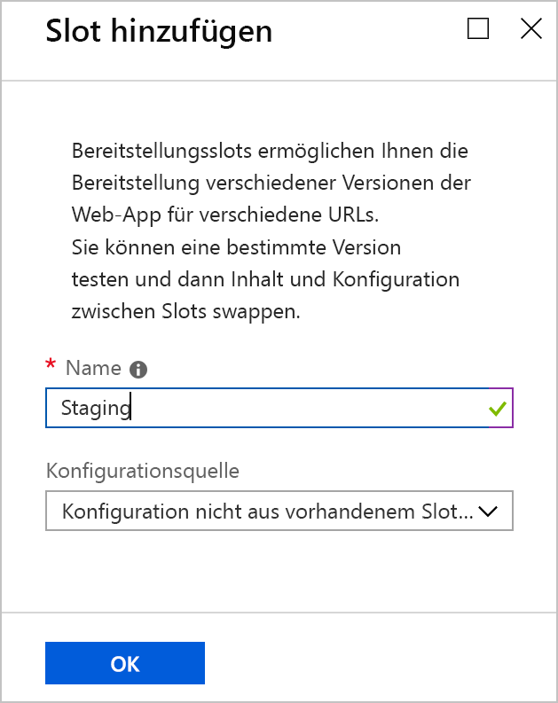
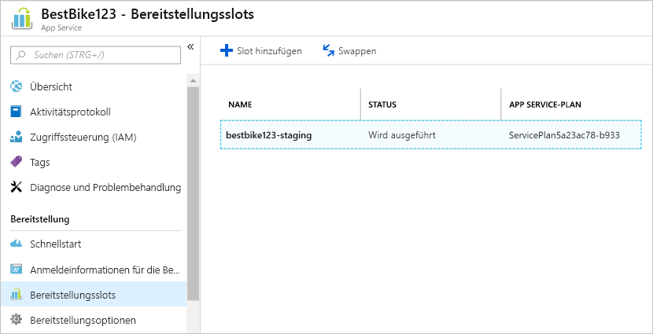
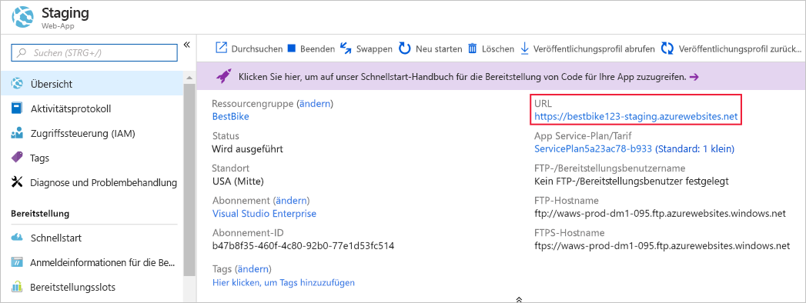
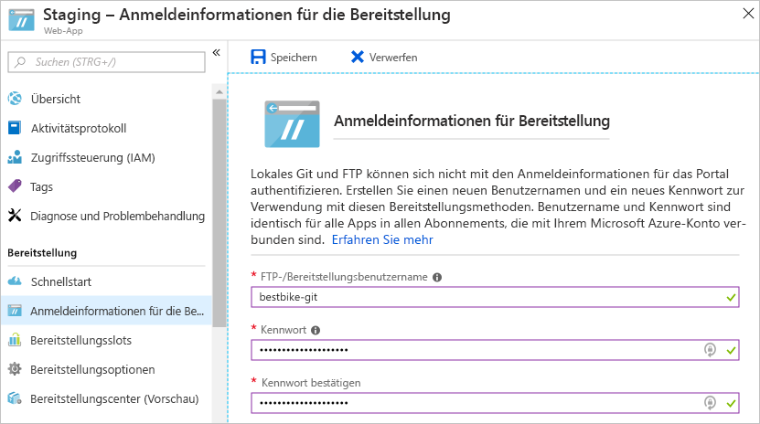
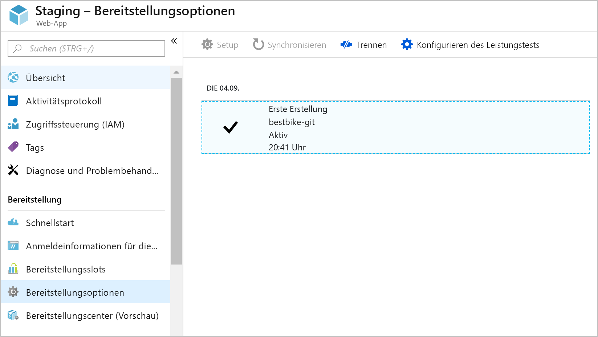
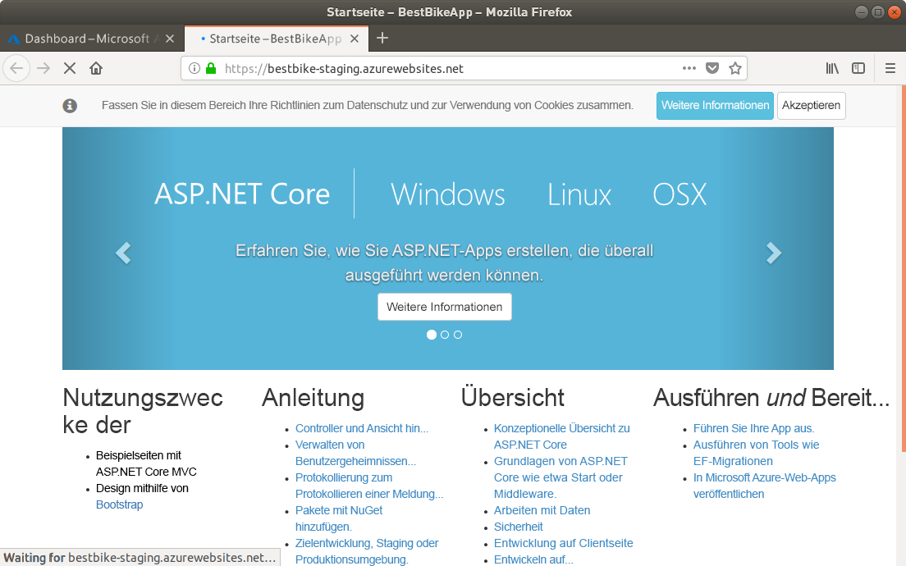
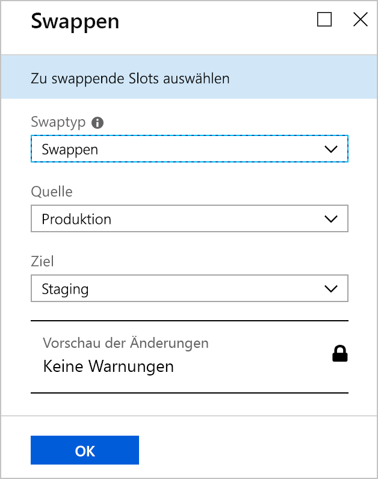
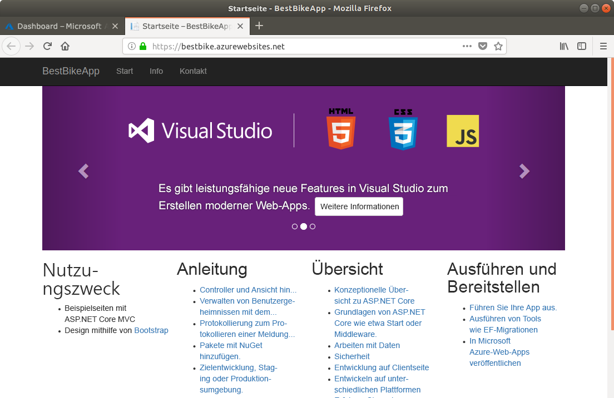
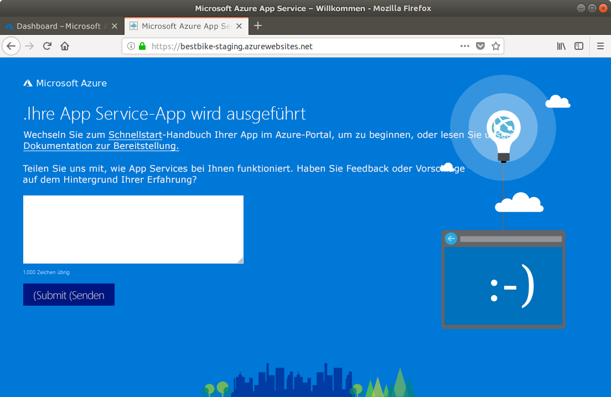

In dieser Einheit laden Sie Ihre ASP.NET Core-Anwendung in Azure App Service hoch.

## <a name="create-a-staging-deployment-slot"></a>Erstellen eines Stagingbereitstellungsslots

1. Wechseln Sie zurück zum [Azure-Portal](https://portal.azure.com/triplecrownlabs.onmicrosoft.com?azure-portal=true).

1. Öffnen Sie die zuvor erstellte App Service-Ressource (die Web-App). Sie können sie erneut öffnen, indem Sie unter **Alle Ressourcen** oder in der enthaltenden Ressourcengruppe unter **Ressourcengruppen** nach der App suchen.

1. Klicken Sie im linken Navigationsbereich auf das Menüelement **Bereitstellungsslots**.

1. Klicken Sie auf der Seite **Bereitstellungsslots** in der oberen Navigationsleiste der Seite auf die Schaltfläche **Slot hinzufügen**.

1. Im Azure-Portal wird wie unten gezeigt die Seite **Slot hinzufügen** geöffnet.

    1. Geben Sie einen Namen für Ihren Bereitstellungsslot ein. Verwenden Sie in diesem Fall `staging`.

    2. Sie haben zwei Möglichkeiten, eine **Konfigurationsquelle** auszuwählen.

        * Sie können sich entscheiden, die Konfigurationselemente eines beliebigen vorhandenen Bereitstellungsslots oder einer in Azure erstellten App Service-App zu klonen.
        * Sie können sich auch gegen das Klonen von Konfigurationselementen entscheiden. Wählen Sie die Option **Don't clone configuration from an existing slot** (Konfiguration nicht aus vorhandenem Slot klonen) aus.

        Wählen Sie für diesen Bereitstellungsslot die zweite Option aus, **Don't clone configuration from an existing slot** (Konfiguration nicht aus vorhandenem Slot klonen). Sie werden ihn direkt konfigurieren.

    

1. Klicken Sie unten auf der Seite auf die Schaltfläche **OK**, um Ihren neuen Bereitstellungsslot zu erstellen.

1. Nachdem der Bereitstellungsslot erfolgreich erstellt wurde, wird im Azure-Portal erneut die Seite **Bereitstellungsslots** Ihrer Web-App angezeigt.

    Sie sehen nun den neuen Bereitstellungsslot, den Sie soeben erstellt haben.

    

1. Wählen Sie den neuen Bereitstellungsslot aus.

1. Im Azure-Portal wird die Seite **Übersicht** des neu erstellten Bereitstellungsslots angezeigt.

    

    Beachten Sie die **URL** des Stagingbereitstellungsslots. Die URL unterscheidet sich von der zuvor angezeigten URL. Sie enthält den angefügten Slotnamen.

    Ein Bereitstellungsslot wird Azure-intern als vollständige App Service-App behandelt. Allerdings handelt es sich um einen speziellen Typ, der ein untergeordnetes Element der ursprünglichen App ist und nicht gegen die ursprüngliche App ausgetauscht werden kann.

    Wenn Sie auf die **URL** klicken, wird die gleiche Standardseite angezeigt, die Azure für die Bereitstellungsslot-„App“ erstellt hat, als wir die App erstmals im Azure-Portal erstellt haben.

Nachdem der Stagingbereitstellungsslot erfolgreich erstellt wurde, müssen Sie nun **Anmeldeinformationen für die Bereitstellung** konfigurieren.

## <a name="create-deployment-credentials"></a>Erstellen von Anmeldeinformationen für die Bereitstellung

In Azure müssen Anmeldeinformationen für die Bereitstellung eingerichtet werden, bevor Sie mit dem eigentlichen Bereitstellungsvorgang beginnen können. Aus diesem Grund lernen Sie, wie Sie Ihre eigenen Anmeldeinformationen für die Bereitstellung erstellen.

1. Klicken Sie im linken Navigationsbereich auf das Menüelement **Anmeldeinformationen für die Bereitstellung**.

1. Das Azure-Portal navigiert wie unten gezeigt zur Seite **Anmeldeinformationen für die Bereitstellung**.

    Geben Sie einen **Benutzernamen** und ein **Kennwort** Ihrer Wahl ein, und bestätigen Sie nochmals Ihr Kennwort.

    > [!NOTE]
    > Stellen Sie sicher, dass Sie Ihren Benutzernamen und Ihr Kennwort nicht vergessen. Sie werden diese Informationen später benötigen, wenn wir beginnen, Ihren Code in Azure hochzuladen und bereitzustellen.

    

1. Klicken Sie oben auf der Seite **Anmeldeinformationen für die Bereitstellung** auf **Speichern**.

Nachdem die Anmeldeinformationen für die Bereitstellung erfolgreich erstellt wurden, müssen Sie nun weitere Bereitstellungsoptionen konfigurieren.

## <a name="use-a-local-git-repository-as-your-deployment-option"></a>Verwenden eines lokalen Git-Repositorys als Bereitstellungsoption

Als Nächstes erstellen wir ein lokales Git-Repository in Azure, damit Sie mit dem Hochladen Ihres Codes beginnen können.

1. Klicken Sie in der „App“ mit dem Bereitstellungsslot **Staging** im linken Navigationsbereich auf das Menüelement **Bereitstellungsoptionen**.

1. Das Azure-Portal navigiert zur Seite **Bereitstellungsoptionen**.

1. Klicken Sie auf **Quelle auswählen**, um die erforderlichen Einstellungen zu konfigurieren.

1. Im Azure-Portal werden die verfügbaren Optionen angezeigt, die Sie konfigurieren und verwenden können. Wählen Sie in unserem Fall die Option **Lokales Git-Repository** aus.

1. Sie gelangen wieder zur Seite **Bereitstellungsoption** zurück. Klicken Sie unten auf der Seite auf **OK**, um die Bereitstellungsquelle einzurichten.

1. Navigieren Sie nun im linken Navigationsbereich zum Abschnitt **Übersicht**.

    Die wichtige Information, die hier zu beachten ist, ist die **Git Clone-URL**, bei der es sich um die URL des lokalen Git-Repositorys handelt, die Sie als **Remote** für Ihr lokales Anwendungscoderepository verwenden werden.

Nun ist es an der Zeit, mit dem Hochladen Ihres Codes in den Stagingbereitstellungsslot zu beginnen.

## <a name="set-up-git-on-cloud-shell"></a>Einrichten von Git in Cloud Shell

Git ist bereits in Azure Cloud Shell installiert, jedoch sollten Sie Ihren Benutzernamen und Ihre E-Mail-Adresse für Ihr Cloud Shell-Konto einrichten.

1. Geben Sie die folgenden Befehle rechts in Cloud Shell ein, und ersetzen Sie die Platzhalter `[your name]` und `[your email]` durch Ihren Namen und Ihre E-Mail-Adresse (ohne Klammern):

    ```bash
    git config --global user.name "[your name]"
    git config --global user.email "[your email]"
    ```

1. Um sicherzustellen, dass Ihre Daten von Git erfasst wurden, geben Sie den folgenden Befehl ein:

    ```bash
    cat ~/.gitconfig
    ```

   Folgendes sollte angezeigt werden, einschließlich Ihres Namens und Ihrer E-Mail-Adresse:

    ```output
    [user]
        name = {your name}
        email = {your email}
    ```

## <a name="initialize-a-local-git-repository-for-your-code"></a>Initialisieren eines lokalen Git-Repositorys für Ihren Code

Um mit der Verwendung von Git zu beginnen, müssen Sie ein lokales Git-Repository für Ihren.NET Core-Anwendungscode initialisieren.

1. Stellen Sie sicher, dass Sie im Projektordner sind, den Sie zuvor erstellt haben.

    ```bash
    cd ~/BestBikeApp/
    ```

1. Verwenden Sie den folgenden Befehl, um ein neues Git-Repository zu initialisieren:

    ```bash
    git init
    ```

    Wenn der Befehl erfolgreich ist, erhalten Sie sinngemäß die folgende Meldung:

    ```output
    Initialized empty Git repository in /home/{your-user}/BestBikeApp/.git/
    ```

1. Nehmen Sie das Staging aller Anwendungsdateien in Git vor.

   Der nächste Schritt besteht darin, Git über Ihre Anwendungsdateien zu informieren. Hierzu fügen Sie alle Dateien des Arbeitsverzeichnisses hinzu, sodass sie von Git **bereitgestellt** werden. Geben Sie den folgenden Befehl ein:

    ```bash
    git add .
    ```

    Der obige Befehl fügt alle durch „.“ dargestellten Dateien zum Stagingstatus von Git hinzu.

1. Nun müssen Sie Ihre Änderungen an Git committen.

   Nachdem Sie die Dateien mit Git bereitgestellt haben, müssen Sie Ihre Dateien an den **Git-Commitverlauf** auf Ihrem lokalen Computer committen. Hierzu geben Sie den folgenden Befehl ein:

    ```bash
   git commit -m "Initial create"
    ```

   Der `commit`-Befehl akzeptiert das `-m`-Argument, um eine Nachricht mit dem von Ihnen erstellten Commit einzuschließen. Wenn Sie später Ihren Code an Azure übertragen, sehen Sie diese Nachricht, die mit diesem konkreten Commit gespeichert wurde.

## <a name="add-a-remote-for-the-local-git-repository"></a>Hinzufügen eines Remoterepositorys für das lokale Git-Repository

Sie haben nun erfolgreich ein neues lokales Git-Repository initialisiert. Außerdem haben Sie alle Ihre Anwendungsdateien an Git committet. Nun müssen Sie lediglich noch ein **Remote**repository hinzufügen, um Ihr lokales Git-Repository mit dem in Azure gehosteten Repository zu verbinden.

Hierzu müssen Sie Folgendes durchführen:

1. Kopieren Sie die **GIT-Klon-URL**, die Sie weiter oben gesehen haben.

1. Sobald Sie sie kopiert haben, navigieren Sie zurück zum Fenster **Terminal**, und führen Sie den folgenden Git-Befehl mit der URL aus:

    ```bash
    git remote add origin https://BESTBIKE-git@BESTBIKE-staging.scm.azurewebsites.net:443/BESTBIKE.git
    ```

    Mit dem obigen Git-Befehl wird Ihr lokales Git-Repository mit dem in Azure gehosteten Repository verbunden. Nun ist Push und Pull zwischen dem lokalen Git-Repository und dem Remote-Git-Repository möglich.

1. Geben Sie zum Überprüfen des obigen Befehls den folgenden Git-Befehl ein:

    ```bash
    git remote -v
    ```

    Mit dem obigen Befehl wird die folgende Ausgabe generiert:

    ```output
    origin  https://BESTBIKE-git@BESTBIKE-staging.scm.azurewebsites.net:443/BESTBIKE.git (fetch)
    origin  https://BESTBIKE-git@BESTBIKE-staging.scm.azurewebsites.net:443/BESTBIKE.git (push)
    ```

## <a name="push-your-code-to-azure"></a>Pushen Ihres Codes in Azure

Nachdem Ihr lokales Git-Repository nun mit dem Git-Remoterepository in Azure verbunden ist, entwickeln und erstellen Sie die App und pushen anschließend Ihren Anwendungscode in Azure.

1. Geben Sie den folgenden Git-Befehl ein, um Ihren **Haupt**branch in das Git-Remoterepository in Azure zu pushen:

    ```bash
    git push origin master
    ```

1. Sie werden aufgefordert, das Kennwort einzugeben, das Sie im Abschnitt **Anmeldeinformationen für die Bereitstellung** weiter oben konfiguriert haben. Geben Sie Ihr Kennwort ein, und drücken Sie die Eingabetaste. Git beginnt, Ihre committeten Dateien in das Git-Remoterepository von Azure hochzuladen, das unter dem Stagingbereitstellungsslot konfiguriert wurde.

## <a name="verify-the-code-is-uploaded-to-azure"></a>Bestätigen, dass der Code in Azure hochgeladen wurde

1. Wechseln Sie zurück zum Azure-Portal.

1. Klicken Sie im linken Navigationsbereich auf das Menüelement **Alle Ressourcen**.

1. Sie gelangen im Azure-Portal zur Liste aller Ressourcen, die bisher in Azure erstellt wurden.

1. Klicken Sie auf den oben erstellten Stagingslot. Denken Sie daran, dass ein Bereitstellungsslot als eine App angesehen wird. Daher wird er unter **Alle Ressourcen** als App Service-Ressource angezeigt.

1. Wenn die Seite „Stagingbereitstellungsslot“ angezeigt wird, navigieren Sie zu **Bereitstellungsoptionen**.

    Sie sehen, dass Ihr erster Commit, der sich lokal auf Ihrem Computer befindet, jetzt in das Azure-Portal hochgeladen wurde.

    Wenn Sie Ihren Code lokal in das Git-Remoterepository in App Service pushen, zeichnet Azure diesen Vorgang auf.

    Jedes Mal, wenn Sie Ihren Code in Azure pushen, wird ein neuer Datensatz zusammen mit der Nachricht angezeigt, die Sie eingeben, wenn Sie Ihre Änderungen lokal auf Ihrem Computer committen.

    

1. Sehen wir uns nun die **Stagingslot**-URL an. Auf die URL wurde bereits oben eingegangen. Sollten Sie jedoch Ihre URL vergessen haben, können Sie stets zur Seite **Übersicht** des Stagingbereitstellungsslots wechseln und von dort die URL übernehmen.

1. Geben Sie die folgende URL in die Adressleiste Ihres Browsers ein: [https://BESTBIKE-staging.azurewebsites.net/](https://BESTBIKE-staging.azurewebsites.net/).

    

Sie haben erfolgreich Ihre lokalen Anwendungsdateien in den Stagingbereitstellungsslot in Azure hochgeladen.

## <a name="swapping-the-staging-and-production-deployment-slots"></a>Austauschen von Staging- und Produktionsbereitstellungsslots

Nachdem die Anwendung nun in dem Stagingbereitstellungsslot ausgeführt wird, der in Azure gehostet wird, ist es Zeit, diesen Slot gegen den Produktionsbereitstellungsslot austauschen. Gehen Sie dazu folgendermaßen vor:

1. Navigieren Sie zur Seite der ursprünglichen App, die Sie zuvor erstellt haben. Sie finden die ursprüngliche Web-App auf der Seite **Alle Ressourcen**.

1. Klicken Sie im linken Navigationsbereich auf das Menüelement **Bereitstellungsslots**.

1. Klicken Sie oben auf der Seite auf die Schaltfläche **Austauschen**.

1. Sie gelangen im Azure-Portal zur Seite **Austauschen**.

1. Wählen Sie für das Feld **Austauschen** die Option **Austauschen** aus.

1. Wählen Sie für das Feld **Quelle** die Option **Staging** aus.

1. Wählen Sie für das Feld **Ziel** die Option **Produktion** aus.

    

1. Klicken Sie am unteren Rand der Seite auf die Schaltfläche **OK**.

1. Azure beginnt mit dem Austauschvorgang. In der Regel beansprucht dieser Vorgang je nach Größe der ausgetauschten Web-App einige Sekunden.

1. Nach dem Vorgang können Sie die URL der Web-App öffnen. Sie finden sie im Portal auf der Übersichtsseite für Ihren App-Dienst: [https://bestbike.azurewebsites.net/](https://bestbike.azurewebsites.net/).

    

    Der Austauschvorgang war erfolgreich! Sie sehen nun, dass der Code, den Sie in den Stagingbereitstellungsslot hochgeladen haben, auch im Produktionsslot gehostet wird.

1. Wechseln Sie nun zur URL des Stagingslots: [https://bestbike-staging.azurewebsites.net/](https://bestbike-staging.azurewebsites.net/).

    

    Der Stagingbereitstellungsslot stellt jetzt die ursprünglichen HTML-Standarddateien bereit, die zuvor vom Produktionsslot bereitgestellt wurden.

Herzlichen Glückwunsch! Sie haben Ihren Anwendungscode erfolgreich in Azure hochgeladen und die Bereitstellungsslots getauscht.
