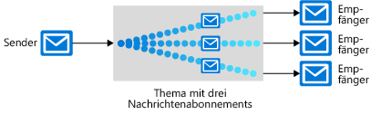

Es gibt viele Kommunikationsplattformen, die zur Verbesserung der Zuverlässigkeit einer verteilten Anwendung beitragen können, darunter auch mehrere innerhalb von Azure.There are many communications platforms that can help improve the reliability of a distributed application, including several within Azure. Jedes dieser Tools dient einem anderen Zweck, daher sehen wir uns hier einmal die einzelnen Tools in Azure an, um Sie bei der Wahl des richtigen Tools zu unterstützen.Each of these tools serves a different purpose; let's review each tool in Azure to help choose the right one.

Die Architektur unserer Bestell- und Nachverfolgungsanwendung für Pizza erfordert mehrere Komponenten: eine Website, Datenspeicherung, einen Back-End-Dienst usw. Wir können die Komponenten unserer Anwendung auf viele verschiedene Arten miteinander verbinden, und eine einzelne Anwendung kann mehrere Techniken nutzen.The architecture of our pizza ordering and tracking application requires several components: a website, data storage, back-end service, etc. We can bind the components of our application together in many different ways, and a single application can take advantage of multiple techniques. 

Wir müssen entscheiden, welche Techniken in der Contoso Slices-Anwendung verwendet werden sollen.We need to decide which techniques to use in the Contoso Slices application. Der erste Schritt besteht darin, jede Stelle auszuwerten, an der Kommunikation zwischen mehreren Bestandteilen stattfindet.The first step is to evaluate each place where there is communication between multiple parts. Einige Komponenten _müssen_ zeitnah ausgeführt werden, damit unsere Anwendung überhaupt ihre Arbeit verrichten kann.Some components _must_ run in a timely manner for our application to be doing its job at all. Andere sind zwar wichtig, aber nicht zeitkritisch.Some may be important, but not time-critical. Und wieder andere, wie etwa unsere Benachrichtigungen für mobile Apps, sind etwas optionaler.Finally, other components, like our mobile app notifications, are a bit more optional.

Hier erfahren Sie mehr über die in Azure verfügbaren Kommunikationsplattformen, sodass Sie für jede Anforderung in Ihrer Anwendung die richtige auswählen können.Here, you will learn about the communications platforms available in Azure, so that you can choose the right one for each requirement in your application.

## Entscheiden zwischen Nachrichten und EreignissenDecide between messages and events

Nachrichten und Ereignisse sind beides **Datagramme**: Pakete von Daten, die von einer Komponente an eine andere gesendet werden.Messages and events are both **datagrams**: packages of data sent from one component to another. Sie unterscheiden sich auf eine Art und Weise, die zunächst subtil erscheint, aber erhebliche Unterschiede dabei bewirken kann, wie Sie Ihre Anwendung gestalten.They are different in ways that at first seem subtle, but can make significant differences in how you architect your application.

### NachrichtenMessages

In der Terminologie verteilter Anwendungen ist das bestimmende Merkmal einer Nachricht, dass die allgemeine Integrität der Anwendung davon abhängen kann, dass Nachrichten empfangen werden.In the terminology of distributed applications, the defining characteristic of a message is that the overall integrity of the application may rely on messages being received. Sie können sich das Senden einer Nachricht so vorstellen, dass eine Komponente den Staffelstab eines Workflows an eine andere Komponente übergibt.You can think of sending a message as one component passing the baton of a workflow to a different component. Der gesamte Workflow kann ein wichtiger Geschäftsprozess sein, und die Nachricht ist der Mörtel, der die Komponenten zusammenhält.The entire workflow may be a vital business process, and the message is the mortar that holds the components together.

Eine Nachricht enthält im Allgemeinen die Daten selbst, nicht nur einen Verweis auf Daten (etwa eine ID oder URL).A message generally contains the data itself, not just a reference (like an ID or URL) to data. Das Senden der Daten als Teil des Datagramms ist weniger fehleranfällig als das Senden eines Verweises.Sending the data as part of the datagram is less brittle than sending a reference. Die Messagingarchitektur garantiert die Zustellung der Nachricht, und da keine zusätzlichen Nachschlagevorgänge erforderlich sind, wird die Nachricht zuverlässig verarbeitet.The messaging architecture guarantees delivery of the message, and because no additional lookups are required, the message is reliably handled. Die sendende Anwendung muss jedoch genau wissen, welche Daten enthalten sein müssen, um nicht zu viele Daten zu senden, wodurch die empfangende Komponente gezwungen wäre, unnötige Arbeiten auszuführen.However, the sending application needs to know exactly what data to include, to avoid sending too much data, which requires the receiving component to do unnecessary work. In diesem Sinne sind Sender und Empfänger einer Nachricht oft durch einen strengen Datenvertrag verbunden.In this sense, the sender and receiver of a message are often coupled by a strict data contract.

In der neuen Architektur von Contoso Slices würden bei der Eingabe einer Pizzabestellung wahrscheinlich Nachrichten verwendet.In Contoso Slices new architecture, when a pizza order is entered, they would likely use messages. Das Web-Front-End oder eine mobile App würde eine Nachricht an die Back-End-Verarbeitungskomponenten senden.The web front end or mobile app would send a message to the back-end processing components. In den Back-End-Schritten würden beispielsweise die Weiterleitung an eine Filiale in der Nähe des Kunden und die Belastung der Kreditkarte stattfinden.In the back end, steps like routing to the store near the customer and charging the credit card would take place.

### EreignisseEvents

Ein Ereignis löst eine Benachrichtigung darüber aus, dass etwas passiert ist.An event triggers notification that something has occurred. Ereignisse sind einfacher als Nachrichten und werden am häufigsten für die Broadcastkommunikation verwendet.Events are "lighter" than messages and are most often used for broadcast communications.

Ereignisse weisen folgende Merkmale auf:Events have the following characteristics:

* Das Ereignis kann an mehrere Empfänger oder an gar keine Empfänger gesendet werden.The event may be sent to multiple receivers, or to none at all
* Ereignisse sollen sich meist „weit verbreiten“ oder weisen eine große Anzahl von Abonnenten für jeden Herausgeber auf.Events are often intended to "fan out," or have a large number of subscribers for each publisher
* Der Herausgeber des Ereignisses hat keine Erwartungen hinsichtlich der Aktion, die eine empfangende Komponente ausführt.The publisher of the event has no expectation about the action a receiving component takes

Unsere Pizzakette würde wahrscheinlich Ereignisse verwenden, um Benutzer mittels Benachrichtigungen über Statusänderungen zu informieren.Our pizza chain would likely use events for notifications to users about status changes. Die Statusänderungsereignisse könnten an Azure Event Grid, dann an Azure Functions und anschließend an Azure Notification Hubs gesendet werden, um eine vollständig _serverlose_ Lösung zu erreichen.Status change events could be sent to Azure Event Grid, then on to Azure Functions, and to Azure Notification Hubs for a completely _serverless_ solution.

Hierbei handelt es sich um einen wesentlichen Unterschied zwischen Ereignissen und Nachrichten, da Kommunikationsplattformen in der Regel entweder Ereignisse oder Nachrichten verarbeiten.This difference between events and messages is fundamental because communications platforms are generally designed to handle one or the other. Service Bus wurde für die Verarbeitung von Nachrichten entwickelt.Service Bus is designed to handle messages. Wenn Sie Ereignisse senden möchten, würden Sie sich wahrscheinlich für Event Grid entscheiden.If you want to send events, you would likely choose Event Grid.

Azure verfügt zwar auch über Azure Event Hubs, diese Lösung wird jedoch am häufigsten für eine bestimmte Art von Kommunikation mit hohem Datenfluss für Analysen verwendet.Azure also has Azure Event Hubs, but it is most often used for a specific type of high-flow stream of communications used for analytics. Wenn unsere Pizzaöfen beispielsweise mit vernetzten Sensoren ausgestattet wären, könnten wir Event Hubs in Verbindung mit Azure Stream Analytics verwenden, um nach Mustern bei Temperaturänderungen zu suchen, die auf einen unerwünschten Brand oder Komponentenverschleiß hindeuten.For example, if we had networked sensors on our pizza ovens, we could use Event Hubs coupled with Azure Stream Analytics to watch for patterns in the temperature changes that might indicate an unwanted fire or component wear.

## Service Bus-Themen, -Warteschlangen und -RelaysService Bus topics, queues, and relays

Azure Service Bus kann Nachrichten auf drei verschiedene Arten austauschen: über Warteschlangen, Themen und Relays.Azure Service Bus can exchange messages in three different ways: queues, topics, and relays.

### Was ist eine Warteschlange?What is a queue?

Eine **Warteschlange** ist ein einfacher temporärer Speicherort für Nachrichten.A **queue** is a simple temporary storage location for messages. Eine sendende Komponente fügt der Warteschlange eine Nachricht hinzu.A sending component adds a message to the queue. Eine Zielkomponente ruft die Nachricht am Anfang der Warteschlange ab.A destination component picks up the message at the front of the queue. Unter normalen Umständen wird jede Nachricht von nur einem Empfänger empfangen.Under ordinary circumstances, each message is received by only one receiver.

Warteschlangen entkoppeln die Quell- und Zielkomponenten, um die Zielkomponenten von hohen Anforderungen zu isolieren.Queues decouple the source and destination components to insulate destination components from high demand. 

In Spitzenzeiten können Nachrichten schneller eintreffen, als die Zielkomponenten sie verarbeiten können.During peak times, messages may come in faster than destination components can handle them. Da Quellkomponenten nicht direkt mit dem Ziel verbunden sind, ist die Quelle nicht betroffen, und die Warteschlange wächst.Because source components have no direct connection to the destination, the source is unaffected and the queue will grow. Zielkomponenten entfernen Nachrichten aus der Warteschlange, sobald sie in der Lage sind, diese zu verarbeiten.Destination components will remove messages from the queue as they are able to handle them. Wenn die Anforderungen abnehmen, können die Zielkomponenten aufholen, und die Warteschlange verkürzt sich.When demand drops, destination components can catch up and the queue shortens.

Eine Warteschlange reagiert auf diese Weise auf hohe Anforderungen, ohne dass dem System Ressourcen hinzugefügt werden müssen.A queue responds to high demand like this without needing to add resources to the system. Bei Nachrichten, die relativ schnell verarbeitet werden müssen, kann das Hinzufügen zusätzlicher Instanzen Ihrer Zielkomponente jedoch dazu führen, dass diese die Last teilen können.However, for messages that need to be handled relatively quickly, adding additional instances of your destination component can allow them to share the load. Jede Nachricht würde nur von einer Instanz verarbeitet.Each message would be handled by only one instance. Dies ist eine effiziente Möglichkeit, Ihre gesamte Anwendung zu skalieren und dabei nur Ressourcen für die Komponenten hinzuzufügen, die diese tatsächlich benötigen.This is an effective way to scale your entire application while only adding resources to the components that actually need it.

### Was ist ein Thema?What is a topic?

Ein **Thema** ähnelt einer Warteschlange, kann jedoch über mehrere Abonnements verfügen.A **topic** is similar to a queue but can have multiple subscriptions. Dies bedeutet, dass mehrere Zielkomponenten ein einzelnes Thema abonnieren können, sodass jede Nachricht an mehrere Empfänger übermittelt wird.This means that multiple destination components can subscribe to a single topic, so each message is delivered to multiple receivers. Abonnements können die Nachrichten im Thema auch filtern, um nur Nachrichten zu empfangen, die relevant sind.Subscriptions can also filter the messages in the topic to receive only messages that are relevant. Abonnements bieten die gleiche entkoppelten Kommunikation wie Warteschlangen und reagieren auf die gleiche Weise auf hohe Anforderungen.Subscriptions provide the same decoupled communications as queues and respond to high demand in the same way. Verwenden Sie ein Thema, wenn jede Nachricht an mehrere Zielkomponenten übermittelt werden soll.Use a topic if you want each message to be delivered to more than one destination component.

Themen werden für den Basic-Tarif nicht unterstützt.Topics are not supported in the Basic pricing tier.

### Was ist ein Relay?What is a relay?

Ein **Relay** ist ein Objekt für die synchrone bidirektionale Kommunikation zwischen Anwendungen.A **relay** is an object that performs synchronous, two-way communication between applications. Es ist kein temporärer Speicherort für Nachrichten wie Warteschlangen und Themen.It is not a temporary storage location for messages like queues and topics. Stattdessen stellt es bidirektionale, ungepufferte Verbindungen über Netzwerkgrenzen hinweg bereit. (Ein Beispiel für eine Netzwerkgrenze wäre etwa eine Firewall.)Instead, it provides bidirectional, unbuffered connections across network boundaries such as firewalls. Verwenden Sie ein Relay, wenn Sie eine direkte Kommunikation zwischen Komponenten benötigen, als befänden sie sich im gleichen Netzwerksegment, obwohl sie durch Netzwerksicherheitsgeräte getrennt sind.Use a relay when you want direct communications between components as if they were located on the same network segment but separated by network security devices.

> [!NOTE]
> Relays sind zwar Teil von Azure Service Bus, implementieren aber keine lose gekoppelten Messagingworkflows und werden in diesem Modul nicht weiter berücksichtigt.Although relays are part of Azure Service Bus, they do not implement loosely coupled messaging workflows and are not considered further in this module.

## Service Bus-Warteschlangen und SpeicherwarteschlangenService Bus queues and storage queues

Es gibt zwei Azure-Features, die Nachrichtenwarteschlangen enthalten: Service Bus und Azure Storage-Konten.There are two Azure features that include message queues: Service Bus and Azure Storage accounts. Im Allgemeinen sind Speicherwarteschlangen einfacher zu verwenden, aber weniger komplex und flexibel als Service Bus-Warteschlangen.As a general guide, storage queues are simpler to use but are less sophisticated and flexible than Service Bus queues.

Zu den wichtigsten Vorteilen von Service Bus-Warteschlangen zählen folgende:Key advantages of Service Bus queues include:

* Sie unterstützen größeren Nachrichten (256 KB pro Nachricht im Vergleich zu 64 KB).Supports larger messages size (256 KB per message versus 64 KB)
* Sie unterstützen die Übermittlungstypen „At-Least-Once“ (mindestens ein Mal) und „At-Most-Once“ (höchstens ein Mal). Sie haben also die Wahl, ob Sie sich bestmöglich gegen den Verlust einer Nachricht oder gegen eine doppelte Verarbeitung einer Nachricht absichern möchten.Supports both at-least-once and at-most-once delivery - choose between a very small chance that a message is lost or a very small chance it is handled twice
* Sie garantieren die **FIFO-Reihenfolge (First-In-First-Out)**: Nachrichten werden in der Reihenfolge verarbeitet, in der sie hinzugefügt wurden. (FIFO ist zwar der normale Betriebsmodus einer Warteschlange, er wird jedoch nicht für jede Nachricht garantiert.)Guarantees **first-in-first-out (FIFO)** order - messages are handled in the same order they are added (although FIFO is the normal operation of a queue, it is not guaranteed for every message)
* Sie können mehrere Nachrichten zu einer Transaktion gruppieren: Wenn eine Nachricht in der Transaktion nicht übermittelt werden kann, wird keine der Nachrichten in der Transaktion übermittelt.Can group multiple messages into a transaction - if one message in the transaction fails to be delivered, all messages in the transaction will not be delivered
* Sie unterstützen rollenbasierte Sicherheit.Supports role-based security
* Sie erfordern nicht, dass Zielkomponenten die Warteschlange kontinuierlich abfragen.Does not require destination components to continuously poll the queue

Vorteile von Speicherwarteschlangen:Advantages of storage queues:

* Sie unterstützen eine unbegrenzte Warteschlangengröße (im Gegensatz zum Grenzwert von 80 GB bei Service Bus-Warteschlangen).Supports unlimited queue size (versus 80-GB limit for Service Bus queues)
* Sie pflegen ein Protokoll aller Nachrichten.Maintains a log of all messages

## Auswählen einer KommunikationstechnologieHow to choose a communications technology

Wir haben die verschiedenen Konzepte und Implementierungen kennengelernt, die Azure anbietet.We've seen the different concepts and the implementations Azure provides. Sehen wir uns nun an, wie unser Entscheidungsprozess für jede unserer Kommunikationsaktivitäten aussehen sollte.Let's discuss what our decision process should look like for each of our communications.

#### Stellen Sie sich die folgenden Fragen:Consider the following questions:

1. Ist die Kommunikation ein Ereignis?Is the communication an event? Falls ja, sollten Sie Event Grid oder Event Hubs verwenden.If so, consider using Event Grid or Event Hubs.

1. Soll eine einzelne Nachricht an mehrere Ziele übermittelt werden?Should a single message be delivered to more than one destination? Falls ja, verwenden Sie ein Service Bus-Thema.If so, use a Service Bus topic. Falls nicht, verwenden Sie eine Warteschlange.Otherwise, use a queue.

Für Warteschlangen gilt:If you decide that you need a queue:

#### Verwenden Sie Service Bus-Warteschlangen, wenn Folgendes zutrifft:Choose Service Bus queues if:

* Sie benötigen eine At-Most-Once-Zustellungsgarantie.You need an at-most-once delivery guarantee
* Sie benötigen eine FIFO-Garantie.You need a FIFO guarantee
* Sie müssen Nachrichten in Transaktionen gruppieren.You need to group messages into transactions
* Sie möchten Nachrichten empfangen, ohne die Warteschlange abzufragen.You want to receive messages without polling the queue
* Sie benötigen rollenbasierten Warteschlangenzugriff.You need to provide role-based access to the queues
* Sie müssen Nachrichten mit einer Größe von 64 bis 256 KB verarbeiten.You need to handle messages larger than 64 KB but smaller than 256 KB
* Die Warteschlangengröße liegt unter 80 GB.Your queue size will not grow larger than 80 GB
* Sie möchten Nachrichtenbatches veröffentlichen und nutzen können.You would like to be able to publish and consume batches of messages

#### Verwenden Sie Queue Storage, wenn Folgendes zutrifft:Choose queue storage if:

* Sie benötigen eine einfache Warteschlange ohne besondere zusätzliche Anforderungen.You need a simple queue with no particular additional requirements
* Sie benötigen serverseitige Protokolle aller Nachrichten, die die Warteschlange passieren.You need an audit trail of all messages that pass through the queue
* Sie gehen davon aus, dass die Größe der Warteschlange 80 GB überschreitet.You expect the queue to exceed 80 GB in size
* Sie möchten den Verarbeitungsfortschritt einer Nachricht innerhalb der Warteschlange nachverfolgen.You want to track progress for processing a message inside of the queue

Die Komponenten einer verteilten Anwendung können zwar direkt kommunizieren, durch die Verwendung einer Zwischenkommunikationsplattform wie Azure Service Bus oder Azure Event Grid lässt sich jedoch häufig die Zuverlässigkeit dieser Kommunikation verbessern.Although the components of a distributed application can communicate directly, you can often increase the reliability of that communication by using an intermediate communication platform such as Azure Service Bus or Azure Event Grid.

Event Grid ist für Ereignisse konzipiert, die Empfänger nur über ein Ereignis informieren und nicht die diesem Ereignis zugeordneten Rohdaten enthalten.Event Grid is designed for events, which notify recipients only of an event and do not contain the raw data associated with that event. Azure Event Hubs wurde für Analyseereignisse mit hohem Datenfluss entwickelt.Azure Event Hubs is designed for high-flow analytics types of events. Azure Service Bus und Speicherwarteschlangen sind für Nachrichten konzipiert und können zur Bindung der wesentlichen Bestandteile jedes Anwendungsworkflows verwendet werden.Azure Service Bus and storage queues are for messages, which can be used for binding the core pieces of any application workflow.

Wenn Sie keine besonders komplexen Anforderungen haben, jede Nachricht nur an ein einzelnes Ziel senden oder möglichst schnell programmieren möchten, ist möglicherweise eine Speicherwarteschlange die beste Option.If your requirements are simple, if you want to send each message to only one destination, or if you want to write code as quickly as possible, a storage queue may be the best option. Andernfalls bieten Service Bus-Warteschlangen viele weitere Optionen und größere Flexibilität.Otherwise, Service Bus queues provide many more options and flexibility.

Wenn Sie Nachrichten an mehrere Abonnenten senden möchten, verwenden Sie ein Service Bus-Thema.If you want to send messages to multiple subscribers, use a Service Bus topic.
