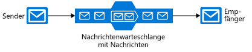

Es gibt viele Communications-Plattformen, mit deren Hilfe können die Zuverlässigkeit einer verteilten Anwendung, einschließlich mehrerer innerhalb von Azure zu verbessern. Jedes dieser Tools dient einem anderen Zweck. Lassen Sie uns jedes Tool in Azure untersuchen, um Sie bei der Auswahl des richtigen Tools zu unterstützen.

Die Architektur unserer Pizza Sortier- und Anwendung sind verschiedene Komponenten erforderlich: eine Website, datenspeicherung, Back-End-Dienst usw. Wir können die Komponenten unserer Anwendung auf viele verschiedene Arten miteinander verbinden, und eine einzige Anwendung kann mehrere Techniken nutzen. 

Wir müssen entscheiden, welche Techniken in der Contoso Slices-Anwendung verwendet werden sollen. Der erste Schritt besteht darin, jede Stelle auszuwerten, an der Kommunikation zwischen mehreren Bestandteilen stattfindet. Einige Komponenten _müssen_ zeitgerecht ausgeführt werden, damit unsere Anwendung überhaupt ihre Arbeit verrichten kann. Einige möglicherweise wichtig, aber nicht zeitkritisch. Schließlich sind andere Komponenten, wie unsere Benachrichtigungen für mobile Apps, etwas optionaler.

Hier erfahren Sie mehr über die in Azure verfügbaren Kommunikationsplattformen, sodass Sie für jede Anforderung in Ihrer Anwendung die richtige auswählen können.

## Entscheiden zwischen Nachrichten und Ereignissen

Nachrichten und Ereignisse sind beides **Datagramme**: Pakete von Daten, die von einer Komponente an eine andere gesendet werden. Sie unterscheiden sich auf eine Art und Weise, die zunächst subtil erscheint, aber erhebliche Unterschiede dabei bewirken kann, wie Sie Ihre Anwendung gestalten. 

### Nachrichten

In der Terminologie verteilter Anwendungen ist das bestimmende Merkmal einer Nachricht, dass die allgemeine Integrität der Anwendung davon abhängen kann, dass Nachrichten empfangen werden. Sie können sich das Senden einer Nachricht so vorstellen, dass eine Komponente den Staffelstab eines Workflows an eine andere Komponente übergibt. Der gesamte Workflow kann ein wichtiger Geschäftsprozess sein, und die Nachricht ist der Mörtel, der die Komponenten zusammenhält.

Eine Nachricht enthält in der Regel die Daten selbst, nicht nur einen Verweis (z. B. eine ID oder -URL), die sich auf Daten. Das Senden der Daten als Teil des Datagramms ist weniger fehleranfällig als das Senden eines Verweises. Die Messagingarchitektur garantiert die Zustellung der Nachricht, und da keine weiteren Suchläufe erforderlich sind, wird die Nachricht zuverlässig behandelt. Allerdings muss die sendende Anwendung wissen genau Daten einschließen, um zu vermeiden, Senden von zu viel Daten, die die empfangende Komponente Sie unnötige Arbeit erforderlich ist. In diesem Sinne sind Sender und Empfänger einer Nachricht oft durch einen strengen Datenvertrag verbunden.

Im Contoso-Slices neue Architektur Wenn eine Pizza Reihenfolge eingegeben wird, würden sie wahrscheinlich Nachrichten verwenden. Die Web-Front-End oder die mobile app würde eine Nachricht an die Back-End-Verarbeitung-Komponenten senden. Im Back-End würde Schritte wie routing, die in den Speicher in der Nähe von Kunden und dann damit, für die Kreditkarte stattfinden.

### Ereignisse

Ein Ereignis auslöst, Benachrichtigung, dass etwas geschehen ist. Ereignisse sind "heller" als Nachrichten und werden am häufigsten für die broadcast-Kommunikation verwendet.

Ereignisse weisen die folgenden Merkmale auf:
* Das Ereignis kann an mehrere Empfänger oder an gar keine Empfänger gesendet werden.
* Ereignisse sollen sich meist „weit verbreiten“ oder weisen eine große Anzahl von Abonnenten für jeden Herausgeber auf.
* Der Herausgeber des Ereignisses hat keine Erwartungen hinsichtlich der Aktion, die eine empfangende Komponente ausführt.

Unsere Pizzakette würde wahrscheinlich Ereignisse für Benachrichtigungen verwenden, die Benutzer über Statusänderungen informieren. Änderungsereignissen konnte gesendet werden, um Azure Event Grid, klicken Sie dann an Azure Functions und Azure Notification Hubs für eine vollständig _serverlose_ Lösung.

Dieser Unterschied zwischen Ereignissen und Nachrichten ist grundlegend, da Kommunikationsplattformen im Allgemeinen so konzipiert sind, dass sie das eine oder das andere verarbeiten. Service Bus wurde für die Verarbeitung von Nachrichten entwickelt. Wenn Sie Ereignisse senden möchten, würden Sie wahrscheinlich Event Grid auswählen. 

Außerdem verfügt Azure über Azure Event Hubs, aber sie wird meistens verwendet, für einen bestimmten Typ von High-Flow-Stream, der Kommunikation, die für die Analyse verwendet. Z. B. wenn wir Sensoren auf unsere Pizza andere vernetzte hatte, können wir Event Hubs zusammen mit Azure Stream Analytics in die temperaturveränderungen nach Mustern zu überwachen, die eine unerwünschte Feuer oder die Komponente Wear hinweisen.

## Service Bus-Themen, Warteschlangen und -relays

Azure Service Bus Nachrichten austauschen können, auf drei verschiedene Arten: Warteschlangen, Themen und Relays.

### Was ist eine Warteschlange?

Ein **Warteschlange** ist ein einfacher temporärer Speicherort für Nachrichten. Eine sendende Komponente fügt der Warteschlange eine Nachricht hinzu. Eine Zielkomponente ruft die Nachricht am Anfang der Warteschlange ab. Unter normalen Umständen ist jede Nachricht von nur einem Empfänger empfangen.

Warteschlangen entkoppeln die Quell- und Zielkomponenten, um die Zielkomponenten von hohen Anforderungen zu isolieren. 

Während der Spitzenzeiten möglicherweise Nachrichten stammen schneller als die Zielkomponenten, die sie verarbeiten können. Da Quellkomponenten keine direkte Verbindung zum Ziel haben, wird die Quelle ist nicht betroffen, und die Warteschlange wird vergrößert. Zielkomponenten entfernen Nachrichten aus der Warteschlange, sobald sie in der Lage sind, diese zu verarbeiten. Wenn die Anforderungen abnehmen, können die Zielkomponenten aufholen, und die Warteschlange verkürzt sich. 

Eine Warteschlange reagiert auf diese Weise auf hohe Anforderungen, ohne dass dem System Ressourcen hinzugefügt werden müssen. Bei Nachrichten, die relativ schnell verarbeitet werden müssen, kann das Hinzufügen zusätzlicher Instanzen Ihrer Zielkomponente jedoch dazu führen, dass diese die Last teilen können. Jede Nachricht würde nur von einer Instanz verarbeitet. Dies ist eine effiziente Möglichkeit, Ihre gesamte Anwendung zu skalieren und dabei Ressourcen nur für die Komponenten hinzuzufügen, die diese tatsächlich benötigen.

### Was ist ein Thema?

Ein **Thema** ähnelt einer Warteschlange, kann jedoch über mehrere Abonnements verfügen. Dies bedeutet, dass mehrere Zielkomponenten ein einzelnes Thema abonnieren können, sodass jede Nachricht an mehrere Empfänger übermittelt wird. Abonnements können die Nachrichten im Thema auch filtern, um nur Nachrichten zu empfangen, die relevant sind. Abonnements bieten die gleiche entkoppelten Kommunikation wie Warteschlangen und reagieren auf die gleiche Weise auf hohe Anforderungen. Verwenden Sie ein Thema, wenn jede Nachricht an mehrere Zielkomponenten übermittelt werden soll.

Themen werden für den Basic-Tarif nicht unterstützt.

### Was ist ein Relay?

Ein **Relay** ist ein Objekt, das synchrone bidirektionale Kommunikation zwischen Anwendungen ausführt. Es ist kein temporärer Speicherort für Nachrichten wie Warteschlangen und Themen. Stattdessen stellt er die bidirektionale, ungepufferte Verbindungen über Netzwerkgrenzen hinweg wie z. B. Firewalls. Verwenden Sie ein Relay aus, wenn Sie die direkte Kommunikation zwischen Komponenten möchten, als ob sie befindet sich im gleichen Netzwerksegment jedoch durch die Geräte getrennt wurden.

> [!NOTE]
> Obwohl Relays Teil von Azure Service Bus sind, werden sie nicht lose gekoppelten messagingworkflows implementieren und nicht weiter unten in diesem Modul berücksichtigt.

## Service Bus-Warteschlangen und Storage-Warteschlangen

Es gibt zwei Azure-Features, die Warteschlangen enthalten: Service Bus und Azure Storage-Konten. Als allgemeinen Anhaltspunkt Storage-Warteschlangen sind einfacher zu verwenden, aber weniger komplexen und flexiblen als Service Bus-Warteschlangen.

Die wichtigsten Vorteile von Service Bus-Warteschlangen:

* Sie unterstützen größeren Nachrichten (256 KB pro Nachricht im Vergleich zu 64 KB).
* Sie unterstützen die Übermittlungstypen „At-Least-Once“ (mindestens ein Mal) und „At-Most-Once“ (höchstens ein Mal). Wählen Sie zwischen der sehr geringen Möglichkeit aus, dass eine Nachricht verloren geht, und der sehr geringen Möglichkeit, dass sie zwei Mal verarbeitet wird.
* Garantien **First-in-First-Out (FIFO)** order - Nachrichten verarbeitet werden, in der gleichen Reihenfolge, die sie hinzugefügt werden (obwohl FIFO-Prinzip, den normalen Betrieb einer Warteschlange ist, es ist nicht unbedingt für jede Nachricht)
* Sie können mehrere Nachrichten in einer Transaktion gruppieren: Wenn eine Nachricht in der Transaktion nicht übermittelt werden kann, werden alle Nachrichten in der Transaktion nicht übermittelt.
* Sie unterstützen rollenbasierte Sicherheit.
* Sie erfordern nicht, dass Zielkomponenten die Warteschlange kontinuierlich abfragen.

Vorteile von Storage-Warteschlangen:

* Unterstützt die unbegrenzte Größe (im Gegensatz zu 80-GB-Limit für Service Bus-Warteschlangen)
* Sie verwalten ein Protokoll aller Nachrichten.

## Auswählen einer Kommunikationstechnologie

Wir haben die verschiedenen Konzepte und Implementierungen kennengelernt, die Azure anbietet. Sehen wir uns nun an, wie unser Entscheidungsprozess für jede unserer Kommunikationsaktivitäten aussehen sollte.

#### Stellen Sie sich die folgenden Fragen:

1. Ist die Kommunikation ein Ereignis? Wenn dies der Fall ist, sollten Sie Event Grid oder Event Hubs.

1. Sollte eine einzelne Nachricht an mehrere Ziele übermittelt werden? Wenn dies der Fall ist, verwenden Sie ein Service Bus-Thema. Verwenden Sie andernfalls eine Warteschlange ein.

Wenn Sie sich dafür entscheiden, dass Sie eine Warteschlange benötigen:

#### Verwenden Sie Service Bus-Warteschlangen, wenn Folgendes zutrifft:

- Sie benötigen ein at-Most-Once-zustellungsgarantie.
- Sie benötigen eine FIFO-Garantie.
- Sie müssen Nachrichten in Transaktionen gruppieren.
- Sie möchten Nachrichten empfangen, ohne die Warteschlange abzufragen.
- Sie müssen rollenbasierten Zugriff auf die Warteschlangen angeben
- Sie müssen zum Verarbeiten von Nachrichten mit mehr als 64 KB, aber kleiner als 256 KB
- Die Warteschlangengröße liegt unter 80 GB.
- Sie möchten Nachrichtenbatches veröffentlichen und nutzen können.

#### Wählen Sie Queue Storage, wenn:
- Sie benötigen eine einfache Warteschlange ohne besondere zusätzliche Anforderungen.
- Sie benötigen serverseitige Protokolle aller Nachrichten, die die Warteschlange passieren.
- Sie gehen davon aus, dass die Größe der Warteschlange 80 GB überschreitet.
- Sie möchten den Verarbeitungsfortschritt einer Nachricht innerhalb der Warteschlange nachverfolgen.

Obwohl die Komponenten einer verteilten Anwendung direkt kommunizieren können, können Sie die Zuverlässigkeit der, dass die Kommunikation häufig mithilfe einer intermediate Communications-Plattform wie Azure Service Bus oder Azure Event Grid erhöhen.

Event Grid dient für Ereignisse, die ein Ereignis nur Empfänger zu benachrichtigen und enthalten die unformatierten Daten, die diesem Ereignis zugeordneten keine. Azure Event Hubs dient zur ablaufsteuerung hoch Analytics Arten von Ereignissen. Azure Service Bus und Speicherwarteschlangen sind für Nachrichten konzipiert und können für die Bindung der wesentlichen Bestandteile jedes Anwendungsworkflows verwendet werden.

Wenn Ihre Anforderungen einfach, sind Wenn jede Nachricht an nur ein Ziel gesendet werden sollen, oder wenn Sie Code so schnell wie möglich schreiben möchten, möglicherweise eine Speicherwarteschlange die beste Option. Andernfalls bieten Service Bus-Warteschlangen viele weitere Optionen und größere Flexibilität.

Wenn Sie Nachrichten an mehrere Abonnenten senden möchten, verwenden Sie ein Service Bus-Thema.
