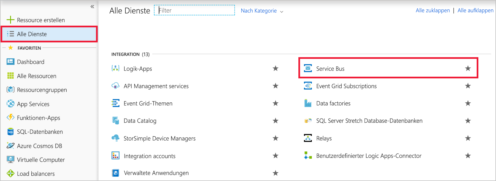
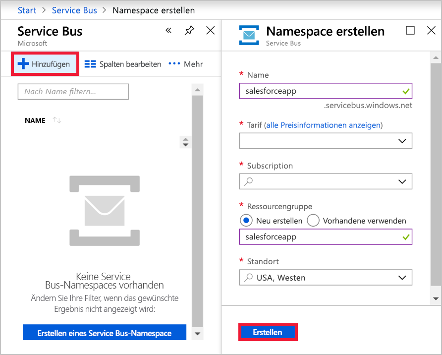
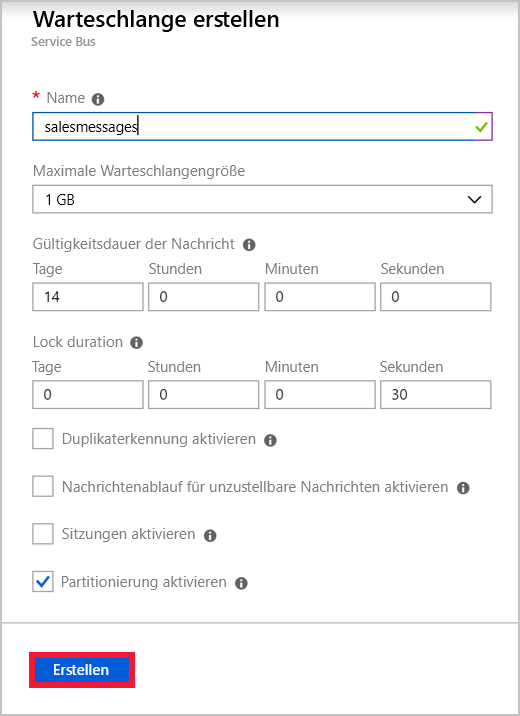
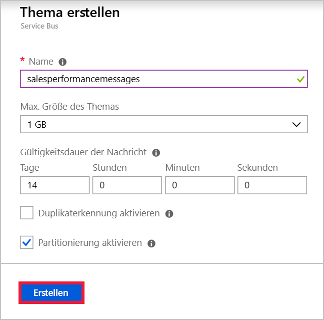

Angenommen, Sie verfügen in Ihrem globalen Unternehmen über eine Anwendung für das Vertriebsteam. Jedes Teammitglied nutzt ein Mobiltelefon, auf dem die App installiert ist. Mit einem in Azure gehosteten Webdienst wird die Geschäftslogik für Ihre Anwendung implementiert, und die Informationen werden in Azure SQL-Datenbank gespeichert. Für jede geografische Region ist eine Instanz des Webdiensts vorhanden. Sie haben für das Senden von Nachrichten zwischen der mobilen App und dem Webdienst die folgenden Ziele ermittelt:

- Nachrichten, die sich auf einzelne Verkäufe beziehen, müssen nur an die Instanz des Webdiensts in der Region des Benutzers gesendet werden.
- Nachrichten, die sich auf die Vertriebsleistung beziehen, müssen an alle Instanzen des Webdiensts gesendet werden.

Sie haben sich dafür entschieden, eine Service Bus-Warteschlange für den ersten Anwendungsfall und das Service Bus-Thema für den zweiten Anwendungsfall zu implementieren.

In dieser Übung erstellen Sie einen Service Bus-Namespace, der sowohl eine Warteschlange als auch ein Thema mit Abonnements enthält.

## Erstellen eines Service Bus-Namespace

[!include]

[!include]

In Azure Service Bus ist ein Namespace ein Container mit einem eindeutigen vollqualifizierten Domänennamen für Warteschlangen, Themen und Relays. Sie müssen zunächst den Namespace erstellen.

Jeder Namespace verfügt außerdem über primäre und sekundäre Shared Access Signature-Verschlüsselungsschlüssel. Eine sendende oder empfangende Komponente muss diese Schlüssel angeben, wenn sie eine Verbindung herstellt, um Zugriff auf die Objekte im Namespace zu erhalten.

Führen Sie diese Schritte aus, um einen Service Bus-Namespace mit dem Azure-Portal zu erstellen:

1. Melden Sie sich beim [Azure-Portal](https://portal.azure.com/?azure-portal=true) an.

1. Klicken Sie im linken Navigationsbereich auf **Alle Dienste**.

1. Scrollen Sie auf dem Blatt **Alle Dienste** nach unten zum Abschnitt **INTEGRATION**, und klicken Sie auf **Service Bus**.

    

1. Klicken Sie oben links auf dem Blatt **Service Bus** auf **Hinzufügen**.

1. Geben Sie im Textfeld **Name** einen eindeutigen Namen für den Namespace ein. Beispiel: „salesteamapp“ + *Ihre Initialen* + *aktuelles Datum*.

1. Wählen Sie in der Dropdownliste **Tarif** die Option **Standard** aus.

1. Wählen Sie in der Dropdownliste **Abonnement** Ihr Abonnement aus.

1. Unter **Ressourcengruppe**Option **vorhandene** , und wählen Sie <rgn>[Ressourcengruppennamen Sandkasten]</rgn>.

1. Wählen Sie in der Dropdownliste **Standort** einen Standort in Ihrer Nähe aus, und klicken Sie dann auf **Erstellen**. Der neue Service Bus-Namespace wird in Azure erstellt.

    

## Erstellen einer Service Bus-Warteschlange

Nachdem Sie nun über einen Namespace verfügen, können Sie eine Warteschlange für Nachrichten zu einzelnen Verkäufen erstellen. Gehen Sie hierzu wie folgt vor:

1. Klicken Sie auf dem Blatt **Service Bus** auf **Aktualisieren**. Der Namespace, den Sie gerade erstellt haben, wird angezeigt.

1. Klicken Sie auf den gerade erstellten Namespace.

1. Klicken Sie oben links auf dem Namespaceblatt auf **+ Warteschlange**.

1. Geben Sie auf dem Blatt **Warteschlange erstellen** im Textfeld **Name** den Namen **salesmessages** ein, und klicken Sie dann auf **Erstellen**. Azure erstellt die Warteschlange in Ihrem Namespace.

    

## Erstellen eines Service Bus-Themas und von Abonnements

Außerdem möchten Sie ein Thema erstellen, das für Nachrichten zur Vertriebsleistung verwendet wird. Mehrere Instanzen des Geschäftslogik-Webdiensts abonnieren dieses Thema aus verschiedenen Ländern. Jede Nachricht wird für mehrere Instanzen zugestellt.

Führen Sie diese Schritte aus:

1. Klicken Sie auf dem Blatt **Service Bus-Namespace** auf **+ Thema**.

1. Geben Sie auf dem Blatt **Thema erstellen** im Textfeld **Name** den Namen **salesperformancemessages** ein, und klicken Sie dann auf **Erstellen**. Azure erstellt das Thema in Ihrem Namespace.

    

1. Klicken Sie nach dem Erstellen des Themas auf dem Blatt **Service Bus-Namespace** unter **Entitäten** auf **Themen**.

1. Klicken Sie in der Liste mit den Themen auf **salesperformancemessages** und dann auf **+ Abonnement**.

1. Geben Sie im Textfeld **Name** den Namen **Americas** ein, und klicken Sie anschließend auf **Erstellen**.

1. Klicken Sie auf **+ Abonnement**.

1. Geben Sie im Textfeld **Name** den Namen **EuropeAndAfrica** ein, und klicken Sie anschließend auf **Erstellen**.

Sie haben die Infrastruktur erstellt, die erforderlich ist, um Service Bus zum Erhöhen der Resilienz Ihrer verteilten Anwendung für die Vertriebsmitarbeiter zu verwenden. Sie haben eine Warteschlange für Nachrichten zu einzelnen Verkäufen und ein Thema für Nachrichten zur Vertriebsleistung erstellt. Das Thema enthält mehrere Abonnements, da an das Thema gesendete Nachrichten für mehrere Empfängerwebdienste weltweit zugestellt werden können.
