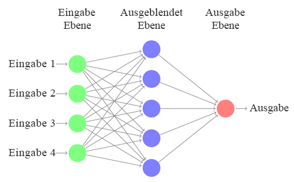
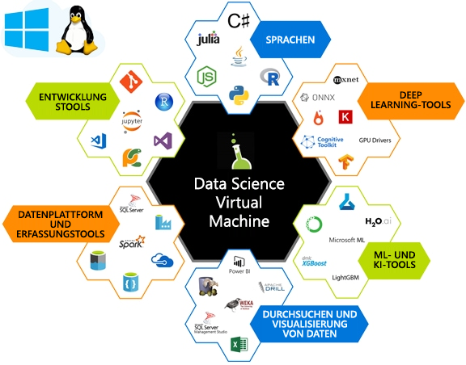

## Intro to deep learning

The goal of Machine Learning ML is to find features to train a model that transforms input data (such as pictures, time series, or audio) to a given output (for example captions, price values, transcriptions). In traditional data science, features are often hand-picked.

In Deep Learning (DL), the process of feature extraction is learned through representing inputs as vectors and transforming them, with a series of clever linear algebra operations, into a given output.  

The model output is then compared against the expected output using an equation called a loss function. The value returned by the loss function of each training input is used to guide the model to extract features that will result in a lower loss value on the next pass.  
 
The series of matrix operations that we computer as part of the linear algebra component tend to be computationally expensive and are often heavily parallelizable, requiring specialized compute such as Graphics Processing Units GPUs to compute efficiently.

## Data Science Virtual Machine

DSVMs are Azure Virtual Machine images, pre-installed, configured, and tested with several popular tools that are commonly used for data analytics, machine learning, and deep learning training.

They provide:

- Consistent setup across team, promote sharing and collaboration, Azure scale and management, Near-Zero Setup, full cloud-based desktop for data science.
- On-demand elastic capacity Ability to run analytics on all Azure hardware configurations with vertical and horizontal scaling. Pay only for what you use, when you use it.
- Deep Learning with GPUs Readily available GPU clusters with Deep Learning tools already pre-configured. 

The DSVM contains several tools for AI including popular GPU editions of deep learning frameworks and tools such as Microsoft R Server Developer Edition, Anaconda Python, Jupyter notebooks for Python and R, IDEs for Python and R, SQL database and many other data science and ML tools.

The DSVM can run on Azure GPU NC-series VM instances. These GPUs use discrete device assignment, resulting in performance close to bare-metal, and are well-suited to deep learning problems.

<!--### Quiz? 

What is the goal of machine learning? 
How is traditional machine learning different from deep learning? 
Why are GPU's often used for deep learning? 
What does the DSVM provide? -->
