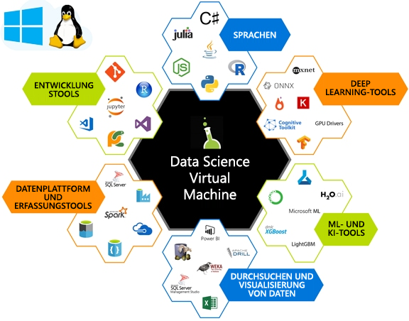

Das Ziel von Machine Learning (ML) besteht darin, Merkmale zu finden, mit denen ein Modell trainiert werden kann, um Eingabedaten (etwa Bild-, Zeitreihen- oder Audiodaten) in eine bestimmte Ausgabe (etwa Untertitel, Preiswerte oder Transkriptionen) umzuwandeln.The goal of Machine Learning (ML) is to find features to train a model that transforms input data (such as pictures, time series, or audio) to a given output (for example captions, price values, transcriptions). Bei herkömmlicher Data Science werden die Merkmale häufig manuell ausgewählt.In traditional data science, features are often handcrafted. Diese manuell erstellten Merkmale werden in einen flachen Lernalgorithmus eingespeist, wie beispielsweise in das in der folgenden Abbildung dargestellte Netzwerk.These handcrafted features are fed into a shallow learning algorithm, such as the network shown in the following diagram. 

Bei Deep Learning (DL) basiert die Extraktion von Merkmalen auf einem Lernprozess. Dabei werden Eingaben als Vektoren dargestellt und mithilfe von einigen intelligenten linearen Algebraoperationen in eine bestimmte Ausgabe umgewandelt.In Deep Learning (DL), the process of feature extraction is learned through representing inputs as vectors and transforming them, with a series of clever linear algebra operations, into a given output.  Die Ausgabe des Modells wird unter Verwendung einer Gleichung (Verlustfunktion) mit der erwarteten Ausgabe abgeglichen.The model output is compared against the expected output using an equation called a loss function. Der Wert, der von der Verlustfunktion für jede Trainingseingabe zurückgegeben wird, dient zur Optimierung des Modells, sodass beim nächsten Mal Merkmale mit einem geringeren Verlustwert extrahiert werden können.The value returned by the loss function of each training input is used to guide the model to extract features that will result in a lower loss value on the next pass. Dieser Vorgang wird als *Training* bezeichnet.This process is called *training*. 

Durch Training lernen diese Algorithmen die leistungsstärksten und geeignetsten Merkmale für das jeweilige Dataset.Through training, these algorithms learn the best performing and most appropriate features for the given dataset. Sie werden aufgrund der Anzahl der Schichten im Netzwerk als „deep“ (tief) bezeichnet.They are called deep because of the number of layers in the network.  

Die Reihe von Matrixoperationen, die wir als Teil der linearen Algebrakomponente berechnen, sind rechenintensiv.The series of matrix operations that we compute as part of the linear algebra component are computationally expensive. Diese Operationen können oft parallel verarbeitet werden. Dies macht sie zu idealen Kandidaten für spezialisierte Berechnungen wie Graphics Processing Units (GPUs), um effizientes Computing bereitzustellen.These operations can often be processed in parallel, making them great candidates for specialized compute such as Graphics Processing Units (GPUs) to compute efficiently.

Das Einrichten einer Umgebung für Deep Learning ist nicht trivial.Setting up an environment to do deep learning is non-trivial. Wie sieht das Hardwaresetup aus, trainieren Sie Ihr Modell mit CPUs oder GPUs und wie viel Speicherplatz sollten diese Computer aufweisen?What's the hardware setup, do you train your model with CPUs or GPUs, and how much memory should these machines have? Für das Erstellen und Trainieren eines Deep Learning-Netzwerks muss die richtige Software installiert sein.Creating and training a deep learning network needs the right software to be installed. Sie haben viele verschiedene Deep Learning-Frameworks zur Auswahl, aber Sie müssen auch die Abhängigkeiten zwischen den einzelnen Komponenten berücksichtigen.You've lots of  deep learning frameworks to choose from, but need to be mindful of dependencies between each component. Nach der aufwändigen Einrichtung finden Sie vielleicht ein großartiges Modell, das für ein anderes Framework erstellt wurde, das Sie gerne testen würden. Sie möchten nicht den Aufwand betreiben, ein neues Deep Learning-Framework mit all seinen Abhängigkeiten auf Ihrem Computer einzurichten.After all of this setup, you might find a great model created on another framework and would like to try it out. You don’t want the overhead of getting a new deep learning framework with all of its dependencies set up on your machine. Data Science Virtual Machine kann diese Probleme lösen.The Data Science Virtual Machine can help solve these problems. 

## Was ist Data Science Virtual Machine?What is a Data Science Virtual Machine (DSVM)?

Data Science Virtual Machine ist ein VM-Image in Azure.The Data Science Virtual Machine is a virtual machine (VM) image on Azure. In ihm sind viele beliebte Data Science- und Deep Learning-Tools bereits installiert und konfiguriert.It has many popular data science and deep learning tools already installed and configured. Diese Images enthalten gängige Data Science- und Machine Learning-Tools, darunter Microsoft R Server Developer Edition, Microsoft R Open, Anaconda Python, Julia, Jupyter Notebooks, Visual Studio Code, RStudio, xgboost und viele mehr.These images come with popular data science and machine learning tools, including Microsoft R Server Developer Edition, Microsoft R Open, Anaconda Python, Julia, Jupyter notebooks, Visual Studio Code, RStudio, xgboost, and many more.  Statt auf eigene Faust einen vergleichbaren Arbeitsbereich bereitzustellen, können Sie eine DSVM nutzen. Dies spart Ihnen viel Zeit bei den mit Installation, Konfiguration und Paketverwaltung einhergehenden Prozessen.Instead of rolling out a comparable workspace on your own, you can provision a DSVM - saving you lots of time on the installation, configuration, and package management processes. Nachdem Ihre DSVM bereitgestellt wurde, können Sie sofort mit der Arbeit an Ihrem Data Science-Projekt beginnen.Once your DSVM has been deployed, you can immediately begin working on your data science project.

Die DSVM kann zum Modelltraining mit Deep Learning-Algorithmen auf Basis von GPU-Hardware (Grafikprozessoren) verwendet werden.The DSVM can be used for training models using deep learning algorithms on Graphics processing units (GPUs) hardware. Durch die VM-Skalierungsfunktionen der Azure-Cloud hilft DSVM Ihnen beim Einsatz von GPU-basierter Hardware in der Cloud nach Bedarf.Utilizing VM scaling capabilities of Azure cloud, DSVM helps you use GPU-based hardware on the cloud as per need. Sie können zu einem GPU-basierten virtuellen Computer wechseln, wenn Sie große Modelle trainieren oder schnelle Berechnungen benötigen, während Sie den gleichen Betriebssystemdatenträger beibehalten.You can switch to a GPU-based VM when training large models or need high-speed computations while keeping the same OS disk. Die Windows Server 2016-Edition von DSVM enthält vorinstallierte GPU-Treiber und -Frameworks sowie GPU-Versionen der Deep Learning-Frameworks.The Windows Server 2016 edition of DSVM comes pre-installed with GPU drivers, frameworks, and GPU versions of deep learning frameworks. Unter Linux ist Deep Learning für GPUs sowohl in CentOS- als auch in Ubuntu-DSVMs aktiviert.On the Linux, deep learning on GPU is enabled on both the CentOS and Ubuntu DSVMs. Sie können die Ubuntu-, CentOS- oder Windows 2016-Edition von Data Science Virtual Machine auch auf CPU-basierten virtuellen Azure-Computern bereitstellen. In diesem Fall werden jedoch die Deep Learning-Frameworks auf den CPU-Modus zurückgesetzt.You can also deploy the Ubuntu, CentOS, or Windows 2016 edition of the Data Science VM to CPU-based Azure virtual machines, in which case all the deep learning frameworks will fallback to CPU mode. 

Weitere Informationen dazu, welche Aufgaben Sie mit einer DSVM ausführen können, finden Sie unter [Data Science mit einer Linux Data Science Virtual Machine in Azure](https://docs.microsoft.com/azure/machine-learning/data-science-virtual-machine/linux-dsvm-walkthrough)For more information on what you can do with a DSVM, see [Data science with a Linux Data Science Virtual Machine on Azure](https://docs.microsoft.com/azure/machine-learning/data-science-virtual-machine/linux-dsvm-walkthrough)

