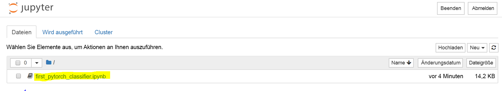
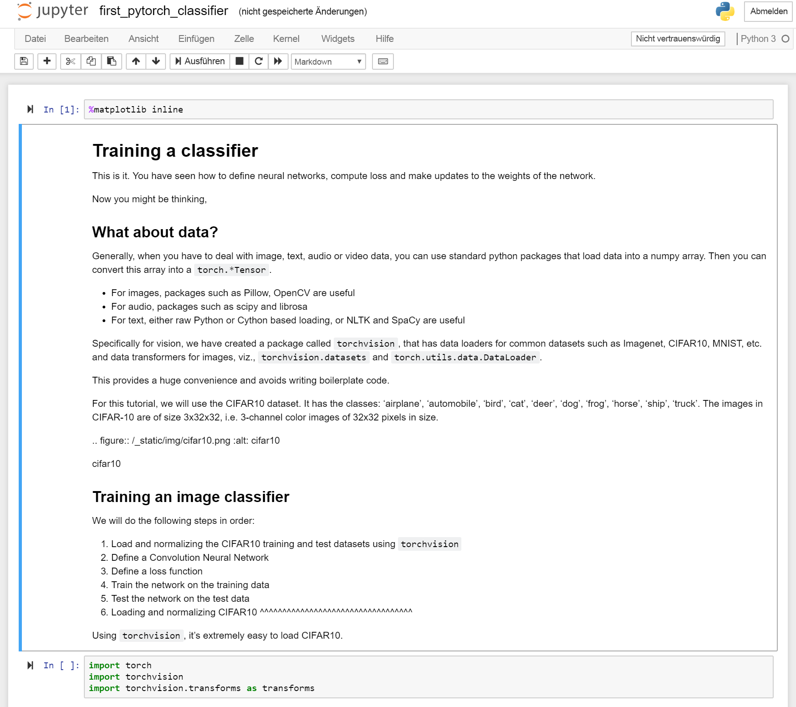

## Train your first deep learning model using PyTorch and Jupyter

 

Typically deep learning engineers do not hard code matrix algebra operations all by hand. They instead use frameworks such as PyTorch or TensorFlow.  

PyTorch is a python-based framework that provides flexibility as a deep learning development platform. PyTorch's workflow is built on top of python scientific computing library numpy. 

Now you might ask, why would we use PyTorch to build deep learning models?  

- Easy to use API – It's as simple as python can be.
- Python support – PyTorch smoothly integrates with the scientific computing stack.
- Dynamic computation graphs – Instead of predefined graphs with specific functionalities, PyTorch build computational graphs dynamically that can be modified during runtime. Dynamic computation graphs are valuable for nested batching and when we do not know how much memory will be needed for creating a given network.

## Run your first PyTorch model

Navigate to the Jupyter Notebook that you set up in the last chapter.

- [[HOSTNAME OF DSVM]].westus2.cloudapp.azure.com:8888/?token={sometoken}

Select the first_pytorch_classifier.ipynb notebook

Follow the instructions in the notebook to train your first PyTorch classifer.

