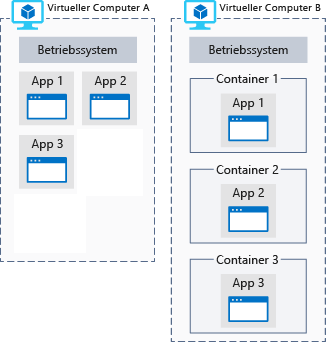

Ihr Forschungsteam hat riesige Mengen an Bilddaten gesammelt, die möglicherweise zu einer Entdeckung auf dem Mars führen. Dazu ist jedoch eine rechenaufwendige Datenverarbeitung erforderlich, und das Team verfügt nicht über die nötige Ausstattung. Sehen wir uns an, was Azure zu einer guten Wahl für die Datenanalyse macht.

## Was ist Azure Compute?
Azure Compute ist ein bedarfsbasierter Computing-Dienst zur Ausführung cloudbasierter Anwendungen. Er stellt Rechenressourcen wie Multi-Core-Prozessoren und Supercomputer über virtuelle Computer und Container bereit. Darüber hinaus bietet der Dienst serverloses Computing, wodurch Apps ohne Einrichtung oder Konfiguration einer Infrastruktur ausgeführt werden können. Die Ressourcen sind bei Bedarf verfügbar und können in der Regel innerhalb von Minuten oder sogar Sekunden erstellt werden. Sie zahlen nur für die Ressourcen, die Sie verwenden, und nur solange Sie sie verwenden.

Es gibt drei gängige Vorgehensweise zum Ausführen von Compute in Azure:

- Virtuelle Computer
- Container
- Serverloses Computing

## Was sind virtuelle Computer?

**Virtuelle Computer** (Virtual Machines, VMs) sind Softwareemulationen physischer Computer. Sie umfassen einen Prozessor, den Arbeitsspeicher, den Speicher und Netzwerkressourcen. Sie hosten ein Betriebssystem und ermöglichen es, Software wie auf einem physischen Computer zu installieren und auszuführen. Mithilfe eines Remotedesktopclients können Sie den virtuellen Computer so verwenden und steuern, als säßen Sie direkt davor.

:::row:::
  :::column:::
    
  :::column-end:::
    :::column span="3":::
**Virtuelle Computer in Azure**

Virtuelle Computer können in Azure erstellt und gehostet werden. Neue virtuelle Computer können in der Regel innerhalb von Minuten erstellt und bereitgestellt werden, indem ein Image eines vorkonfigurierten virtuellen Computers ausgewählt wird.

Die Wahl des Images ist eine der wichtigsten Entscheidungen, die Sie beim Erstellen eines virtuellen Computers treffen. Ein Image ist eine Vorlage, die zum Erstellen eines virtuellen Computers verwendet wird. Diese Vorlagen enthalten bereits ein Betriebssystem und häufig auch andere Software, z.B. Entwicklungstools oder Webhostingumgebungen.

  :::column-end:::
:::row-end:::

## Was sind Container?

> [!VIDEO https://www.microsoft.com/videoplayer/embed/RE2yMhY]

Container sind eine Virtualisierungsumgebung, die im Gegensatz zu VMs kein Betriebssystem beinhaltet. Stattdessen verweisen sie auf das Betriebssystem der Hostumgebung, in der der Container ausführt wird. Wenn zum Beispiel fünf Container auf einem Server mit einem spezifischen Linux-Kernel ausgeführt werden, werden alle fünf Container auf demselben Kernel ausgeführt.

In der folgenden Abbildung werden Anwendungen, die direkt auf einem virtuellen Computer ausgeführt werden, mit Anwendungen verglichen, die innerhalb eines Containers auf einem virtuellen Computer ausgeführt werden.

Container enthalten in der Regel eine von Ihnen geschriebene Anwendung sowie alle Bibliotheken, die für die Ausführung Ihrer Anwendung auf dem Kernel der Hostumgebung erforderlich sind.

Container sind kompakt und dafür konzipiert, dynamisch erstellt, hochskaliert und beendet zu werden. Dadurch können Sie auf Änderungen beim Bedarf reagieren und im Falle eines Absturzes oder einer Hardwarestörung rasch neu starten.

Die Verwendung von Containern hat zudem den Vorteil, dass mehrere isolierte Anwendungen auf einem virtuellen Computer ausgeführt werden können. Da Container selbst geschützt und isoliert sind, benötigen Sie nicht unbedingt separate virtuelle Computer für separate Workloads.

Azure unterstützt Docker-Container und mehrere Methoden zum Verwalten dieser Container. Container können manuell oder mit Azure-Diensten wie Azure Kubernetes Service verwaltet werden.

### Was ist serverloses Computing?

Serverloses Computing ist eine in der Cloud gehostete Ausführungsumgebung, die Ihren Code ausführt, die zugrunde liegende Hostumgebung jedoch vollständig abstrahiert. Sie erstellen eine Instanz des Diensts und fügen Ihren Code hinzu. Eine Konfiguration oder Wartung der Infrastruktur ist weder erforderlich noch zulässig.

#### Was ist serverloses Computing?

> [!VIDEO https://www.microsoft.com/videoplayer/embed/RE2yzjL]

Sie konfigurieren Ihre serverlosen Apps, um auf _Ereignisse_ zu reagieren. Dabei kann es sich um einen REST-Endpunkt, einen Timer oder eine von einem anderen Azure-Dienst empfangene Nachricht handeln. Die serverlose App wird nur ausgeführt, wenn sie durch ein Ereignis ausgelöst wird.

Für die Infrastruktur sind Sie nicht verantwortlich. Skalierung und Leistungsanpassung erfolgen automatisch. Es werden nur die Ressourcen in Rechnung gestellt, die Sie verwenden. Das Reservieren von Kapazität ist nicht notwendig.

:::row:::
  :::column:::
    
  :::column-end:::
    :::column span="3":::
**Serverloses Computing in Azure**

Azure verfügt über zwei Implementierungen von serverlosem Computing:

- **Azure Functions** ist in der Lage, Code in fast jeder modernen Programmiersprache auszuführen.
- Mit **Azure Logic Apps** erstellte Apps werden in einem webbasierten Designer erstellt und können Logik ausführen, die von Azure-Diensten ausgelöst wird – und zwar ganz ohne Schreiben von Code.

  :::column-end:::
:::row-end:::