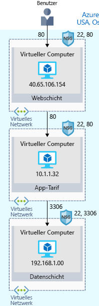

Der erste Schritt besteht mit hoher Wahrscheinlichkeit darin, Ihre lokale Konfiguration in der Cloud neu zu erstellen.Your first step will likely be to re-create your on-premises configuration in the cloud.

Mit der folgenden grundlegenden Konfiguration erhalten Sie einen Überblick darüber, wie Netzwerke konfiguriert werden und Netzwerkdatenverkehr an bzw. von Azure gesendet wird.This basic configuration will give you a sense of how networks are configured, and how network traffic moves in and out of Azure.

## Ihre E-Commerce-Website auf einen BlickYour e-commerce site at a glance

Größere Unternehmenssysteme bestehen häufig aus miteinander verbundenen Anwendungen und Diensten, die interagieren.Larger enterprise systems are often composed of multiple inter-connected applications and services that work together. Möglicherweise verfügen Sie über ein Front-End-System, das dafür zuständig ist, einen Bestand anzuzeigen und Kunden die Möglichkeit bietet, eine Bestellung aufzugeben.You might have a front-end web system that takes displays inventory and allows customers to create an order. Dieses System kommuniziert unter Umständen mit einer Vielzahl von Webdiensten, um Bestandsdaten bereitzustellen, Benutzerprofile zu verwalten, Kreditkartendaten zu verarbeiten und die Bestellabwicklung anzufordern.That might talk to a variety of web services to provide the inventory data, manage user profiles, process credit cards, and request fulfillment of processed orders.

Es gibt verschiedene Strategien und Muster, die von Softwarearchitekten und Entwicklern eingesetzt werden, um diese komplexen Systeme einfacher zu entwerfen, zu erstellen, zu verwalten und zu warten.There are several strategies and patterns employed by software architects and designers to make these complex systems easier to design, build, manage, and maintain. Wir werfen nun einen Blick auf einige dieser Ansätze und beginnen mit _lose gekoppelten Architekturen_.Let's look at a few of them, starting with _loosely coupled architectures_.

### Vorteile einer lose gekoppelten ArchitekturBenefits of a loosely coupled architecture

<!-- TOOD: verify video -->
> [!VIDEO https://www.microsoft.com/en-us/videoplayer/embed/RE2yHrc]

### Verwenden einer n-schichtigen ArchitekturUsing an N-tier architecture

Zur Erstellung lose gekoppelter Systeme kann ein _n-schichtiges_ Architekturmuster verwendet werden.An architectural pattern that can be used to build loosely coupled systems is _N-Tier_.

In einer [n-schichtigen Architektur](https://docs.microsoft.com/azure/architecture/guide/architecture-styles/n-tier) wird eine Anwendung in mindestens zwei logische Schichten aufgeteilt.An [N-tier architecture](https://docs.microsoft.com/azure/architecture/guide/architecture-styles/n-tier) divides an application into two or more logical tiers. Höhere Schichten können dabei auf Dienste niedrigerer Schichten zugreifen. Umgekehrt sollte dies jedoch nicht möglich sein.Architecturally, a higher tier can access services from a lower tier, but a lower tier should never access a higher tier.

Schichten sind im Idealfall wiederverwendbar und werden dazu verwendet, unterschiedliche Aufgaben voneinander zu trennen.Tiers help separate concerns, and are ideally designed to be reusable. Eine Schichtenarchitektur verringert auch den Wartungsaufwand.Using a tiered architecture also simplifies maintenance. Schichten können unabhängig voneinander geändert oder ersetzt werden können. Zusätzlich können neue Schichten bei Bedarf eingefügt werden.Tiers can be updated or replaced independently, and new tiers can be inserted if needed.

Unter einer _dreischichtigen_ Anwendung wird eine n-schichtige Anwendung mit drei Schichten verstanden._Three-tier_ refers to an n-tier application that has three tiers. Auch für Ihre E-Commerce-Webanwendung wird eine dreischichtige Architektur verwendet:Your e-commerce web application follows this three-tier architecture:

* Die **Webschicht** stellt über einen Browser die Webschnittstelle für Ihre Benutzer bereit.The **web tier** provides the web interface to your users through a browser.
* In der **Logikschicht** wird die Geschäftslogik ausgeführt.The **application tier** runs business logic.
* Die **Datenschicht** enthält Datenbanken und andere Speicher, die Produktinformationen und Kundenbestellungen enthalten.The **data tier** includes databases and other storage that hold product information and customer orders.

Auf der folgenden Abbildung wird der Weg der Benutzeranforderung vom Benutzer bis zur Datenschicht dargestellt.The following illustration shows the flow of request from the user to the data tier.

Wenn der Benutzer auf die Schaltfläche zum Aufgeben der Bestellung klickt, wird die Anforderung zusammen mit der Adresse des Benutzers und den Zahlungsinformationen an die Webschicht gesendet.When the user clicks the button to place the order, the request is sent to the web tier, along with the user's address and payment information. Die Webschicht übergibt diese Informationen der Logikschicht, in der die Zahlungsinformationen überprüft werden und eine Bestandsprüfung durchgeführt wird.The web tier passes this information to the application tier, which would validate payment information and check inventory. Mithilfe der Logikschicht kann die Bestellung anschließend in der Datenschicht gespeichert werden, damit später die Bestellabwicklung eingeleitet werden kann.The application tier might then store the order in the data tier, to be picked up later for fulfillment.

## Ihre E-Commerce-Website in AzureYour e-commerce site running on Azure

Azure bietet mehrere Möglichkeiten zum Hosten Ihrer Webanwendungen, die von vollständig vorkonfigurierten Umgebungen, in denen Ihr Code gehostet wird, bis hin zu virtuellen Computern reichen, die Sie selbst konfigurieren, anpassen und verwalten.Azure provides many different ways to host your web applications, from fully pre-configured environments that host your code, to virtual machines that you configure, customize, and manage.

Angenommen, Sie möchten Ihre E-Commerce-Website auf virtuellen Computern betreiben.Let's say you choose to run your e-commerce site on virtual machines. In Ihrer Testumgebung in Azure könnte dies etwa wie folgt aussehen.Here's what that might look like in your test environment running on Azure. Auf der folgenden Abbildung wird eine Architektur mit drei Schichten dargestellt, die auf virtuellen Computern ausgeführt werden. Zusätzlich sind Sicherheitsfeatures aktiviert, durch die eingehende Anforderungen eingeschränkt werden.The following illustration shows a three-tier architecture running on virtual machines with security features enabled to restrict inbound requests. 

Im Folgenden erhalten Sie einen Überblick über die einzelnen Komponenten.Let's break this down.

### Was ist eine Azure-Region?What is an Azure region?

Eine _Region_ ist ein Azure-Rechenzentrum an einem bestimmten geografischen Standort.A _region_ is an Azure data center within a specific geographic location. Beispiele für Regionen sind „USA, Osten“, „USA, Westen“ und „Europa, Norden“.East US, West US, and North Europe are examples of regions. Wie Sie sehen, wird die Anwendung in der Region „USA, Osten“ ausgeführt.You see that the application is running in the East US region.

### Was ist ein virtuelles Netzwerk?What is a virtual network?

Ein _virtuelles Netzwerk_ ist ein logisch isoliertes Netzwerk in Azure.A _virtual network_ is a logically isolated network on Azure. Wenn Sie bereits Netzwerke in Hyper-V, VMware oder in anderen öffentlichen Clouds eingerichtet haben, sind Sie sicherlich mit virtuellen Azure-Netzwerken vertraut.Azure virtual networks will be familiar to you if you’ve set up networks on Hyper-V, VMware, or even on other public clouds.

Die Web-, Logik- und Datenschichten verfügen jeweils über einen eigenen virtuellen Computer.The web, application, and data tiers each have a single VM. Jeder virtuelle Computer gehört zu einem virtuellen Netzwerk.Each VM belongs to a virtual network.

Benutzer interagieren direkt mit der Webschicht, weshalb der virtuelle Computer in dieser Schicht über eine öffentliche IP-Adresse verfügt.Users interact with the web tier directly, so that VM has a public IP address. Mit der Logik- und Datenschicht interagieren die Benutzer hingegen nicht.Users don't interact with the application or data tiers. Diese virtuellen Computer verfügen dementsprechend über jeweils eine private IP-Adresse.So these VMs each have a private IP address.

Die physische Hardware wird von Azure-Rechenzentren für Sie verwaltet.Azure data centers manage the physical hardware for you. Die virtuellen Netzwerke konfigurieren Sie mithilfe von Software, wodurch Sie virtuelle Netzwerke wie eigene Netzwerke behandeln können.You configure virtual networks through software, which enables you to treat a virtual network just like your own network. Beispielsweise haben Sie die Möglichkeit, ein virtuelles Netzwerk in Subnetze zu unterteilen, um besser steuern zu können, wie das Netzwerk IP-Adressen zuweist.For example, you can divide a virtual network into subnets to better control how the network assigns IP addresses. Außerdem können Sie andere Netzwerke – beispielsweise das öffentliche Internet oder Netzwerke innerhalb des privaten IP-Adressraums – festlegen, die über das virtuelle Netzwerk erreichbar sind.You also choose which other networks your virtual network can reach, whether that’s the public internet or other networks in the private IP address space.

### Was ist eine Netzwerksicherheitsgruppe?What's a network security group?

Eine _Netzwerksicherheitsgruppe_ (NSG) lässt eingehenden Netzwerkdatenverkehr für Ihre Azure-Ressourcen zu oder blockiert diesen.A _network security group_, or NSG, allows or denies inbound network traffic to your Azure resources. Eine Netzwerksicherheitsgruppe ist mit einer Firewall auf Cloudebene für Ihr Netzwerk vergleichbar.Think of a network security group as a cloud-level firewall for your network.

Der virtuelle Computer in der Webschicht lässt beispielsweise eingehenden Datenverkehr für die Ports 22 (SSH) und 80 (HTTP) zu.For example, notice that the VM in the web tier allows inbound traffic on ports 22 (SSH) and 80 (HTTP). Hierbei lässt jede Netzwerksicherheitsgruppe Datenverkehr aus allen Quellen zu.Each network security group here allows traffic from all sources. Sie können nun die Netzwerksicherheitsgruppe so konfigurieren, dass nur Datenverkehr aus bekannten Quellen, z.B. von vertrauenswürdigen IP-Adressen, akzeptiert wird.You can configure a network security group to accept traffic only from known sources, such as IP addresses that you trust.

> [!NOTE]
> Über Port 22 können Sie eine SSH-Verbindung mit Linux-Systemen herstellen.Port 22 enables you to connect directly to Linux systems over SSH. In unserem Szenario ist Port 22 aus didaktischen Gründen offen.Here we show port 22 open for learning purposes. In der Praxis können Sie den VPN-Zugriff auf Ihr virtuelles Netzwerk konfigurieren und so die Sicherheit erhöhen.In practice, you might configure VPN access to your virtual network to increase security.

## ZusammenfassungSummary

Ihre dreischichtige Anwendung wird nun in Azure in der Region „USA, Osten“ ausgeführt.Your three-tier application is now running on Azure in the East US region. Eine _Region_ ist ein Azure-Rechenzentrum an einem bestimmten geografischen Standort.A _region_ is an Azure data center within a specific geographic location.

Jede Schicht kann nur auf Dienste untergeordneter Schichten zugreifen.Each tier can access services only from a lower tier. Der virtuelle Computer in der Webschicht verfügt über eine öffentliche IP-Adresse, da Datenverkehr über das Internet empfangen wird.The VM running in the web tier has a public IP address because it receives traffic from the internet. Die virtuellen Computer in der niedrigeren Logik- und Datenschicht verfügen jeweils über private IP-Adressen, da sie nicht direkt über das Internet kommunizieren.The VMs in the lower tiers, the application and data tiers, each have private IP addresses because they don't communicate directly over the internet.

Mit _virtuellen Netzwerken_ können Sie zugehörige Systeme gruppieren und isolieren._Virtual networks_ enable you to group and isolate related systems. Über _Netzwerksicherheitsgruppen_ steuern Sie, welcher Datenverkehr über ein virtuelles Netzwerk übertragen wird.You define _network security groups_ to control what traffic can flow through a virtual network.

Die hier beschriebene Konfiguration erleichtert Ihnen die ersten Schritte.The configuration you saw here is a good start. Wenn Sie jedoch Ihre E-Commerce-Website für die Produktionsphase in der Cloud bereitstellen, werden vermutlich die gleichen Probleme wie bei Ihrer lokalen Bereitstellung auftreten.But when you deploy your e-commerce site to production in the cloud, you'll likely run into the same problems as you did in your on-premises deployment.
