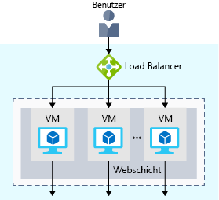
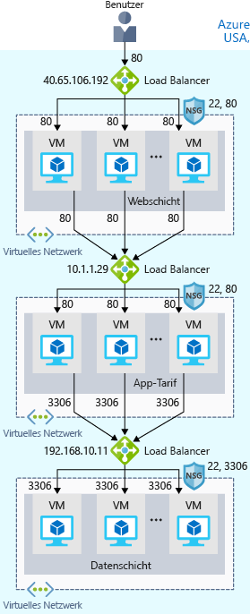
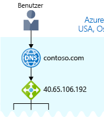

Ihre Website ist nun online und wird in Azure gehostet.You now have your site up and running on Azure. Wie kann aber sichergestellt werden, dass Ihre Website ununterbrochen verfügbar ist?But how can you help ensure your site is running 24/7?

Und was geschieht beispielsweise, wenn Sie wöchentliche Wartungsarbeiten durchführen müssen?For instance, what happens when you need to do weekly maintenance? Innerhalb des Wartungsfensters ist Ihr Dienst nicht verfügbar.Your service will still be unavailable during your maintenance window. Da Ihre Website von Benutzern auf der ganzen Welt genutzt wird, gibt es keinen idealen Wartungszeitraum.And because your site reaches users all over the world, there's no good time to take down your systems for maintenance. Falls zu viele Benutzer gleichzeitig eine Verbindung mit Ihrer Website herstellen, kann es außerdem zu Leistungsproblemen kommen.You may also run into performance issues if too many users connect at the same time.

## Was sind Verfügbarkeit und Hochverfügbarkeit?What are availability and high availability?

:::row:::
  :::column:::
    
  :::column-end:::
    :::column span="3"::: Unter _Verfügbarkeit_ wird der Zeitraum verstanden, in dem ein Dienst ohne Unterbrechung ausgeführt werden kann.:::column span="3"::: _Availability_ refers to how long your service is up and running without interruption. Unter _Hochverfügbarkeit_ (oder als Adjektiv _hochverfügbar_) wird ein langer Zeitraum verstanden, in dem ein Dienst ohne Unterbrechung ausgeführt werden kann._High availability_, or _highly available_, refers to a service that's up and running for a long period of time.

Wenn Informationen nicht zugänglich sind, ist das frustrierend, wie Sie sicherlich selbst wissen.You know how frustrating it is when you can't access the information you need. Gute Beispiele sind Plattformen für soziale Medien oder bestimmte Nachrichtenseiten, die Sie vermutlich jeden Tag nutzen.Think of a social media or news site that you visit daily. Können Sie jederzeit auf diese Websites zugreifen oder werden häufig Fehlermeldungen wie „503 Service Unavailable“ (503 – Dienst nicht verfügbar) angezeigt?Can you always access the site, or do you often see error messages like "503 Service Unavailable"?
  :::column-end:::
 :::row-end:::

Möglicherweise haben Sie schon einmal den englischen Ausdruck „Five Nines Availability“ gehört.You may have heard terms like "five nines availability." Dieser bezieht sich auf einen Dienst, für den eine Verfügbarkeit von 99,999 % garantiert wird.Five nines availability means that the service is guaranteed to be running 99.999 percent of the time. Dieser Zustand wird von vielen Teams angestrebt, da eine Verfügbarkeit von 100 % nur schwer gewährleistet werden kann.Although it's difficult to achieve 100 percent availability, many teams strive for at least five nines.

## Was ist Resilienz?What is resiliency?

:::row:::
  :::column:::
    
  :::column-end:::
    :::column span="3"::: Unter _Resilienz_ wird die Fähigkeit eines Systems verstanden, auch bei anormalen Bedingungen weiterhin einsatzfähig zu sein.:::column span="3"::: _Resiliency_ refers to a system's ability to stay operational during abnormal conditions.

Zu diesen Bedingungen zählenThese conditions include:

- Naturkatastrophen,Natural disasters.
- geplante und ungeplante Systemwartungen, bei denen Softwareupdates oder Sicherheitspatches durchgeführt werden,System maintenance, both planned and unplanned, including software updates and security patches.
- Lastspitzen beim Website-DatenverkehrSpikes in traffic to your site.
- und von Angreifern ausgehende Bedrohungen wie verteilte Denial-of-Service-Angriffe (DDoS).Threats made by malicious parties, such as distributed denial of service, or DDoS, attacks.
  :::column-end:::
:::row-end:::

Angenommen, Ihr Marketingteam möchte einen Blitzverkauf organisieren, um neue Vitaminpräparate zu bewerben.Imagine your marketing team wants to have a flash sale to promote a new line of vitamin supplements. Für den geplanten Zeitraum rechnen Sie mit Lastspitzen.You might expect a huge spike in traffic during this time. Diese könnten Ihr Verarbeitungssystem überfordern und dessen Leistung einschränken oder sogar zu einem Ausfall führen, was zu Enttäuschung auf Benutzerseite führen würde.This spike could overwhelm your processing system, causing it to slow down or halt, disappointing your users. Vielleicht haben Sie schon einmal eine ähnliche Erfahrung gemacht,You may have experienced this disappointment for yourself. als Sie sich für ein Onlineangebot interessiert haben und feststellen mussten, dass die Website nicht erreichbar war.Have you ever tried to access an online sale only to find the website wasn't responding?

## Was ist ein Lastenausgleich?What is a load balancer?

:::row:::
  :::column:::
    
  :::column-end:::
    :::column span="3"::: Ein _Lastenausgleich_ verteilt den Datenverkehr gleichmäßig auf die einzelnen Systeme in einem Pool.:::column span="3"::: A _load balancer_ distributes traffic evenly among each system in a pool. Mit diesem können Sie leichter Hochverfügbarkeit und Resilienz gewährleisten.A load balancer can help you achieve both high availability and resiliency.

Angenommen, Sie fügen allen Schichten zusätzliche, jeweils gleich konfigurierte virtuelle Computer hinzu.Say you start by adding additional VMs, each configured identically, to each tier. Die Idee besteht darin, über zusätzliche Systeme zu verfügen, falls eines ausfällt oder zu viele Benutzeranforderungen gleichzeitig verarbeitet werden müssen.The idea is to have additional systems ready, in case one goes down or is serving too many users at the same time.
  :::column-end:::
:::row-end:::

Problematisch ist hier, dass jeder virtueller Computer über eine eigene IP-Adresse verfügt.The problem here is that each VM would have its own IP address. Außerdem besteht keine Möglichkeit, den Datenverkehr zu verteilen, falls ein System ausfällt oder ausgelastet ist.Plus, you don't have a way to distribute traffic in case one system goes down or is busy. Es stellt sich daher die Frage, wie die virtuellen Computer so verbunden werden, dass Benutzer den Eindruck haben, mit nur einem System zu interagieren.How do you connect your VMs so that they appear to the user as one system?

Die Lösung besteht im Einsatz eines Lastenausgleichs, der den Datenverkehr verteilt.The answer is to use a load balancer to distribute traffic. Der Lastenausgleich wird für die Benutzer zum Einstiegspunkt.The load balancer becomes the entry point to the user. Diese wissen nicht (und müssen auch nicht wissen), welches System vom Lastenausgleich dazu bestimmt wird, die Anforderung entgegenzunehmen.The user doesn't know (or need to know) which system the load balancer chooses to receive the request.

Auf der folgenden Abbildung ist die Rolle eines Lastenausgleichs dargestellt.The following illustration shows the role of a load balancer.

Wie Sie sehen, empfängt der Lastenausgleich die Benutzeranforderung.You see that the load balancer receives the user's request. Anschließend wird diese an einen der virtuellen Computer in der Webschicht weitergeleitet.The load balancer directs the request to one of the VMs in the web tier. Wenn der virtuelle Computer nicht verfügbar ist oder nicht mehr reagiert, leitet der Lastenausgleich keinen Datenverkehr mehr an diesen weiter.If a VM is unavailable or stops responding, the load balancer stops sending traffic to it. Stattdessen wird der Datenverkehr an einen der antwortenden Server weitergeleitet.The load balancer then directs traffic to one of the responsive servers.

Mit einem Lastenausgleich können Sie Wartungsaufgaben ausführen, ohne den Dienst zu unterbrechen.Load balancing enables you to run maintenance tasks without interrupting service. Sie haben beispielsweise die Möglichkeit, das Wartungsfenster für jeden virtuellen Computer so festzulegen, dass keine Überschneidungen auftreten.For example, you can stagger the maintenance window for each VM. Innerhalb des Wartungsfensters erkennt der Lastenausgleich, dass der virtuelle Computer nicht reagiert, und leitet den Datenverkehr an die anderen virtuellen Computer im Pool weiter.During the maintenance window, the load balancer detects that the VM is unresponsive, and directs traffic to other VMs in the pool.

Sie können auch der Logik- und Datenschicht Ihrer E-Commerce-Website einen Lastenausgleich hinzufügen.For your e-commerce site, the app and data tiers can also have a load balancer. Ob diese Entscheidung sinnvoll ist, hängt von den Anforderungen Ihres Diensts ab.It all depends on what your service requires.

## Was ist Azure Load Balancer?What is Azure Load Balancer?

Azure Load Balancer ist ein Lastenausgleichsdienst, der von Microsoft bereitgestellt wird und Ihnen Wartungsaufgaben abnimmt.Azure Load Balancer is a load balancer service that Microsoft provides that helps take care of the maintenance for you.

Wenn Sie übliche Lastenausgleichssoftware manuell auf einem virtuellen Computer konfigurieren, hat dies den Nachteil, dass Sie über ein zusätzliche System verfügen, das Sie verwalten müssen.When you manually configure typical load balancer software on a virtual machine, there's a downside: you now have an additional system that you need to maintain. Wenn der Lastenausgleich ausfällt oder routinemäßige Wartungsaufgaben erforderlich sind, stehen Sie wieder vor dem ursprünglichen Problem.If your load balancer goes down or needs routine maintenance, you're back to your original problem.

Azure Load Balancer bietet eine Lösung für diese Herausforderung, da Sie bei der Nutzung dieses Diensts keine Infrastruktur oder Software verwalten müssen.If instead, however, you use Azure Load Balancer, there's no infrastructure or software for you to maintain.

Auf der folgenden Abbildung wird die Rolle von Azure-Lastenausgleichen in einer mehrschichtigen Architektur dargestellt.The following illustration shows  the role of Azure load balancers in a multi-tier architecture.

## Wie sieht es mit dem Einsatz von DNS aus?What about DNS?

:::row:::
  :::column:::
    
  :::column-end:::
    :::column span="3"::: Mit DNS (Domain Name System) können Sie Anzeigenamen den zugehörigen IP-Adressen zuordnen.:::column span="3"::: DNS, or Domain Name System, is a way to map user-friendly names to their IP addresses. DNS lässt sich mit einem Telefonbuch für das Internet vergleichen.You can think of DNS as the phonebook of the internet.

Ein Domänenname wie contoso.com könnte beispielsweise der IP-Adresse 40.65.106.192 des Lastenausgleichs in der Webschicht zugeordnet werden.For example, your domain name, contoso.com, might map to the IP address of the load balancer at the web tier, 40.65.106.192.

Sie können entweder Ihren DNS-Server oder Azure DNS, ein Hostingdienst für DNS-Domänen innerhalb der Azure-Infrastruktur, verwenden.You can bring your own DNS server or use Azure DNS, a hosting service for DNS domains that runs on Azure infrastructure.
  :::column-end:::
:::row-end:::

Auf der folgenden Abbildung wird Azure DNS dargestellt.The following illustration shows Azure DNS. Wenn der Benutzer contoso.com aufruft, leitet Azure DNS den Datenverkehr an den Lastenausgleich weiter.When the user navigates to contoso.com, Azure DNS routes traffic to the load balancer.

## ZusammenfassungSummary

Mit dem eingerichteten Lastenausgleich haben Sie die Hochverfügbarkeit und Resilienz Ihrer E-Commerce-Website erhöht.With load balancing in place, your e-commerce site is now more highly available and resilient. Wenn Sie nun Wartungsarbeiten durchführen oder Lastspitzen auftreten, kann der Lastenausgleich den Datenverkehr an ein anderes verfügbares System weiterleiten.When you perform maintenance or receive an uptick in traffic, your load balancer can distribute traffic to another available system.

Sie können zwar einen eigenen Lastenausgleich in einem virtuellen Computer konfigurieren. Der Einsatz von Azure Load Balancer bietet jedoch den Vorteil, dass sich der Unterhaltungsaufwand verringert, da Sie keine Infrastruktur und Software warten müssen.Although you can configure your own load balancer on a VM, Azure Load Balancer reduces upkeep because there's no infrastructure or software to maintain.

Mit DNS werden Anzeigenamen den zugehörigen IP-Adressen zugeordnet. Domain Name System ist daher mit einem Telefonbuch vergleichbar, in dem die Namen von Personen oder Unternehmen Telefonnummern zugeordnet werden.DNS maps user-friendly names to their IP addresses, much like how a phonebook maps names of people or businesses to phone numbers. Sie können entweder Ihren eigenen DNS-Server oder Azure DNS verwenden.You can bring your own DNS server, or use Azure DNS.
