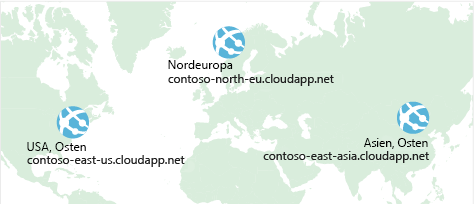

Es wurde bereits erläutert, wie Sie mithilfe von **Azure Load Balancer** Hochverfügbarkeit erreichen und die Downtime minimieren.Previously, you saw how **Azure Load Balancer** helps you achieve high availability and minimize downtime.

Aber auch wenn Ihre E-Commerce-Website über Hochverfügbarkeit verfügt, wird dadurch die Latenz nicht reduziert, und es wird nicht automatisch Resilienz für verschiedene Regionen hergestellt.Although your e-commerce site is more highly available, it doesn't solve the issue of latency or create resiliency across geographic regions.

Nachfolgend wird erläutert, wie Sie dafür sorgen können, dass eine US-amerikanische Website für Benutzer in Europa oder Asien schneller laden kann.How can you make your site, which is located in the United States, load faster for users located in Europe or Asia?

## Was ist Netzwerklatenz?What is network latency?

:::row:::
  :::column:::
     :::column-end:::: :::column span="3"::: Als _Latenz_ wird die Zeit bezeichnet, die für die Übertragung der Daten über das Netzwerk in Anspruch genommen wird. :::column-end:::: :::column span="3"::: _Latency_ refers to the time it takes for data to travel over the network. Die Latenz wird in der Regel in Millisekunden gemessen.Latency is typically measured in milliseconds.

In welchem Zusammenhang steht die Latenz mit der Bandbreite?Compare latency to bandwidth. Der Begriff „Bandbreite“ bezieht sich auf die Menge an Daten, die innerhalb einer Verbindung verarbeitet werden kann.Bandwidth refers to the amount of data that can fit on the connection. Der Begriff „Latenz“ bezieht sich hingegen auf die Zeit, die Daten benötigen, um ihr Ziel zu erreichen.Latency refers to the time it takes for that data to reach its destination.
  :::column-end:::
:::row-end:::

Faktoren wie der von Ihnen verwendete Verbindungstyp und der Aufbau Ihrer Anwendung können Auswirkungen auf die Latenz haben.Factors such as the type of connection you use and how your application is designed can affect latency. Den wichtigsten Faktor stellt allerdings die Distanz dar.But perhaps the biggest factor is distance.

Als Beispiel soll Ihre E-Commerce-Website in Azure dienen. Diese befindet sich in der Region „USA, Osten“.Think about your e-commerce site on Azure, which is in the East US region. In der Regel werden Daten schneller nach Atlanta (Distanz von 400 Meilen) als nach London gesendet (Distanz von 4000 Meilen).It would typically take less time to transfer data to Atlanta (a distance of around 400 miles) than to transfer data to London (a distance of around 4,000 miles).

Ihre E-Commerce-Website sendet Standardcode in HTML, CSS und JavaScript sowie Bilder.Your e-commerce site delivers standard HTML, CSS, JavaScript, and images. Wenn mehrere Dateien gesendet werden, ist die Netzwerklatenz entsprechend höher.The network latency for many files can add up. Wie können Sie also die Latenz für Benutzer reduzieren, die sich weit entfernt befinden?How can you reduce latency for users located far away geographically?

## Horizontales Hochskalieren auf verschiedene RegionenScale out to different regions

Azure stellt überall auf der Welt in verschiedenen Regionen Rechenzentren zur Verfügung.Recall that Azure provides data centers in regions across the globe.

:::row:::
  :::column:::
     :::column-end:::: :::column span="3"::: Der Bau eines Rechenzentrums ist sehr teuer. :::column-end:::: :::column span="3"::: Think about the cost of building a data center. Dabei müssen nicht nur die Geräte angeschafft werden,Equipment costs aren't the only factor. sondern es muss auch dafür gesorgt werden, dass das Rechenzentrum mit Strom versorgt wird und ein ausreichendes Kühlsystem vorhanden ist. Außerdem muss für jeden Standort Personal eingestellt werden, das dafür sorgt, dass die Systeme gewartet werden.You need to provide the power, cooling, and personnel to keep your systems running at each location. Daher wäre es viel zu teuer, ein Replikat eines Rechenzentrums an einem anderen Standort zu erstellen.It might be prohibitively expensive to replicate your entire data center. Wenn Sie Azure verwenden, sind die Kosten viel geringer, da die nötigen Geräte und das Personal bereits vorhanden sind.But doing so with Azure can cost much less, because Azure already has the equipment and personnel in place.
  :::column-end:::
:::row-end:::

Wenn Sie identische Kopien Ihres Diensts in mehreren Regionen erstellen, ist dies eine Möglichkeit, die Latenz zu reduzieren.One way to reduce latency is to provide exact copies of your service in more than one region. Auf der folgenden Abbildung sehen Sie ein Beispiel für die globale Bereitstellung.The following illustration shows an example of global deployment.

Auf dem Diagramm sehen Sie Ihre E-Commerce-Website, die in drei Azure-Regionen betrieben wird: „USA, Osten“, „Europa, Norden“ und „Asien, Osten“.The diagram shows your e-commerce site running in three Azure regions: East US, North Europe, and East Asia. Beachten Sie die einzelnen DNS-Namen.Notice the DNS name for each. Nachfolgend wird erläutert, wie Sie Benutzer unter der contoso.com-Domäne mit dem Dienst verbinden können, der diesem am nächsten gelegen ist.How can you connect users to the service that's closest geographically, but under the contoso.com domain?

## Verwenden des Traffic Manager zum Weiterleiten von Benutzern an den nächstgelegenen EndpunktUse Traffic Manager to route users to the closest endpoint

:::row:::
  :::column:::
     :::column-end:::: :::column span="3"::: Sie können beispielsweise den **Azure Traffic Manager** verwenden. :::column-end:::: :::column span="3"::: One answer is **Azure Traffic Manager**. Der Traffic Manager verwendet den DNS-Server, der dem Benutzer am nächsten gelegen ist, um Benutzerdatenverkehr an einen global verteilten Endpunkt weiterzuleiten.Traffic Manager uses the DNS server that's closest to the user to direct user traffic to a globally distributed endpoint.
  :::column-end:::
:::row-end:::

Auf der folgenden Abbildung ist die Rolle des Traffic Manager dargestellt.The following illustration shows the role of the Traffic Manager.

Der Traffic Manager kann den Datenverkehr zwischen Client und Server nicht sehen.Traffic Manager doesn't see the traffic that's passed between the client and server. Stattdessen wird der Clientwebbrowser an den bevorzugten Endpunkt weitergeleitet.Rather, it directs the client web browser to a preferred endpoint. Der Traffic Manager hat verschiedene Möglichkeiten, Datenverkehr weiterzuleiten, z.B. an den Endpunkt mit der niedrigsten Latenz.Traffic Manager can route traffic in a few different ways, such as to the endpoint with the lowest latency.

Dieses Setup kann auch Ihre lokale Bereitstellung in Kalifornien umfassen. Darauf wird an dieser Stelle allerdings nicht genauer eingegangen.Although not shown here, this setup could also include your on-premises deployment running in California. Sie können den Traffic Manager mit Ihren lokalen Netzwerken verbinden, wodurch Sie Ihre bereits vorhandenen Rechenzentren weiter nutzen können.You can connect Traffic Manager to your own on-premises networks, enabling you to maintain your existing data center investments. Alternativ können Sie Ihre Anwendung auch vollständig in die Cloud verlagern.Or you can move your application entirely to the cloud. Die Entscheidung liegt bei Ihnen.The choice is yours.

## Load Balancer und Traffic Manager im VergleichCompare Load Balancer to Traffic Manager

:::row:::
  :::column:::
     :::column-end:::: :::column span="3"::: Azure Load Balancer verteilt den Datenverkehr auf die gesamte Region, damit Ihre Dienste hochverfügbarer und resilienter sind. :::column-end:::: :::column span="3"::: Azure Load Balancer distributes traffic within the same region to make your services more highly available and resilient. Der Traffic Manager agiert auf DNS-Ebene und leitet den Client an einen bevorzugten Endpunkt weiter.Traffic Manager works at the DNS level, and directs the client to a preferred endpoint. Dieser Endpunkt kann sich in der Region befinden, die dem Benutzer am nächsten gelegen ist.This endpoint can be to the region that's closest to your user.

Sowohl Azure Load Balancer als auch der Traffic Manager tragen auf unterschiedliche Weise zur Resilienz Ihres Diensts bei.Load Balancer and Traffic Manager both help make your services more resilient, but in slightly different ways. Wenn Load Balancer eine VM erkennt, die nicht reagiert, wird der Datenverkehr an andere VMs im Pool weitergeleitet.When Load Balancer detects an unresponsive VM, it directs traffic to other VMs in the pool. Der Traffic Manager überwacht die Integrität der Endpunkte.Traffic Manager monitors the health of your endpoints. Wenn der Traffic Manager im Gegensatz dazu einen Endpunkt erkennt, der nicht reagiert, leitet er Datenverkehr an den Endpunkt weiter, der am nächsten gelegen ist und reagiert.In contrast, when Traffic Manager finds an unresponsive endpoint, it directs traffic to the next closest endpoint that is responsive.
  :::column-end:::
:::row-end:::

## ZusammenfassungSummary

Die geografische Distanz ist einer der Hauptfaktoren, die die Latenz beeinflussen.Geographic distance is one of the biggest factors that contributes to latency. Mithilfe des Traffic Managers können Sie Kopien Ihres Dienst in mehreren geografischen Regionen hosten.With Traffic Manager in place, you can host exact copies of your service in multiple geographic regions. Auf diese Weise können Benutzer in den USA sowie in Europa und Asien Ihre E-Commerce-Website ohne Probleme nutzen.That way, users in the United States, Europe, and Asia will all have a good experience using your e-commerce site.
