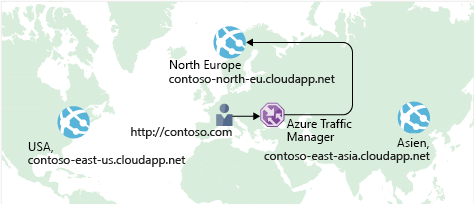

Es wurde bereits erläutert, wie Sie mithilfe von **Azure Load Balancer** Hochverfügbarkeit erreichen und die Downtime minimieren.

Aber auch wenn Ihre E-Commerce-Website über Hochverfügbarkeit verfügt, wird dadurch die Latenz nicht reduziert, und es wird nicht automatisch Resilienz für verschiedene Regionen hergestellt.

Nachfolgend wird erläutert, wie Sie dafür sorgen können, dass eine US-amerikanische Website für Benutzer in Europa oder Asien schneller laden kann.

## Was ist Netzwerklatenz?

:::row:::
  :::column:::
     :::column-end:::: :::column span="3"::: Als _Latenz_ wird die Zeit bezeichnet, die für die Übertragung der Daten über das Netzwerk in Anspruch genommen wird. Die Latenz wird in der Regel in Millisekunden gemessen.

In welchem Zusammenhang steht die Latenz mit der Bandbreite? Der Begriff „Bandbreite“ bezieht sich auf die Menge an Daten, die innerhalb einer Verbindung verarbeitet werden kann. Der Begriff „Latenz“ bezieht sich hingegen auf die Zeit, die Daten benötigen, um ihr Ziel zu erreichen.
  :::column-end:::
:::row-end:::

Faktoren wie der von Ihnen verwendete Verbindungstyp und der Aufbau Ihrer Anwendung können Auswirkungen auf die Latenz haben. Den wichtigsten Faktor stellt allerdings die Distanz dar.

Als Beispiel soll Ihre E-Commerce-Website in Azure dienen. Diese befindet sich in der Region „USA, Osten“. In der Regel werden Daten schneller nach Atlanta (Distanz von 400 Meilen) als nach London gesendet (Distanz von 4000 Meilen).

Ihre E-Commerce-Website sendet Standardcode in HTML, CSS und JavaScript sowie Bilder. Wenn mehrere Dateien gesendet werden, ist die Netzwerklatenz entsprechend höher. Wie können Sie also die Latenz für Benutzer reduzieren, die sich weit entfernt befinden?

## Horizontales Hochskalieren auf verschiedene Regionen

Azure stellt überall auf der Welt in verschiedenen Regionen Rechenzentren zur Verfügung.

:::row:::
  :::column:::
     :::column-end:::: :::column span="3"::: Der Bau eines Rechenzentrums ist sehr teuer. Dabei müssen nicht nur die Geräte angeschafft werden, sondern es muss auch dafür gesorgt werden, dass das Rechenzentrum mit Strom versorgt wird und ein ausreichendes Kühlsystem vorhanden ist. Außerdem muss für jeden Standort Personal eingestellt werden, das dafür sorgt, dass die Systeme gewartet werden. Daher wäre es viel zu teuer, ein Replikat eines Rechenzentrums an einem anderen Standort zu erstellen. Wenn Sie Azure verwenden, sind die Kosten viel geringer, da die nötigen Geräte und das Personal bereits vorhanden sind.
  :::column-end:::
:::row-end:::

Wenn Sie identische Kopien Ihres Diensts in mehreren Regionen erstellen, ist dies eine Möglichkeit, die Latenz zu reduzieren. Auf der folgenden Abbildung sehen Sie ein Beispiel für die globale Bereitstellung.

Auf dem Diagramm sehen Sie Ihre E-Commerce-Website, die in drei Azure-Regionen betrieben wird: „USA, Osten“, „Europa, Norden“ und „Asien, Osten“. Beachten Sie die einzelnen DNS-Namen. Nachfolgend wird erläutert, wie Sie Benutzer unter der contoso.com-Domäne mit dem Dienst verbinden können, der diesem am nächsten gelegen ist.

## Verwenden des Traffic Manager zum Weiterleiten von Benutzern an den nächstgelegenen Endpunkt

:::row:::
  :::column:::
     :::column-end:::: :::column span="3"::: Sie können beispielsweise den **Azure Traffic Manager** verwenden. Der Traffic Manager verwendet den DNS-Server, der dem Benutzer am nächsten gelegen ist, um Benutzerdatenverkehr an einen global verteilten Endpunkt weiterzuleiten.
  :::column-end:::
:::row-end:::

Auf der folgenden Abbildung ist die Rolle des Traffic Manager dargestellt.

Der Traffic Manager kann den Datenverkehr zwischen Client und Server nicht sehen. Stattdessen wird der Clientwebbrowser an den bevorzugten Endpunkt weitergeleitet. Der Traffic Manager hat verschiedene Möglichkeiten, Datenverkehr weiterzuleiten, z.B. an den Endpunkt mit der niedrigsten Latenz.

Dieses Setup kann auch Ihre lokale Bereitstellung in Kalifornien umfassen. Darauf wird an dieser Stelle allerdings nicht genauer eingegangen. Sie können den Traffic Manager mit Ihren lokalen Netzwerken verbinden, wodurch Sie Ihre bereits vorhandenen Rechenzentren weiter nutzen können. Alternativ können Sie Ihre Anwendung auch vollständig in die Cloud verlagern. Die Entscheidung liegt bei Ihnen.

## Load Balancer und Traffic Manager im Vergleich

:::row:::
  :::column:::
     :::column-end:::: :::column span="3"::: Azure Load Balancer verteilt den Datenverkehr auf die gesamte Region, damit Ihre Dienste hochverfügbarer und resilienter sind. Der Traffic Manager agiert auf DNS-Ebene und leitet den Client an einen bevorzugten Endpunkt weiter. Dieser Endpunkt kann sich in der Region befinden, die dem Benutzer am nächsten gelegen ist.

Sowohl Azure Load Balancer als auch der Traffic Manager tragen auf unterschiedliche Weise zur Resilienz Ihres Diensts bei. Wenn Load Balancer eine VM erkennt, die nicht reagiert, wird der Datenverkehr an andere VMs im Pool weitergeleitet. Der Traffic Manager überwacht die Integrität der Endpunkte. Wenn der Traffic Manager im Gegensatz dazu einen Endpunkt erkennt, der nicht reagiert, leitet er Datenverkehr an den Endpunkt weiter, der am nächsten gelegen ist und reagiert.
  :::column-end:::
:::row-end:::

## Zusammenfassung

Die geografische Distanz ist einer der Hauptfaktoren, die die Latenz beeinflussen. Mithilfe des Traffic Managers können Sie Kopien Ihres Dienst in mehreren geografischen Regionen hosten. Auf diese Weise können Benutzer in den USA sowie in Europa und Asien Ihre E-Commerce-Website ohne Probleme nutzen.
