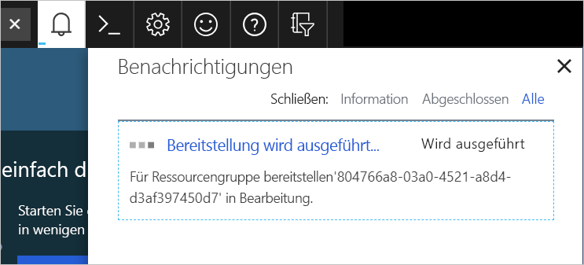

Sie haben nun die Netzwerkinfrastruktur geplant und einige virtuelle Computer identifiziert, die zur Cloud migriert werden sollen. Ein virtueller Computer kann auf unterschiedliche Weise erstellt werden. Die Vorgehensweise hängt von Ihrer bevorzugten Umgebung ab. Azure unterstützt zum Erstellen und Verwalten von Ressourcen ein webbasiertes Portal. Des Weiteren können Sie auch Befehlszeilentools nutzen, die unter macOS, Windows und Linux ausgeführt werden.

[!include]

#### Optionen zum Erstellen und Verwalten von virtuellen Computern

> [!VIDEO https://www.microsoft.com/videoplayer/embed/RE2yJKx]

Zunächst werfen Sie einen Blick auf das Azure-Portal, das den einfachsten Einstieg in Azure darstellt.

## Azure-Portal

Das **Azure-Portal** stellt eine benutzerfreundliche und browserbasierte Benutzeroberfläche bereit, auf der Sie all Ihre Azure-Ressourcen erstellen und verwalten können. Sie können beispielsweise eine neue Datenbank einrichten, die Rechenleistung Ihrer virtuellen Computer erhöhen und Ihre monatlichen Kosten überwachen. Es ist auch ein praktisches Lerntool, da Sie alle verfügbaren Ressourcen auf einen Blick erfassen und Assistenten verwenden können, um benötigte Ressourcen zu erstellen.

Nach der Anmeldung werden zwei Hauptbereiche angezeigt. Der erste ist ein Menü, das Optionen zum Erstellen und Überwachen von Ressourcen sowie zur Abrechnungsverwaltung enthält. Der zweite ist ein anpassbares Dashboard, das eine Momentaufnahme aller grundlegenden Dienste bereitstellt, die Sie in Azure bereitgestellt haben. Wenn Sie vorher noch nicht mit Azure gearbeitet haben, ist das Portal vermutlich die komfortabelste Option für die ersten Schritte.

> [!TIP]
> Wenn Sie im Portal Optionen auswählen, werden Ansichten angezeigt, die häufig als _Blätter_ bezeichnet werden. Ein Blatt kann sowohl eine Menüstruktur als auch einen Konfigurationsbereich darstellen. Während der Nutzung des Azure-Portals werden neu aufgerufene Benutzeroberflächenelemente immer rechts vom aktuellen Bereich angeordnet. Dabei verschiebt sich der Anzeigebereich, sodass immer das aktuelle Blatt angezeigt wird. Mit dem Schieberegler im unteren Bereich können Sie schnell zu den übergeordneten Ansichten zurückwechseln.

### Erstellen eines virtuellen Azure-Computers über das Azure-Portal

Angenommen, Sie möchten einen virtuellen Computer erstellen, auf dem eine WordPress-Website betrieben wird. Das Einrichten einer Website ist nicht schwierig, doch einige Punkte sind zu bedenken. Sie müssen ein Betriebssystem installieren und konfigurieren, eine Website einrichten, eine Datenbank installieren und sich beispielsweise mit Firewalls befassen. In den nächsten Modulen erhalten Sie ausführliche Informationen zum Erstellen eines virtuellen Computers. Hier erstellen Sie allerdings bereits einen virtuellen Computer, um zu sehen, wie einfach dieser Vorgang ist. Nicht alle Optionen werden an dieser Stelle beschrieben. Eine ausführliche Übersicht über die einzelnen Optionen finden Sie in den Modulen zum **Erstellen eines virtuellen Computers**.

1. Melden Sie sich beim [Azure-Portal](https://portal.azure.com/learn.docs.microsoft.com?azure-portal=true) mit dem gleichen Konto an, über das Sie die Sandbox aktiviert haben.

1. Das Menü zum Erstellen und Verwalten von Azure-Ressourcen wird links angezeigt. Den verbleibenden Bildschirmbereich nimmt das Dashboard ein.

    

1. Klicken Sie links oben auf der Portalseite auf **Ressource erstellen**. Dadurch wird das Blatt „Azure Marketplace“ geöffnet. Wenn die linke Randleiste reduziert ist, wird ein grünes Pluszeichen angezeigt. Sie können die Randleiste erweitern, indem Sie auf das Caretzeichen klicken. Dadurch wird der vollständige Text wie in der obigen Abbildung angezeigt.

    

    Wie Sie sehen, werden zahlreiche auswählbare Optionen angezeigt. Sie möchten einen virtuellen Computer erstellen, auf dem eine WordPress-Website betrieben wird. Virtuelle Computer sind Azure-Computeressourcen. Wählen Sie daher **Compute** aus der Liste der verfügbaren Optionen aus, und suchen Sie anschließend nach Images für virtuelle WordPress-Computer. Sie können auf **Alle anzeigen** klicken, um die gesamte Liste anzuzeigen.

1. Geben Sie in der Suchleiste **Marketplace durchsuchen** „WordPress“ ein. Nun sollte eine Liste mit Optionen angezeigt werden. Wählen Sie wie unten gezeigt die Option **WordPress 4.9.7** aus.

    

    Auf dem neu geöffneten Blatt werden nun Lizenzinformationen für das Image angezeigt, das wir im Anschluss verwenden. Klicken Sie auf **Erstellen**.

    

1. Das Blatt **Virtuellen Computer erstellen** wird angezeigt. Zum Konfigurieren des virtuellen Computers können Sie einen Assistenten verwenden.

### Konfigurieren der VM

Zunächst müssen Sie die grundlegenden Parameter des virtuellen Computers für WordPress konfigurieren. Wenn Sie mit einigen Optionen noch nicht vertraut sind, ist das kein Problem. Alle Optionen werden in einem weiteren Modul beschrieben. Sie können die hier verwendeten Werte gerne kopieren.

1. Nutzen Sie die folgenden Werte auf der Registerkarte **Grundlagen**.
    - Das Abonnement sollte auf _Concierge-Abonnement_ festgelegt werden.
    - Wählen Sie für die Region die Option **Vorhandene verwenden** aus, und wählen Sie dann in der Dropdownliste der Ressourcengruppe **Vorhandene verwenden** und <rgn>[Name der Sandboxressourcengruppe]</rgn> aus.
    - Geben Sie unter **Name** einen Namen für die VM ein. Verwenden Sie _test-wp1-eus-vm_.
    - Wählen Sie in der folgenden Liste eine **Region** aus, die in Ihrer Nähe liegt.
        [!include]
    - Wählen Sie unter **Verfügbarkeitsoptionen** die Option _Keine_. Dies ist für die Hochverfügbarkeit.
    - Für **Image** sollte die Option _WordPress 4.9.7_ festgelegt werden, die Sie im Marketplace ausgewählt haben.
    - Verwenden Sie für **Größe** den Standardwert _Standard A1_. Hierbei können Sie einen Kern und 1,75 GB Arbeitsspeicher nutzen, was für eine einfache Website ausreichend sein sollte.
    - Legen Sie für den Authentifizierungstyp **Kennwort** fest, und geben Sie einen Benutzernamen und ein Kennwort ein.

    

1. Sie können noch weitere Registerkarten mit Einstellungen aufrufen, die Sie während der Erstellung des virtuellen Computers anpassen können. Klicken Sie abschließend auf **Überprüfen + erstellen**, um die Einstellungen zu überprüfen.

1. Auf dem Überprüfungsbildschirm überprüft Azure Ihre Einstellungen. Unter Umständen müssen Sie je nach den Anforderungen des Imageerstellers noch einige weitere Informationen angeben. Stellen Sie sicher, dass alle Einstellungen korrekt sind, und klicken Sie anschließend auf **Erstellen**, um den virtuellen Computer zu erstellen und bereitzustellen.

1. Sie können den Bereitstellungsstatus über den Bereich **Benachrichtigungen** überwachen. Klicken Sie auf der oberen Symbolleiste auf das entsprechende Symbol, um den Bereich ein- oder auszublenden.

    

1. Der Bereitstellungsprozess für den virtuellen Computer kann einige Minuten dauern. Nachdem die Bereitstellung erfolgreich abgeschlossen wurde, erhalten Sie eine Benachrichtigung. Klicken Sie auf die Schaltfläche **Go to resource** (Zu Ressource wechseln), um auf die Seite mit der VM-Übersicht zu gelangen.

    

1. Hier sehen Sie alle Informationen und Konfigurationsoptionen für den neu erstellten virtuellen Computer für WordPress. Hierzu gehört auch die Angabe für **Öffentliche IP-Adresse**.

    

11. Kopieren Sie die IP-Adresse, öffnen Sie in Ihrem Browser eine neue Registerkarte, und fügen Sie die Adresse ein. Die neue WordPress-Website sollte geöffnet werden.

    

Glückwunsch! Sie haben in wenigen Schritten einen virtuellen Linux-Computer bereitgestellt, auf dem eine Datenbank installiert ist und auf dem eine funktionsfähige Website betrieben wird. Im Folgenden erfahren Sie, welche anderen Möglichkeiten Sie nutzen können, um einen virtuellen Computer zu erstellen.
