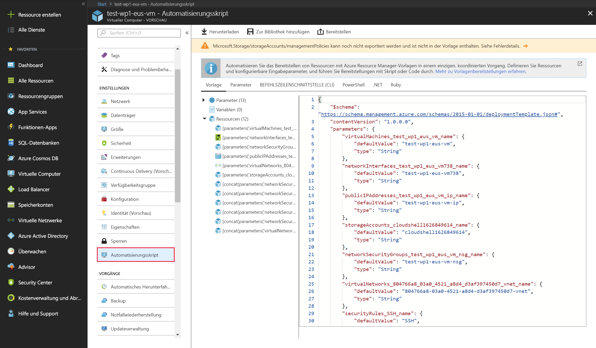

Das Azure-Portal ist der einfachste Weg, um anfangs Ressourcen wie VMs zu erstellen. Allerdings stellt Azure nicht unbedingt die effizienteste oder schnellste Möglichkeit dar, insbesondere wenn Sie mehrere Ressourcen gleichzeitig erstellen möchten. In unserem Fall werden wir Dutzende von VMs erstellen, um verschiedene Aufgaben zu verarbeiten. Es wäre umständlich und lästig, sie manuell im Azure-Portal zu erstellen.

Betrachten wir einige andere Methoden, um Ressourcen in Azure zu erstellen und zu verwalten:

- Azure Resource Manager
- Azure PowerShell
- Azure CLI
- Azure-REST-API
- Azure Client SDK
- Azure-VM-Erweiterungen
- Azure Automation-Dienste

## <a name="azure-resource-manager"></a>Azure Resource Manager

Angenommen, Sie möchten eine Kopie einer VM mit den gleichen Einstellungen erstellen. Dafür könnten Sie ein VM-Image erstellen, es in Azure hochladen und als Grundlage für Ihre neue VM verwenden. Dieses Vorgehen ist ineffizient und zeitaufwändig. Azure bietet Ihnen die Möglichkeit, eine Vorlage zu erstellen, aus der Sie eine genaue Kopie einer VM erstellen können.

In der Regel enthält Ihre Azure-Infrastruktur viele Ressourcen, von denen viele in irgendeiner Weise miteinander verbunden sind. Beispielsweise verfügt die von uns erstellte VM über den virtuellen Computer selbst, Speicher, Netzwerkschnittstelle, Webserver und eine Datenbank – allesamt erstellt, um die WordPress-Website auszuführen. Mit dem **Azure Resource Manager** ist die Arbeit mit diesen zugehörigen Ressourcen effizienter. Er fasst Ressourcen in benannten **Ressourcengruppen** zusammen, über die Sie alle Ressourcen gleichzeitig bereitstellen, aktualisieren oder löschen können. Beim Erstellen der WordPress-Website wurde die Ressourcengruppe im Rahmen der VM-Erstellung identifiziert, und der Resource Manager hat die zugehörigen Ressourcen in derselben Gruppe platziert.

Mit dem Resource Manager können Sie auch _Vorlagen_ zum Erstellen und Bereitstellen bestimmter Konfigurationen erstellen.

### <a name="what-are-resource-manager-templates"></a>Was sind Resource Manager-Vorlagen?

**Resource Manager-Vorlagen** sind JSON-Dateien, mit denen die Ressourcen definiert werden, die Sie für Ihre Lösung bereitstellen müssen.

Sie können Ressourcenvorlagen im Abschnitt **Einstellungen** für eine bestimmte VM erstellen, indem Sie die Option „Automatisierungsskript“ auswählen.



Sie haben die Möglichkeit, die Ressourcenvorlage zur späteren Verwendung zu speichern oder direkt eine neue VM auf Grundlage dieser Vorlage bereitzustellen. Wenn Sie beispielsweise eine VM aus einer Vorlage in einer Testumgebung erstellen und feststellen, dass sie Ihren lokalen Computer nicht ganz ersetzen kann, können Sie wie folgt vorgehen. Sie können die Ressourcengruppe löschen, wodurch alle Ressourcen gelöscht werden, die Vorlage optimieren und es dann erneut versuchen. Wenn Sie nur Änderungen an den vorhandenen, bereitgestellten Ressourcen vornehmen möchten, können Sie die Vorlage, mit der sie erstellt wurden, ändern und erneut bereitstellen. Resource Manager ändert die Ressourcen entsprechend der neuen Vorlage.

Sobald alles Ihren Vorstellungen entspricht, können Sie mit dieser Vorlage mehrere Versionen Ihrer Infrastruktur erstellen, z.B. für das Staging und die Produktion. Sie können Felder wie VM-Name, Netzwerkname, Speicherkontoname usw. parametrisieren und die Vorlage mit verschiedenen Parametern wiederholt laden, um jede Umgebung anzupassen.

Mithilfe von Tools zur automatischen Skripterstellung (beispielsweise Azure CLI, Azure PowerShell oder sogar Azure-REST-APIs) können Sie Resource Manager-Vorlagen mit der von Ihnen bevorzugten Programmiersprache verarbeiten und auf diese Weise schnell eine Infrastruktur erstellen.

## <a name="azure-powershell"></a>Azure PowerShell

Die Erstellung von Verwaltungsskripts ist eine ausgezeichnete Möglichkeit, um Ihren Workflow zu optimieren. Sie können alltägliche, sich wiederholende Aufgaben automatisieren, und nachdem ein Skript überprüft wurde, wird es konsistent ausgeführt, sodass weniger Fehler auftreten sollten. **Azure PowerShell** eignet sich ideal für einmalige interaktive Aufgaben und/oder für das Automatisieren von sich wiederholenden Aufgaben.

> [!NOTE]
> PowerShell ist eine plattformübergreifende Shell, die Dienste wie das Shellfenster und Befehlsanalysen bereitstellt. Azure PowerShell ist ein optionales Add-On-Paket, das Azure-spezifische Befehle (sogenannte **Cmdlets**) hinzufügt. Weitere Informationen zur Installation und Verwendung von Azure PowerShell erhalten Sie in einem separaten Schulungsmodul.

Beispielsweise können Sie mit dem `New-AzureRmVM`-Cmdlet eine neue Azure-VM erstellen.

```powershell
New-AzureRmVm `
    -ResourceGroupName "TestResourceGroup" `
    -Name "test-wp1-eus-vm" `
    -Location "East US" `
    -VirtualNetworkName "test-wp1-eus-network" `
    -SubnetName "default" `
    -SecurityGroupName "test-wp1-eus-nsg" `
    -PublicIpAddressName "test-wp1-eus-pubip" `
    -OpenPorts 80,3389
```

Wie hier gezeigt, geben Sie verschiedene Parameter an, um die zahlreichen verfügbaren VM-Konfigurationseinstellungen zu behandeln. Die meisten Parameter haben sinnvolle Werte – Sie müssen nur die erforderlichen Parameter angeben. Weitere Informationen zum Erstellen und Verwalten von VMs mit Azure PowerShell finden Sie im Modul **Automatisieren von Azure-Aufgaben mithilfe von Skripts mit PowerShell**.

## <a name="azure-cli"></a>Azure CLI

Eine weitere Option für das Erstellen von Skripts und Verwenden von Befehlszeilen in Azure ist die **Azure CLI**.

Die Azure CLI ist das plattformübergreifende Befehlszeilentool von Microsoft zum Verwalten von Azure-Ressourcen wie VMs und Dateiträgern über die Befehlszeile. Sie steht für macOS, Linux und Windows sowie unter Verwendung von Cloud Shell im Browser zur Verfügung. Wie Azure PowerShell ist auch die Azure CLI eine leistungsstarke Option, Ihren Verwaltungsworkflow zu optimieren. Im Gegensatz zu Azure PowerShell benötigt die Azure CLI PowerShell nicht.

Sie können beispielsweise eine Azure-VM mit dem Befehl `az vm create` erstellen.

```azurecli
az vm create \
    --resource-group TestResourceGroup \
    --name test-wp1-eus-vm \
    --image win2016datacenter \
    --admin-username jonc \
    --admin-password aReallyGoodPasswordHere
```

Die Azure CLI kann mit anderen Skriptsprachen verwendet werden, beispielsweise mit Ruby und Python. Beide Programmiersprachen werden häufig auf Computern verwendet, die nicht auf Windows basieren. Außerdem sind nicht alle Entwickler mit PowerShell vertraut.

Weitere Informationen zum Erstellen und Verwalten von VMs finden Sie im Modul **Verwalten von VMs mit der Azure CLI**.

## <a name="programmatic-apis"></a>Programmgesteuert (APIs)

Im Allgemeinen sind sowohl Azure PowerShell als auch die Azure CLI gute Optionen, wenn Sie einfache Skripts ausführen und Befehlszeilentools verwenden möchten. Bei komplexeren Szenarien, in denen das Erstellen und Verwalten von VMs Teil einer größeren Anwendung mit komplexer Logik ist, ist ein anderer Ansatz erforderlich.

Sie können mit jedem Ressourcentyp in Azure programmgesteuert interagieren.

### <a name="azure-rest-api"></a>Azure-REST-API

Die Azure-REST-API bietet Entwicklern nach Ressourcen geordnete Vorgänge und die Möglichkeit, VMs zu erstellen und zu verwalten. Vorgänge werden als URIs mit entsprechenden HTTP-Methoden (`GET`, `PUT`, `POST`, `DELETE` und `PATCH`) und einer entsprechenden Antwort verfügbar gemacht.

Die Azure Compute-APIs ermöglichen Ihnen den programmgesteuerten Zugriff auf virtuelle Computer und die zugehörigen unterstützenden Ressourcen. Diese API unterstützt die folgenden Vorgänge:

- Erstellen und Verwalten von Verfügbarkeitsgruppen
- Hinzufügen und Verwalten von VM-Erweiterungen
- Erstellen und Verwalten von verwalteten Datenträgern, Momentaufnahmen und Images
- Zugreifen auf die in Azure verfügbaren Plattformimages
- Abrufen von Nutzungsinformationen von Ressourcen
- Erstellen und Verwalten von VMs
- Erstellen und Verwalten von VM-Skalierungsgruppen

### <a name="azure-client-sdk"></a>Azure Client SDK

Obwohl die REST-API plattform- und sprachunabhängig ist, achten Entwickler meist auf eine höhere Abstraktionsebene. Das Azure Client SDK kapselt die Azure-REST-API und erleichtert Entwicklern die Interaktion mit Azure dadurch erheblich.

Die Azure Client SDKs sind für zahlreiche Programmiersprachen und Frameworks verfügbar, einschließlich .NET-basierter Programmiersprachen wie C#, Java, Node.js, PHP, Python, Ruby und Go.

Nachfolgend sehen Sie einen Beispielausschnitt aus einem C#-Code zum Erstellen einer Azure-VM mit dem NuGet-Paket `Microsoft.Azure.Management.Fluent`:

```csharp
var azure = Azure
    .Configure()
    .WithLogLevel(HttpLoggingDelegatingHandler.Level.Basic)
    .Authenticate(credentials)
    .WithDefaultSubscription();
// ...
var vmName = "test-wp1-eus-vm";

azure.VirtualMachines.Define(vmName)
    .WithRegion(Region.USEast)
    .WithExistingResourceGroup("TestResourceGroup")
    .WithExistingPrimaryNetworkInterface(networkInterface)
    .WithLatestWindowsImage("MicrosoftWindowsServer", "WindowsServer", "2012-R2-Datacenter")
    .WithAdminUsername("jonc")
    .WithAdminPassword("aReallyGoodPasswordHere")
    .WithComputerName(vmName)
    .WithSize(VirtualMachineSizeTypes.StandardDS1)
    .Create();
```

Hier ist der gleiche Ausschnitt in Java unter Verwendung von **Azure-Java SDK**:

```java
String vmName = "test-wp1-eus-vm";
// ...
VirtualMachine virtualMachine = azure.virtualMachines()
    .define(vmName)
    .withRegion(Region.US_EAST)
    .withExistingResourceGroup("TestResourceGroup")
    .withExistingPrimaryNetworkInterface(networkInterface)
    .withLatestWindowsImage("MicrosoftWindowsServer", "WindowsServer", "2012-R2-Datacenter")
    .withAdminUsername("jonc")
    .withAdminPassword("aReallyGoodPasswordHere")
    .withComputerName(vmName)
    .withSize("Standard_DS1")
    .create();
```

## <a name="azure-vm-extensions"></a>Azure-VM-Erweiterungen

Angenommen, Sie möchten nach der ersten Bereitstellung zusätzliche Software auf Ihrer VM konfigurieren und installieren. Sie möchten, dass diese Aufgabe eine bestimmte Konfiguration verwendet, die automatisch überwacht und ausgeführt wird.

**Azure-VM-Erweiterungen** sind kleine Anwendungen, mit denen Sie Aufgaben auf Azure-VMs nach der erstmaligen Bereitstellung konfigurieren und automatisieren können. **Azure-VM-Erweiterungen** können über die Azure CLI, PowerShell, Azure Resource Manager-Vorlagen und das Azure-Portal ausgeführt werden.

Sie bündeln Erweiterungen mit einer neuen VM-Bereitstellung oder führen sie für ein bestehendes System aus.

## <a name="azure-automation-services"></a>Azure Automation-Dienste

Zeitersparnis, Fehlerreduktion und Effizienzsteigerung sind einige der größten Herausforderungen beim Verwalten von Remoteinfrastrukturen. Wenn Sie viele Infrastrukturdienste haben, sollten Sie die Verwendung von übergeordneten Diensten in Azure in Betracht ziehen, um auf einer höheren Ebene arbeiten zu können.

**Azure Automation** ermöglicht Ihnen die Integration von Diensten, mit denen Sie häufige, zeitaufwändige und fehleranfällige Verwaltungsaufgaben ganz leicht automatisieren können. Zu diesen Diensten zählen die **Prozessautomatisierung**, **Konfigurationsverwaltung** und **Updateverwaltung**.

- **Prozessverwaltung**. Angenommen, Sie haben eine VM, die auf ein bestimmtes Fehlerereignis überwacht wird. Sie möchten Maßnahmen ergreifen und das Problem beheben, sobald es gemeldet wird. Mit der Prozessautomatisierung können Sie Watchertasks einrichten, die auf mögliche Ereignisse in Ihrem Datencenter reagieren.

- **Konfigurationsverwaltung**.  Möglicherweise möchten Sie Softwareupdates nachverfolgen, die für das auf Ihrer VM ausgeführte Betriebssystem verfügbar werden. Vielleicht möchten Sie bestimmte Updates ein- oder ausschließen. Mit der Konfigurationsverwaltung können Sie diese Updates nachverfolgen und bei Bedarf Maßnahmen ergreifen. Mit **System Center Configuration Manager** können Sie die PCs, Server und mobilen Geräte Ihres Unternehmens verwalten. Mit Configuration Manager können Sie diese Unterstützung auf Ihre Azure-VMs ausdehnen.

- **Updateverwaltung**. Mit der Updateverwaltung können Sie Updates und Patches für Ihre VMs verwalten. Dieser Dienst bietet Ihnen die Möglichkeit, den Status verfügbarer Updates zu bewerten, Installationen zu planen und Bereitstellungsergebnisse zu überprüfen, um sicherzustellen, dass Updates erfolgreich angewendet werden. Die Updateverwaltung umfasst Dienste, die Prozess- und Konfigurationsverwaltung bieten. Sie aktivieren die Updateverwaltung für eine VM direkt über Ihr **Azure Automation**-Konto. Sie können die Updateverwaltung für eine einzelne VM auch auf dem Blatt der VM im Portal zulassen.

Wie Sie sehen, bietet Azure zahlreiche Tools zum Erstellen und Verwalten von Ressourcen, mit denen Sie Verwaltungsvorgänge in einen Prozess integrieren und _Ihre Workflows optimieren_ können. Als Nächstes werfen wir einen Blick auf einige andere Azure-Dienste, mit denen Sie für eine optimale Ausführung Ihrer Infrastrukturressourcen sorgen können werden.
