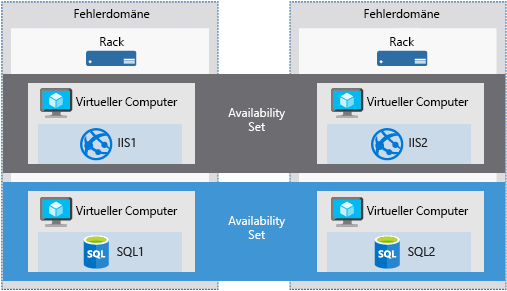

Häufig steht der Erfolg eines Dienstleistungsunternehmens im unmittelbaren Zusammenhang mit den Vereinbarungen zum Servicelevel (SLAs), die das Unternehmen mit seinen Kunden schließt. Ihre Kunden erwarten, dass die von Ihnen bereitgestellten Dienste immer zur Verfügung stehen und ihre Daten sicher aufbewahrt werden. Dies nimmt Microsoft sehr ernst. Azure bietet Tools, mit denen Sie die Verfügbarkeit, Datensicherheit und Überwachung verwalten können. So können Sie sicher sein, dass Ihre Dienste stets für Ihre Kunden verfügbar sind.

Die Verwaltung eines virtuellen Azure-Computers ist nicht auf die Verwaltung des Betriebssystems oder einer Software begrenzt, die auf dem virtuellen Computer ausgeführt wird. Es ist hilfreich zu wissen, welche Dienste Azure anbietet, die Dienstverfügbarkeit sicherstellen und Automatisierung unterstützen. Diese Dienste unterstützen Sie bei der Planung der Business Continuity & Disaster Recovery-Strategie (BCDR) Ihrer Organisationen.

In diesem Artikel wird der Azure-Dienst behandelt, mit dem Sie die Verfügbarkeit virtueller Computer verbessern, Aufgaben zur Verwaltung virtueller Computer optimieren und die Daten Ihrer virtuellen Computer sichern und schützen können. Definieren wir zunächst einmal die Verfügbarkeit.

## Was ist Verfügbarkeit?

Verfügbarkeit ist der Anteil der Zeit, in dem ein Dienst für die Verwendung verfügbar ist.

Nehmen wir an, Sie betreiben eine Website, auf deren Informationen Ihre Kunden jederzeit zugreifen können sollen. Ihre Erwartung bezüglich des Websitezugriffs liegt bei einer Verfügbarkeit von 100 %.

### Warum muss bei der Verwendung von Azure die Verfügbarkeit berücksichtigt werden?

Virtuelle Azure-Computer werden auf physischen Servern ausgeführt, die in Rechenzentren von Microsoft gehostet werden. Wie bei den meisten physischen Geräten besteht das Risiko eines Ausfalls. Wenn der physische Server ausfällt, fallen auch die auf diesem Server gehosteten virtuellen Computer aus. In diesem Fall migriert Azure die jeweilige VM automatisch zu einem fehlerfreien Hostserver. Diese Selbstreparaturmigration könnte allerdings einige Minuten dauern. In diesem Zeitraum sind die Anwendungen, die auf dieser VM gehostet werden, nicht verfügbar.

Die VMs könnten zudem durch regelmäßige Updates, die von Azure selbst initiiert werden, betroffen sein. Diese Wartungsereignisse reichen von Softwareupdates bis hin zu Hardwareaufrüstungen und sind notwendig, um die Zuverlässigkeit und Leistung der Plattform zu verbessern. Diese Ereignisse erfolgen in der Regel ohne Beeinträchtigung von virtuellen Gastcomputern, doch gelegentlich werden die virtuellen Computer zur Ausführung eines Updates oder Upgrades neu gestartet.

> [!NOTE]
> Microsoft aktualisiert das Betriebssystem oder die Software Ihrer virtuellen Computer nicht automatisch. Die vollständige Kontrolle und Zuständigkeit liegt in Ihren Händen. Der zugrunde liegende Softwarehost und die Hardware werden in regelmäßigen Abständen gepatcht, um jederzeit Zuverlässigkeit und eine hohe Leistung sicherzustellen.

Es wird empfohlen, mindestens zwei Instanzen von jedem virtuellen Computer bereitzustellen, um sicherzustellen, dass Ihre Dienste nicht unterbrochen werden, und um einen Single Point of Failure zu vermeiden. Dieses Feature wird als _Verfügbarkeitsgruppe_ bezeichnet.

### Was ist eine Verfügbarkeitsgruppe?

Eine **Verfügbarkeitsgruppe** ist ein logisches Feature, das sicherstellt, dass eine Gruppe von verwandten virtuellen Computern bereitgestellt wird, damit nicht für alle ein Single Point of Failure gilt und nicht für alle virtuellen Computer im Rechenzentrum gleichzeitig ein Hostbetriebssystemupgrade durchgeführt wird. Virtuelle Computer in einer Verfügbarkeitsgruppe sollten einen identischen Satz von Funktionen ausführen, und die gleiche Software sollte installiert sein.

> [!TIP]
> Microsoft bietet für VMs mit mehreren Instanzen, die in einer Verfügbarkeitsgruppe bereitgestellt werden, eine Vereinbarung zum Servicelevel (SLA) mit einer Verfügbarkeit externer Konnektivität von 99,95 %. Das bedeutet, dass für die SLA mindestens zwei Instanzen der VM, die innerhalb einer Verfügbarkeitsgruppe bereitgestellt wird, vorhanden sein müssen. 

Sie können über das Azure-Portal im Abschnitt „Notfallwiederherstellung“ Verfügbarkeitsgruppen erstellen. Darüber hinaus können Sie sie mithilfe von Resource Manager-Vorlagen oder Skripterstellungs- oder API-Tools erstellen. Wenn Sie virtuelle Computer in einer Verfügbarkeitsgruppe platzieren, garantiert Azure, dass diese auf **Fehlerdomänen** und **Updatedomänen** verteilt werden.

#### Was ist eine Fehlerdomäne?

Eine Fehlerdomäne ist eine logische Gruppe von Hardwarekomponenten in Azure, die eine Stromquelle und einen Netzwerkswitch gemeinsam nutzen. Sie können sich diese als Rack in einem lokalen Rechenzentrum vorstellen. Die ersten beiden VMs in einer Verfügbarkeitsgruppe werden in zwei unterschiedlichen Racks bereitgestellt, damit nur eine VM betroffen ist, wenn das Netzwerk oder die Stromversorgung in einem Rack ausfällt. Fehlerdomänen werden auch für verwaltete Datenträger, die an VMs angefügt sind, definiert.

#### Was ist eine Updatedomäne?

Eine Updatedomäne ist eine logische Hardwaregruppe, die zur gleichen Zeit gewartet oder neu gestartet werden kann. Azure platziert automatisch Verfügbarkeitsgruppen in Updatedomänen, um die Auswirkungen zu minimieren, wenn die Azure-Plattform Änderungen am Hostbetriebssystem einführt. Azure verarbeitet anschließend jeweils eine Updatedomäne.

Verfügbarkeitsgruppen stellen ein leistungsstarkes Feature dar, um sicherzustellen, dass die auf Ihren VMs ausgeführten Dienste immer für Ihre Kunden zur Verfügung stehen. Diese sind jedoch nicht zu 100 % sicher. Was geschieht, wenn ein Fehler bei den Daten oder der Software auf dem virtuellen Computer selbst auftritt? Hierfür müssen wir uns andere Notfallwiederherstellungs- und Sicherungsmethoden ansehen.

## Failover zwischen Standorten

Sie können Ihre Infrastruktur auch zwischen Standorten replizieren, um regionale Failover durchzuführen. **Azure Site Recovery** repliziert Workloads von einem primären Standort an einem sekundären Standort. Bei einem Ausfall am primären Standort können Sie ein Failover an einem sekundären Standort ausführen. Durch ein solches Failover können Benutzer ohne Unterbrechung auf Ihre Anwendungen zugreifen. Sie können dann ein Failback zum primären Standort ausführen, sobald dieser wieder betriebsbereit ist. Azure Site Recovery dient zur Replikation von virtuellen oder physischen Computern und sorgt dafür, dass Ihre Workloads bei einem Ausfall weiterhin verfügbar sind.

Site Recovery weist eine Vielzahl von ausgefeilten technischen Features auf, darunter sind jedoch mindestens zwei bedeutende geschäftliche Vorteile zu beachten:

1. Mithilfe von Site Recovery kann Azure als Ziel für die Wiederherstellung verwendet werden, wodurch die Kosten für die Verwaltung eines sekundären physischen Rechenzentrums und deren Komplexität wegfallen.

2. Site Recovery macht es einfach, Failover im Hinblick auf Wiederherstellungsroutinen zu testen, ohne Produktionsumgebungen zu beeinträchtigen. Dies vereinfacht das Testen Ihrer geplanten oder ungeplanten Failover. Zu einem guten Notfallwiederherstellungsplan gehört ein Testfailover.

Mit Site Recovery können je nach Szenario einfache oder komplexe Wiederherstellungspläne erstellt werden. Diese können benutzerdefinierte PowerShell-Skripts, Azure Automation-Runbooks oder Schritte für manuelle Eingriffe enthalten. Anhand der Wiederherstellungspläne können Sie Workloads in Azure replizieren, um mühelos neue Möglichkeiten für die Migration, für temporäre Bursts in Spitzenzeiten oder für Entwicklungen und Tests für neue Anwendungen zu erschließen.

Azure Site Recovery ist mit Azure-Ressourcen oder Hyper-V, VMware und physischen Servern in Ihrer lokalen Infrastruktur kompatibel und kann eine wichtige Rolle in der BCDR-Strategie (Business Continuity & Disaster Recovery) Ihrer Organisation übernehmen, indem beim Ausfall des primären Standorts die Replikation, das Failover und die Wiederherstellung von Workloads und Anwendungen orchestriert werden.
