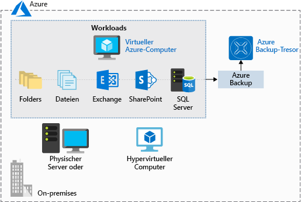

Die Sicherung und Wiederherstellung von Daten stellt einen wichtigen Teil des Planungsprozesses für eine solide Infrastruktur dar. Es kann immer vorkommen, dass durch einen Fehler Daten gelöscht werden oder Sie archivierte Daten abrufen müssen, um diese zu prüfen. Wenn Sie über eine solide Sicherungsstrategie verfügen, vermeiden Sie Probleme, wenn Daten oder Software wiederhergestellt werden müssen.

Bei **Azure Backup** handelt es sich um einen _Sicherungsdienst_, der physische oder virtuelle Computer unabhängig davon schützt, ob sie lokal oder in der Cloud verwendet werden.

Azure Backup kann für verschiedene Szenarios verwendet werden, die im Zusammenhang mit der Datensicherung stehen. Z.B.:

- Für Dateien und Ordner auf Windows-Computern (physisch oder virtuell bzw. lokal oder in der Cloud)
- Für anwendungsabhängige Momentaufnahmen (Volumeschattenkopie-Dienst, VSS)
- Für beliebte Microsoft-Serverworkloads wie Microsoft SQL Server, Microsoft SharePoint und Microsoft Exchange
- Für native Unterstützung für virtuelle Azure-Computer unter Windows und Linux
- Für Linux- und Windows 10-Clientcomputer

## Vorteile von Azure Backup

Traditionelle Sicherungslösungen nutzen häufig nicht alle Vorteile der zugrunde liegenden Azure-Plattform. Dadurch entstehen Lösungen, die teuer und ineffizient sind. Die Lösung entweder zu viel oder zu wenig Speicher bietet, bietet nicht die richtigen Arten von Speicher oder ist mühsam und das umständlich Verwaltungsaufgaben. Azure Backup wurde dafür entwickelt, im Einklang mit anderen Azure-Diensten zu arbeiten und umfasst einige besondere Vorteile.

- **Automatische Speicherverwaltung.** Azure Backup sorgt im Rahmen eines Modells mit nutzungsbasierter Bezahlung für die automatische Zuteilung und Verwaltung von Sicherungsspeichern. Sie bezahlen nur für das, was Sie tatsächlich nutzen.

- **Unbegrenzte Skalierung.** Azure Backup nutzt die Leistungsfähigkeit und Skalierbarkeit von Azure, um hochverfügbarkeit sicherzustellen.

- **Mehrere Speicheroptionen.** Azure Backup bietet lokal redundanten Speicher, in dem alle Kopien der Daten innerhalb der gleichen Region vorhanden sein, und geografisch redundanten Speicher, in dem Ihre Daten in eine sekundäre Region repliziert werden.

- **Unbegrenzte Datenübertragung.** Bei Azure Backup ist die Menge der übertragenen eingehenden und ausgehenden Daten nicht beschränkt. Außerdem fallen bei Azure Backup keine Gebühren für übertragene Daten an.

- **Datenverschlüsselung.** Die Datenverschlüsselung ermöglicht eine sichere Übertragung und Speicherung von Kundendaten in Azure.

- **Anwendungskonsistente Sicherung.** Eine Sicherung ist anwendungskonsistent, wenn ein Wiederherstellungspunkt alle erforderlichen Daten zum Wiederherstellen der Sicherungskopie enthält. Azure Backup umfasst anwendungskonsistente Sicherungen.

- **Langzeitaufbewahrung.** In Azure ist nicht festgelegt, wie lange die Sicherungsdaten gespeichert werden.

## Verwenden von Azure Backup

Azure-Sicherung nutzt mehrere Komponenten, die Sie herunterladen und bereitstellen, die auf jedem Computer, die Sie sichern möchten. Die Komponente, die Sie bereitstellen, richtet sich danach, was geschützt werden soll.

- Azure Backup-Agent
- System Center Data Protection Manager
- Azure Backup Server
- Azure Backup (VM-Erweiterung)

Azure Backup verwendet einen Recovery Services-Tresor zum Speichern von Sicherungsdaten. Da Tresore von Azure Storage-Blobs gesichert werden, stellen sie ein effizientes und rentables langfristiges Speichermedium dar. Wenn Sie einen Tresor verwenden, können Sie die Computer auswählen, für die eine Datensicherung durchgeführt wird, und eine Sicherungsrichtlinie dafür definieren, wann Momentaufnahmen erstellt und wie lange diese gespeichert werden.