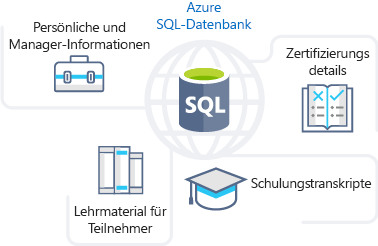
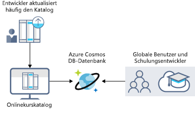
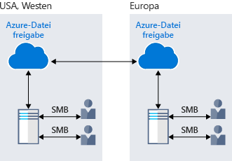
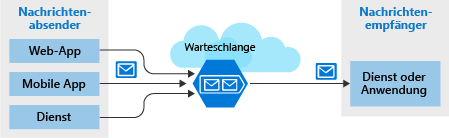

Looking at the benefits of Azure Storage, you understand that it offers the best options for storing your learning portal. Now let's explore the benefits and options available in Azure Storage in detail to see how it fits your business needs.

## How Azure Storage can meet your business storage needs

Azure Storage provides several options that accommodate specific types of data storage needs.

### Azure SQL Database

**Azure SQL Database** is a robust, fully managed, relational cloud database that stores all your data. You can use this feature to store data that you frequently access and update, such as personal and training-related information for your staff. You can also migrate your existing SQL Server databases without changing your applications. The following illustration shows the types of data from the online learning portal scenario that would be stored in an Azure SQL database.

### Azure Cosmos DB

Azure Cosmos DB is a globally distributed database service. It supports schema-less data that offers the capability to build highly responsive and *Always On* applications to support constantly changing data. You can use this feature to store data that is updated and maintained based on inputs from users around the world. The following illustration shows a sample Azure Cosmos DB database used to store data that is accessed by multiple people located around the world.

### Azure Blob storage

Azure Blob storage provides the ability to stream large video or audio files directly to the user browser from anywhere in the world. Blob storage is also used to store data for backup and restore, disaster recovery, and archiving. Azure Blob storage can store up to 8 TB of data to store files for virtual machines. The following illustration shows an example usage of Azure blob storage.

### Azure Data Lake Storage Gen2

The Data Lake feature of Azure storage allows you to perform analytics on your data usage and prepare reports accordingly. Data Lake is a large repository that stores both structured and unstructured data.

**Azure Data Lake Storage Gen2** combines the scalability and cost benefits of object storage with the reliability and performance of the Big Data file system capabilities. The following illustration shows how Azure Data Lake stores all your business data  and makes it available for analysis.

### Azure Files

Azure Files offers fully managed file shares in the cloud. Applications running in Azure can easily share files between VMs. You can use Azure file shares at the same time for cloud or on-premises deployments of Windows, Linux, and macOS. The following illustration shows Azure Files being used to share data between two geographical locations. Azure Files uses the Server Message Block (SMB) protocol which ensures the data is encrypted at rest and in transit.

### Azure Queue

Azure Queue storage is a service for storing large numbers of messages that can be accessed from anywhere in the world. A single queue message is up to 64 KB in size, and a queue can contain millions of messages.

Typically, there are one or more sender components and one or more receiver components. Sender components add message to the queue. Receiver components retrieve messages from the front of the queue for processing. The following illustration shows multiple sender applications adding messages to the Azure Queue and one receiver application retrieving the messages.

Queue storage is primarily used for the following:

- To create a backlog of work and to pass messages between different Azure web servers.
- For load balancing between different web servers/infrastructure and for managing bursts of traffic.
- To build resilience against component failure when multiple users access your data at the same time.

### Azure Standard Storage

Virtual machines in Azure use disks to store operating systems, applications, and data. Azure Standard Storage delivers reliable, low-cost disk support for VMs running workloads that are not mission critical. With Standard Storage, the data is stored on hard disk drives (HDDs).

When working with VMs, you can use standard SSD and HDD disks for less critical workloads, and premium SSD disks for mission-critical production applications. Azure Disks have consistently delivered enterprise-grade durability, with an industry-leading ZERO% Annualized Failure Rate. The following illustration shows an Azure virtual machine using separate disks to store different data.

### Storage tiers

Azure Storage offers three storage tiers for blob object storage:

1. **Hot storage tier** - The Azure hot storage tier is optimized for storing data that is accessed frequently. 

1. **Cool storage tier** - The Azure cool storage tier is optimized for storing data that is infrequently accessed and stored for at least 30 days.

1. **Archive storage tier** - The Azure archive storage tier is optimized for storing data that is rarely accessed and stored for at least 180 days with flexible latency requirements. The archive storage in Azure is ideal for storing older versions of your data so that you can retrieve it when required for auditing or other infrequent activities.

The following illustration shows the Azure Blob Storage tiers.

### Azure Storage encryption/replication

Azure Storage provides security and high availability to your data through encryption and replication features.

#### Encryption for storage services

The following encryption types are available for your resources:

1. **Azure Storage Service Encryption (SSE)** for data at rest helps you secure your data to meet the organization's security and regulatory compliance. The Azure SSE encrypts the data before storing it and decrypts the data before retrieving it. The encryption and decryption are transparent to the user.
1. **Client-side encryption** is where the data is already encrypted by the client libraries. Azure stores the data in the encrypted state at rest, which is then decrypted during retrieval.

    This encryption feature ensures your data meets global protection standards. It is appropriate for storing sensitive information like personal and financial data.

#### Replication for storage availability

A replication type is set up when you create a storage account. The replication feature ensures that your data is durable and always available. Azure Storage enables regional and geographic replications to protect your data against natural disasters and other local disasters like fire or flooding.
