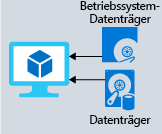

Wenn Sie sich die Vorteile von Azure Storage ansehen, werden Sie schnell verstehen, dass dieser Dienst die besten Optionen für die Speicherung Ihres Schulungsportals bietet. Erkunden Sie die Vorteile und Optionen im Einzelnen, um herauszufinden, wie Azure Storage Ihre Geschäftsanforderungen erfüllt.

## So erfüllt Azure Storage die Speicheranforderungen Ihres Unternehmens

Azure Storage bietet verschiedene Optionen für verschiedene Arten von Anforderungen an Datenspeicher.

### Azure SQL-Datenbank

**Azure SQL-Datenbank** ist eine stabile, vollständig verwaltete relationale Clouddatenbank, in der Sie all Ihre Daten speichern können. Sie können dieses Feature verwenden, um Daten zu speichern, auf die Sie häufig zugreifen und die Sie häufig aktualisieren, z.B. Informationen zu Schulungen für Ihre Mitarbeiter. Sie können auch Ihre vorhandenen SQL Server-Datenbanken migrieren, ohne Ihre Anwendungen ändern zu müssen. In der folgenden Abbildung werden die Datentypen aus dem Szenario für ein Onlinelernportal veranschaulicht, die in einer SQL-Datenbank von Azure gespeichert werden würden.

### Azure Cosmos DB

Azure Cosmos DB ist ein global verteilter Datenbankdienst. Der Dienst unterstützt schemalose Daten, mit denen sich extrem reaktionsschnelle *Always On*-Anwendungen erstellen lassen, um sich ständig ändernde Daten zu unterstützen. Sie können dieses Feature verwenden, um Daten zu speichern, die basierend auf Eingaben von Benutzern auf der ganzen Welt aktualisiert und verwaltet werden. In der folgenden Abbildung wird eine Beispieldatenbank von Azure Cosmos DB gezeigt, die zum Speichern von Daten verwendet wird, auf die mehrere Personen aus der ganzen Welt zugreifen.

### Azure Blob Storage

Azure Blob Storage bietet die Möglichkeit, große Video- und Audiodateien von jedem Standort der Welt aus direkt in Browser von Benutzern zu streamen. Blob-Speicher werden auch zum Speichern von Daten für die Sicherung und Wiederherstellung, die Notfallwiederherstellung sowie die Archivierung verwendet. Azure Blob Storage kann bis zu 8 TB Daten speichern, um z.B. Dateien für VMs zu speichern. In der folgenden Abbildung wird ein Beispiel zur Verwendung von Azure Blob Storage veranschaulicht.

### Azure Data Lake Storage Gen2

Das Data Lake-Feature von Azure Storage ermöglicht es Ihnen, Ihre Datennutzung zu analysieren und entsprechende Berichte zu erstellen. Data Lake ist ein umfangreiches Repository, in dem sowohl strukturierte als auch unstrukturierte Daten gespeichert werden können.

**Azure Data Lake Storage Gen2** kombiniert die Skalierbarkeit und Kostenvorteile eines Objektspeichers mit der Zuverlässigkeit und Leistung eines Big Data-Dateisystems. In der folgenden Abbildung wird gezeigt, wie Azure Data Lake all Ihre Geschäftsdaten speichert und für die Analyse zur Verfügung stellt.

### Azure Files

Azure Files bietet vollständig verwaltete Dateifreigaben in der Cloud. Anwendungen, die in Azure ausgeführt werden, können problemlos Dateien zwischen virtuellen Computern freigeben. Sie können Azure-Dateifreigaben gleichzeitig für Cloud- und lokale Bereitstellungen von Windows, Linux und macOS verwenden. In der folgenden Abbildung wird die Verwendung von Azure Files zum Freigeben von Daten für zwei geografische Standorte veranschaulicht. Azure Files verwendet das SMB-Protokoll (Server Message Block). Es stellt sicher, dass Daten im Ruhezustand und während der Übertragung verschlüsselt sind.

### Azure Queue

Azure Queue ist ein Dienst zur Speicherung einer großen Anzahl von Nachrichten, auf die von überall auf der Welt aus zugegriffen werden kann. Eine einzelne Warteschlangennachricht kann bis zu 64 KB groß sein, und eine Warteschlange kann Millionen von Nachrichten enthalten.

In der Regel gibt es mindestens eine Senderkomponente und mindestens eine Empfängerkomponente. Senderkomponenten fügen der Warteschlange eine Nachricht hinzu. Empfängerkomponenten rufen Nachrichten am Anfang der Warteschlange zur Verarbeitung ab. Die folgende Abbildung zeigt mehrere Senderanwendungen beim Hinzufügen von Nachrichten zur Azure-Warteschlange und eine Empfängeranwendung beim Abrufen der Nachrichten.

Warteschlangenspeicher werden hauptsächlich für Folgendes verwendet:

- Erstellen eines Arbeitsbacklogs und Übermitteln von Nachrichten zwischen Azure-Webservern.
- Lastenausgleiche zwischen verschiedenen Webservern und Infrastrukturen und Verwalten von Bursts in der Datenverkehrsübertragung.
- Aufbauen eines robusten Schutzes vor Komponentenfehlern, wenn mehrere Benutzer gleichzeitig auf Ihre Daten zugreifen.

### Azure-Standardspeicher

Virtuelle Computer in Azure verwenden Datenträger zum Speichern von Betriebssystemen, Anwendungen und Daten. Azure-Standardspeicher bieten zuverlässige, kostengünstige Datenträgerunterstützung für virtuelle Computer mit nicht geschäftskritischen Workloads. Bei Verwendung von Storage Standard werden die Daten auf Festplattenlaufwerken (Hard Disk Drives, HDDs) gespeichert.

Wenn Sie mit virtuellen Computern arbeiten, können Sie standardmäßige SSD- und HDD-Datenträger für weniger kritische Workloads und Premium-SSD-Datenträger für unternehmenskritische Produktionsanwendungen verwenden. Azure-Datenträger stellen konsistent Dauerhaftigkeit auf Unternehmensniveau bereit, mit einer branchenweit führenden auf das Jahr umgerechneten Fehlerrate von NULL %. In der folgenden Abbildung wird gezeigt, wie eine Azure-VM separate Datenträger nutzt, um unterschiedliche Daten zu speichern.

### Speicherebenen

Azure Storage bietet drei Speicherebenen für Blobspeicher:

1. **Speicherebene „Heiß“:** Diese Azure-Speicherebene ist für die Speicherung von Daten optimiert, auf die häufig zugegriffen wird. 

1. **Speicherebene „Kalt“**: Diese Azure-Speicherebene ist für die Speicherung von Daten optimiert, auf die weniger häufig zugegriffen wird und die mindestens 30 Tage lang gespeichert werden.

1. **Speicherebene „Archiv“:** Diese Azure-Speicherebene ist für die Speicherung von Daten optimiert, auf die selten zugegriffen wird und die bei flexiblen Latenzanforderungen mindestens 180 Tage lang gespeichert werden. Der Archivspeicher in Azure eignet sich ideal zum Speichern älterer Versionen Ihrer Daten, sodass Sie die Daten abrufen können, wenn diese für Überprüfungen oder andere unregelmäßige Aktivitäten benötigt werden.

In der folgenden Abbildung werden die Speicherebenen von Azure Blob Storage veranschaulicht.

### Azure Storage-Verschlüsselung bzw. -Replikation

Azure Storage bietet Verschlüsselungs- und Replikationsfeatures, um für die Sicherheit und Hochverfügbarkeit Ihrer Daten zu sorgen.

#### Verschlüsselung für Speicherdienste

Ihnen stehen folgende Verschlüsselungstypen für Ihre Ressourcen zur Verfügung:

1. Die **Azure-Speicherdienstverschlüsselung ( Storage Service Encryption, SSE)** für ruhende Daten unterstützt Sie dabei, Ihre Daten zu sichern, um die Anforderungen Ihrer Organisation an die Sicherheit und Einhaltung von gesetzlichen Bestimmungen zu erfüllen. Azure SSE verschlüsselt die Daten vor dem Speichern und entschlüsselt sie vor dem Abrufen wieder. Die Verschlüsselung und Entschlüsselung sind für den Benutzer transparent.
1. Bei der **clientseitigen Verschlüsselung** werden die Daten bereits von den Clientbibliotheken verschlüsselt. Azure speichert die Daten verschlüsselt im Ruhezustand, und die Daten werden während des Abrufs entschlüsselt.

    Dieses Verschlüsselungsfeature stellt sicher, dass Ihre Daten die globalen Schutzstandards erfüllen. Es eignet sich zum Speichern vertraulicher Informationen, z.B. personenbezogene und finanzielle Daten.

#### Replikation für Speicherverfügbarkeit

Wenn Sie ein Speicherkonto erstellen, wird ein Replikationstyp festgelegt. Das Replikationsfeature stellt sicher, dass Ihre Daten stabil und jederzeit verfügbar sind. Azure Storage ermöglicht regionale und geografische Replikationen, um Ihre Daten bei Naturkatastrophen und anderen lokalen Ereignissen wie Bränden oder Überflutungen zu schützen.
